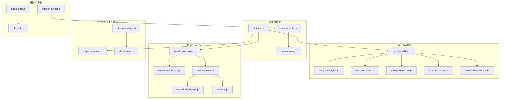
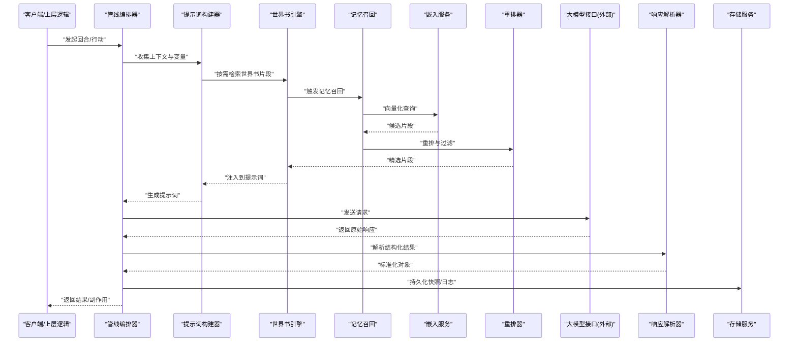
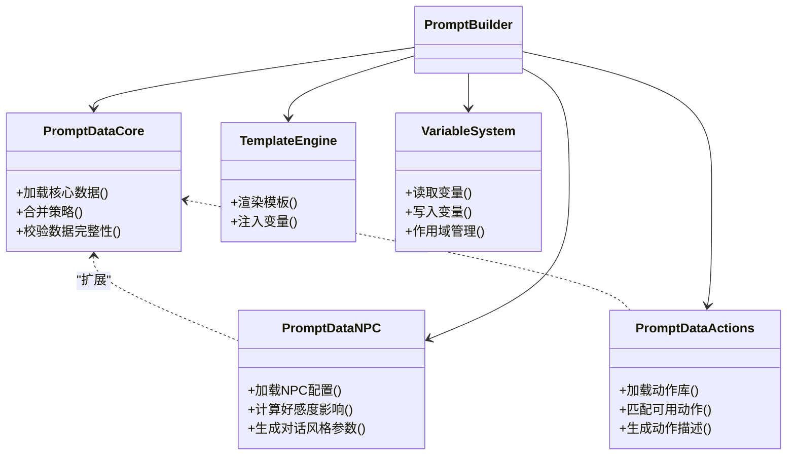
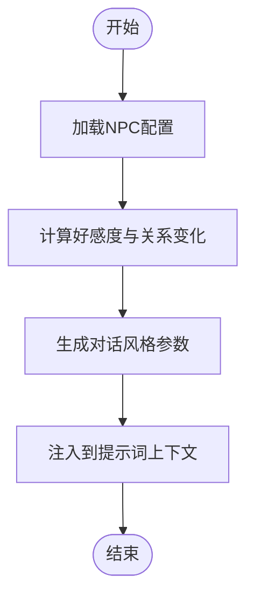
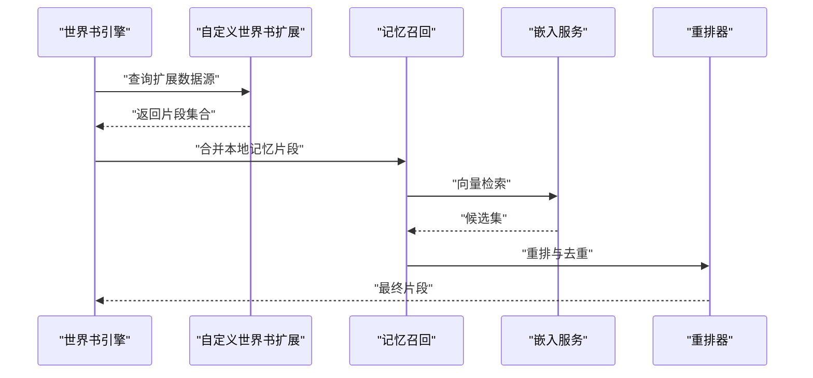
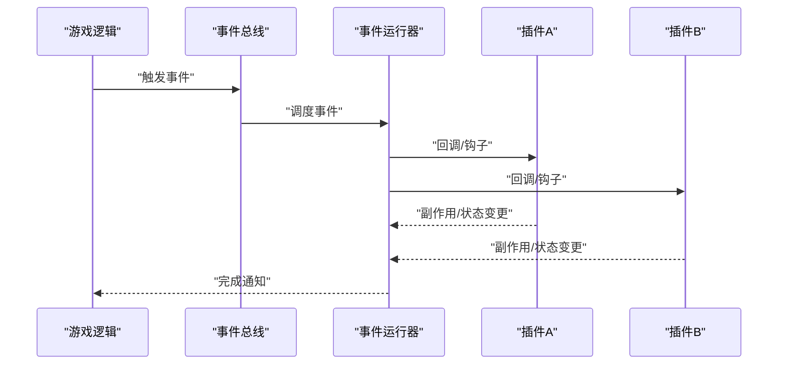
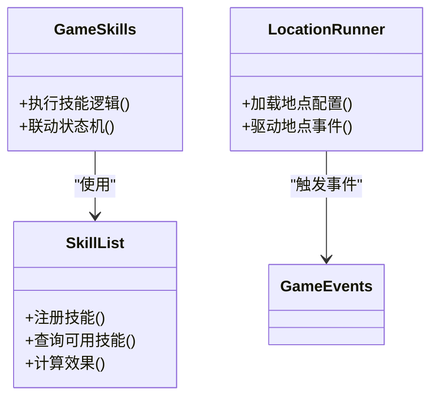
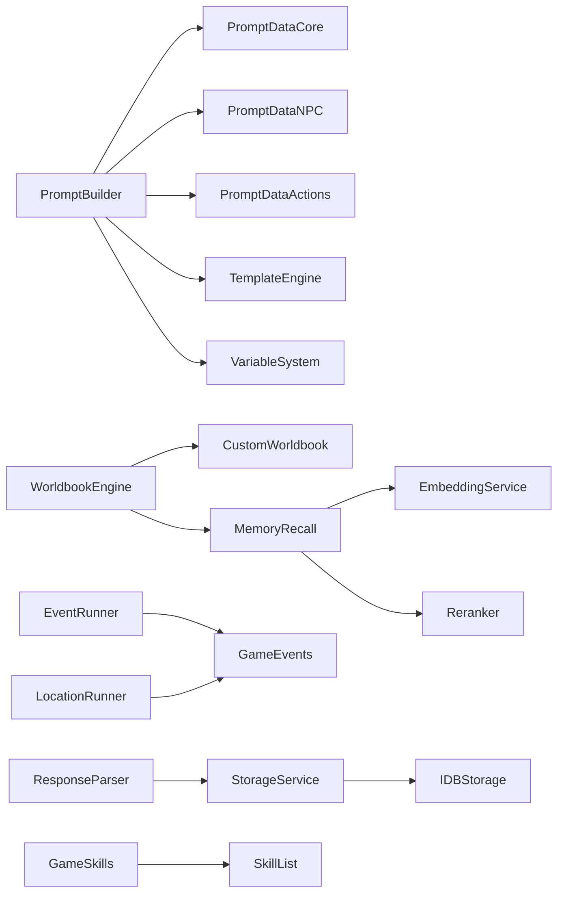

# 插件扩展架构

<cite>
**本文引用的文件**   
- [module/pipeline.js](file://module/pipeline.js)
- [module/prompt-builder.js](file://module/prompt-builder.js)
- [module/prompt-data-core.js](file://module/prompt-data-core.js)
- [module/prompt-data-npc.js](file://module/prompt-data-npc.js)
- [module/prompt-data-actions.js](file://module/prompt-data-actions.js)
- [module/worldbook-engine.js](file://module/worldbook-engine.js)
- [module/custom-worldbook.js](file://module/custom-worldbook.js)
- [module/event-runner.js](file://module/event-runner.js)
- [module/game-events.js](file://module/game-events.js)
- [module/memory-recall.js](file://module/memory-recall.js)
- [module/embedding-service.js](file://module/embedding-service.js)
- [module/reranker.js](file://module/reranker.js)
- [module/response-parser.js](file://module/response-parser.js)
- [module/template-engine.js](file://module/template-engine.js)
- [module/variable-system.js](file://module/variable-system.js)
- [module/storage-service.js](file://module/storage-service.js)
- [module/idb-storage.js](file://module/idb-storage.js)
- [module/skill-list.js](file://module/skill-list.js)
- [module/game-skills.js](file://module/game-skills.js)
- [module/location-runner.js](file://module/location-runner.js)
- [tools/generate-prompt-data.js](file://tools/generate-prompt-data.js)
</cite>

## 目录
1. [简介](#简介)
2. [项目结构](#项目结构)
3. [核心组件](#核心组件)
4. [架构总览](#架构总览)
5. [详细组件分析](#详细组件分析)
6. [依赖关系分析](#依赖关系分析)
7. [性能考虑](#性能考虑)
8. [故障排查指南](#故障排查指南)
9. [结论](#结论)
10. [附录：插件开发指南与最佳实践](#附录插件开发指南与最佳实践)

## 简介
本文件为“姬侠传”插件扩展系统的架构文档，聚焦于可扩展的模块设计，涵盖以下关键领域：
- 提示词数据插件（Prompt Data Plugins）
- NPC系统插件（NPC System Plugins）
- 世界书扩展机制（Worldbook Extensions）
- 插件注册、生命周期管理与依赖注入
- 扩展点设计与接口规范
- 插件开发指南与最佳实践

目标是帮助开发者理解现有扩展能力边界，快速定位扩展点，并基于统一接口规范实现可插拔的功能。

## 项目结构
从工程视角看，扩展相关代码主要集中在 module 目录，围绕“管线编排—数据装配—渲染输出”的主线组织。工具脚本 tools 提供辅助生成与转换能力。

图表来源
- [module/pipeline.js](file://module/pipeline.js)
- [module/prompt-builder.js](file://module/prompt-builder.js)
- [module/prompt-data-core.js](file://module/prompt-data-core.js)
- [module/prompt-data-npc.js](file://module/prompt-data-npc.js)
- [module/prompt-data-actions.js](file://module/prompt-data-actions.js)
- [module/worldbook-engine.js](file://module/worldbook-engine.js)
- [module/custom-worldbook.js](file://module/custom-worldbook.js)
- [module/memory-recall.js](file://module/memory-recall.js)
- [module/embedding-service.js](file://module/embedding-service.js)
- [module/reranker.js](file://module/reranker.js)
- [module/response-parser.js](file://module/response-parser.js)
- [module/storage-service.js](file://module/storage-service.js)
- [module/idb-storage.js](file://module/idb-storage.js)
- [module/event-runner.js](file://module/event-runner.js)
- [module/game-events.js](file://module/game-events.js)
- [module/skill-list.js](file://module/skill-list.js)
- [module/game-skills.js](file://module/game-skills.js)
- [module/location-runner.js](file://module/location-runner.js)

章节来源
- [module/pipeline.js](file://module/pipeline.js)
- [module/prompt-builder.js](file://module/prompt-builder.js)
- [module/worldbook-engine.js](file://module/worldbook-engine.js)
- [module/event-runner.js](file://module/event-runner.js)

## 核心组件
- 管线编排器（Pipeline）：负责串联各阶段处理逻辑，定义执行顺序、错误传播与结果汇聚。
- 提示词构建器（Prompt Builder）：组合上下文变量、模板引擎与多类提示词数据源，产出最终提示词。
- 世界书引擎（Worldbook Engine）：管理世界知识检索、增量更新与外部扩展接入。
- 事件运行器（Event Runner）：驱动游戏内事件流，协调 UI、状态与业务逻辑。
- 响应解析器（Response Parser）：标准化模型返回，提取结构化信息供后续流程使用。
- 存储与服务层（Storage & Services）：封装持久化与外部服务调用，屏蔽底层差异。

章节来源
- [module/pipeline.js](file://module/pipeline.js)
- [module/prompt-builder.js](file://module/prompt-builder.js)
- [module/worldbook-engine.js](file://module/worldbook-engine.js)
- [module/event-runner.js](file://module/event-runner.js)
- [module/response-parser.js](file://module/response-parser.js)
- [module/storage-service.js](file://module/storage-service.js)

## 架构总览
下图展示“请求进入—提示词组装—世界书检索—模型交互—响应解析—状态更新”的整体流程，以及插件在其中的挂载位置。

图表来源
- [module/pipeline.js](file://module/pipeline.js)
- [module/prompt-builder.js](file://module/prompt-builder.js)
- [module/worldbook-engine.js](file://module/worldbook-engine.js)
- [module/memory-recall.js](file://module/memory-recall.js)
- [module/embedding-service.js](file://module/embedding-service.js)
- [module/reranker.js](file://module/reranker.js)
- [module/response-parser.js](file://module/response-parser.js)
- [module/storage-service.js](file://module/storage-service.js)

## 详细组件分析

### 提示词数据插件体系
提示词数据插件用于动态注入角色设定、行为规则、动作库等上下文内容，支持按条件加载与优先级合并。

图表来源
- [module/prompt-data-core.js](file://module/prompt-data-core.js)
- [module/prompt-data-npc.js](file://module/prompt-data-npc.js)
- [module/prompt-data-actions.js](file://module/prompt-data-actions.js)
- [module/template-engine.js](file://module/template-engine.js)
- [module/variable-system.js](file://module/variable-system.js)
- [module/prompt-builder.js](file://module/prompt-builder.js)

章节来源
- [module/prompt-data-core.js](file://module/prompt-data-core.js)
- [module/prompt-data-npc.js](file://module/prompt-data-npc.js)
- [module/prompt-data-actions.js](file://module/prompt-data-actions.js)
- [module/template-engine.js](file://module/template-engine.js)
- [module/variable-system.js](file://module/variable-system.js)
- [module/prompt-builder.js](file://module/prompt-builder.js)

#### 提示词数据插件接口规范（建议）
- 注册入口：通过统一的注册函数暴露插件元信息与加载方法。
- 数据契约：每个插件需提供稳定的数据结构（如角色属性、动作列表、权重等）。
- 生命周期钩子：初始化、热重载、卸载时清理资源。
- 依赖声明：声明对其他插件或服务的依赖，由容器进行解析与注入。
- 版本兼容：提供最小版本要求与迁移说明。

章节来源
- [module/prompt-builder.js](file://module/prompt-builder.js)
- [module/prompt-data-core.js](file://module/prompt-data-core.js)

### NPC系统插件
NPC插件负责管理角色档案、关系网络、情感状态与对话风格，并可被提示词构建器按需拉取。

图表来源
- [module/prompt-data-npc.js](file://module/prompt-data-npc.js)
- [module/prompt-builder.js](file://module/prompt-builder.js)

章节来源
- [module/prompt-data-npc.js](file://module/prompt-data-npc.js)
- [module/prompt-builder.js](file://module/prompt-builder.js)

### 世界书扩展机制
世界书引擎提供知识片段的检索、缓存与增量更新，并通过自定义扩展点允许外部数据源接入。

图表来源
- [module/worldbook-engine.js](file://module/worldbook-engine.js)
- [module/custom-worldbook.js](file://module/custom-worldbook.js)
- [module/memory-recall.js](file://module/memory-recall.js)
- [module/embedding-service.js](file://module/embedding-service.js)
- [module/reranker.js](file://module/reranker.js)

章节来源
- [module/worldbook-engine.js](file://module/worldbook-engine.js)
- [module/custom-worldbook.js](file://module/custom-worldbook.js)
- [module/memory-recall.js](file://module/memory-recall.js)
- [module/embedding-service.js](file://module/embedding-service.js)
- [module/reranker.js](file://module/reranker.js)

### 事件系统与插件集成
事件运行器作为总线，协调 UI、状态与业务逻辑，插件可通过订阅/发布模式参与流程。

图表来源
- [module/event-runner.js](file://module/event-runner.js)
- [module/game-events.js](file://module/game-events.js)

章节来源
- [module/event-runner.js](file://module/event-runner.js)
- [module/game-events.js](file://module/game-events.js)

### 技能与地点扩展
技能系统与地点运行器可作为独立插件域，提供战斗、探索等玩法扩展点。

图表来源
- [module/skill-list.js](file://module/skill-list.js)
- [module/game-skills.js](file://module/game-skills.js)
- [module/location-runner.js](file://module/location-runner.js)
- [module/game-events.js](file://module/game-events.js)

章节来源
- [module/skill-list.js](file://module/skill-list.js)
- [module/game-skills.js](file://module/game-skills.js)
- [module/location-runner.js](file://module/location-runner.js)
- [module/game-events.js](file://module/game-events.js)

## 依赖关系分析
- 松耦合：通过事件总线与接口契约解耦各模块，便于替换与扩展。
- 明确边界：提示词数据、世界书、事件系统各自维护内部状态，对外仅暴露必要 API。
- 潜在循环：避免在提示词构建器中直接依赖世界书引擎的写路径，应通过只读接口或事件回传。

图表来源
- [module/prompt-builder.js](file://module/prompt-builder.js)
- [module/prompt-data-core.js](file://module/prompt-data-core.js)
- [module/prompt-data-npc.js](file://module/prompt-data-npc.js)
- [module/prompt-data-actions.js](file://module/prompt-data-actions.js)
- [module/template-engine.js](file://module/template-engine.js)
- [module/variable-system.js](file://module/variable-system.js)
- [module/worldbook-engine.js](file://module/worldbook-engine.js)
- [module/custom-worldbook.js](file://module/custom-worldbook.js)
- [module/memory-recall.js](file://module/memory-recall.js)
- [module/embedding-service.js](file://module/embedding-service.js)
- [module/reranker.js](file://module/reranker.js)
- [module/event-runner.js](file://module/event-runner.js)
- [module/game-events.js](file://module/game-events.js)
- [module/response-parser.js](file://module/response-parser.js)
- [module/storage-service.js](file://module/storage-service.js)
- [module/idb-storage.js](file://module/idb-storage.js)
- [module/skill-list.js](file://module/skill-list.js)
- [module/game-skills.js](file://module/game-skills.js)
- [module/location-runner.js](file://module/location-runner.js)

章节来源
- [module/pipeline.js](file://module/pipeline.js)
- [module/prompt-builder.js](file://module/prompt-builder.js)
- [module/worldbook-engine.js](file://module/worldbook-engine.js)
- [module/event-runner.js](file://module/event-runner.js)

## 性能考虑
- 提示词构建：尽量复用模板与变量缓存，减少重复渲染；对大型数据源采用分页或懒加载。
- 世界书检索：优先命中缓存，控制向量检索批次大小，结合重排器降低无效片段数量。
- 事件分发：批量事件合并与节流，避免高频回调导致主线程阻塞。
- 存储读写：合并写入操作，使用事务或批处理提升 I/O 效率。

[本节为通用指导，不直接分析具体文件]

## 故障排查指南
- 提示词缺失字段：检查提示词数据插件的数据契约与校验逻辑，确认是否按优先级合并。
- 世界书检索为空：验证嵌入服务可用性、索引是否更新，以及重排器的阈值设置。
- 事件未触发：确认事件名称与作用域，检查事件运行器的订阅注册是否正确。
- 响应解析失败：核对模型返回格式与解析器期望结构，必要时增加容错与降级策略。
- 存储异常：检查 IDB 权限与配额，确保存储服务的错误重试与回退机制生效。

章节来源
- [module/response-parser.js](file://module/response-parser.js)
- [module/storage-service.js](file://module/storage-service.js)
- [module/idb-storage.js](file://module/idb-storage.js)
- [module/event-runner.js](file://module/event-runner.js)

## 结论
本架构以“管线编排+模块化扩展”为核心，通过清晰的接口契约与事件总线，将提示词数据、NPC系统与世界书扩展有机整合。开发者可在不侵入核心逻辑的前提下，快速实现功能增强与个性化定制。

[本节为总结性内容，不直接分析具体文件]

## 附录：插件开发指南与最佳实践

### 插件注册与生命周期
- 注册方式：提供统一的注册入口，包含插件元信息、依赖声明与加载方法。
- 生命周期钩子：
  - 初始化：准备数据、建立连接、预热缓存。
  - 热重载：增量更新配置、平滑切换版本。
  - 卸载：释放资源、断开连接、清理监听器。
- 依赖注入：由容器根据声明自动解析与注入，避免硬编码依赖。

章节来源
- [module/pipeline.js](file://module/pipeline.js)
- [module/prompt-builder.js](file://module/prompt-builder.js)
- [module/worldbook-engine.js](file://module/worldbook-engine.js)

### 扩展点设计与接口规范
- 提示词数据插件：
  - 数据契约：角色属性、行为规则、动作库等稳定结构。
  - 合并策略：优先级、冲突解决、覆盖范围。
- 世界书扩展：
  - 只读接口：检索、分页、过滤。
  - 增量更新：提交新片段、删除旧片段、版本号管理。
- 事件插件：
  - 订阅/发布：事件名、作用域、回调签名。
  - 副作用：状态变更需幂等，避免重复执行。

章节来源
- [module/prompt-data-core.js](file://module/prompt-data-core.js)
- [module/custom-worldbook.js](file://module/custom-worldbook.js)
- [module/game-events.js](file://module/game-events.js)

### 示例：新增一个提示词数据插件
- 步骤概览：
  - 定义数据契约与默认值。
  - 实现加载与合并逻辑。
  - 在提示词构建器中注册并使用。
  - 编写单元测试与回归用例。
- 参考路径：
  - [module/prompt-data-core.js](file://module/prompt-data-core.js)
  - [module/prompt-builder.js](file://module/prompt-builder.js)

章节来源
- [module/prompt-data-core.js](file://module/prompt-data-core.js)
- [module/prompt-builder.js](file://module/prompt-builder.js)

### 示例：接入自定义世界书数据源
- 步骤概览：
  - 实现只读检索接口与分页。
  - 注册到世界书引擎的扩展点。
  - 与记忆召回和重排器协作。
- 参考路径：
  - [module/custom-worldbook.js](file://module/custom-worldbook.js)
  - [module/worldbook-engine.js](file://module/worldbook-engine.js)
  - [module/memory-recall.js](file://module/memory-recall.js)
  - [module/reranker.js](file://module/reranker.js)

章节来源
- [module/custom-worldbook.js](file://module/custom-worldbook.js)
- [module/worldbook-engine.js](file://module/worldbook-engine.js)
- [module/memory-recall.js](file://module/memory-recall.js)
- [module/reranker.js](file://module/reranker.js)

### 示例：通过事件系统扩展玩法
- 步骤概览：
  - 定义事件名与作用域。
  - 在事件运行器中注册回调。
  - 在回调中执行副作用与状态更新。
- 参考路径：
  - [module/game-events.js](file://module/game-events.js)
  - [module/event-runner.js](file://module/event-runner.js)

章节来源
- [module/game-events.js](file://module/game-events.js)
- [module/event-runner.js](file://module/event-runner.js)

### 工具与辅助
- 提示词数据生成工具：用于批量生成或校验提示词数据，提高一致性。
- 参考路径：
  - [tools/generate-prompt-data.js](file://tools/generate-prompt-data.js)

章节来源
- [tools/generate-prompt-data.js](file://tools/generate-prompt-data.js)