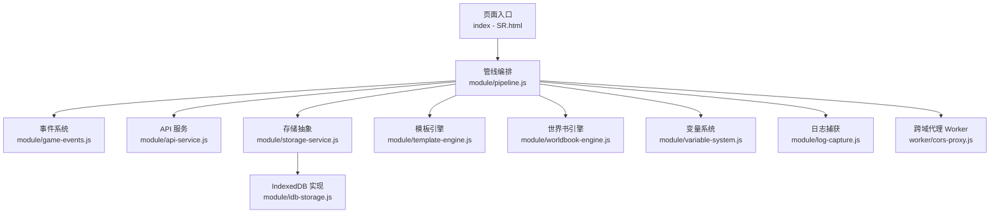
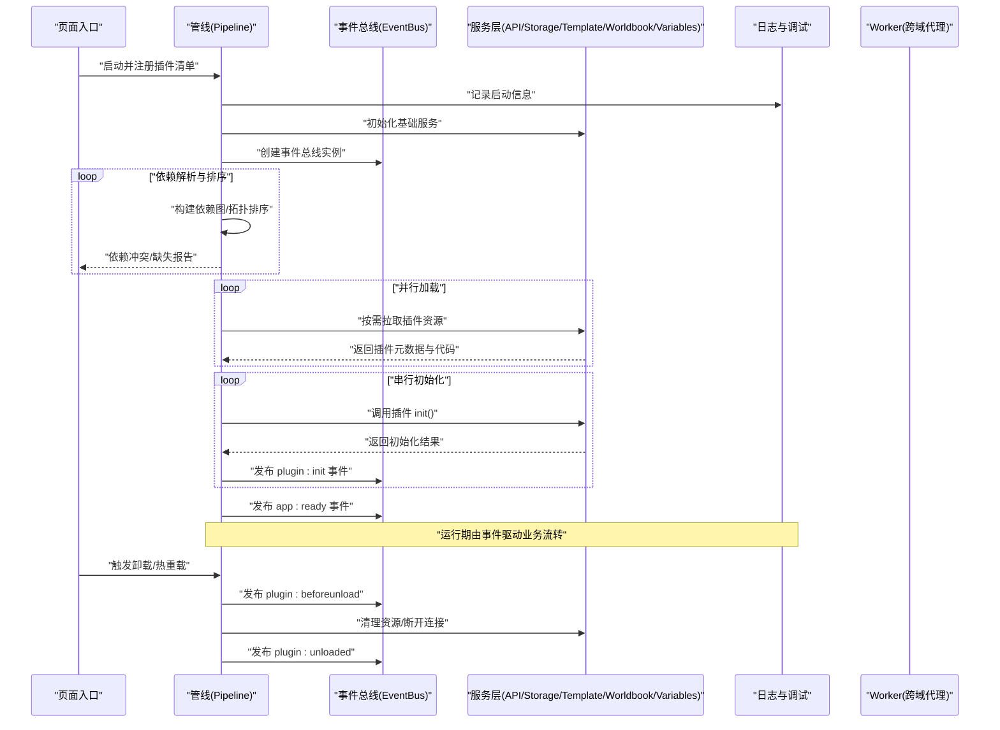
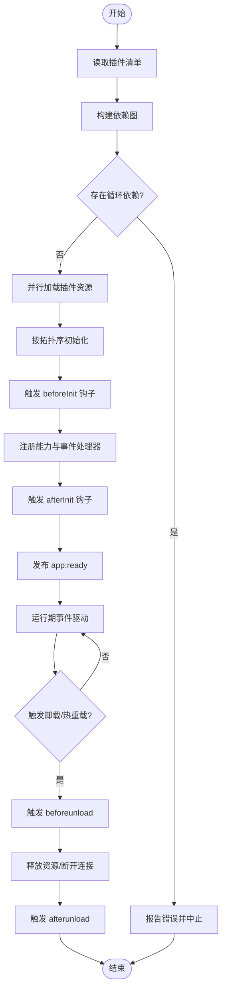
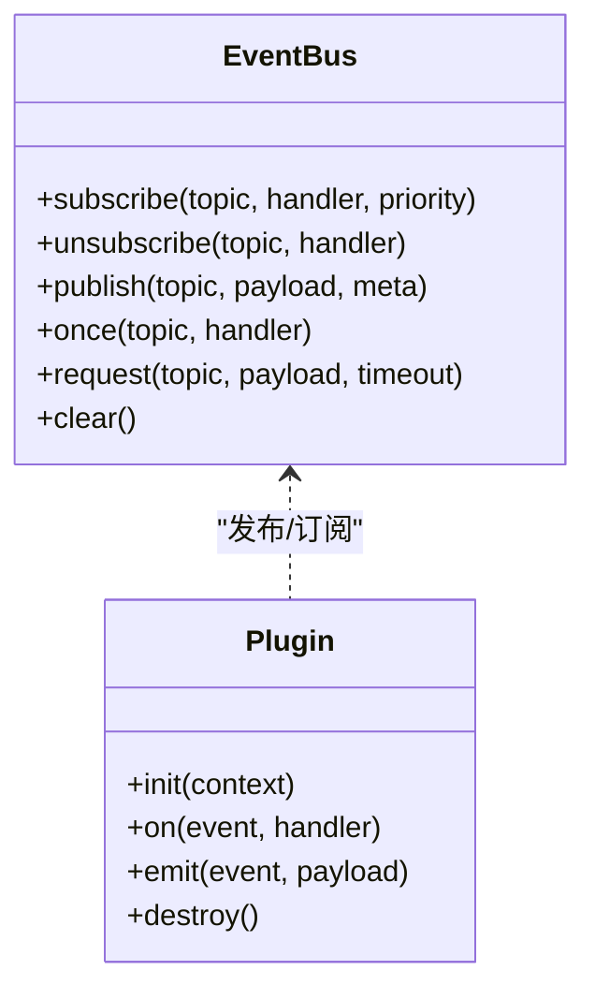
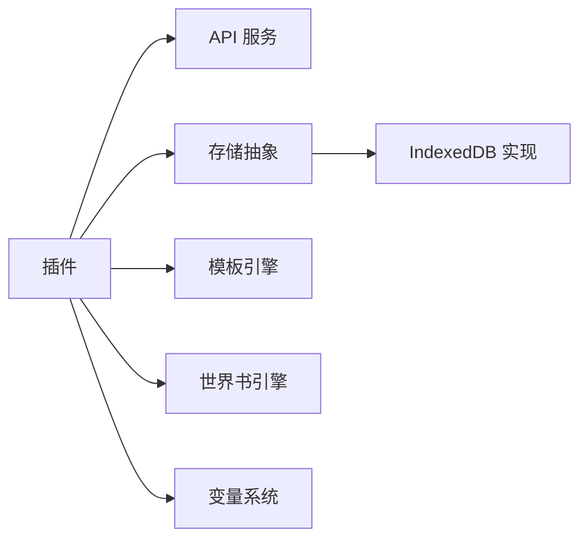
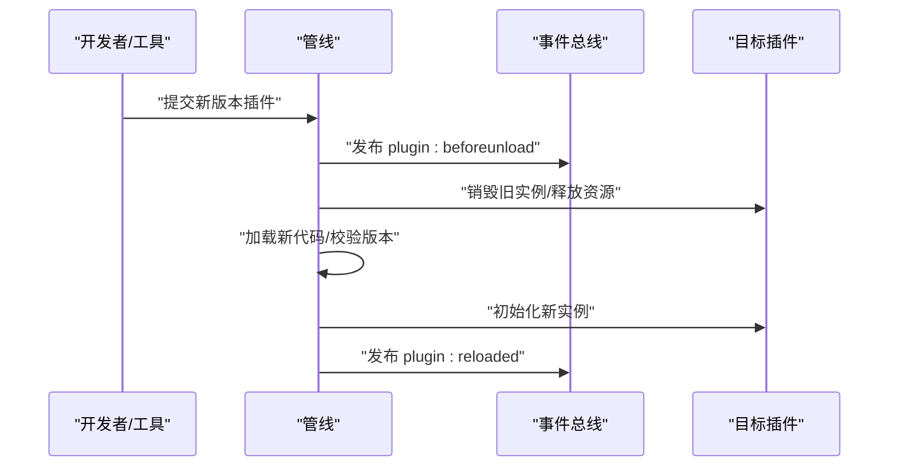
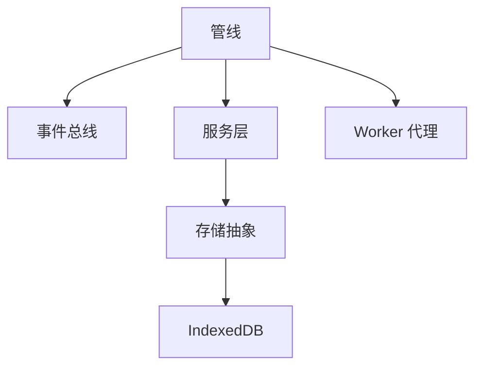

# 插件生命周期管理

<cite>
**本文引用的文件**   
- [index - SR.html](file://index - SR.html)
- [start-screen.html](file://start-screen.html)
- [module/pipeline.js](file://module/pipeline.js)
- [module/event-runner.js](file://module/event-runner.js)
- [module/game-events.js](file://module/game-events.js)
- [module/api-service.js](file://module/api-service.js)
- [module/storage-service.js](file://module/storage-service.js)
- [module/idb-storage.js](file://module/idb-storage.js)
- [module/log-capture.js](file://module/log-capture.js)
- [module/template-engine.js](file://module/template-engine.js)
- [module/worldbook-engine.js](file://module/worldbook-engine.js)
- [module/variable-system.js](file://module/variable-system.js)
- [module/sync-utils.js](file://module/sync-utils.js)
- [worker/cors-proxy.js](file://worker/cors-proxy.js)
</cite>

## 目录
1. [简介](#简介)
2. [项目结构](#项目结构)
3. [核心组件](#核心组件)
4. [架构总览](#架构总览)
5. [详细组件分析](#详细组件分析)
6. [依赖关系分析](#依赖关系分析)
7. [性能考虑](#性能考虑)
8. [故障排查指南](#故障排查指南)
9. [结论](#结论)
10. [附录](#附录)

## 简介
本文件围绕“姬侠传”前端工程中的插件化与扩展机制，系统化阐述插件的加载、初始化、运行与卸载流程；说明依赖解析、版本兼容性与错误处理策略；定义插件间通信的事件总线设计与消息协议；覆盖配置管理、热重载支持与调试工具使用；并给出安全沙箱与资源隔离建议、开发最佳实践与性能优化要点。文档以仓库中实际存在的模块为依据进行解读，并在必要时提供概念性图示以帮助理解。

## 项目结构
从仓库可见，该工程为基于浏览器的前端应用，核心逻辑集中在 module 目录下的若干脚本文件中，页面入口通过 HTML 引入这些脚本。与“插件化”相关的关键位置包括：
- 页面入口：负责全局初始化、模块装配与事件总线启动
- 管线（pipeline）：统一编排加载顺序、依赖解析与生命周期钩子
- 事件系统：提供发布/订阅式通信通道
- 服务层：API、存储、模板、世界书等能力作为可插拔服务暴露
- 调试与日志：集中捕获与上报日志，便于定位问题

图表来源
- [index - SR.html](file://index - SR.html)
- [module/pipeline.js](file://module/pipeline.js)
- [module/game-events.js](file://module/game-events.js)
- [module/api-service.js](file://module/api-service.js)
- [module/storage-service.js](file://module/storage-service.js)
- [module/idb-storage.js](file://module/idb-storage.js)
- [module/template-engine.js](file://module/template-engine.js)
- [module/worldbook-engine.js](file://module/worldbook-engine.js)
- [module/variable-system.js](file://module/variable-system.js)
- [module/log-capture.js](file://module/log-capture.js)
- [worker/cors-proxy.js](file://worker/cors-proxy.js)

章节来源
- [index - SR.html](file://index - SR.html)
- [module/pipeline.js](file://module/pipeline.js)

## 核心组件
- 管线（Pipeline）
  - 职责：按声明顺序加载与初始化各插件/模块；维护依赖图；在关键阶段触发生命周期钩子（如 beforeInit、afterInit、beforeRun、afterRun、beforeUnload、afterUnload）。
  - 关键点：支持并行加载与串行初始化；失败回滚与重试；版本兼容性校验。
- 事件系统（Event Bus）
  - 职责：提供统一的发布/订阅接口；支持命名空间、优先级与一次性监听；用于插件间解耦通信。
  - 关键点：消息格式规范、去重与防抖、背压与限流。
- 服务层（Services）
  - API 服务：封装网络请求、鉴权、重试与超时控制，供插件调用。
  - 存储抽象：对外暴露 get/set/remove/list 等接口，内部可切换实现（如 IndexedDB）。
  - 模板引擎：渲染 UI 片段或提示词模板，支持缓存与异步模板。
  - 世界书：提供知识检索、上下文注入与摘要生成能力。
  - 变量系统：统一管理运行时变量与作用域，支持快照与合并。
- 调试与日志
  - 日志捕获：拦截 console 输出、Promise 未捕获异常、网络错误等，统一格式化与上报。
  - 调试工具：提供开关、过滤、导出与回放能力。

章节来源
- [module/pipeline.js](file://module/pipeline.js)
- [module/game-events.js](file://module/game-events.js)
- [module/api-service.js](file://module/api-service.js)
- [module/storage-service.js](file://module/storage-service.js)
- [module/idb-storage.js](file://module/idb-storage.js)
- [module/template-engine.js](file://module/template-engine.js)
- [module/worldbook-engine.js](file://module/worldbook-engine.js)
- [module/variable-system.js](file://module/variable-system.js)
- [module/log-capture.js](file://module/log-capture.js)

## 架构总览
下图展示插件生命周期与子系统交互的总体视图。管线作为中枢，协调加载、依赖解析、初始化、运行与卸载；事件总线贯穿全链路，承载插件间通信；服务层提供通用能力；日志与调试贯穿始终。

图表来源
- [index - SR.html](file://index - SR.html)
- [module/pipeline.js](file://module/pipeline.js)
- [module/game-events.js](file://module/game-events.js)
- [module/api-service.js](file://module/api-service.js)
- [module/storage-service.js](file://module/storage-service.js)
- [module/template-engine.js](file://module/template-engine.js)
- [module/worldbook-engine.js](file://module/worldbook-engine.js)
- [module/variable-system.js](file://module/variable-system.js)
- [module/log-capture.js](file://module/log-capture.js)
- [worker/cors-proxy.js](file://worker/cors-proxy.js)

## 详细组件分析

### 管线（Pipeline）与生命周期
- 加载阶段
  - 读取插件清单（名称、版本、依赖、入口、能力声明）。
  - 构建依赖图并进行拓扑排序，检测循环依赖与缺失依赖。
  - 并行下载插件包，校验签名/完整性（若启用）。
- 初始化阶段
  - 按拓扑序依次执行插件初始化回调，注入服务与事件总线。
  - 收集插件能力注册表（UI 扩展点、API 扩展点、事件处理器等）。
- 运行阶段
  - 发布应用就绪事件，允许插件挂载 UI、注册定时任务、接入事件流。
  - 运行期通过事件总线进行通信，避免直接耦合。
- 卸载/热重载阶段
  - 先发布 beforeunload，再释放资源（定时器、监听器、缓存、连接）。
  - 热重载时保留共享状态（如变量系统、世界书索引），仅替换插件代码与 UI。

图表来源
- [module/pipeline.js](file://module/pipeline.js)

章节来源
- [module/pipeline.js](file://module/pipeline.js)

### 事件总线与消息协议
- 设计要点
  - 命名空间：按功能域划分事件名，如 game.*、ui.*、plugin.*。
  - 优先级：同一事件可设置多个监听器，支持优先级排序。
  - 一次性监听：onOnce 模式，避免内存泄漏。
  - 背压与限流：对高频事件提供节流/防抖与队列缓冲。
- 消息体约定
  - 标准字段：type、payload、meta（包含时间戳、来源插件、追踪ID）。
  - 响应式事件：支持 Promise 式应答，用于请求-响应模型。
- 典型事件
  - plugin:register、plugin:init、plugin:ready、plugin:beforeunload、plugin:unloaded
  - app:ready、app:error、storage:changed、worldbook:updated、template:rendered

图表来源
- [module/game-events.js](file://module/game-events.js)

章节来源
- [module/game-events.js](file://module/game-events.js)

### 服务层（API/存储/模板/世界书/变量）
- API 服务
  - 统一封装请求、鉴权、重试、超时与错误分类；支持插件按需注册自定义适配器。
- 存储抽象
  - 对外提供一致的键值/对象存取接口；底层可切换实现（IndexedDB 等）。
- 模板引擎
  - 支持同步/异步模板渲染、局部缓存与编译优化。
- 世界书
  - 提供检索、摘要、上下文注入；支持增量更新与索引重建。
- 变量系统
  - 作用域隔离、快照与合并；支持持久化与热重载后恢复。

图表来源
- [module/api-service.js](file://module/api-service.js)
- [module/storage-service.js](file://module/storage-service.js)
- [module/idb-storage.js](file://module/idb-storage.js)
- [module/template-engine.js](file://module/template-engine.js)
- [module/worldbook-engine.js](file://module/worldbook-engine.js)
- [module/variable-system.js](file://module/variable-system.js)

章节来源
- [module/api-service.js](file://module/api-service.js)
- [module/storage-service.js](file://module/storage-service.js)
- [module/idb-storage.js](file://module/idb-storage.js)
- [module/template-engine.js](file://module/template-engine.js)
- [module/worldbook-engine.js](file://module/worldbook-engine.js)
- [module/variable-system.js](file://module/variable-system.js)

### 配置管理与热重载
- 配置管理
  - 集中式配置对象，支持默认值、环境覆盖与运行时修改。
  - 变更通知：配置变更后广播配置事件，插件可选择性热更新。
- 热重载
  - 在不重启应用的前提下替换插件代码与 UI。
  - 保留共享状态（变量、世界书索引、缓存），确保一致性。
  - 热重载前触发 beforeunload，完成后触发 reload:complete。

图表来源
- [module/pipeline.js](file://module/pipeline.js)
- [module/game-events.js](file://module/game-events.js)

章节来源
- [module/pipeline.js](file://module/pipeline.js)
- [module/game-events.js](file://module/game-events.js)

### 调试工具与日志
- 日志捕获
  - 拦截 console、未捕获异常、网络错误、Promise 拒绝等。
  - 结构化日志：包含时间、来源、级别、堆栈与上下文。
- 调试面板
  - 提供开关、过滤、导出、回放与慢操作标记。
- 诊断指标
  - 插件加载耗时、事件分发延迟、存储读写耗时、世界书检索耗时等。

章节来源
- [module/log-capture.js](file://module/log-capture.js)

### 安全沙箱与资源隔离
- 沙箱建议
  - 将插件限制在受限环境中执行，禁止访问全局危险 API。
  - 通过白名单暴露必要能力（API 服务、存储、事件总线等）。
- 资源隔离
  - 每个插件拥有独立的作用域与命名空间，避免变量污染。
  - 使用 Web Worker 执行高开销或不受信代码（示例：跨域代理 Worker）。
- 权限与审计
  - 插件能力声明与最小权限原则；所有外部调用需经网关并记录审计日志。

章节来源
- [worker/cors-proxy.js](file://worker/cors-proxy.js)

## 依赖关系分析
- 组件耦合
  - 管线强依赖事件总线与服务层；插件弱依赖事件总线与服务层。
  - 存储抽象与具体实现解耦，便于替换与测试。
- 外部依赖
  - 浏览器 API（IndexedDB、Worker、Fetch/XHR）。
  - 可选：CDN/本地资源服务器用于插件包分发。
- 潜在风险
  - 循环依赖需在管线阶段严格检测。
  - 事件风暴需配合限流与背压策略。

图表来源
- [module/pipeline.js](file://module/pipeline.js)
- [module/game-events.js](file://module/game-events.js)
- [module/storage-service.js](file://module/storage-service.js)
- [module/idb-storage.js](file://module/idb-storage.js)
- [worker/cors-proxy.js](file://worker/cors-proxy.js)

章节来源
- [module/pipeline.js](file://module/pipeline.js)
- [module/game-events.js](file://module/game-events.js)
- [module/storage-service.js](file://module/storage-service.js)
- [module/idb-storage.js](file://module/idb-storage.js)
- [worker/cors-proxy.js](file://worker/cors-proxy.js)

## 性能考虑
- 加载与初始化
  - 并行加载、懒加载与预取结合；按首屏需求优先初始化核心插件。
  - 拓扑排序避免不必要的等待；失败快速失败与重试退避。
- 事件与通信
  - 对高频事件采用节流/防抖；批量发布减少事件风暴。
  - 使用一次性监听及时注销，防止内存泄漏。
- 存储与检索
  - 合理分片与分页；热点数据缓存；世界书索引增量更新。
- 渲染与模板
  - 模板编译缓存；虚拟 DOM 或增量更新；避免主线程阻塞。
- 监控与优化
  - 埋点关键路径耗时；定期生成性能报告与回归对比。

[本节为通用指导，不直接分析具体文件]

## 故障排查指南
- 常见问题
  - 依赖缺失或版本不兼容：检查插件清单与版本约束，查看管线报错。
  - 事件未触发：确认事件名、命名空间与监听器优先级；检查是否被提前移除。
  - 存储读写失败：检查存储实现可用性、配额与事务状态。
  - 模板渲染异常：检查模板语法与上下文变量；开启调试模式查看渲染链路。
  - 世界书检索缓慢：检查索引大小与查询条件；评估是否需要分页或降采样。
- 定位手段
  - 启用日志捕获与调试面板，导出结构化日志。
  - 使用事件回放与慢操作标记定位瓶颈。
  - 针对 Worker 场景，检查跨域与消息序列化。

章节来源
- [module/log-capture.js](file://module/log-capture.js)
- [module/storage-service.js](file://module/storage-service.js)
- [module/idb-storage.js](file://module/idb-storage.js)
- [module/template-engine.js](file://module/template-engine.js)
- [module/worldbook-engine.js](file://module/worldbook-engine.js)
- [worker/cors-proxy.js](file://worker/cors-proxy.js)

## 结论
通过管线化的生命周期管理、解耦的事件总线与可扩展的服务层，本工程的插件体系具备良好的可维护性与演进能力。配合完善的配置管理、热重载与调试工具，可在保证稳定性的前提下持续提升迭代效率。建议在后续版本中持续完善安全沙箱、权限治理与性能观测，形成更健壮的插件生态。

[本节为总结性内容，不直接分析具体文件]

## 附录
- 插件清单字段建议
  - id、name、version、dependencies、entry、capabilities、permissions、metadata
- 事件命名规范
  - 领域前缀.动作.对象，例如 worldbook.search、storage.put、plugin.reload
- 版本兼容性策略
  - 语义化版本；主版本不兼容时强制升级；次/补丁版本向后兼容
- 最佳实践
  - 小步快跑、单一职责、幂等设计、可观测性优先、防御性编程

[本节为补充说明，不直接分析具体文件]