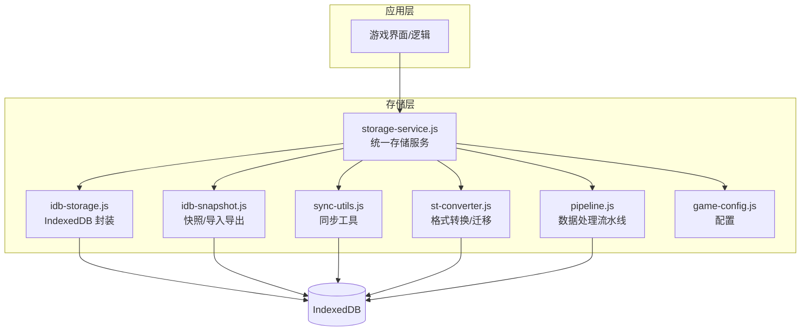
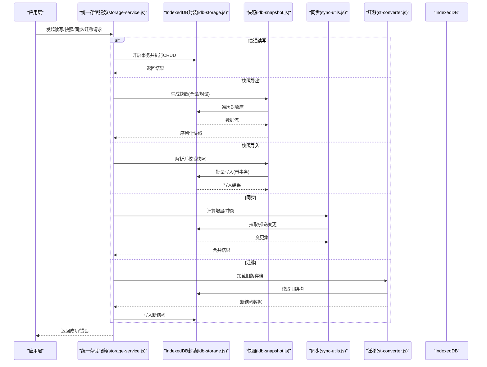
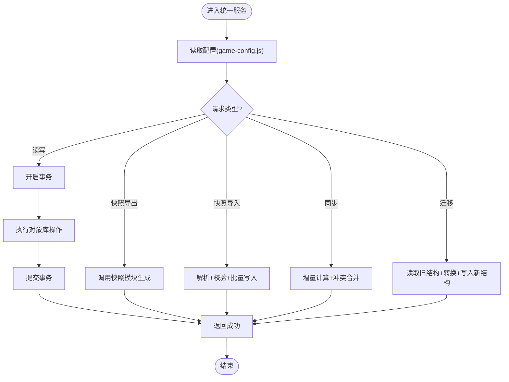
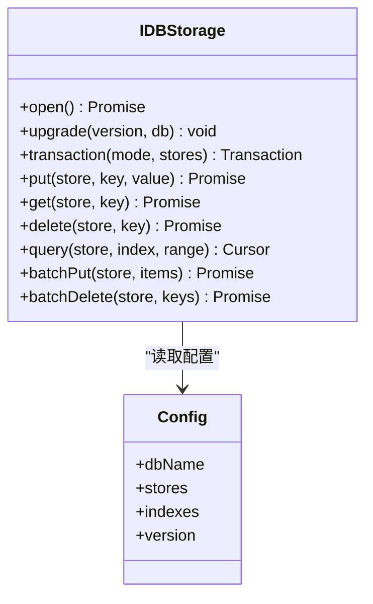
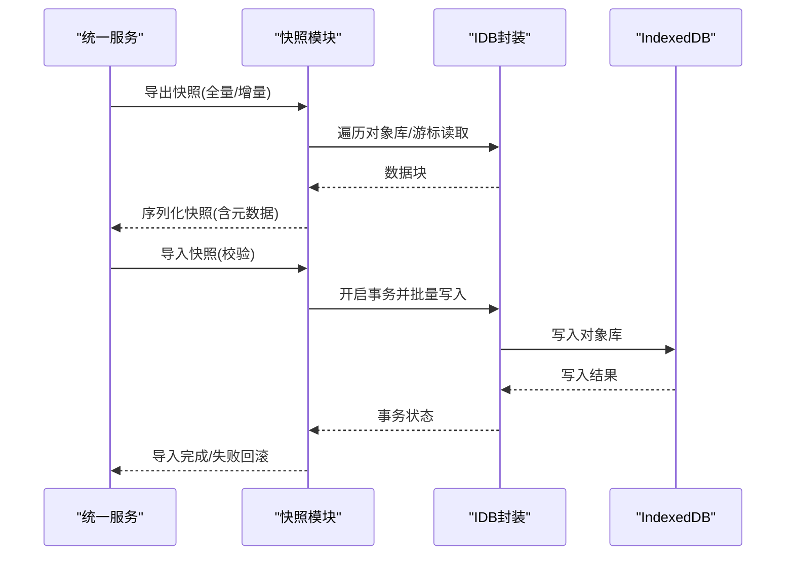
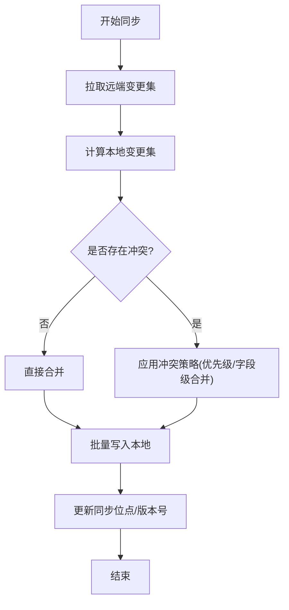
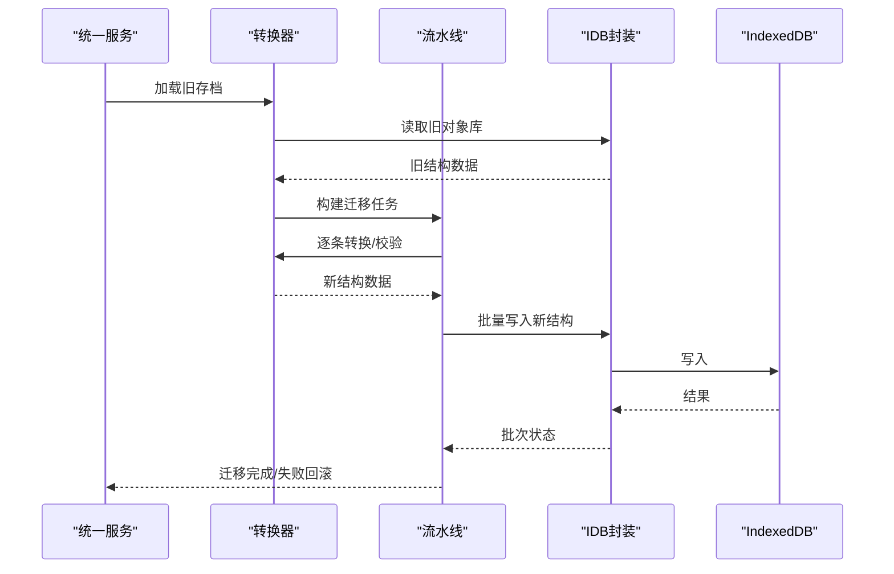
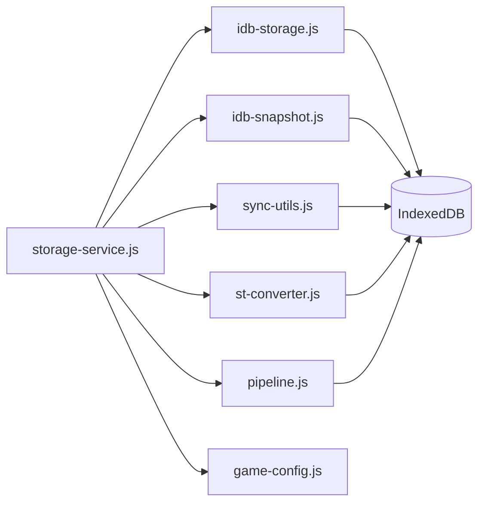

# 数据存储架构

<cite>
**本文引用的文件**   
- [idb-storage.js](file://module/idb-storage.js)
- [idb-snapshot.js](file://module/idb-snapshot.js)
- [storage-service.js](file://module/storage-service.js)
- [sync-utils.js](file://module/sync-utils.js)
- [st-converter.js](file://module/st-converter.js)
- [pipeline.js](file://module/pipeline.js)
- [game-config.js](file://module/game-config.js)
- [ReadMe.md](file://ReadMe.md)
</cite>

## 目录
1. [简介](#简介)
2. [项目结构](#项目结构)
3. [核心组件](#核心组件)
4. [架构总览](#架构总览)
5. [详细组件分析](#详细组件分析)
6. [依赖关系分析](#依赖关系分析)
7. [性能考虑](#性能考虑)
8. [故障排查指南](#故障排查指南)
9. [结论](#结论)
10. [附录](#附录)

## 简介
本文件为“姬侠传”数据存储系统的架构文档，聚焦于基于 IndexedDB 的数据持久化设计。内容涵盖统一存储服务接口、快照机制与数据同步策略；数据模型设计、索引优化与查询性能调优；存档恢复机制与数据迁移方案；以及数据备份、版本兼容性与错误恢复策略。文末提供数据流图与存储架构图，帮助读者快速理解系统结构与关键流程。

## 项目结构
与数据存储相关的核心模块位于 module 目录下，围绕 IndexedDB 的封装、快照/导入导出、统一服务层与同步工具展开：
- idb-storage.js：IndexedDB 底层封装（数据库打开、对象库管理、事务、索引、CRUD 操作）
- idb-snapshot.js：快照序列化/反序列化、导入/导出、校验与回滚
- storage-service.js：面向业务层的统一存储服务接口（聚合读写、事务编排、错误处理）
- sync-utils.js：增量同步、冲突检测与合并策略工具
- st-converter.js：存档格式转换与版本迁移
- pipeline.js：数据处理流水线（读取、转换、写入），用于批量迁移或批处理任务
- game-config.js：配置项（如数据库名、对象库名、版本号等）

图表来源
- [idb-storage.js](file://module/idb-storage.js)
- [idb-snapshot.js](file://module/idb-snapshot.js)
- [storage-service.js](file://module/storage-service.js)
- [sync-utils.js](file://module/sync-utils.js)
- [st-converter.js](file://module/st-converter.js)
- [pipeline.js](file://module/pipeline.js)
- [game-config.js](file://module/game-config.js)

章节来源
- [ReadMe.md](file://ReadMe.md)

## 核心组件
- 统一存储服务接口（storage-service.js）
  - 职责：对外暴露一致的 API（读/写/删除/事务/快照/同步/迁移），屏蔽底层 IndexedDB 细节，集中错误处理与重试策略。
  - 关键点：事务边界控制、批量操作、幂等性保证、失败回滚。
- IndexedDB 封装（idb-storage.js）
  - 职责：数据库连接、对象库创建/升级、索引定义、增删改查、游标遍历、事务生命周期管理。
  - 关键点：并发安全、事务隔离级别、索引选择与复合索引使用。
- 快照机制（idb-snapshot.js）
  - 职责：全量/增量快照生成、校验、导入导出、版本标记、回滚到指定快照。
  - 关键点：一致性快照、压缩与分片、导入时的幂等与冲突解决。
- 同步工具（sync-utils.js）
  - 职责：增量变更收集、冲突检测、合并策略、断点续传。
  - 关键点：时间戳/版本号驱动、向量时钟或简单序列号、冲突消解规则。
- 存档转换与迁移（st-converter.js + pipeline.js）
  - 职责：旧版存档格式到新版的转换、字段映射、缺失值填充、迁移日志。
  - 关键点：可逆迁移、幂等执行、失败回退。
- 配置（game-config.js）
  - 职责：数据库名、对象库名、索引列表、版本号、默认策略等。
  - 关键点：环境差异、灰度开关、向后兼容参数。

章节来源
- [storage-service.js](file://module/storage-service.js)
- [idb-storage.js](file://module/idb-storage.js)
- [idb-snapshot.js](file://module/idb-snapshot.js)
- [sync-utils.js](file://module/sync-utils.js)
- [st-converter.js](file://module/st-converter.js)
- [pipeline.js](file://module/pipeline.js)
- [game-config.js](file://module/game-config.js)

## 架构总览
整体采用“服务层 + 存储层”的分层架构。上层通过统一服务接口访问数据，服务层协调 IndexedDB 封装、快照、同步与迁移工具，最终落盘至 IndexedDB。

图表来源
- [storage-service.js](file://module/storage-service.js)
- [idb-storage.js](file://module/idb-storage.js)
- [idb-snapshot.js](file://module/idb-snapshot.js)
- [sync-utils.js](file://module/sync-utils.js)
- [st-converter.js](file://module/st-converter.js)

## 详细组件分析

### 统一存储服务接口（storage-service.js）
- 设计要点
  - 抽象出统一的读写接口，隐藏 IndexedDB 的事务细节与错误类型。
  - 提供快照导入/导出、同步与迁移的统一入口。
  - 内置重试与降级策略，确保在浏览器环境下的稳定性。
- 关键流程
  - 事务编排：将多个对象库操作组合在一个事务中，保证原子性。
  - 错误分类：区分网络/权限/空间不足/版本不匹配等错误，给出明确提示。
  - 幂等写入：对重复写入进行去重或覆盖策略控制。

图表来源
- [storage-service.js](file://module/storage-service.js)
- [game-config.js](file://module/game-config.js)

章节来源
- [storage-service.js](file://module/storage-service.js)
- [game-config.js](file://module/game-config.js)

### IndexedDB 封装（idb-storage.js）
- 设计要点
  - 数据库初始化与版本升级：根据配置动态创建/升级对象库与索引。
  - 事务与游标：支持多对象库事务、范围查询、分页游标。
  - 索引策略：按常用查询条件建立单列/复合索引，避免全表扫描。
- 关键能力
  - 高并发安全：通过队列串行化写操作，避免事务冲突。
  - 错误恢复：捕获常见错误（QuotaExceededError、VersionChangeError 等）并给出降级路径。
  - 批量操作：批量插入/更新/删除，减少事务次数。

图表来源
- [idb-storage.js](file://module/idb-storage.js)
- [game-config.js](file://module/game-config.js)

章节来源
- [idb-storage.js](file://module/idb-storage.js)
- [game-config.js](file://module/game-config.js)

### 快照机制（idb-snapshot.js）
- 设计要点
  - 全量快照：按对象库顺序序列化所有记录，附带元数据（版本、时间戳、哈希）。
  - 增量快照：仅包含自上次快照以来的变更集合。
  - 导入流程：先校验完整性，再分批写入，失败时自动回滚。
- 关键流程

图表来源
- [idb-snapshot.js](file://module/idb-snapshot.js)
- [idb-storage.js](file://module/idb-storage.js)

章节来源
- [idb-snapshot.js](file://module/idb-snapshot.js)
- [idb-storage.js](file://module/idb-storage.js)

### 数据同步策略（sync-utils.js）
- 设计要点
  - 增量采集：基于时间戳/版本号/序列号识别新增、修改、删除。
  - 冲突检测：比较本地与远端（或另一份本地副本）的变更，定位冲突。
  - 合并策略：定义优先级（如服务端优先、最后写入优先、字段级合并）。
- 关键流程

图表来源
- [sync-utils.js](file://module/sync-utils.js)
- [idb-storage.js](file://module/idb-storage.js)

章节来源
- [sync-utils.js](file://module/sync-utils.js)
- [idb-storage.js](file://module/idb-storage.js)

### 存档恢复与数据迁移（st-converter.js + pipeline.js）
- 设计要点
  - 格式转换：从旧版存档结构映射到新版结构，补齐缺失字段，规范化枚举值。
  - 迁移流水线：读取旧结构 -> 转换 -> 校验 -> 写入新结构，支持断点续跑与回滚。
  - 幂等与可逆：同一份旧存档多次迁移应得到一致结果；必要时保留旧结构以便回退。
- 关键流程

图表来源
- [st-converter.js](file://module/st-converter.js)
- [pipeline.js](file://module/pipeline.js)
- [idb-storage.js](file://module/idb-storage.js)

章节来源
- [st-converter.js](file://module/st-converter.js)
- [pipeline.js](file://module/pipeline.js)
- [idb-storage.js](file://module/idb-storage.js)

### 数据模型设计与索引优化
- 模型组织
  - 以对象库为单位划分领域（如用户、存档、事件、NPC、世界书等），每个对象库对应一组键与属性。
  - 关键字段建议包含：唯一标识、版本号/时间戳、关联外键、状态标志。
- 索引策略
  - 高频查询字段建立单列索引；多条件过滤使用复合索引。
  - 范围查询尽量利用有序索引；避免在索引上执行复杂函数。
  - 大文本/二进制数据不建议放入索引，必要时拆分为独立对象库并通过外键关联。
- 查询调优
  - 使用游标分页，避免一次性加载大量数据。
  - 批量操作合并事务，降低锁竞争。
  - 定期统计热点查询，调整索引与对象库拆分。

章节来源
- [idb-storage.js](file://module/idb-storage.js)
- [game-config.js](file://module/game-config.js)

### 数据备份与版本兼容性
- 备份
  - 定期导出全量快照，保存元数据（版本、时间戳、哈希）便于校验与回溯。
  - 增量快照配合全量快照，实现高效恢复。
- 版本兼容
  - 数据库版本升级由配置驱动，迁移脚本保证新旧结构共存期平滑过渡。
  - 导入快照前进行版本检查，不兼容时提示升级或转换。
- 错误恢复
  - 导入/迁移失败自动回滚，保留最近可用快照。
  - 记录错误上下文（对象库、键、错误码），便于定位问题。

章节来源
- [idb-snapshot.js](file://module/idb-snapshot.js)
- [st-converter.js](file://module/st-converter.js)
- [game-config.js](file://module/game-config.js)

## 依赖关系分析
- 耦合与内聚
  - 统一服务层高度内聚，聚合各工具能力，降低上层调用复杂度。
  - IndexedDB 封装与业务逻辑解耦，便于替换存储后端或扩展功能。
- 外部依赖
  - 主要依赖浏览器 IndexedDB API；其他均为内部模块。
- 循环依赖
  - 当前分层清晰，未见循环依赖迹象；如需引入跨模块回调，建议使用事件总线或回调注册模式。

图表来源
- [storage-service.js](file://module/storage-service.js)
- [idb-storage.js](file://module/idb-storage.js)
- [idb-snapshot.js](file://module/idb-snapshot.js)
- [sync-utils.js](file://module/sync-utils.js)
- [st-converter.js](file://module/st-converter.js)
- [pipeline.js](file://module/pipeline.js)
- [game-config.js](file://module/game-config.js)

章节来源
- [storage-service.js](file://module/storage-service.js)
- [idb-storage.js](file://module/idb-storage.js)
- [idb-snapshot.js](file://module/idb-snapshot.js)
- [sync-utils.js](file://module/sync-utils.js)
- [st-converter.js](file://module/st-converter.js)
- [pipeline.js](file://module/pipeline.js)
- [game-config.js](file://module/game-config.js)

## 性能考虑
- 事务与批量
  - 合并小操作为大事务，减少锁开销与磁盘 IO。
  - 使用 batchPut/batchDelete 提升吞吐。
- 索引与查询
  - 针对热点查询建立合适索引，避免全表扫描。
  - 分页游标限制单次加载量，结合懒加载提升首屏速度。
- 内存与序列化
  - 快照序列化时按需压缩或分片，避免一次性占用过多内存。
  - 大对象拆分存储，主表仅保留引用。
- 并发与竞态
  - 写操作串行化，避免事务冲突导致频繁回滚。
  - 增量同步使用版本号/时间戳，减少不必要的全量比对。

## 故障排查指南
- 常见问题
  - 存储空间不足：捕获配额错误，提示清理或降级策略。
  - 版本不匹配：导入快照或打开数据库时检查版本，引导升级或转换。
  - 事务冲突：重试机制与幂等写入，避免重复写入造成不一致。
- 诊断手段
  - 记录关键操作的上下文（对象库、键、操作类型、错误码）。
  - 导出最近快照进行离线复现与对比。
  - 使用迁移流水线的日志定位失败阶段与数据位置。

章节来源
- [storage-service.js](file://module/storage-service.js)
- [idb-snapshot.js](file://module/idb-snapshot.js)
- [pipeline.js](file://module/pipeline.js)

## 结论
本架构以统一服务层为核心，整合 IndexedDB 封装、快照、同步与迁移工具，形成稳定、可扩展的数据持久化体系。通过合理的索引设计与批量事务策略，兼顾了查询性能与写入吞吐；借助快照与迁移流水线，实现了可靠的备份恢复与版本演进。建议在后续迭代中持续监控热点查询、完善冲突合并策略，并逐步引入更细粒度的增量同步与压缩机制，进一步提升用户体验与系统健壮性。

## 附录
- 术语
  - 快照：某一时刻数据的完整或增量表示，用于备份与恢复。
  - 增量同步：仅传输自上次同步以来的变更集合。
  - 幂等：同一操作多次执行产生相同结果，避免副作用。
- 参考
  - ReadMe.md 中的项目说明与使用说明可作为背景补充。

章节来源
- [ReadMe.md](file://ReadMe.md)