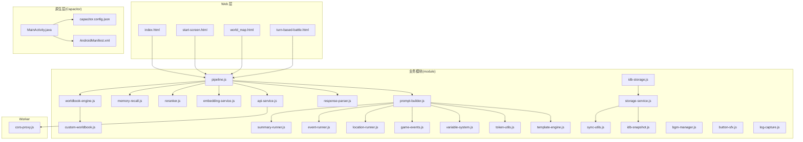
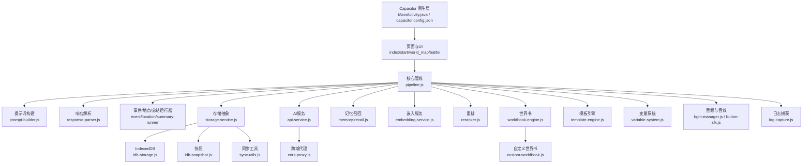
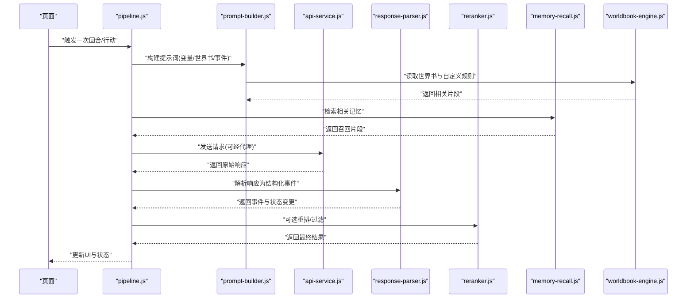
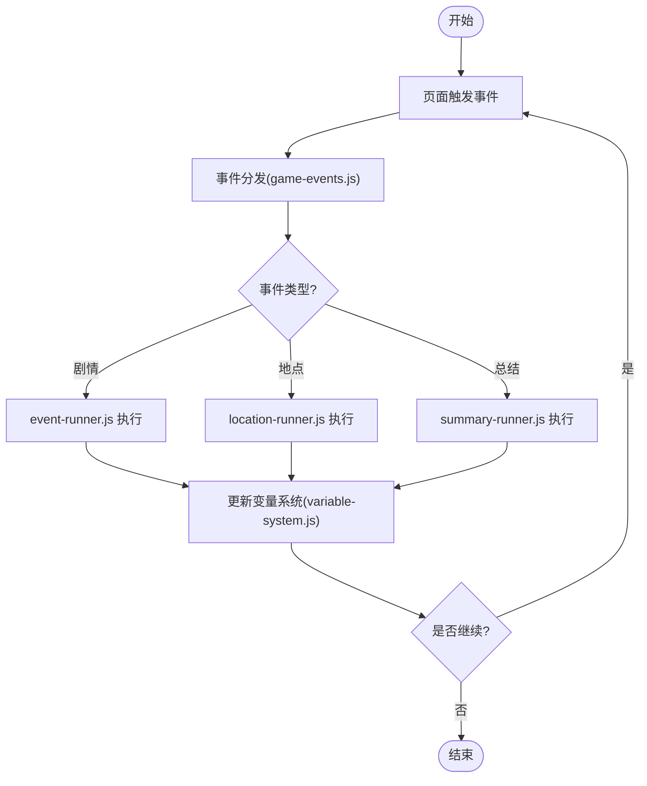
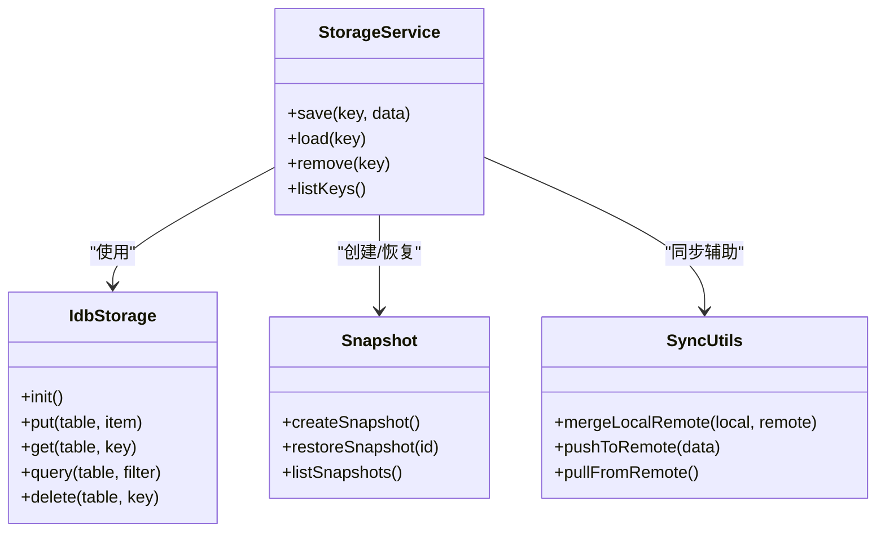
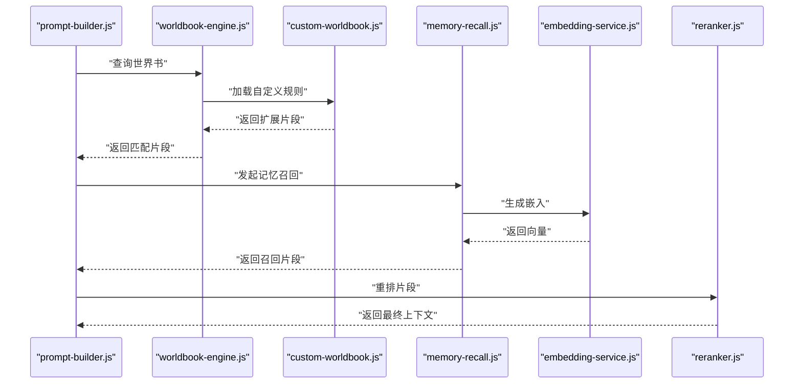
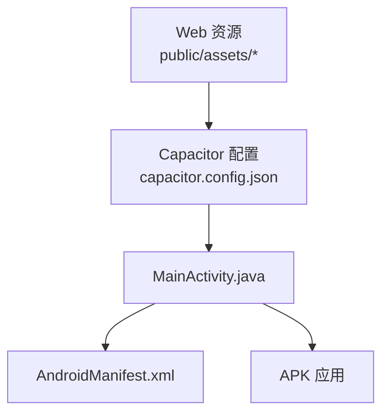
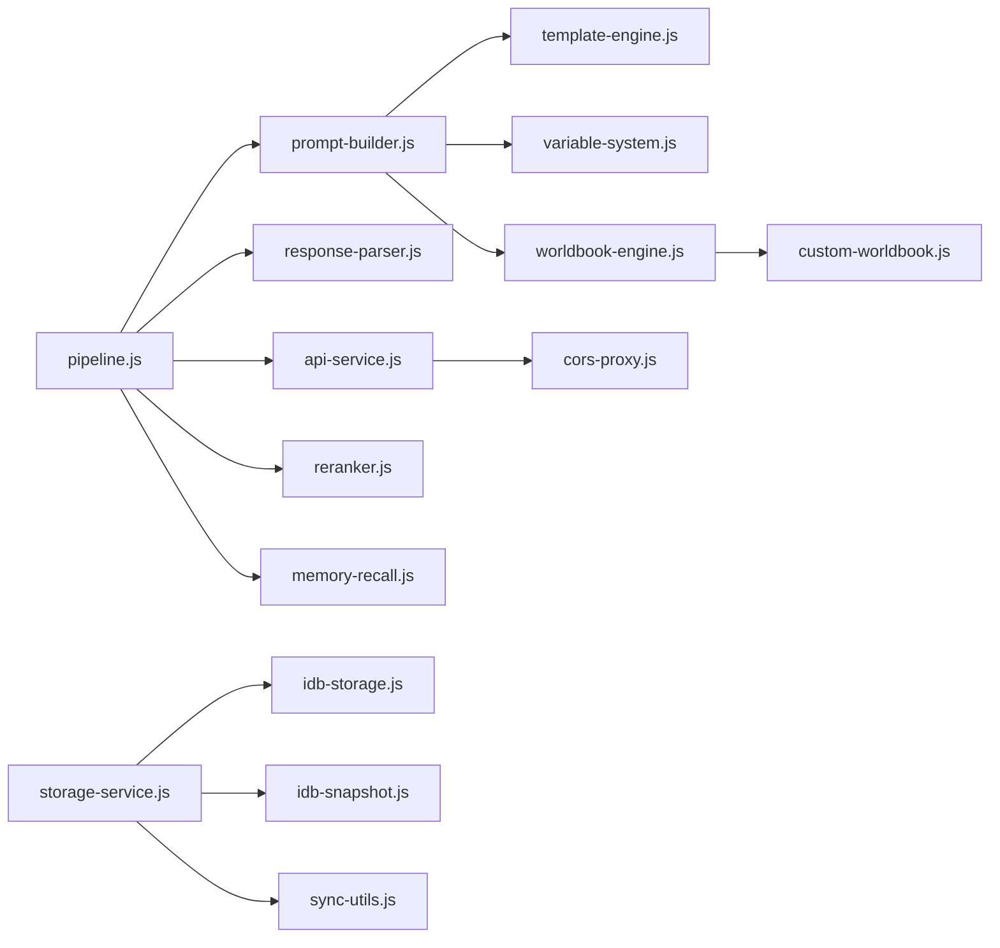

# 整体架构概览

<cite>
**本文引用的文件**   
- [index.html](file://index.html)
- [start-screen.html](file://start-screen.html)
- [world_map.html](file://world_map.html)
- [turn-based-battle.html](file://turn-based-battle.html)
- [capacitor.config.json](file://apk/capacitor.config.json)
- [MainActivity.java](file://apk/android/app/src/main/java/com/jihaitang/jxz/MainActivity.java)
- [AndroidManifest.xml](file://apk/android/app/src/main/AndroidManifest.xml)
- [api-service.js](file://module/api-service.js)
- [embedding-service.js](file://module/embedding-service.js)
- [prompt-builder.js](file://module/prompt-builder.js)
- [response-parser.js](file://module/response-parser.js)
- [pipeline.js](file://module/pipeline.js)
- [event-runner.js](file://module/event-runner.js)
- [location-runner.js](file://module/location-runner.js)
- [summary-runner.js](file://module/summary-runner.js)
- [game-events.js](file://module/game-events.js)
- [variable-system.js](file://module/variable-system.js)
- [idb-storage.js](file://module/idb-storage.js)
- [storage-service.js](file://module/storage-service.js)
- [idb-snapshot.js](file://module/idb-snapshot.js)
- [sync-utils.js](file://module/sync-utils.js)
- [memory-recall.js](file://module/memory-recall.js)
- [reranker.js](file://module/reranker.js)
- [template-engine.js](file://module/template-engine.js)
- [token-utils.js](file://module/token-utils.js)
- [custom-worldbook.js](file://module/custom-worldbook.js)
- [worldbook-engine.js](file://module/worldbook-engine.js)
- [cors-proxy.js](file://worker/cors-proxy.js)
- [bgm-manager.js](file://module/bgm-manager.js)
- [button-sfx.js](file://module/button-sfx.js)
- [log-capture.js](file://module/log-capture.js)
- [config-modal.js](file://ui/config-modal.js)
- [prompt-manager-modal.js](file://ui/prompt-manager-modal.js)
</cite>

## 目录
1. [简介](#简介)
2. [项目结构](#项目结构)
3. [核心组件](#核心组件)
4. [架构总览](#架构总览)
5. [详细组件分析](#详细组件分析)
6. [依赖关系分析](#依赖关系分析)
7. [性能考量](#性能考量)
8. [故障排查指南](#故障排查指南)
9. [结论](#结论)
10. [附录](#附录)

## 简介
本文件为“姬侠传”游戏的整体架构概览，面向开发者与产品人员，帮助快速理解系统边界、技术栈选择（Capacitor、IndexedDB、AI服务）、模块化设计与事件驱动的数据流。文档通过架构图与交互图展示模块职责与依赖关系，并给出关键流程的时序说明，便于后续扩展与维护。

## 项目结构
项目采用“前端HTML页面 + JS模块 + Capacitor打包”的混合架构：
- 入口页面：提供游戏主界面、世界地图、战斗等场景入口
- 业务模块：位于 module/，按职责划分为 AI 管线、事件运行器、存储、提示词构建、UI 工具等
- 原生桥接：通过 Capacitor 将 Web 应用打包为 Android APK，并在 MainActivity 中加载本地资源
- Worker：用于跨域代理等后台任务
- UI 弹窗：配置与提示词管理弹窗

图表来源
- [index.html](file://index.html)
- [start-screen.html](file://start-screen.html)
- [world_map.html](file://world_map.html)
- [turn-based-battle.html](file://turn-based-battle.html)
- [pipeline.js](file://module/pipeline.js)
- [prompt-builder.js](file://module/prompt-builder.js)
- [response-parser.js](file://module/response-parser.js)
- [api-service.js](file://module/api-service.js)
- [embedding-service.js](file://module/embedding-service.js)
- [reranker.js](file://module/reranker.js)
- [memory-recall.js](file://module/memory-recall.js)
- [worldbook-engine.js](file://module/worldbook-engine.js)
- [custom-worldbook.js](file://module/custom-worldbook.js)
- [template-engine.js](file://module/template-engine.js)
- [token-utils.js](file://module/token-utils.js)
- [variable-system.js](file://module/variable-system.js)
- [game-events.js](file://module/game-events.js)
- [location-runner.js](file://module/location-runner.js)
- [event-runner.js](file://module/event-runner.js)
- [summary-runner.js](file://module/summary-runner.js)
- [idb-storage.js](file://module/idb-storage.js)
- [storage-service.js](file://module/storage-service.js)
- [idb-snapshot.js](file://module/idb-snapshot.js)
- [sync-utils.js](file://module/sync-utils.js)
- [cors-proxy.js](file://worker/cors-proxy.js)
- [capacitor.config.json](file://apk/capacitor.config.json)
- [MainActivity.java](file://apk/android/app/src/main/java/com/jihaitang/jxz/MainActivity.java)
- [AndroidManifest.xml](file://apk/android/app/src/main/AndroidManifest.xml)

章节来源
- [index.html](file://index.html)
- [start-screen.html](file://start-screen.html)
- [world_map.html](file://world_map.html)
- [turn-based-battle.html](file://turn-based-battle.html)
- [capacitor.config.json](file://apk/capacitor.config.json)
- [MainActivity.java](file://apk/android/app/src/main/java/com/jihaitang/jxz/MainActivity.java)
- [AndroidManifest.xml](file://apk/android/app/src/main/AndroidManifest.xml)

## 核心组件
- 应用入口与路由
  - 入口页面负责初始化全局状态、加载必要模块并进入主流程
  - 世界地图与战斗页面作为独立场景，复用统一的事件与数据管线
- AI 管线
  - 提示词构建：组合角色设定、变量、地点、行动、世界书等上下文
  - 响应解析：将大模型输出结构化，提取动作、对话、状态变更
  - 重排与记忆召回：对候选结果进行排序与检索增强
  - 嵌入与向量：为历史与知识片段生成嵌入，支持语义检索
- 事件与场景运行器
  - 事件运行器：驱动剧情事件、分支与条件判定
  - 地点运行器：处理地点相关逻辑与场景切换
  - 总结运行器：周期性压缩长对话历史，控制上下文长度
- 存储与同步
  - IndexedDB 持久化：存档、快照、周记、事件历史等
  - 存储抽象：统一的读写接口，屏蔽底层差异
  - 同步工具：多端或跨会话一致性辅助
- 模板与变量
  - 模板引擎：渲染提示词与文本
  - 变量系统：维护玩家属性、NPC 关系、世界状态等
- 音频与日志
  - BGM 管理器：背景音乐播放与切换
  - 按钮音效：交互反馈
  - 日志捕获：收集运行时信息，便于定位问题
- 原生桥接
  - Capacitor 配置与 Android 主活动：将 Web 内容打包为 APK，并提供原生能力访问点

章节来源
- [pipeline.js](file://module/pipeline.js)
- [prompt-builder.js](file://module/prompt-builder.js)
- [response-parser.js](file://module/response-parser.js)
- [reranker.js](file://module/reranker.js)
- [memory-recall.js](file://module/memory-recall.js)
- [embedding-service.js](file://module/embedding-service.js)
- [event-runner.js](file://module/event-runner.js)
- [location-runner.js](file://module/location-runner.js)
- [summary-runner.js](file://module/summary-runner.js)
- [idb-storage.js](file://module/idb-storage.js)
- [storage-service.js](file://module/storage-service.js)
- [idb-snapshot.js](file://module/idb-snapshot.js)
- [sync-utils.js](file://module/sync-utils.js)
- [template-engine.js](file://module/template-engine.js)
- [variable-system.js](file://module/variable-system.js)
- [bgm-manager.js](file://module/bgm-manager.js)
- [button-sfx.js](file://module/button-sfx.js)
- [log-capture.js](file://module/log-capture.js)
- [capacitor.config.json](file://apk/capacitor.config.json)
- [MainActivity.java](file://apk/android/app/src/main/java/com/jihaitang/jxz/MainActivity.java)
- [AndroidManifest.xml](file://apk/android/app/src/main/AndroidManifest.xml)

## 架构总览
系统分为三层：
- 表现层：HTML 页面与 UI 弹窗，负责用户交互与展示
- 业务层：JS 模块实现 AI 管线、事件驱动、存储与工具
- 原生层：Capacitor 与 Android 工程，提供打包与平台能力

图表来源
- [pipeline.js](file://module/pipeline.js)
- [prompt-builder.js](file://module/prompt-builder.js)
- [response-parser.js](file://module/response-parser.js)
- [event-runner.js](file://module/event-runner.js)
- [location-runner.js](file://module/location-runner.js)
- [summary-runner.js](file://module/summary-runner.js)
- [storage-service.js](file://module/storage-service.js)
- [idb-storage.js](file://module/idb-storage.js)
- [idb-snapshot.js](file://module/idb-snapshot.js)
- [sync-utils.js](file://module/sync-utils.js)
- [api-service.js](file://module/api-service.js)
- [cors-proxy.js](file://worker/cors-proxy.js)
- [memory-recall.js](file://module/memory-recall.js)
- [embedding-service.js](file://module/embedding-service.js)
- [reranker.js](file://module/reranker.js)
- [worldbook-engine.js](file://module/worldbook-engine.js)
- [custom-worldbook.js](file://module/custom-worldbook.js)
- [template-engine.js](file://module/template-engine.js)
- [variable-system.js](file://module/variable-system.js)
- [bgm-manager.js](file://module/bgm-manager.js)
- [button-sfx.js](file://module/button-sfx.js)
- [log-capture.js](file://module/log-capture.js)
- [MainActivity.java](file://apk/android/app/src/main/java/com/jihaitang/jxz/MainActivity.java)
- [capacitor.config.json](file://apk/capacitor.config.json)

## 详细组件分析

### AI 管线与提示词构建
- 设计要点
  - 以 pipeline.js 为核心编排器，串联提示词构建、AI 调用、响应解析、重排与记忆召回
  - prompt-builder.js 聚合变量系统、模板引擎、世界书与事件上下文，生成高质量提示词
  - response-parser.js 将非结构化输出转为结构化事件与状态变更
- 关键依赖
  - template-engine.js、variable-system.js、worldbook-engine.js、custom-worldbook.js
  - api-service.js、embedding-service.js、reranker.js、memory-recall.js
- 复杂度与优化
  - 提示词组装时间复杂度与上下文规模线性相关；可通过摘要与检索降低输入长度
  - 响应解析失败时回退策略与重试机制提升鲁棒性

图表来源
- [pipeline.js](file://module/pipeline.js)
- [prompt-builder.js](file://module/prompt-builder.js)
- [response-parser.js](file://module/response-parser.js)
- [api-service.js](file://module/api-service.js)
- [reranker.js](file://module/reranker.js)
- [memory-recall.js](file://module/memory-recall.js)
- [worldbook-engine.js](file://module/worldbook-engine.js)

章节来源
- [pipeline.js](file://module/pipeline.js)
- [prompt-builder.js](file://module/prompt-builder.js)
- [response-parser.js](file://module/response-parser.js)
- [api-service.js](file://module/api-service.js)
- [reranker.js](file://module/reranker.js)
- [memory-recall.js](file://module/memory-recall.js)
- [worldbook-engine.js](file://module/worldbook-engine.js)
- [custom-worldbook.js](file://module/custom-worldbook.js)
- [template-engine.js](file://module/template-engine.js)
- [variable-system.js](file://module/variable-system.js)

### 事件驱动与场景运行器
- 设计理念
  - 事件总线由 game-events.js 提供，各模块订阅/发布事件，解耦业务逻辑
  - event-runner.js 驱动剧情事件，location-runner.js 处理地点逻辑，summary-runner.js 定期压缩历史
- 数据流向
  - 页面触发事件 -> 事件运行器执行 -> 更新变量与世界书 -> 触发下一事件或场景切换

图表来源
- [game-events.js](file://module/game-events.js)
- [event-runner.js](file://module/event-runner.js)
- [location-runner.js](file://module/location-runner.js)
- [summary-runner.js](file://module/summary-runner.js)
- [variable-system.js](file://module/variable-system.js)

章节来源
- [game-events.js](file://module/game-events.js)
- [event-runner.js](file://module/event-runner.js)
- [location-runner.js](file://module/location-runner.js)
- [summary-runner.js](file://module/summary-runner.js)
- [variable-system.js](file://module/variable-system.js)

### 存储与快照机制
- 设计要点
  - storage-service.js 提供统一存储接口，idb-storage.js 基于 IndexedDB 实现
  - idb-snapshot.js 支持存档快照，sync-utils.js 提供同步辅助
- 数据流
  - 业务模块通过 storage-service.js 读写，底层落盘到 IndexedDB；快照用于快速恢复与迁移

图表来源
- [storage-service.js](file://module/storage-service.js)
- [idb-storage.js](file://module/idb-storage.js)
- [idb-snapshot.js](file://module/idb-snapshot.js)
- [sync-utils.js](file://module/sync-utils.js)

章节来源
- [storage-service.js](file://module/storage-service.js)
- [idb-storage.js](file://module/idb-storage.js)
- [idb-snapshot.js](file://module/idb-snapshot.js)
- [sync-utils.js](file://module/sync-utils.js)

### 世界书与记忆召回
- 世界书
  - worldbook-engine.js 提供知识检索与注入，custom-worldbook.js 允许动态扩展
- 记忆召回
  - memory-recall.js 结合 embedding-service.js 生成的嵌入，进行语义检索，提升提示词相关性
- 重排
  - reranker.js 对召回结果进行二次排序，提高最终上下文质量

图表来源
- [worldbook-engine.js](file://module/worldbook-engine.js)
- [custom-worldbook.js](file://module/custom-worldbook.js)
- [memory-recall.js](file://module/memory-recall.js)
- [embedding-service.js](file://module/embedding-service.js)
- [reranker.js](file://module/reranker.js)
- [prompt-builder.js](file://module/prompt-builder.js)

章节来源
- [worldbook-engine.js](file://module/worldbook-engine.js)
- [custom-worldbook.js](file://module/custom-worldbook.js)
- [memory-recall.js](file://module/memory-recall.js)
- [embedding-service.js](file://module/embedding-service.js)
- [reranker.js](file://module/reranker.js)
- [prompt-builder.js](file://module/prompt-builder.js)

### 原生桥接与打包
- Capacitor 配置
  - capacitor.config.json 定义 Web 资源路径与插件配置
- Android 主活动
  - MainActivity.java 加载本地资源并启动应用
  - AndroidManifest.xml 声明权限与应用元数据

图表来源
- [capacitor.config.json](file://apk/capacitor.config.json)
- [MainActivity.java](file://apk/android/app/src/main/java/com/jihaitang/jxz/MainActivity.java)
- [AndroidManifest.xml](file://apk/android/app/src/main/AndroidManifest.xml)

章节来源
- [capacitor.config.json](file://apk/capacitor.config.json)
- [MainActivity.java](file://apk/android/app/src/main/java/com/jihaitang/jxz/MainActivity.java)
- [AndroidManifest.xml](file://apk/android/app/src/main/AndroidManifest.xml)

### 音频与日志
- BGM 管理器：统一管理背景音乐播放、音量与切换
- 按钮音效：提供交互反馈音效
- 日志捕获：集中记录运行时日志，便于调试与问题定位

章节来源
- [bgm-manager.js](file://module/bgm-manager.js)
- [button-sfx.js](file://module/button-sfx.js)
- [log-capture.js](file://module/log-capture.js)

### UI 弹窗与配置
- 配置弹窗：提供游戏参数调整入口
- 提示词管理弹窗：便捷编辑与管理提示词模板

章节来源
- [config-modal.js](file://ui/config-modal.js)
- [prompt-manager-modal.js](file://ui/prompt-manager-modal.js)

## 依赖关系分析
- 模块耦合
  - pipeline.js 作为编排中心，依赖提示词构建、响应解析、AI 服务、重排与记忆召回
  - prompt-builder.js 强依赖模板引擎、变量系统与世界书
  - storage-service.js 封装 idb-storage.js、快照与同步工具
- 外部依赖
  - api-service.js 可能通过 cors-proxy.js 进行跨域访问
  - Capacitor 与 Android 原生层提供打包与平台能力

图表来源
- [pipeline.js](file://module/pipeline.js)
- [prompt-builder.js](file://module/prompt-builder.js)
- [response-parser.js](file://module/response-parser.js)
- [api-service.js](file://module/api-service.js)
- [reranker.js](file://module/reranker.js)
- [memory-recall.js](file://module/memory-recall.js)
- [template-engine.js](file://module/template-engine.js)
- [variable-system.js](file://module/variable-system.js)
- [worldbook-engine.js](file://module/worldbook-engine.js)
- [custom-worldbook.js](file://module/custom-worldbook.js)
- [cors-proxy.js](file://worker/cors-proxy.js)
- [storage-service.js](file://module/storage-service.js)
- [idb-storage.js](file://module/idb-storage.js)
- [idb-snapshot.js](file://module/idb-snapshot.js)
- [sync-utils.js](file://module/sync-utils.js)

章节来源
- [pipeline.js](file://module/pipeline.js)
- [prompt-builder.js](file://module/prompt-builder.js)
- [response-parser.js](file://module/response-parser.js)
- [api-service.js](file://module/api-service.js)
- [reranker.js](file://module/reranker.js)
- [memory-recall.js](file://module/memory-recall.js)
- [template-engine.js](file://module/template-engine.js)
- [variable-system.js](file://module/variable-system.js)
- [worldbook-engine.js](file://module/worldbook-engine.js)
- [custom-worldbook.js](file://module/custom-worldbook.js)
- [cors-proxy.js](file://worker/cors-proxy.js)
- [storage-service.js](file://module/storage-service.js)
- [idb-storage.js](file://module/idb-storage.js)
- [idb-snapshot.js](file://module/idb-snapshot.js)
- [sync-utils.js](file://module/sync-utils.js)

## 性能考量
- 上下文长度控制
  - 通过 summary-runner.js 定期压缩历史，减少提示词体积，降低延迟与成本
- 检索增强
  - memory-recall.js 与 embedding-service.js 结合，仅注入相关片段，避免全量上下文
- 重排优化
  - reranker.js 对召回结果进行二次排序，提升最终上下文质量
- 存储效率
  - idb-snapshot.js 提供快照机制，减少重复写入与恢复开销
- 网络与代理
  - cors-proxy.js 缓解跨域限制，必要时增加缓存与重试策略

[本节为通用指导，不直接分析具体文件]

## 故障排查指南
- 常见问题
  - AI 调用失败：检查 api-service.js 的网络请求与 cors-proxy.js 的代理配置
  - 解析异常：查看 response-parser.js 的解析逻辑与错误回退
  - 存储异常：确认 idb-storage.js 的表结构与索引，以及 storage-service.js 的封装是否正确
  - 事件未触发：检查 game-events.js 的订阅与发布是否匹配
- 调试建议
  - 启用 log-capture.js 收集日志，定位问题链路
  - 使用 config-modal.js 与 prompt-manager-modal.js 调整参数与提示词，验证效果

章节来源
- [api-service.js](file://module/api-service.js)
- [cors-proxy.js](file://worker/cors-proxy.js)
- [response-parser.js](file://module/response-parser.js)
- [idb-storage.js](file://module/idb-storage.js)
- [storage-service.js](file://module/storage-service.js)
- [game-events.js](file://module/game-events.js)
- [log-capture.js](file://module/log-capture.js)
- [config-modal.js](file://ui/config-modal.js)
- [prompt-manager-modal.js](file://ui/prompt-manager-modal.js)

## 结论
本项目采用模块化与事件驱动的架构，围绕 pipeline.js 构建 AI 管线，结合世界书与记忆召回提升生成质量；通过 storage-service.js 统一存储抽象，保障数据持久化与快照恢复；借助 Capacitor 完成跨平台打包。该设计在可扩展性与可维护性之间取得平衡，适合持续迭代与功能扩展。

[本节为总结性内容，不直接分析具体文件]

## 附录
- 入口页面
  - index.html、start-screen.html、world_map.html、turn-based-battle.html
- 核心模块
  - pipeline.js、prompt-builder.js、response-parser.js、event-runner.js、location-runner.js、summary-runner.js
- 存储与同步
  - storage-service.js、idb-storage.js、idb-snapshot.js、sync-utils.js
- 世界书与记忆
  - worldbook-engine.js、custom-worldbook.js、memory-recall.js、embedding-service.js、reranker.js
- 模板与变量
  - template-engine.js、variable-system.js
- 音频与日志
  - bgm-manager.js、button-sfx.js、log-capture.js
- 原生与打包
  - capacitor.config.json、MainActivity.java、AndroidManifest.xml

[本节为索引性内容，不直接分析具体文件]