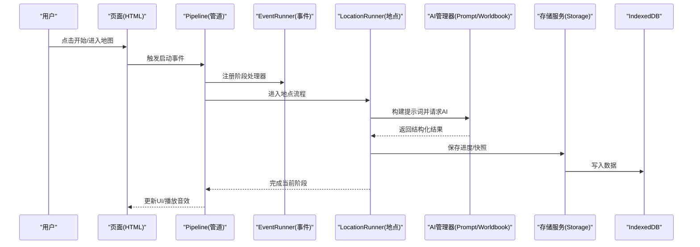
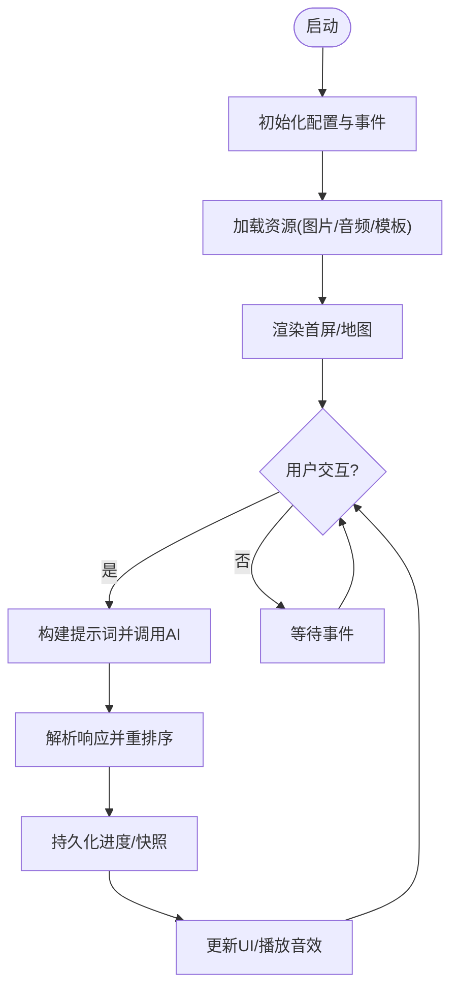
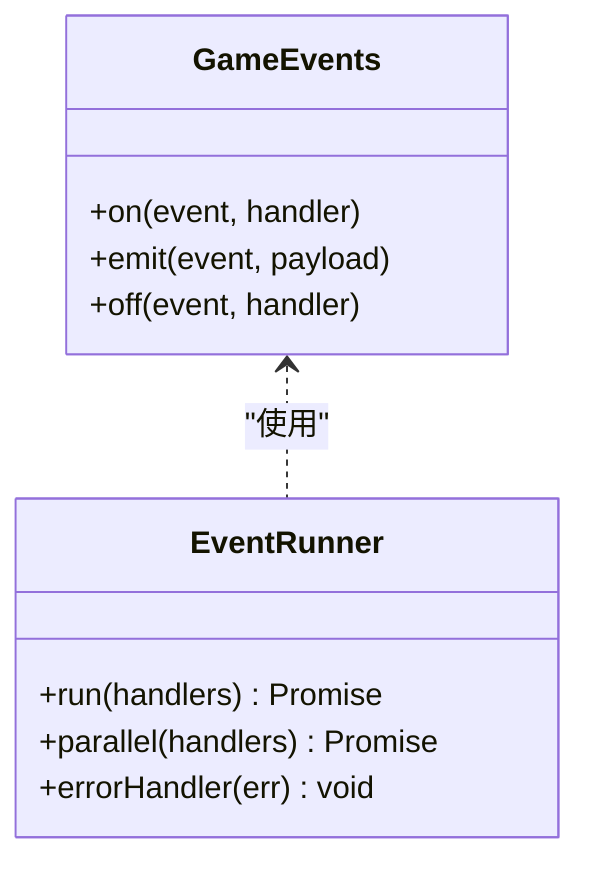
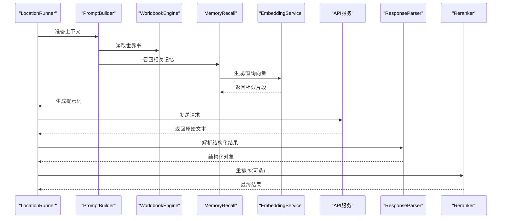
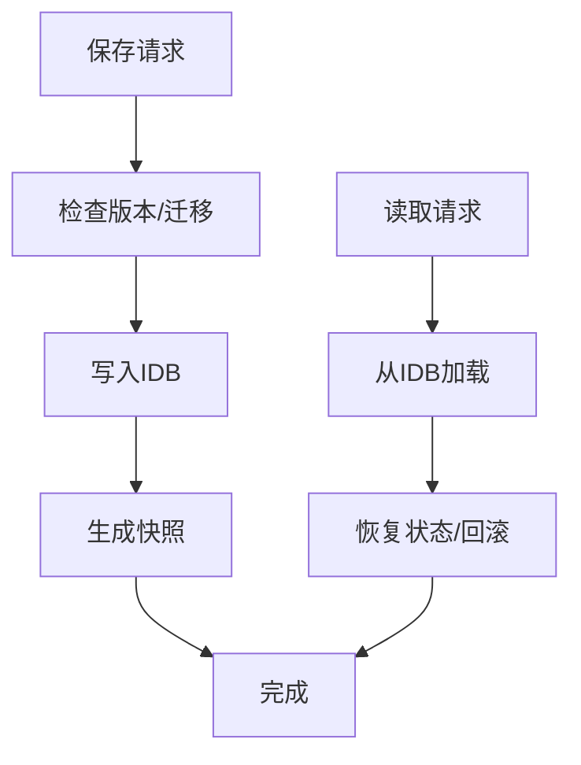
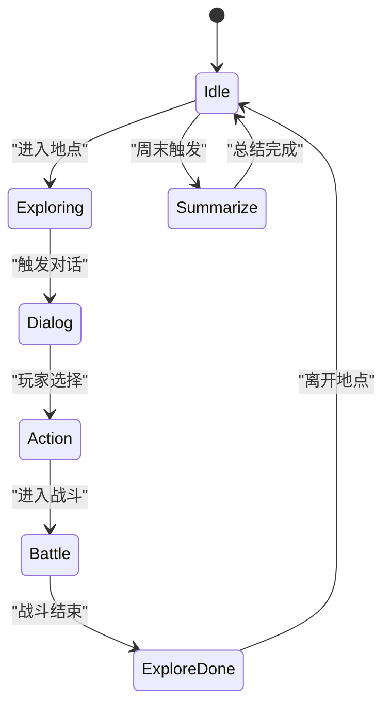
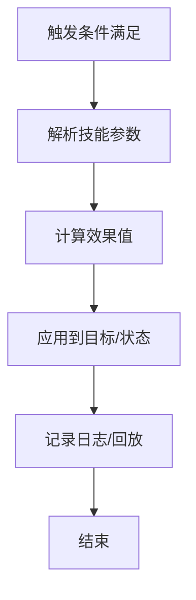
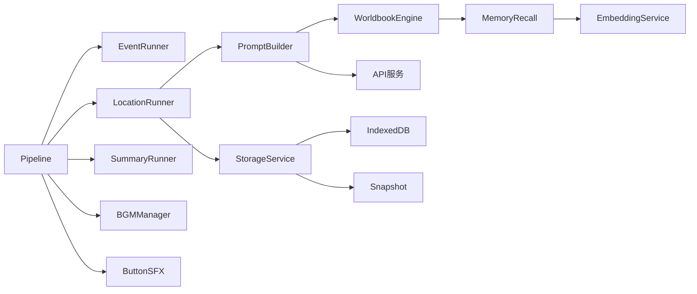

# 架构设计

<cite>
**本文引用的文件**   
- [index.html](file://index.html)
- [start-screen.html](file://start-screen.html)
- [world_map.html](file://world_map.html)
- [turn-based-battle-new.html](file://turn-based-battle-new.html)
- [module/pipeline.js](file://module/pipeline.js)
- [module/event-runner.js](file://module/event-runner.js)
- [module/location-runner.js](file://module/location-runner.js)
- [module/summary-runner.js](file://module/summary-runner.js)
- [module/storage-service.js](file://module/storage-service.js)
- [module/idb-storage.js](file://module/idb-storage.js)
- [module/idb-snapshot.js](file://module/idb-snapshot.js)
- [module/game-config.js](file://module/game-config.js)
- [module/game-events.js](file://module/game-events.js)
- [module/game-helpers.js](file://module/game-helpers.js)
- [module/game-utils.js](file://module/game-utils.js)
- [module/template-engine.js](file://module/template引擎.js)
- [module/prompt-builder.js](file://module/prompt-builder.js)
- [module/prompt-data-core.js](file://module/prompt-data-core.js)
- [module/prompt-data-actions.js](file://module/prompt-data-actions.js)
- [module/prompt-data-npc.js](file://module/prompt-data-npc.js)
- [module/response-parser.js](file://module/response-parser.js)
- [module/reranker.js](file://module/reranker.js)
- [module/worldbook-engine.js](file://module/worldbook-engine.js)
- [module/custom-worldbook.js](file://module/custom-worldbook.js)
- [module/memory-recall.js](file://module/memory-recall.js)
- [module/embedding-service.js](file://module/embedding-service.js)
- [module/token-utils.js](file://module/token-utils.js)
- [module/skill-list.js](file://module/skill-list.js)
- [module/game-skills.js](file://module/game-skills.js)
- [module/bgm-manager.js](file://module/bgm-manager.js)
- [module/button-sfx.js](file://module/button-sfx.js)
- [module/log-capture.js](file://module/log-capture.js)
- [module/api-service.js](file://module/api-service.js)
- [module/sync-utils.js](file://module/sync-utils.js)
- [worker/cors-proxy.js](file://worker/cors-proxy.js)
</cite>

## 目录
1. [简介](#简介)
2. [项目结构](#项目结构)
3. [核心组件](#核心组件)
4. [架构总览](#架构总览)
5. [详细组件分析](#详细组件分析)
6. [依赖关系分析](#依赖关系分析)
7. [性能考量](#性能考量)
8. [故障排查指南](#故障排查指南)
9. [结论](#结论)
10. [附录](#附录)

## 简介
本文件为“姬侠传”游戏的架构设计文档，面向架构师与高级开发者，同时兼顾初学者理解。文档围绕模块化、事件驱动、管道处理三大核心设计理念展开，系统阐述游戏引擎、AI管理器、存储服务、资源管理等关键组件的职责与交互；并给出数据流与状态管理机制、技术选型权衡、系统边界与扩展点（含插件化）设计，以及配套架构图与组件关系图。

## 项目结构
整体采用“前端单页应用 + Capacitor打包”的形态：HTML页面作为入口与视图容器，业务逻辑集中在 module 目录下的独立模块中，通过浏览器原生能力（IndexedDB、Web Audio、Fetch等）实现本地存储、音频播放与网络请求。worker 提供跨域代理辅助，ui 提供配置弹窗等界面增强。

```mermaid
graph TB
subgraph "页面入口"
IDX["index.html"]
START["start-screen.html"]
MAP["world_map.html"]
BATTLE["turn-based-battle-new.html"]
end
subgraph "核心运行时"
PIPE["pipeline.js<br/>管道编排"]
EVT["event-runner.js<br/>事件执行器"]
LOC["location-runner.js<br/>地点流程"]
SUMM["summary-runner.js<br/>周总结流程"]
GCONF["game-config.js<br/>全局配置"]
GEVT["game-events.js<br/>事件总线"]
GHLP["game-helpers.js<br/>通用工具"]
GUTIL["game-utils.js<br/>通用工具集"]
end
subgraph "AI与提示工程"
PB["prompt-builder.js<br/>提示构建"]
PDC["prompt-data-core.js"]
PDA["prompt-data-actions.js"]
PDN["prompt-data-npc.js"]
RP["response-parser.js<br/>响应解析"]
RR["reranker.js<br/>重排序"]
WBE["worldbook-engine.js<br/>世界书引擎"]
CWB["custom-worldbook.js<br/>自定义世界书"]
MR["memory-recall.js<br/>记忆召回"]
EMB["embedding-service.js<br/>向量嵌入服务"]
TKU["token-utils.js<br/>Token统计"]
end
subgraph "持久化与同步"
STS["storage-service.js<br/>存储抽象层"]
IDB["idb-storage.js<br/>IndexedDB封装"]
SNAP["idb-snapshot.js<br/>快照机制"]
API["api-service.js<br/>API调用"]
SYNC["sync-utils.js<br/>同步工具"]
CORS["cors-proxy.js<br/>跨域代理"]
end
subgraph "表现与资源"
TPL["template-engine.js<br/>模板引擎"]
SKL["skill-list.js / game-skills.js<br/>技能系统"]
BGM["bgm-manager.js<br/>背景音乐管理"]
BTN["button-sfx.js<br/>按钮音效"]
LOG["log-capture.js<br/>日志采集"]
end
IDX --> PIPE
START --> PIPE
MAP --> PIPE
BATTLE --> PIPE
PIPE --> EVT
PIPE --> LOC
PIPE --> SUMM
PIPE --> PB
PIPE --> RP
PIPE --> WBE
PIPE --> STS
PIPE --> BGM
PIPE --> BTN
PIPE --> LOG
PB --> PDC
PB --> PDA
PB --> PDN
PB --> TKU
WBE --> CWB
WBE --> MR
MR --> EMB
STS --> IDB
STS --> SNAP
STS --> API
API --> CORS
```

图表来源
- [index.html](file://index.html)
- [start-screen.html](file://start-screen.html)
- [world_map.html](file://world_map.html)
- [turn-based-battle-new.html](file://turn-based-battle-new.html)
- [module/pipeline.js](file://module/pipeline.js)
- [module/event-runner.js](file://module/event-runner.js)
- [module/location-runner.js](file://module/location-runner.js)
- [module/summary-runner.js](file://module/summary-runner.js)
- [module/storage-service.js](file://module/storage-service.js)
- [module/idb-storage.js](file://module/idb-storage.js)
- [module/idb-snapshot.js](file://module/idb-snapshot.js)
- [module/game-config.js](file://module/game-config.js)
- [module/game-events.js](file://module/game-events.js)
- [module/game-helpers.js](file://module/game-helpers.js)
- [module/game-utils.js](file://module/game-utils.js)
- [module/template-engine.js](file://module/template引擎.js)
- [module/prompt-builder.js](file://module/prompt-builder.js)
- [module/prompt-data-core.js](file://module/prompt-data-core.js)
- [module/prompt-data-actions.js](file://module/prompt-data-actions.js)
- [module/prompt-data-npc.js](file://module/prompt-data-npc.js)
- [module/response-parser.js](file://module/response-parser.js)
- [module/reranker.js](file://module/reranker.js)
- [module/worldbook-engine.js](file://module/worldbook-engine.js)
- [module/custom-worldbook.js](file://module/custom-worldbook.js)
- [module/memory-recall.js](file://module/memory-recall.js)
- [module/embedding-service.js](file://module/embedding-service.js)
- [module/token-utils.js](file://module/token-utils.js)
- [module/skill-list.js](file://module/skill-list.js)
- [module/game-skills.js](file://module/game-skills.js)
- [module/bgm-manager.js](file://module/bgm-manager.js)
- [module/button-sfx.js](file://module/button-sfx.js)
- [module/log-capture.js](file://module/log-capture.js)
- [module/api-service.js](file://module/api-service.js)
- [module/sync-utils.js](file://module/sync-utils.js)
- [worker/cors-proxy.js](file://worker/cors-proxy.js)

章节来源
- [index.html](file://index.html)
- [start-screen.html](file://start-screen.html)
- [world_map.html](file://world_map.html)
- [turn-based-battle-new.html](file://turn-based-battle-new.html)

## 核心组件
- 游戏引擎（Pipeline）
  - 职责：统一编排运行阶段（初始化、加载资源、渲染、事件循环、结束），协调各子系统按序执行，暴露生命周期钩子与错误恢复策略。
  - 关键点：基于事件驱动的调度，支持可插拔的阶段处理器；对异常进行捕获与降级。
- AI管理器（PromptBuilder + WorldbookEngine + ResponseParser + Reranker）
  - 职责：组装上下文（角色、地点、世界书、记忆）、生成提示词、调用外部API、解析返回、重排候选结果。
  - 关键点：Token预算控制、检索增强（RAG）、结构化输出解析、容错重试。
- 存储服务（StorageService + IndexedDB + Snapshot）
  - 职责：统一读写接口，封装IndexedDB操作，提供存档/读档、快照对比与回滚。
  - 关键点：事务安全、增量更新、版本兼容。
- 资源管理（BGMManager + ButtonSFX + TemplateEngine）
  - 职责：音频播放控制、UI音效反馈、文本模板渲染。
  - 关键点：懒加载、预缓存、音量与静音策略。
- 事件系统（GameEvents + EventRunner）
  - 职责：定义事件类型、注册监听器、分发事件、顺序/并发执行回调。
  - 关键点：解耦业务逻辑、支持异步回调链。
- 流程控制器（LocationRunner + SummaryRunner）
  - 职责：场景推进、回合制战斗流程、周总结生成与展示。
  - 关键点：状态机驱动、分支条件评估、进度持久化。
- 技能系统（SkillList + GameSkills）
  - 职责：技能定义、生效时机、效果计算与结算。
  - 关键点：规则表驱动、可扩展新技能。
- 工具与辅助（GameHelpers/GameUtils/SyncUtils/LogCapture）
  - 职责：通用函数、跨端同步、日志收集与上报。
  - 关键点：幂等性、错误分类、采样上报。

章节来源
- [module/pipeline.js](file://module/pipeline.js)
- [module/event-runner.js](file://module/event-runner.js)
- [module/location-runner.js](file://module/location-runner.js)
- [module/summary-runner.js](file://module/summary-runner.js)
- [module/storage-service.js](file://module/storage-service.js)
- [module/idb-storage.js](file://module/idb-storage.js)
- [module/idb-snapshot.js](file://module/idb-snapshot.js)
- [module/game-config.js](file://module/game-config.js)
- [module/game-events.js](file://module/game-events.js)
- [module/game-helpers.js](file://module/game-helpers.js)
- [module/game-utils.js](file://module/game-utils.js)
- [module/template-engine.js](file://module/template引擎.js)
- [module/prompt-builder.js](file://module/prompt-builder.js)
- [module/prompt-data-core.js](file://module/prompt-data-core.js)
- [module/prompt-data-actions.js](file://module/prompt-data-actions.js)
- [module/prompt-data-npc.js](file://module/prompt-data-npc.js)
- [module/response-parser.js](file://module/response-parser.js)
- [module/reranker.js](file://module/reranker.js)
- [module/worldbook-engine.js](file://module/worldbook-engine.js)
- [module/custom-worldbook.js](file://module/custom-worldbook.js)
- [module/memory-recall.js](file://module/memory-recall.js)
- [module/embedding-service.js](file://module/embedding-service.js)
- [module/token-utils.js](file://module/token-utils.js)
- [module/skill-list.js](file://module/skill-list.js)
- [module/game-skills.js](file://module/game-skills.js)
- [module/bgm-manager.js](file://module/bgm-manager.js)
- [module/button-sfx.js](file://module/button-sfx.js)
- [module/log-capture.js](file://module/log-capture.js)
- [module/api-service.js](file://module/api-service.js)
- [module/sync-utils.js](file://module/sync-utils.js)
- [worker/cors-proxy.js](file://worker/cors-proxy.js)

## 架构总览
系统采用“事件驱动 + 管道编排”的混合模式：
- 事件驱动：以 GameEvents 为中心，各子系统通过发布/订阅解耦，EventRunner 负责回调执行与错误隔离。
- 管道编排：Pipeline 将启动、加载、渲染、交互、AI推理、持久化等步骤组织成阶段，便于扩展与调试。
- 分层清晰：表现层（HTML/CSS/JS UI）、业务层（Runner/Engine）、AI层（Prompt/RAG/Parser）、数据层（Storage/IDB/Snapshot）。

图表来源
- [module/pipeline.js](file://module/pipeline.js)
- [module/event-runner.js](file://module/event-runner.js)
- [module/location-runner.js](file://module/location-runner.js)
- [module/prompt-builder.js](file://module/prompt-builder.js)
- [module/worldbook-engine.js](file://module/worldbook-engine.js)
- [module/storage-service.js](file://module/storage-service.js)
- [module/idb-storage.js](file://module/idb-storage.js)

## 详细组件分析

### 管道编排器（Pipeline）
- 设计要点
  - 阶段模型：每个阶段包含前置校验、执行体、后置清理与错误恢复。
  - 生命周期：init → loadAssets → render → interact → ai → persist → cleanup。
  - 扩展点：新增阶段只需注册到管线，无需改动既有逻辑。
- 数据流
  - 输入：页面事件、配置项、上一阶段输出。
  - 输出：渲染指令、AI请求参数、持久化数据。
- 错误处理
  - 捕获异常并降级到默认行为，记录日志，允许继续或中止。

图表来源
- [module/pipeline.js](file://module/pipeline.js)
- [module/game-config.js](file://module/game-config.js)
- [module/bgm-manager.js](file://module/bgm-manager.js)
- [module/template-engine.js](file://module/template引擎.js)

章节来源
- [module/pipeline.js](file://module/pipeline.js)
- [module/game-config.js](file://module/game-config.js)

### 事件系统与执行器（GameEvents + EventRunner）
- 设计要点
  - 事件总线：集中注册/注销监听器，支持命名空间与优先级。
  - 执行器：串行/并行执行回调，支持异步Promise与错误隔离。
- 使用场景
  - 页面切换、地点推进、战斗回合、AI完成、存储完成等。

图表来源
- [module/game-events.js](file://module/game-events.js)
- [module/event-runner.js](file://module/event-runner.js)

章节来源
- [module/game-events.js](file://module/game-events.js)
- [module/event-runner.js](file://module/event-runner.js)

### AI管理器（PromptBuilder + WorldbookEngine + ResponseParser + Reranker）
- 职责分工
  - PromptBuilder：组合核心信息（角色、动作、NPC、世界书、记忆）生成提示词，并进行Token预算裁剪。
  - WorldbookEngine：维护世界书内容，支持自定义扩展与检索增强。
  - MemoryRecall + EmbeddingService：基于向量的历史记忆召回。
  - ResponseParser：将非结构化文本解析为结构化对象（如行动选择、剧情分支）。
  - Reranker：对候选结果进行二次排序，提升一致性。
- 数据流
  - 输入：当前状态、玩家输入、世界书片段、记忆片段。
  - 输出：结构化决策/剧情文本，附带元数据（置信度、来源）。

图表来源
- [module/prompt-builder.js](file://module/prompt-builder.js)
- [module/worldbook-engine.js](file://module/worldbook-engine.js)
- [module/custom-worldbook.js](file://module/custom-worldbook.js)
- [module/memory-recall.js](file://module/memory-recall.js)
- [module/embedding-service.js](file://module/embedding-service.js)
- [module/response-parser.js](file://module/response-parser.js)
- [module/reranker.js](file://module/reranker.js)
- [module/api-service.js](file://module/api-service.js)

章节来源
- [module/prompt-builder.js](file://module/prompt-builder.js)
- [module/prompt-data-core.js](file://module/prompt-data-core.js)
- [module/prompt-data-actions.js](file://module/prompt-data-actions.js)
- [module/prompt-data-npc.js](file://module/prompt-data-npc.js)
- [module/worldbook-engine.js](file://module/worldbook-engine.js)
- [module/custom-worldbook.js](file://module/custom-worldbook.js)
- [module/memory-recall.js](file://module/memory-recall.js)
- [module/embedding-service.js](file://module/embedding-service.js)
- [module/response-parser.js](file://module/response-parser.js)
- [module/reranker.js](file://module/reranker.js)
- [module/token-utils.js](file://module/token-utils.js)
- [module/api-service.js](file://module/api-service.js)

### 存储服务（StorageService + IndexedDB + Snapshot）
- 设计要点
  - 抽象层：统一键空间、版本迁移、批量读写。
  - IndexedDB封装：事务、索引、游标遍历。
  - 快照机制：全量/增量快照、差异对比、回滚。
- 使用场景
  - 自动存档、手动存档/读档、进度回溯、多设备同步（配合SyncUtils）。

图表来源
- [module/storage-service.js](file://module/storage-service.js)
- [module/idb-storage.js](file://module/idb-storage.js)
- [module/idb-snapshot.js](file://module/idb-snapshot.js)

章节来源
- [module/storage-service.js](file://module/storage-service.js)
- [module/idb-storage.js](file://module/idb-storage.js)
- [module/idb-snapshot.js](file://module/idb-snapshot.js)

### 流程控制器（LocationRunner + SummaryRunner）
- LocationRunner
  - 驱动地点内事件序列，处理玩家选择、NPC对话、随机事件。
  - 与AI管理器协作生成剧情分支与对话。
- SummaryRunner
  - 周期性地汇总本周事件，生成总结报告，更新世界书与记忆。
- 状态管理
  - 使用轻量状态机，记录当前位置、阶段、待办事项、冷却时间等。

图表来源
- [module/location-runner.js](file://module/location-runner.js)
- [module/summary-runner.js](file://module/summary-runner.js)

章节来源
- [module/location-runner.js](file://module/location-runner.js)
- [module/summary-runner.js](file://module/summary-runner.js)

### 技能系统（SkillList + GameSkills）
- 设计要点
  - 规则表驱动：技能名称、触发条件、效果、冷却、消耗。
  - 结算流程：判定→计算→应用→记录日志。
- 扩展方式
  - 新增技能仅需在列表注册，并在结算器中实现对应效果。

图表来源
- [module/skill-list.js](file://module/skill-list.js)
- [module/game-skills.js](file://module/game-skills.js)

章节来源
- [module/skill-list.js](file://module/skill-list.js)
- [module/game-skills.js](file://module/game-skills.js)

### 资源与表现（BGMManager + ButtonSFX + TemplateEngine）
- BGMManager：按需加载、循环播放、淡入淡出、静音策略。
- ButtonSFX：短音效队列、防抖、音量控制。
- TemplateEngine：文本模板渲染，支持变量替换与条件段落。

章节来源
- [module/bgm-manager.js](file://module/bgm-manager.js)
- [module/button-sfx.js](file://module/button-sfx.js)
- [module/template-engine.js](file://module/template引擎.js)

### 工具与辅助（GameHelpers/GameUtils/SyncUtils/LogCapture）
- GameHelpers/GameUtils：通用算法、格式化、校验、跨端兼容。
- SyncUtils：与后端或云端的增量同步、冲突解决。
- LogCapture：结构化日志、采样上报、错误堆栈收集。

章节来源
- [module/game-helpers.js](file://module/game-helpers.js)
- [module/game-utils.js](file://module/game-utils.js)
- [module/sync-utils.js](file://module/sync-utils.js)
- [module/log-capture.js](file://module/log-capture.js)

## 依赖关系分析
- 松耦合
  - Pipeline 仅依赖抽象接口（事件、存储、AI、资源），具体实现可替换。
  - Runner 之间通过事件通信，避免直接引用。
- 关键依赖链
  - PromptBuilder → WorldbookEngine/MemoryRecall/EmbeddingService → API
  - StorageService → IndexedDB → Snapshot
  - BGM/ButtonSFX → Web Audio API
- 潜在风险
  - AI服务可用性：需增加重试与降级策略。
  - IndexedDB容量：需监控与清理策略。
  - 跨域限制：通过 worker/cors-proxy 缓解。

图表来源
- [module/pipeline.js](file://module/pipeline.js)
- [module/event-runner.js](file://module/event-runner.js)
- [module/location-runner.js](file://module/location-runner.js)
- [module/summary-runner.js](file://module/summary-runner.js)
- [module/prompt-builder.js](file://module/prompt-builder.js)
- [module/worldbook-engine.js](file://module/worldbook-engine.js)
- [module/memory-recall.js](file://module/memory-recall.js)
- [module/embedding-service.js](file://module/embedding-service.js)
- [module/api-service.js](file://module/api-service.js)
- [module/storage-service.js](file://module/storage-service.js)
- [module/idb-storage.js](file://module/idb-storage.js)
- [module/idb-snapshot.js](file://module/idb-snapshot.js)
- [module/bgm-manager.js](file://module/bgm-manager.js)
- [module/button-sfx.js](file://module/button-sfx.js)

章节来源
- [module/pipeline.js](file://module/pipeline.js)
- [module/event-runner.js](file://module/event-runner.js)
- [module/location-runner.js](file://module/location-runner.js)
- [module/summary-runner.js](file://module/summary-runner.js)
- [module/prompt-builder.js](file://module/prompt-builder.js)
- [module/worldbook-engine.js](file://module/worldbook-engine.js)
- [module/memory-recall.js](file://module/memory-recall.js)
- [module/embedding-service.js](file://module/embedding-service.js)
- [module/api-service.js](file://module/api-service.js)
- [module/storage-service.js](file://module/storage-service.js)
- [module/idb-storage.js](file://module/idb-storage.js)
- [module/idb-snapshot.js](file://module/idb-snapshot.js)
- [module/bgm-manager.js](file://module/bgm-manager.js)
- [module/button-sfx.js](file://module/button-sfx.js)

## 性能考量
- 资源加载
  - 图片/音频懒加载与预缓存，减少首屏延迟。
  - 模板渲染按需更新，避免整页重绘。
- AI推理
  - Token预算控制与上下文裁剪，降低请求成本与延迟。
  - 失败重试与超时保护，必要时降级为本地脚本。
- 存储IO
  - 批量写入与事务合并，减少IDB压力。
  - 快照压缩与定期清理，控制存储空间。
- 音频
  - 音频队列与节流，避免频繁创建解码实例。
- 网络
  - 请求去重与缓存，跨域代理减少CORS问题。

[本节为通用指导，不直接分析具体文件]

## 故障排查指南
- 常见问题定位
  - AI无响应：检查API可达性与跨域代理，查看日志采集。
  - 存档失败：确认IndexedDB权限与配额，查看快照是否损坏。
  - 音频无声：检查用户手势授权与音量设置。
- 诊断手段
  - 启用日志采集，导出最近会话日志。
  - 使用快照对比工具定位状态差异。
  - 在关键节点插入断点与事件追踪。

章节来源
- [module/log-capture.js](file://module/log-capture.js)
- [module/idb-snapshot.js](file://module/idb-snapshot.js)
- [module/api-service.js](file://module/api-service.js)
- [worker/cors-proxy.js](file://worker/cors-proxy.js)

## 结论
本架构以事件驱动与管道编排为核心，结合RAG增强的AI管理与本地持久化，形成高内聚、低耦合的可扩展体系。通过明确的系统边界与插件化扩展点，既满足当前玩法需求，也为后续内容迭代与技术升级预留空间。建议在生产环境完善监控与告警，持续优化AI与存储性能，确保稳定体验。

[本节为总结性内容，不直接分析具体文件]

## 附录
- 系统边界
  - 内部：页面、运行时、AI、存储、资源、工具。
  - 外部：AI服务、跨域代理、浏览器原生能力。
- 扩展点设计
  - 新增阶段：在Pipeline注册新阶段处理器。
  - 新增技能：在SkillList注册并在结算器实现效果。
  - 自定义世界书：实现CustomWorldbook接口并注入WorldbookEngine。
  - 自定义存储后端：实现StorageService接口，适配不同持久化方案。
- 插件架构建议
  - 插件契约：统一的初始化、生命周期钩子、配置项与事件接口。
  - 加载机制：动态导入与沙箱隔离，防止污染全局状态。
  - 版本兼容：语义化版本与迁移脚本，保证向后兼容。

[本节为概念性内容，不直接分析具体文件]