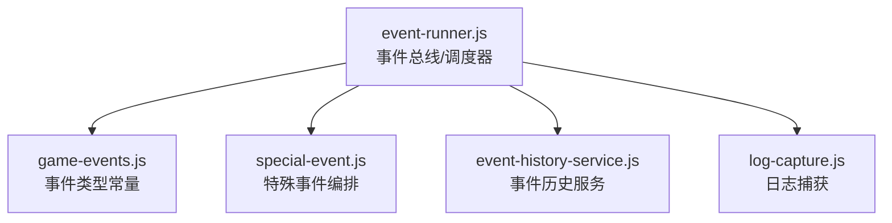
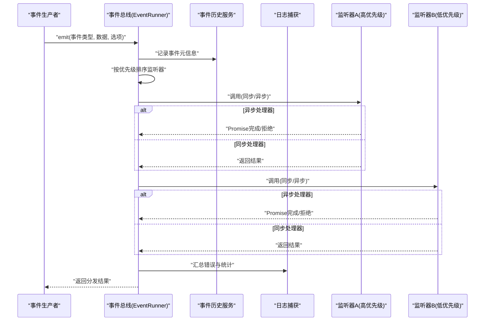
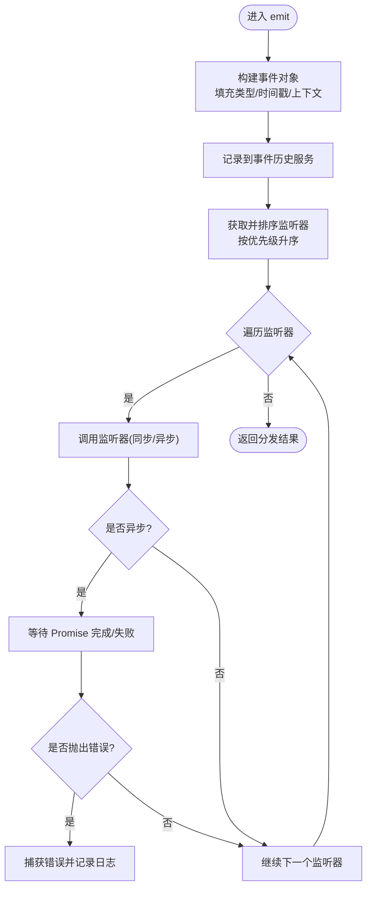
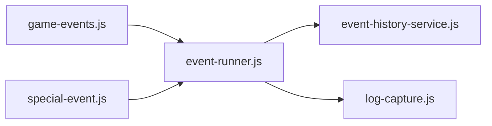

# 事件驱动系统

<cite>
**本文引用的文件**   
- [event-runner.js](file://module/event-runner.js)
- [game-events.js](file://module/game-events.js)
- [special-event.js](file://module/special-event.js)
- [event-history-service.js](file://module/event-history-service.js)
- [log-capture.js](file://module/log-capture.js)
</cite>

## 目录
1. [简介](#简介)
2. [项目结构](#项目结构)
3. [核心组件](#核心组件)
4. [架构总览](#架构总览)
5. [详细组件分析](#详细组件分析)
6. [依赖关系分析](#依赖关系分析)
7. [性能考量](#性能考量)
8. [故障排查指南](#故障排查指南)
9. [结论](#结论)
10. [附录](#附录)

## 简介
本文件面向姬侠传游戏引擎的事件驱动子系统，聚焦于 event-runner.js 中的事件处理机制。文档将系统性解析事件的注册、触发、监听与传播流程，说明事件类型定义、事件数据结构与异步处理模式，并覆盖事件优先级管理、错误处理与调试工具使用。文末提供创建自定义事件、构建复杂事件链以及优化事件性能的实践建议。

## 项目结构
围绕事件系统的核心文件位于 module 目录下：
- event-runner.js：事件总线与调度器，负责事件生命周期管理与执行顺序控制
- game-events.js：全局事件常量与默认事件类型定义
- special-event.js：特殊事件（如剧情/分支）的封装与编排
- event-history-service.js：事件历史记录与回放服务
- log-capture.js：日志捕获与上报，辅助调试

图表来源
- [event-runner.js](file://module/event-runner.js)
- [game-events.js](file://module/game-events.js)
- [special-event.js](file://module/special-event.js)
- [event-history-service.js](file://module/event-history-service.js)
- [log-capture.js](file://module/log-capture.js)

章节来源
- [event-runner.js](file://module/event-runner.js)
- [game-events.js](file://module/game-events.js)
- [special-event.js](file://module/special-event.js)
- [event-history-service.js](file://module/event-history-service.js)
- [log-capture.js](file://module/log-capture.js)

## 核心组件
- 事件总线（EventRunner）
  - 职责：维护事件订阅表、按优先级分发事件、协调同步/异步处理器、统一错误边界与日志输出
  - 关键能力：on/off/emit、批量注册、优先级队列、异步处理器支持、错误隔离
- 事件类型与数据模型
  - 事件类型：在 game-events.js 中集中定义，便于跨模块引用与一致性校验
  - 事件数据：标准字段包含类型、时间戳、来源、上下文快照等；可携带业务负载
- 特殊事件（SpecialEvent）
  - 职责：对复杂事件流进行封装，提供组合、条件分支与回退策略
- 事件历史服务（EventHistoryService）
  - 职责：持久化事件序列、支持回放与审计
- 日志捕获（LogCapture）
  - 职责：捕获运行时异常与警告，关联事件上下文，便于定位问题

章节来源
- [event-runner.js](file://module/event-runner.js)
- [game-events.js](file://module/game-events.js)
- [special-event.js](file://module/special-event.js)
- [event-history-service.js](file://module/event-history-service.js)
- [log-capture.js](file://module/log-capture.js)

## 架构总览
事件驱动系统采用“发布-订阅 + 优先级调度”的架构。事件生产者通过 emit 提交事件，事件总线根据优先级排序后依次调用已注册的监听器。监听器可为同步或异步函数，异步处理器由调度器统一管理，确保错误隔离与资源释放。

图表来源
- [event-runner.js](file://module/event-runner.js)
- [event-history-service.js](file://module/event-history-service.js)
- [log-capture.js](file://module/log-capture.js)

## 详细组件分析

### 事件总线（EventRunner）
- 事件注册与取消
  - on(eventType, handler, options)：注册监听器，支持优先级与一次性标记
  - off(eventType, handler)：取消指定监听器
- 事件触发与传播
  - emit(eventType, payload, options)：构造事件对象，写入历史，按优先级分发
  - 传播策略：支持冒泡/停止传播标志位，允许监听器中断后续处理
- 优先级管理
  - 通过优先级数值控制执行顺序，数值越小优先级越高
  - 同优先级内保持注册顺序稳定
- 异步处理模式
  - 监听器可返回 Promise；调度器收集所有异步任务，统一等待与错误隔离
  - 支持超时与重试配置，避免长尾阻塞
- 错误处理
  - 每个监听器执行被包裹在 try/catch 或 Promise.catch 中
  - 错误信息附加事件上下文，交由日志捕获模块统一输出
- 调试与观测
  - 提供开关以开启详细日志，记录事件生命周期各阶段耗时
  - 暴露统计接口，用于监控热点事件与慢监听器

图表来源
- [event-runner.js](file://module/event-runner.js)
- [event-history-service.js](file://module/event-history-service.js)
- [log-capture.js](file://module/log-capture.js)

章节来源
- [event-runner.js](file://module/event-runner.js)

### 事件类型与数据结构（game-events.js）
- 事件类型定义
  - 集中声明所有事件类型常量，避免硬编码字符串带来的不一致
  - 可按领域分组（如 UI、战斗、存档、网络等），便于权限与路由管理
- 事件数据结构
  - 基础字段：type、timestamp、source、context
  - 业务负载：payload 为任意对象，建议遵循命名规范与必填项约定
  - 扩展字段：metadata 用于追踪链路 ID、版本、环境信息等
- 校验与默认值
  - 可在 emit 前进行轻量校验，缺失必填字段时快速失败
  - 提供默认上下文注入，减少重复初始化逻辑

章节来源
- [game-events.js](file://module/game-events.js)

### 特殊事件编排（special-event.js）
- 设计目标
  - 将复杂业务流程抽象为“特殊事件”，对外仅暴露简洁 API
  - 内部可组合多个子事件，实现条件分支、并行聚合与回退
- 编排模式
  - 串行：依次触发子事件，任一失败则整体失败
  - 并行：并发触发多个子事件，全部成功才视为成功
  - 条件：根据上下文动态选择分支
- 错误与回退
  - 支持局部失败不影响其他分支的策略
  - 提供补偿动作与最终状态收敛

章节来源
- [special-event.js](file://module/special-event.js)

### 事件历史服务（event-history-service.js）
- 功能概述
  - 记录事件元信息与关键负载，支持查询、过滤与回放
  - 提供分页与索引，避免全量扫描导致的性能问题
- 存储策略
  - 内存缓存 + 持久化落盘（按需）
  - 定期清理旧记录，保留最近 N 条或按时间窗口归档
- 回放与审计
  - 支持重放特定事件序列，用于复现问题与自动化测试
  - 审计导出格式标准化，便于外部工具分析

章节来源
- [event-history-service.js](file://module/event-history-service.js)

### 日志捕获（log-capture.js）
- 作用
  - 捕获未处理的异常与警告，附带事件上下文与堆栈
  - 支持分级输出与采样策略，降低高频日志开销
- 集成点
  - 事件总线在错误路径统一上报
  - 特殊事件在关键节点输出结构化日志

章节来源
- [log-capture.js](file://module/log-capture.js)

## 依赖关系分析
- 松耦合
  - 事件总线不直接依赖具体业务模块，仅通过类型常量与回调接口交互
- 明确边界
  - 历史服务与日志模块作为横切关注点，被事件总线按需调用
- 潜在循环依赖规避
  - 业务模块通过事件类型常量解耦，避免直接相互引用

图表来源
- [event-runner.js](file://module/event-runner.js)
- [game-events.js](file://module/game-events.js)
- [special-event.js](file://module/special-event.js)
- [event-history-service.js](file://module/event-history-service.js)
- [log-capture.js](file://module/log-capture.js)

章节来源
- [event-runner.js](file://module/event-runner.js)
- [game-events.js](file://module/game-events.js)
- [special-event.js](file://module/special-event.js)
- [event-history-service.js](file://module/event-history-service.js)
- [log-capture.js](file://module/log-capture.js)

## 性能考量
- 监听器数量与优先级
  - 热点事件应精简监听器数量，必要时合并处理逻辑
  - 合理设置优先级，避免高代价监听器频繁执行
- 异步处理
  - 将 I/O 与计算密集型任务放入异步监听器，避免阻塞主线程
  - 使用并发上限与超时保护，防止雪崩
- 事件数据大小
  - 避免在 payload 中传递大对象，必要时只传引用或摘要
- 历史记录
  - 限制历史长度与采样率，避免内存膨胀
- 调试开关
  - 生产环境关闭详细日志，仅在需要时开启采样式诊断

[本节为通用指导，无需代码来源]

## 故障排查指南
- 常见问题
  - 监听器未触发：检查事件类型常量是否一致、是否误用 off 移除
  - 异步未等待：确认监听器返回 Promise，且未被同步吞掉
  - 错误被静默忽略：查看日志捕获输出，定位具体监听器与上下文
- 定位步骤
  - 开启详细日志，观察事件生命周期耗时分布
  - 使用事件历史回放，复现场景并对比差异
  - 针对热点事件添加临时断点或采样计数
- 恢复策略
  - 对关键流程增加重试与降级逻辑
  - 对不可恢复错误进行告警与人工介入

章节来源
- [event-runner.js](file://module/event-runner.js)
- [log-capture.js](file://module/log-capture.js)
- [event-history-service.js](file://module/event-history-service.js)

## 结论
事件驱动系统通过统一的事件总线与清晰的类型定义，实现了模块间的松耦合与可扩展性。结合优先级调度、异步处理与完善的错误与日志体系，能够支撑复杂的游戏逻辑与稳定的运行体验。建议在业务侧遵循最佳实践，持续优化事件结构与监听器实现，以获得更好的性能与可维护性。

[本节为总结性内容，无需代码来源]

## 附录

### 示例一：创建自定义事件
- 步骤
  - 在事件类型文件中新增事件类型常量
  - 在需要处通过事件总线触发事件，附带必要负载
  - 在相关模块注册监听器，处理业务逻辑
- 参考路径
  - [事件类型定义位置](file://module/game-events.js)
  - [事件触发入口](file://module/event-runner.js)
  - [监听器注册位置](file://module/event-runner.js)

章节来源
- [game-events.js](file://module/game-events.js)
- [event-runner.js](file://module/event-runner.js)

### 示例二：处理复杂事件链
- 思路
  - 使用特殊事件封装多步流程，内部组合多个子事件
  - 对关键步骤设置条件分支与回退策略
- 参考路径
  - [特殊事件封装](file://module/special-event.js)
  - [事件调度与传播](file://module/event-runner.js)

章节来源
- [special-event.js](file://module/special-event.js)
- [event-runner.js](file://module/event-runner.js)

### 示例三：优化事件性能
- 措施
  - 合并高频小事件，减少分发次数
  - 将重型计算移至异步监听器，并设置超时
  - 限制历史记录长度，启用采样日志
- 参考路径
  - [事件调度实现](file://module/event-runner.js)
  - [历史记录服务](file://module/event-history-service.js)
  - [日志捕获](file://module/log-capture.js)

章节来源
- [event-runner.js](file://module/event-runner.js)
- [event-history-service.js](file://module/event-history-service.js)
- [log-capture.js](file://module/log-capture.js)