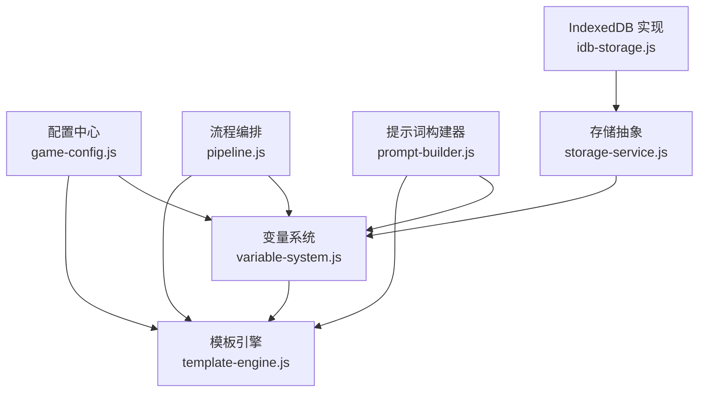
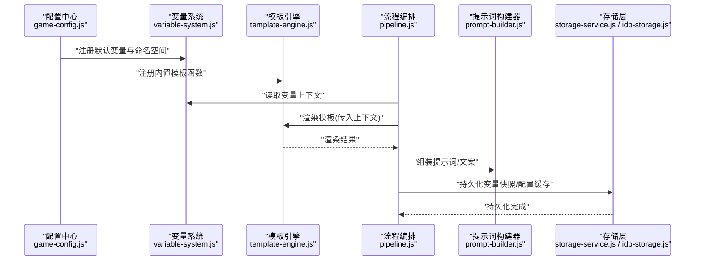
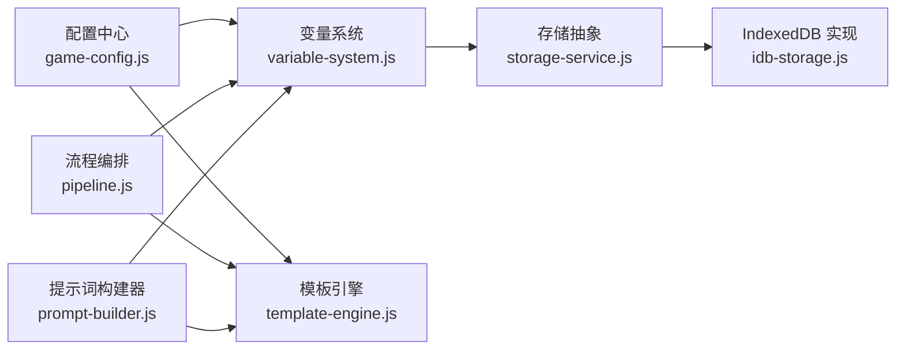

# 变量与配置管理

<cite>
**本文引用的文件**   
- [variable-system.js](file://module/variable-system.js)
- [template-engine.js](file://module/template-engine.js)
- [game-config.js](file://module/game-config.js)
- [pipeline.js](file://module/pipeline.js)
- [prompt-builder.js](file://module/prompt-builder.js)
- [storage-service.js](file://module/storage-service.js)
- [idb-storage.js](file://module/idb-storage.js)
</cite>

## 目录
1. [简介](#简介)
2. [项目结构](#项目结构)
3. [核心组件](#核心组件)
4. [架构总览](#架构总览)
5. [详细组件分析](#详细组件分析)
6. [依赖关系分析](#依赖关系分析)
7. [性能考虑](#性能考虑)
8. [故障排查指南](#故障排查指南)
9. [结论](#结论)
10. [附录](#附录)

## 简介
本文件面向姬侠传游戏引擎的“变量与配置管理系统”，聚焦以下目标：
- 深入解析 variable-system.js 中的变量管理机制，包括变量的定义、作用域、生命周期与数据绑定。
- 解释 template-engine.js 中的模板引擎工作原理，涵盖模板语法、变量替换与动态内容生成。
- 说明配置文件的组织结构、热重载机制与验证规则。
- 提供扩展变量类型、自定义模板函数与优化渲染性能的实践示例（以路径引用方式给出）。

## 项目结构
围绕变量与配置管理的核心模块位于 module 目录下，关键文件如下：
- variable-system.js：变量系统核心，负责变量注册、作用域、读写、监听与持久化。
- template-engine.js：模板引擎，负责模板解析、变量替换、函数调用与渲染输出。
- game-config.js：全局配置加载与校验入口，支持热重载与默认值合并。
- pipeline.js：流程编排，串联变量读取、模板渲染与结果回写。
- prompt-builder.js：提示词构建器，使用变量系统与模板引擎组合生成结构化文本。
- storage-service.js / idb-storage.js：存储抽象与 IndexedDB 实现，用于变量快照与配置缓存。

图表来源
- [variable-system.js](file://module/variable-system.js)
- [template-engine.js](file://module/template-engine.js)
- [game-config.js](file://module/game-config.js)
- [pipeline.js](file://module/pipeline.js)
- [prompt-builder.js](file://module/prompt-builder.js)
- [storage-service.js](file://module/storage-service.js)
- [idb-storage.js](file://module/idb-storage.js)

章节来源
- [variable-system.js](file://module/variable-system.js)
- [template-engine.js](file://module/template-engine.js)
- [game-config.js](file://module/game-config.js)
- [pipeline.js](file://module/pipeline.js)
- [prompt-builder.js](file://module/prompt-builder.js)
- [storage-service.js](file://module/storage-service.js)
- [idb-storage.js](file://module/idb-storage.js)

## 核心组件
本节从职责边界与交互契约角度概述各组件：
- 变量系统：提供命名空间与作用域隔离、变量读写、变更监听、批量更新与持久化。
- 模板引擎：提供模板解析、变量插值、函数调用、条件与循环控制、缓存与错误恢复。
- 配置中心：提供配置项定义、默认值、校验规则、热重载与版本兼容。
- 流程编排：将变量读取、模板渲染、结果落盘等步骤串成可复用的执行管线。
- 提示词构建器：基于变量与模板生成 AI 提示词或 UI 文案。
- 存储层：对变量与配置进行持久化，支持快照与增量同步。

章节来源
- [variable-system.js](file://module/variable-system.js)
- [template-engine.js](file://module/template-engine.js)
- [game-config.js](file://module/game-config.js)
- [pipeline.js](file://module/pipeline.js)
- [prompt-builder.js](file://module/prompt-builder.js)
- [storage-service.js](file://module/storage-service.js)
- [idb-storage.js](file://module/idb-storage.js)

## 架构总览
下图展示了变量与配置在运行时的整体协作关系：配置中心初始化变量与模板函数；流程编排驱动变量读取与模板渲染；存储层保证状态一致性与可恢复性。

图表来源
- [game-config.js](file://module/game-config.js)
- [variable-system.js](file://module/variable-system.js)
- [template-engine.js](file://module/template-engine.js)
- [pipeline.js](file://module/pipeline.js)
- [prompt-builder.js](file://module/prompt-builder.js)
- [storage-service.js](file://module/storage-service.js)
- [idb-storage.js](file://module/idb-storage.js)

## 详细组件分析

### 变量系统（variable-system.js）
- 设计要点
  - 命名空间与作用域：通过层级键名组织变量，支持局部作用域覆盖全局。
  - 生命周期：创建→初始化→运行时读写→监听回调→清理释放。
  - 数据绑定：变量变更触发订阅者通知，支持批量更新与事务式提交。
  - 持久化：与存储层对接，支持快照与增量同步。
- 关键能力
  - 变量注册与校验：类型约束、默认值、必填检查。
  - 读写访问：按路径解析、越界保护、不可变视图。
  - 监听与事件：on/off/once 模式，避免内存泄漏。
  - 批量操作：原子写入、回滚策略。
- 复杂度与性能
  - 路径解析 O(n)，n 为路径深度；批量更新采用最小化变更集。
  - 监听分发采用事件队列，避免同步阻塞。
- 扩展点
  - 新增变量类型：在类型注册处扩展校验与序列化逻辑。
  - 自定义作用域：提供作用域工厂与隔离策略。
- 典型用法路径
  - 变量定义与注册：[variable-system.js](file://module/variable-system.js)
  - 变量读写与监听：[variable-system.js](file://module/variable-system.js)
  - 批量更新与事务：[variable-system.js](file://module/variable-system.js)
  - 持久化集成：[storage-service.js](file://module/storage-service.js), [idb-storage.js](file://module/idb-storage.js)

章节来源
- [variable-system.js](file://module/variable-system.js)
- [storage-service.js](file://module/storage-service.js)
- [idb-storage.js](file://module/idb-storage.js)

### 模板引擎（template-engine.js）
- 设计要点
  - 模板语法：支持变量插值、函数调用、条件分支与循环。
  - 变量替换：从变量系统获取上下文，支持嵌套路径与默认值。
  - 动态内容：通过函数钩子注入业务逻辑，如格式化、计算、资源路径拼接。
  - 渲染管线：解析→编译→执行→缓存→输出。
- 关键能力
  - 解析器：词法/语法分析，错误定位与友好提示。
  - 编译器：生成可执行片段，减少重复解析开销。
  - 执行器：安全沙箱环境，限制危险 API。
  - 缓存：按模板指纹缓存编译结果。
- 复杂度与性能
  - 首次解析 O(m)，m 为模板长度；后续命中缓存接近 O(1)。
  - 大模板分块渲染，避免主线程阻塞。
- 扩展点
  - 自定义函数：注册到函数表，支持异步与副作用控制。
  - 新语法元素：在解析器中扩展 AST 节点与执行器。
- 典型用法路径
  - 模板解析与编译：[template-engine.js](file://module/template-engine.js)
  - 变量替换与函数调用：[template-engine.js](file://module/template-engine.js)
  - 缓存与错误处理：[template-engine.js](file://module/template-engine.js)

章节来源
- [template-engine.js](file://module/template-engine.js)

### 配置中心（game-config.js）
- 设计要点
  - 配置文件组织：分层配置（基础、平台、运行时），合并策略明确。
  - 热重载：监听配置变更，增量更新并触发相关子系统刷新。
  - 验证规则：字段类型、取值范围、依赖关系校验。
- 关键能力
  - 默认值合并：深合并与冲突解决策略。
  - 版本兼容：迁移脚本与降级策略。
  - 发布订阅：配置变更事件广播。
- 典型用法路径
  - 配置加载与合并：[game-config.js](file://module/game-config.js)
  - 热重载与校验：[game-config.js](file://module/game-config.js)

章节来源
- [game-config.js](file://module/game-config.js)

### 流程编排（pipeline.js）
- 设计要点
  - 阶段划分：准备→读取变量→渲染模板→后处理→持久化。
  - 错误恢复：失败重试、降级输出、日志上报。
  - 可观测性：阶段耗时统计与指标收集。
- 典型用法路径
  - 流水线定义与执行：[pipeline.js](file://module/pipeline.js)

章节来源
- [pipeline.js](file://module/pipeline.js)

### 提示词构建器（prompt-builder.js）
- 设计要点
  - 组合变量与模板：根据场景选择模板，注入变量上下文。
  - 结构化输出：JSON/纯文本两种模式，便于下游消费。
- 典型用法路径
  - 构建与渲染：[prompt-builder.js](file://module/prompt-builder.js)

章节来源
- [prompt-builder.js](file://module/prompt-builder.js)

### 存储层（storage-service.js / idb-storage.js）
- 设计要点
  - 抽象接口：统一 get/set/list/clear 等能力。
  - 实现细节：IndexedDB 事务、索引与分页查询。
  - 一致性：快照与增量同步，冲突解决策略。
- 典型用法路径
  - 变量快照与配置缓存：[storage-service.js](file://module/storage-service.js), [idb-storage.js](file://module/idb-storage.js)

章节来源
- [storage-service.js](file://module/storage-service.js)
- [idb-storage.js](file://module/idb-storage.js)

## 依赖关系分析
- 耦合与内聚
  - 变量系统与模板引擎低耦合，通过上下文对象传递数据。
  - 配置中心作为权威源，向变量系统与模板引擎注入初始状态。
  - 存储层被变量系统与配置中心共同依赖，确保状态可恢复。
- 外部依赖
  - 浏览器 IndexedDB API（由 idb-storage.js 封装）。
  - 文件系统/网络加载（由配置中心按需引入）。
- 潜在循环依赖
  - 通过事件总线与延迟加载避免直接循环引用。

图表来源
- [game-config.js](file://module/game-config.js)
- [variable-system.js](file://module/variable-system.js)
- [template-engine.js](file://module/template-engine.js)
- [pipeline.js](file://module/pipeline.js)
- [prompt-builder.js](file://module/prompt-builder.js)
- [storage-service.js](file://module/storage-service.js)
- [idb-storage.js](file://module/idb-storage.js)

章节来源
- [game-config.js](file://module/game-config.js)
- [variable-system.js](file://module/variable-system.js)
- [template-engine.js](file://module/template-engine.js)
- [pipeline.js](file://module/pipeline.js)
- [prompt-builder.js](file://module/prompt-builder.js)
- [storage-service.js](file://module/storage-service.js)
- [idb-storage.js](file://module/idb-storage.js)

## 性能考虑
- 变量系统
  - 批量更新：合并多次写入，减少监听触发次数。
  - 路径缓存：对常用路径建立索引，降低解析成本。
  - 监听去抖：高频变更时合并回调，避免抖动。
- 模板引擎
  - 编译缓存：按模板指纹缓存 AST 与执行片段。
  - 惰性求值：仅在需要时计算表达式与函数。
  - 分块渲染：长模板分段输出，保持主线程响应。
- 配置中心
  - 增量热重载：仅更新变更项，避免全量重建。
  - 校验批处理：集中校验，减少重复检查。
- 存储层
  - 事务合并：批量写入合并为单次事务。
  - 索引优化：为热点查询字段建立索引。

[本节为通用指导，不直接分析具体文件]

## 故障排查指南
- 常见问题
  - 变量未定义或作用域冲突：检查命名空间前缀与作用域覆盖顺序。
  - 模板渲染失败：查看模板语法与函数签名是否匹配，确认上下文键存在。
  - 配置热重载无效：确认监听器已注册且变更事件已广播。
  - 持久化失败：检查存储接口返回与 IndexedDB 权限。
- 诊断建议
  - 启用详细日志：记录变量变更、模板解析与渲染耗时。
  - 快照对比：比较前后快照差异，定位异常变更。
  - 最小复现：剥离无关模块，逐步缩小问题范围。
- 参考路径
  - 变量系统错误处理与日志：[variable-system.js](file://module/variable-system.js)
  - 模板引擎错误恢复与调试信息：[template-engine.js](file://module/template-engine.js)
  - 配置校验与热重载事件：[game-config.js](file://module/game-config.js)
  - 存储层异常与回退策略：[storage-service.js](file://module/storage-service.js), [idb-storage.js](file://module/idb-storage.js)

章节来源
- [variable-system.js](file://module/variable-system.js)
- [template-engine.js](file://module/template-engine.js)
- [game-config.js](file://module/game-config.js)
- [storage-service.js](file://module/storage-service.js)
- [idb-storage.js](file://module/idb-storage.js)

## 结论
变量与配置管理系统通过清晰的职责划分与松耦合设计，实现了高内聚的变量管理、灵活的模板渲染与可靠的配置热重载。配合流程编排与存储层，系统在可扩展性、性能与稳定性方面具备良好表现。遵循本文提供的扩展与优化建议，可进一步提升系统的可维护性与用户体验。

[本节为总结性内容，不直接分析具体文件]

## 附录

### 扩展变量类型（示例路径）
- 在变量系统中注册新类型，实现校验与序列化逻辑。
- 在配置中心为新类型添加默认值与校验规则。
- 在模板引擎中注册对应格式化函数，以便在模板中使用。
- 参考路径
  - [variable-system.js](file://module/variable-system.js)
  - [game-config.js](file://module/game-config.js)
  - [template-engine.js](file://module/template-engine.js)

### 自定义模板函数（示例路径）
- 在模板引擎中注册函数表，实现业务逻辑（如日期格式化、数值计算）。
- 在流程编排中注入上下文，使函数能访问变量系统数据。
- 参考路径
  - [template-engine.js](file://module/template-engine.js)
  - [pipeline.js](file://module/pipeline.js)

### 优化渲染性能（示例路径）
- 启用模板编译缓存与惰性求值。
- 对频繁更新的变量使用批量更新与监听去抖。
- 使用分块渲染与异步调度，避免主线程阻塞。
- 参考路径
  - [template-engine.js](file://module/template-engine.js)
  - [variable-system.js](file://module/variable-system.js)
  - [pipeline.js](file://module/pipeline.js)