# 游戏引擎架构

<cite>
**本文引用的文件**   
- [pipeline.js](file://module/pipeline.js)
- [event-runner.js](file://module/event-runner.js)
- [variable-system.js](file://module/variable-system.js)
- [template-engine.js](file://module/template-engine.js)
- [game-config.js](file://module/game-config.js)
- [game-events.js](file://module/game-events.js)
- [prompt-builder.js](file://module/prompt-builder.js)
- [response-parser.js](file://module/response-parser.js)
- [storage-service.js](file://module/storage-service.js)
- [idb-storage.js](file://module/idb-storage.js)
- [log-capture.js](file://module/log-capture.js)
- [index.html](file://apk/android/app/src/main/assets/public/index.html)
</cite>

## 目录
1. [简介](#简介)
2. [项目结构](#项目结构)
3. [核心组件](#核心组件)
4. [架构总览](#架构总览)
5. [详细组件分析](#详细组件分析)
6. [依赖关系分析](#依赖关系分析)
7. [性能考量](#性能考量)
8. [故障排查指南](#故障排查指南)
9. [结论](#结论)
10. [附录](#附录)

## 简介
本文件为“姬侠传”游戏引擎的架构文档，聚焦以下关键主题：
- 游戏循环机制与生命周期管理
- 状态管理系统与变量系统
- 事件驱动架构与事件处理流程
- 管道模式（Pipeline）在数据加工中的应用
- 模板引擎的工作原理与扩展方式
- 配置加载机制与错误处理策略
- 最佳实践与常见问题排查

目标读者包括引擎使用者、内容策划与二次开发者。文档以渐进式复杂度组织，既提供高层概览，也给出面向代码级的分析与图示。

## 项目结构
从模块视角看，引擎采用“模块化+职责分离”的组织方式：
- 运行时核心：事件运行器、变量系统、模板引擎、管道处理器
- 业务编排：提示构建、响应解析、技能与特殊事件
- 持久化与存储：IndexedDB 封装、快照服务
- 日志与调试：日志捕获
- 入口与页面：HTML 入口承载 UI 与脚本加载

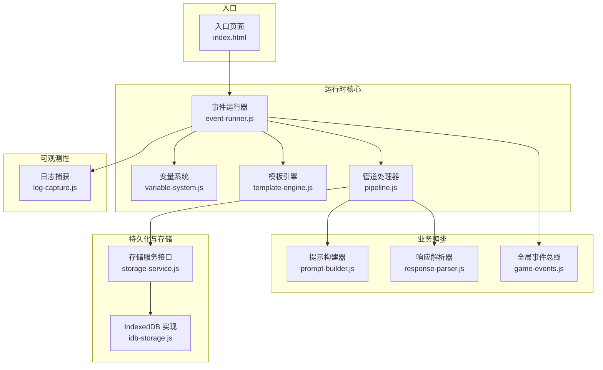

图表来源
- [event-runner.js](file://module/event-runner.js)
- [variable-system.js](file://module/variable-system.js)
- [template-engine.js](file://module/template-engine.js)
- [pipeline.js](file://module/pipeline.js)
- [prompt-builder.js](file://module/prompt-builder.js)
- [response-parser.js](file://module/response-parser.js)
- [game-events.js](file://module/game-events.js)
- [storage-service.js](file://module/storage-service.js)
- [idb-storage.js](file://module/idb-storage.js)
- [log-capture.js](file://module/log-capture.js)
- [index.html](file://apk/android/app/src/main/assets/public/index.html)

章节来源
- [index.html](file://apk/android/app/src/main/assets/public/index.html)

## 核心组件
本节概述各核心模块的职责与交互要点：
- 事件运行器：负责调度事件、维护执行上下文、协调渲染与异步任务
- 变量系统：提供变量的读写、作用域、默认值与校验能力
- 模板引擎：基于模板字符串与占位符进行文本生成，支持自定义过滤器与函数
- 管道处理器：将数据处理拆分为多个阶段，按顺序执行并传递上下文
- 提示构建器与响应解析器：用于与外部模型交互的数据准备与结果解析
- 存储服务：统一持久化接口，底层由 IndexedDB 实现
- 全局事件总线：解耦模块间通信
- 日志捕获：集中收集运行期日志，便于定位问题

章节来源
- [event-runner.js](file://module/event-runner.js)
- [variable-system.js](file://module/variable-system.js)
- [template-engine.js](file://module/template-engine.js)
- [pipeline.js](file://module/pipeline.js)
- [prompt-builder.js](file://module/prompt-builder.js)
- [response-parser.js](file://module/response-parser.js)
- [storage-service.js](file://module/storage-service.js)
- [idb-storage.js](file://module/idb-storage.js)
- [game-events.js](file://module/game-events.js)
- [log-capture.js](file://module/log-capture.js)

## 架构总览
下图展示了引擎在运行期的主要交互路径：入口初始化后，事件运行器启动主循环；每次迭代中，事件运行器根据当前状态触发事件，事件可能更新变量、调用模板引擎生成文本、通过管道对数据进行清洗与转换，最终写入存储或渲染到界面。

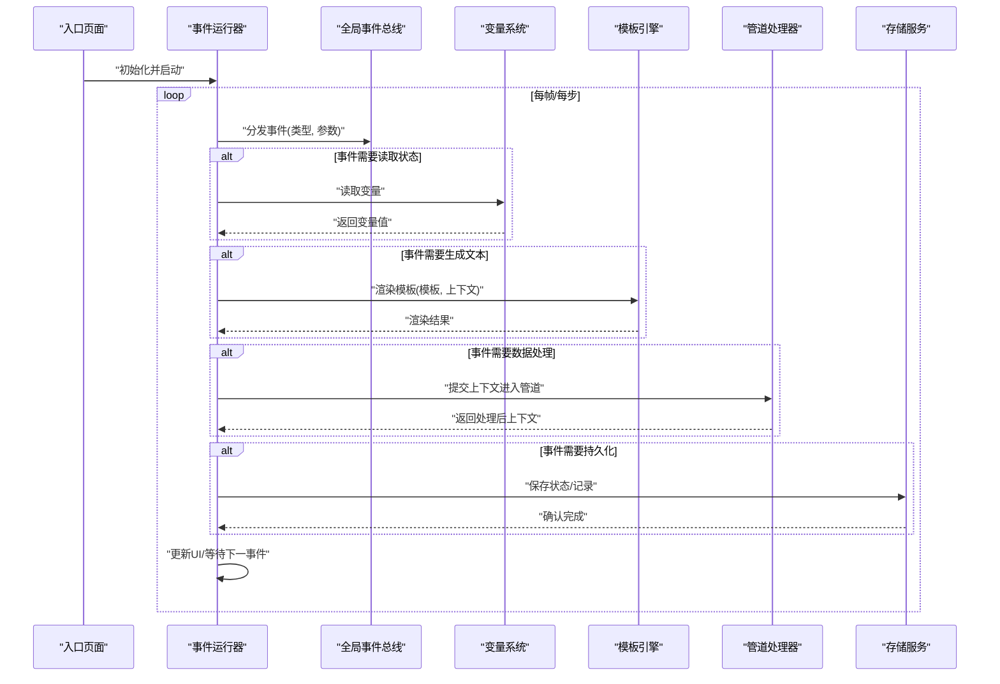

图表来源
- [event-runner.js](file://module/event-runner.js)
- [game-events.js](file://module/game-events.js)
- [variable-system.js](file://module/variable-system.js)
- [template-engine.js](file://module/template-engine.js)
- [pipeline.js](file://module/pipeline.js)
- [storage-service.js](file://module/storage-service.js)

## 详细组件分析

### 事件运行器（event-runner.js）
- 职责
  - 维护运行上下文（当前场景、玩家状态、时间等）
  - 注册与调度事件，支持同步与异步事件
  - 协调变量系统、模板引擎、管道与存储
  - 控制游戏循环节奏与暂停/恢复
- 关键流程
  - 初始化：加载配置、绑定事件、创建上下文
  - 事件派发：根据条件匹配事件，入队执行
  - 上下文传播：将变量与中间结果传递给后续步骤
  - 异常隔离：单个事件失败不影响整体循环
- 设计要点
  - 使用事件总线降低耦合
  - 明确事件优先级与去重策略
  - 提供钩子用于调试与监控

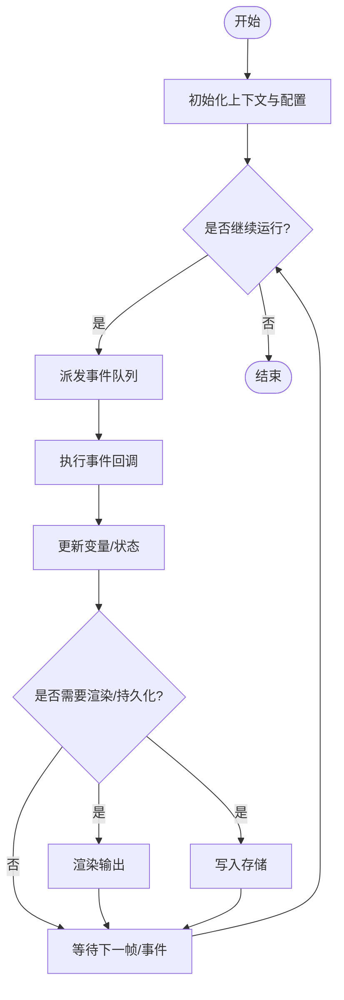

图表来源
- [event-runner.js](file://module/event-runner.js)
- [game-events.js](file://module/game-events.js)

章节来源
- [event-runner.js](file://module/event-runner.js)
- [game-events.js](file://module/game-events.js)

### 管道处理器（pipeline.js）
- 职责
  - 定义可插拔的处理阶段（如：预处理、校验、转换、格式化、后处理）
  - 维护统一的上下文对象在各阶段间传递
  - 支持短路、跳过、重试与错误恢复
- 典型阶段
  - 输入校验：检查必填字段与类型
  - 数据清洗：去除空白、标准化键名
  - 模板注入：将变量注入到文本或结构化数据
  - 输出格式化：统一返回结构，便于下游消费
- 错误处理
  - 阶段级 try/catch 包裹，记录错误并决定是否中断
  - 提供回退阶段与默认值策略

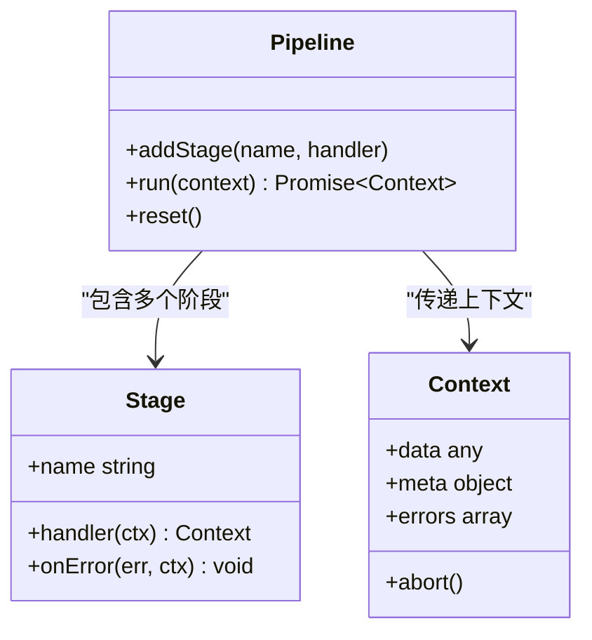

图表来源
- [pipeline.js](file://module/pipeline.js)

章节来源
- [pipeline.js](file://module/pipeline.js)

### 事件驱动架构（event-runner.js 与 game-events.js）
- 事件总线
  - 提供 on/off/emit 能力，支持命名空间与通配符
  - 保证事件处理的顺序性与幂等性
- 事件分类
  - 系统事件：生命周期、配置加载、错误上报
  - 业务事件：对话推进、战斗回合、地点切换
  - 用户事件：点击、选择、输入
- 事件流
  - 生产者（UI/逻辑）发出事件
  - 消费者（事件处理器）订阅并响应
  - 运行器作为编排者，决定何时触发哪些事件

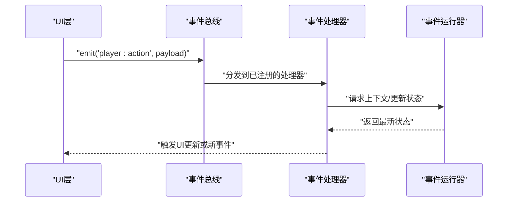

图表来源
- [event-runner.js](file://module/event-runner.js)
- [game-events.js](file://module/game-events.js)

章节来源
- [event-runner.js](file://module/event-runner.js)
- [game-events.js](file://module/game-events.js)

### 变量系统（variable-system.js）
- 职责
  - 提供全局与局部作用域的变量读写
  - 支持默认值、类型约束与变更监听
  - 提供批量操作与快照能力
- 数据结构
  - 变量表：键值映射，含元信息（类型、默认值、只读标记）
  - 作用域栈：支持嵌套作用域，优先读取最近作用域
- 访问语义
  - 读取：按作用域自顶向下查找，未命中则返回默认值
  - 写入：校验通过后更新，并触发监听器
  - 删除：清理引用，避免内存泄漏

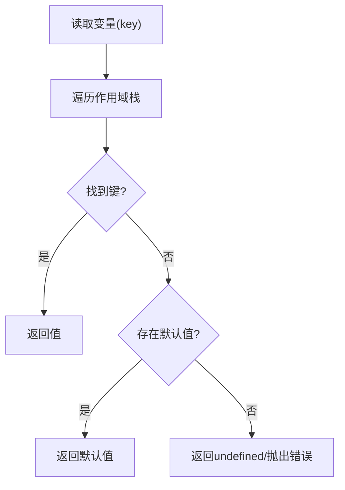

图表来源
- [variable-system.js](file://module/variable-system.js)

章节来源
- [variable-system.js](file://module/variable-system.js)

### 模板引擎（template-engine.js）
- 工作原理
  - 解析模板字符串中的占位符与表达式
  - 结合上下文变量进行替换与计算
  - 支持内置过滤器与自定义函数扩展
- 扩展方式
  - 注册新的过滤器：在引擎中登记名称与处理函数
  - 注册全局函数：暴露给模板表达式调用
  - 安全沙箱：限制危险操作，仅允许白名单函数
- 性能优化
  - 编译缓存：相同模板只编译一次
  - 惰性求值：按需计算表达式

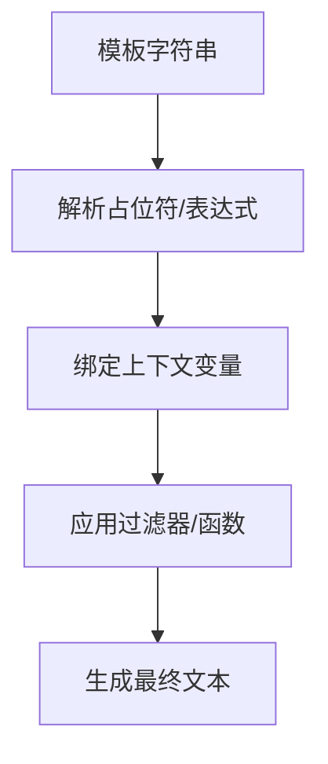

图表来源
- [template-engine.js](file://module/template-engine.js)

章节来源
- [template-engine.js](file://module/template-engine.js)

### 提示构建器与响应解析器（prompt-builder.js 与 response-parser.js）
- 提示构建器
  - 聚合系统指令、角色设定、历史摘要与当前上下文
  - 使用模板引擎生成结构化提示
  - 支持动态插入技能、地点与NPC信息
- 响应解析器
  - 解析外部模型的返回，提取动作、对话与状态变更
  - 将非结构化文本转换为引擎内部事件
  - 容错与降级：当解析失败时回退到默认行为

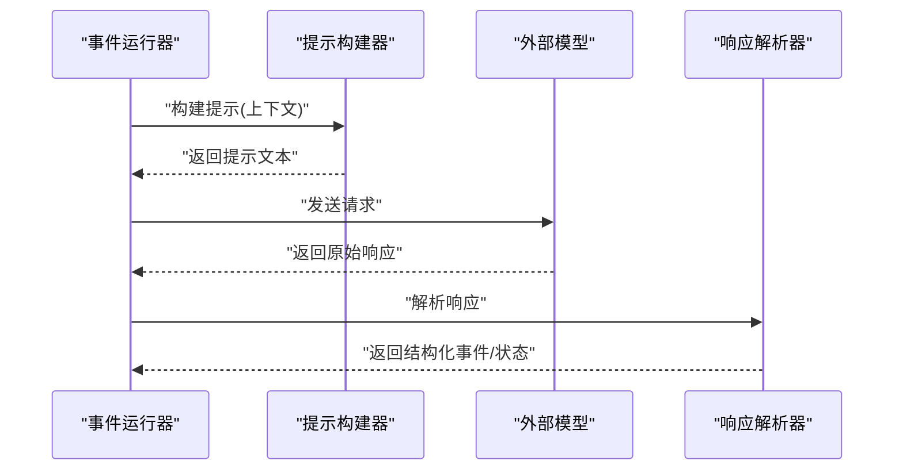

图表来源
- [prompt-builder.js](file://module/prompt-builder.js)
- [response-parser.js](file://module/response-parser.js)

章节来源
- [prompt-builder.js](file://module/prompt-builder.js)
- [response-parser.js](file://module/response-parser.js)

### 存储与持久化（storage-service.js 与 idb-storage.js）
- 存储服务接口
  - 统一 get/set/remove/list 等方法
  - 支持事务与批量操作
- IndexedDB 实现
  - 高性能本地存储，适合大量结构化数据
  - 自动版本迁移与兼容性处理
- 快照机制
  - 定期保存关键状态，支持快速恢复
  - 合并增量变更，减少IO压力

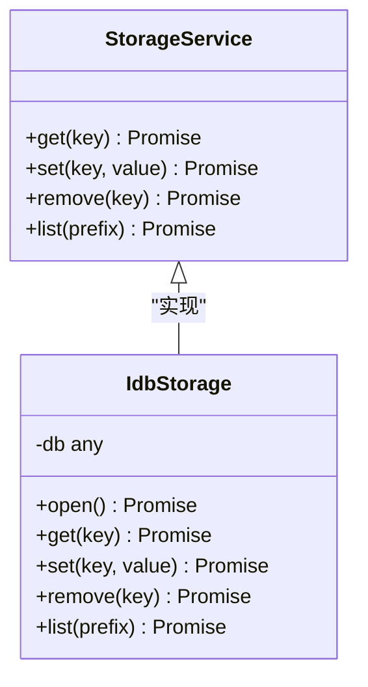

图表来源
- [storage-service.js](file://module/storage-service.js)
- [idb-storage.js](file://module/idb-storage.js)

章节来源
- [storage-service.js](file://module/storage-service.js)
- [idb-storage.js](file://module/idb-storage.js)

### 配置加载机制（game-config.js）
- 职责
  - 加载与合并多源配置（默认、覆盖、运行时）
  - 提供配置校验与回退策略
  - 暴露统一接口供其他模块读取
- 加载流程
  - 读取基础配置
  - 应用环境差异配置
  - 合并用户覆盖项
  - 校验并缓存结果

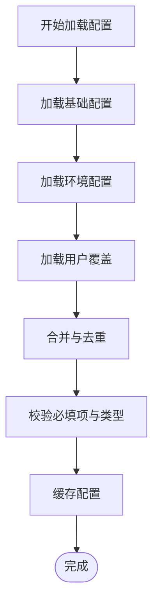

图表来源
- [game-config.js](file://module/game-config.js)

章节来源
- [game-config.js](file://module/game-config.js)

### 日志与可观测性（log-capture.js）
- 职责
  - 捕获 console 输出与未处理异常
  - 格式化日志并写入存储或上传
  - 提供分级过滤与采样策略
- 最佳实践
  - 区分调试与生产日志级别
  - 避免敏感信息泄露
  - 设置合理的日志保留周期

章节来源
- [log-capture.js](file://module/log-capture.js)

## 依赖关系分析
- 低耦合高内聚
  - 事件运行器通过事件总线与其他模块解耦
  - 管道处理器抽象了数据处理流程，易于扩展
  - 变量系统与模板引擎被广泛复用
- 直接依赖
  - event-runner.js 依赖 game-events.js、variable-system.js、template-engine.js、pipeline.js、storage-service.js
  - pipeline.js 依赖 template-engine.js、prompt-builder.js、response-parser.js
  - storage-service.js 依赖 idb-storage.js
- 潜在风险
  - 事件风暴：需关注高频事件的节流与合并
  - 模板注入安全风险：需严格白名单与沙箱
  - 存储竞争：并发写需加锁或队列

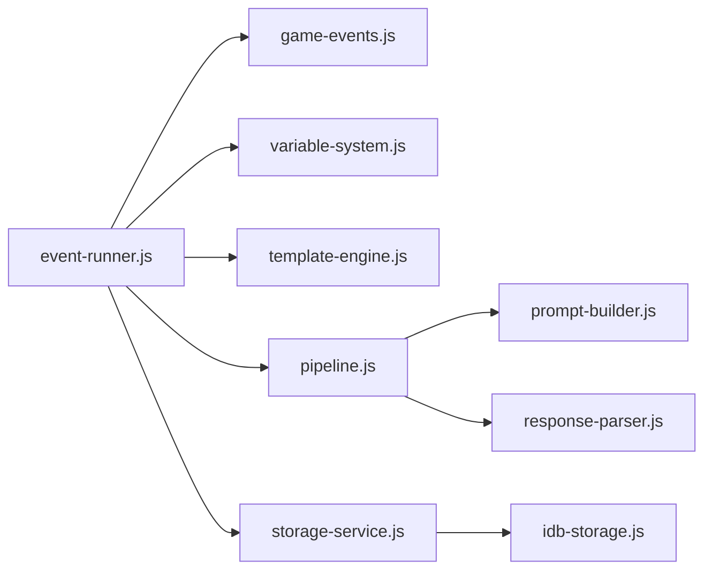

图表来源
- [event-runner.js](file://module/event-runner.js)
- [game-events.js](file://module/game-events.js)
- [variable-system.js](file://module/variable-system.js)
- [template-engine.js](file://module/template-engine.js)
- [pipeline.js](file://module/pipeline.js)
- [prompt-builder.js](file://module/prompt-builder.js)
- [response-parser.js](file://module/response-parser.js)
- [storage-service.js](file://module/storage-service.js)
- [idb-storage.js](file://module/idb-storage.js)

章节来源
- [event-runner.js](file://module/event-runner.js)
- [game-events.js](file://module/game-events.js)
- [variable-system.js](file://module/variable-system.js)
- [template-engine.js](file://module/template-engine.js)
- [pipeline.js](file://module/pipeline.js)
- [prompt-builder.js](file://module/prompt-builder.js)
- [response-parser.js](file://module/response-parser.js)
- [storage-service.js](file://module/storage-service.js)
- [idb-storage.js](file://module/idb-storage.js)

## 性能考量
- 事件批处理：合并短时间内的同类事件，降低抖动
- 模板编译缓存：避免重复解析相同模板
- 管道阶段懒执行：仅在必要时运行昂贵阶段
- 存储写入节流：批量写入与延迟落盘
- 变量访问优化：热点变量缓存与索引
- 日志采样：生产环境降低日志量

[本节为通用指导，不直接分析具体文件]

## 故障排查指南
- 常见症状
  - 事件未触发：检查事件总线订阅与命名空间
  - 变量未生效：确认作用域与默认值设置
  - 模板渲染异常：检查占位符与上下文键名
  - 管道中断：查看阶段错误与短路逻辑
  - 存储失败：确认 IndexedDB 权限与版本兼容
- 定位方法
  - 启用详细日志，过滤相关模块
  - 在关键节点打印上下文快照
  - 使用最小复现用例逐步缩小范围
- 恢复策略
  - 回滚到上一个有效快照
  - 重置受影响的状态与作用域
  - 重启事件运行器并重新加载配置

章节来源
- [log-capture.js](file://module/log-capture.js)
- [idb-storage.js](file://module/idb-storage.js)
- [pipeline.js](file://module/pipeline.js)
- [variable-system.js](file://module/variable-system.js)
- [template-engine.js](file://module/template-engine.js)
- [event-runner.js](file://module/event-runner.js)

## 结论
本引擎通过事件驱动与管道模式实现了高内聚、低耦合的可扩展架构。变量系统与模板引擎为内容与表现提供了灵活支撑，存储与日志保障了稳定性与可观测性。遵循本文的最佳实践与排障建议，可有效提升开发效率与运行可靠性。

[本节为总结，不直接分析具体文件]

## 附录
- 术语表
  - 事件运行器：负责调度与编排事件的核心组件
  - 管道处理器：将数据处理拆分为多个阶段的抽象
  - 变量系统：提供变量读写与作用域管理的子系统
  - 模板引擎：基于模板字符串生成文本的工具
  - 存储接口：统一持久化操作的抽象层
- 参考入口
  - 入口页面用于加载与初始化上述模块

章节来源
- [index.html](file://apk/android/app/src/main/assets/public/index.html)