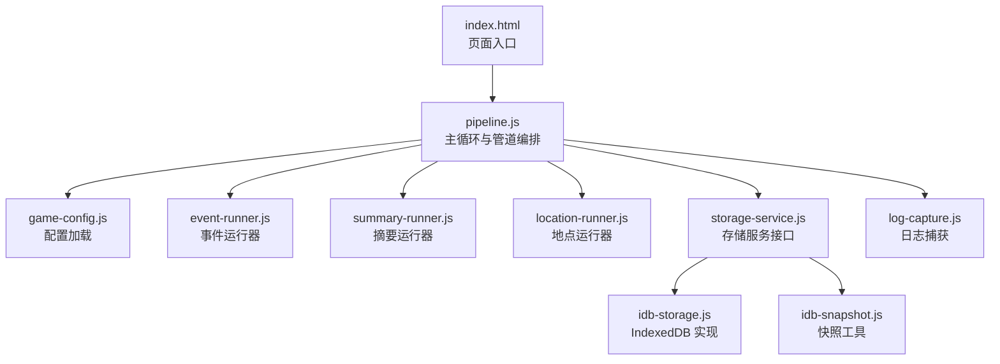
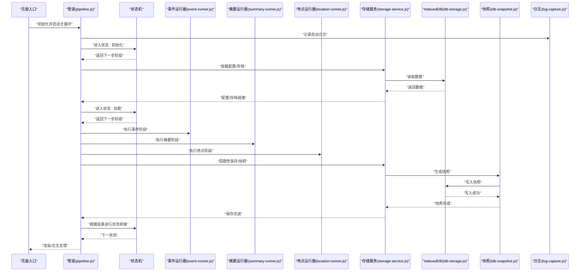
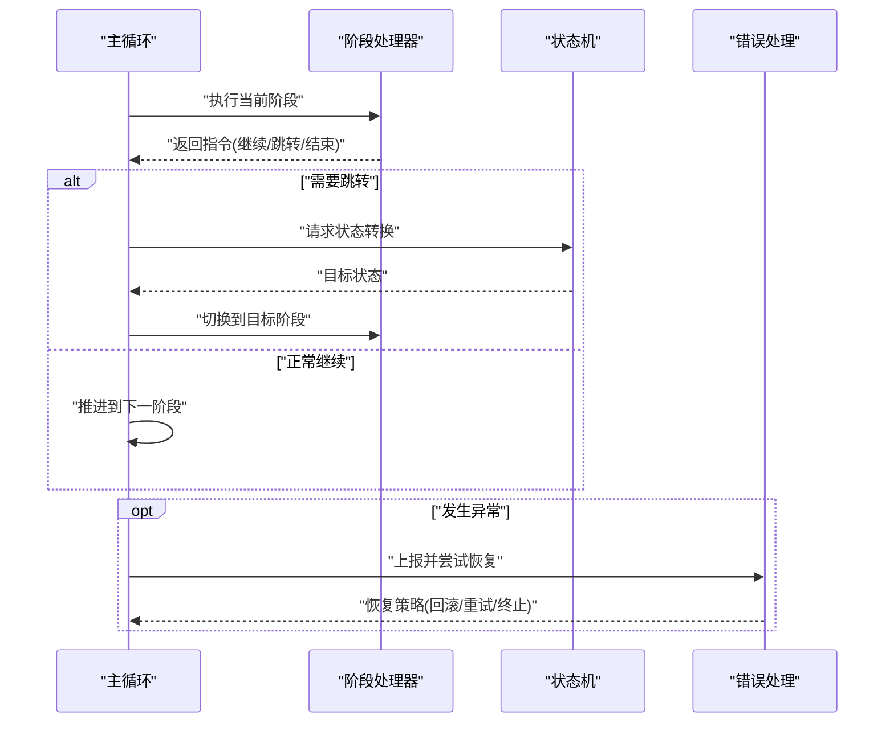
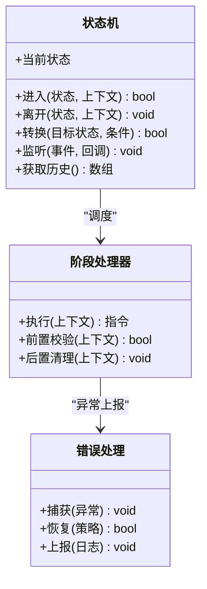
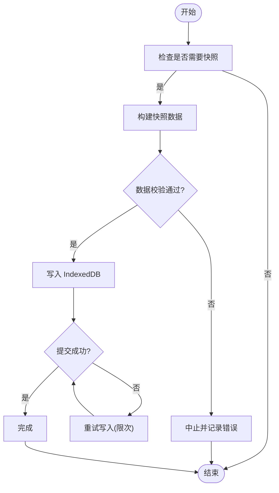
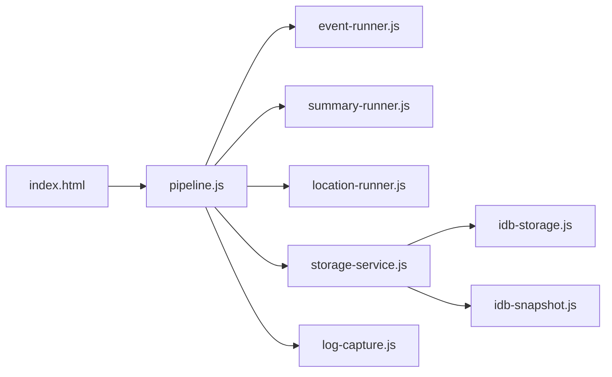

# 游戏循环与状态管理

<cite>
**本文引用的文件**   
- [pipeline.js](file://module/pipeline.js)
- [game-config.js](file://module/game-config.js)
- [storage-service.js](file://module/storage-service.js)
- [idb-storage.js](file://module/idb-storage.js)
- [idb-snapshot.js](file://module/idb-snapshot.js)
- [event-runner.js](file://module/event-runner.js)
- [summary-runner.js](file://module/summary-runner.js)
- [location-runner.js](file://module/location-runner.js)
- [log-capture.js](file://module/log-capture.js)
- [index.html](file://apk/android/app/src/main/assets/public/index.html)
</cite>

## 目录
1. [简介](#简介)
2. [项目结构](#项目结构)
3. [核心组件](#核心组件)
4. [架构总览](#架构总览)
5. [详细组件分析](#详细组件分析)
6. [依赖关系分析](#依赖关系分析)
7. [性能考虑](#性能考虑)
8. [故障排查指南](#故障排查指南)
9. [结论](#结论)
10. [附录](#附录)

## 简介
本文件聚焦姬侠传游戏引擎的“游戏循环与状态管理”，围绕 pipeline.js 中的管道模式实现，系统阐述主循环执行流程、状态机设计与转换逻辑、配置加载机制、初始化与生命周期管理、状态持久化策略、错误恢复机制与性能优化方案。文档同时提供扩展新状态与处理异常场景的实践指引，帮助开发者快速理解并安全地演进系统。

## 项目结构
从模块组织看，核心运行时位于 module 目录：
- pipeline.js：定义游戏主循环与阶段（stage）管道，协调各运行器与状态切换
- game-config.js：集中管理游戏配置项与默认值
- storage-service.js / idb-storage.js / idb-snapshot.js：负责本地存储、快照与恢复
- event-runner.js / summary-runner.js / location-runner.js：事件、摘要与地点等具体业务运行器
- log-capture.js：日志捕获与上报，辅助调试与问题定位
- index.html：前端入口，触发初始化与启动主循环

图表来源
- [pipeline.js](file://module/pipeline.js)
- [game-config.js](file://module/game-config.js)
- [storage-service.js](file://module/storage-service.js)
- [idb-storage.js](file://module/idb-storage.js)
- [idb-snapshot.js](file://module/idb-snapshot.js)
- [event-runner.js](file://module/event-runner.js)
- [summary-runner.js](file://module/summary-runner.js)
- [location-runner.js](file://module/location-runner.js)
- [log-capture.js](file://module/log-capture.js)
- [index.html](file://apk/android/app/src/main/assets/public/index.html)

章节来源
- [pipeline.js](file://module/pipeline.js)
- [game-config.js](file://module/game-config.js)
- [storage-service.js](file://module/storage-service.js)
- [idb-storage.js](file://module/idb-storage.js)
- [idb-snapshot.js](file://module/idb-snapshot.js)
- [event-runner.js](file://module/event-runner.js)
- [summary-runner.js](file://module/summary-runner.js)
- [location-runner.js](file://module/location-runner.js)
- [log-capture.js](file://module/log-capture.js)
- [index.html](file://apk/android/app/src/main/assets/public/index.html)

## 核心组件
- 管道与阶段（Pipeline & Stage）
  - 将游戏主循环抽象为一系列可插拔的阶段（如初始化、加载、渲染、更新、输入、保存等），每个阶段以统一接口接入，按序执行并可短路或跳转。
- 状态机（State Machine）
  - 维护当前游戏状态（如启动、加载、菜单、游玩、暂停、结算、退出等），提供进入/离开钩子与转换规则，支持条件分支与回退。
- 运行器（Runners）
  - 事件运行器、摘要运行器、地点运行器等作为阶段的具体实现，封装业务逻辑，通过管道被调度。
- 配置与初始化
  - 集中式配置加载与合并，保证多环境一致；在启动阶段完成资源预取、服务注册与上下文构建。
- 持久化与快照
  - 基于 IndexedDB 的存储层，提供数据存取与快照能力，用于断点续玩与崩溃恢复。
- 日志与监控
  - 统一日志捕获，记录关键节点与异常堆栈，便于线上问题定位。

章节来源
- [pipeline.js](file://module/pipeline.js)
- [game-config.js](file://module/game-config.js)
- [storage-service.js](file://module/storage-service.js)
- [idb-storage.js](file://module/idb-storage.js)
- [idb-snapshot.js](file://module/idb-snapshot.js)
- [event-runner.js](file://module/event-runner.js)
- [summary-runner.js](file://module/summary-runner.js)
- [location-runner.js](file://module/location-runner.js)
- [log-capture.js](file://module/log-capture.js)

## 架构总览
下图展示了主循环与状态机的交互关系，以及各运行器在管道中的位置。

图表来源
- [pipeline.js](file://module/pipeline.js)
- [event-runner.js](file://module/event-runner.js)
- [summary-runner.js](file://module/summary-runner.js)
- [location-runner.js](file://module/location-runner.js)
- [storage-service.js](file://module/storage-service.js)
- [idb-storage.js](file://module/idb-storage.js)
- [idb-snapshot.js](file://module/idb-snapshot.js)
- [log-capture.js](file://module/log-capture.js)
- [index.html](file://apk/android/app/src/main/assets/public/index.html)

## 详细组件分析

### 管道模式与主循环（pipeline.js）
- 设计要点
  - 阶段注册：以键名注册阶段函数，支持前置校验、超时保护与错误边界。
  - 顺序执行：按注册顺序依次调用，允许阶段返回“继续/跳过/跳转”指令。
  - 中断与恢复：遇到不可恢复错误时，进入错误状态并尝试回滚到最近快照。
  - 生命周期钩子：在进入/离开阶段时触发钩子，便于统计与清理。
- 典型阶段
  - 初始化：加载配置、注册服务、创建上下文
  - 加载：读取存档、恢复世界状态
  - 运行：事件、摘要、地点等业务阶段
  - 保存：增量保存与快照
  - 错误处理：统一异常捕获与降级
- 扩展建议
  - 新增阶段：在注册表中添加阶段名与处理器，确保返回一致的指令语义
  - 阶段间通信：通过共享上下文对象传递数据，避免全局污染

章节来源
- [pipeline.js](file://module/pipeline.js)

#### 主循环时序图

图表来源
- [pipeline.js](file://module/pipeline.js)

### 状态机设计与转换逻辑
- 状态集合
  - 启动、初始化、加载、菜单、游玩、暂停、结算、退出、错误
- 转换规则
  - 明确合法转换路径，禁止非法跳转
  - 支持条件转换（如网络失败、存档损坏）
  - 提供进入/离开钩子，用于资源准备与释放
- 错误态
  - 任何阶段抛出未捕获异常均进入错误态，随后尝试恢复或提示用户

章节来源
- [pipeline.js](file://module/pipeline.js)

#### 状态机类图

图表来源
- [pipeline.js](file://module/pipeline.js)

### 配置加载机制（game-config.js）
- 职责
  - 定义默认配置、合并外部配置、校验必填字段
  - 暴露统一的配置访问接口，供各阶段读取
- 关键点
  - 分层覆盖：内置默认 < 用户配置 < 环境变量
  - 延迟加载：按需加载大型配置块，减少首屏开销
  - 版本兼容：对旧版配置做迁移与降级处理

章节来源
- [game-config.js](file://module/game-config.js)

### 初始化流程与生命周期管理
- 初始化步骤
  - 解析入口参数、加载配置、注册运行器与服务
  - 建立日志通道、绑定错误边界、创建上下文对象
  - 进入“初始化”状态，完成后转入“加载”状态
- 生命周期钩子
  - 应用级：启动、销毁
  - 状态级：进入、离开
  - 阶段级：前置、后置
- 资源管理
  - 显式释放大对象、断开事件监听、清理定时器

章节来源
- [pipeline.js](file://module/pipeline.js)
- [game-config.js](file://module/game-config.js)

### 状态持久化策略（storage-service.js / idb-storage.js / idb-snapshot.js）
- 存储分层
  - 轻量数据：即时写入，适合频繁变更的小对象
  - 快照数据：定时或关键节点生成完整快照，用于快速恢复
- 索引与查询
  - 使用 IndexedDB 的索引提升查询效率
  - 对热点数据进行内存缓存，降低 IO 压力
- 一致性保障
  - 事务写入，失败自动回滚
  - 写前校验，避免脏数据入库

章节来源
- [storage-service.js](file://module/storage-service.js)
- [idb-storage.js](file://module/idb-storage.js)
- [idb-snapshot.js](file://module/idb-snapshot.js)

#### 快照写入流程图

图表来源
- [idb-snapshot.js](file://module/idb-snapshot.js)
- [idb-storage.js](file://module/idb-storage.js)

### 错误恢复机制
- 捕获范围
  - 阶段执行期、异步回调期、IO 操作期
- 恢复策略
  - 重试：对瞬时错误进行有限次数重试
  - 回滚：恢复到最近一次有效快照
  - 降级：关闭非核心功能，保证主流程可用
- 用户可见
  - 友好的错误提示与恢复引导
  - 可选的“重新加载存档”选项

章节来源
- [pipeline.js](file://module/pipeline.js)
- [log-capture.js](file://module/log-capture.js)

### 性能优化方案
- 阶段批处理
  - 将多个小阶段合并，减少调度开销
- 惰性加载
  - 按需加载运行器与资源，缩短冷启动时间
- 读写分离
  - 读路径走缓存，写路径批量合并后落盘
- 节流与防抖
  - 高频事件（如输入、滚动）进行节流/防抖
- 渲染优化
  - 帧率自适应，低性能设备降低更新频率

[本节为通用指导，不直接分析具体文件]

## 依赖关系分析
- 内聚与耦合
  - pipeline.js 作为编排中心，依赖各运行器与服务，但通过统一接口解耦
  - storage-service.js 屏蔽底层 IndexedDB 细节，提高可替换性
- 外部依赖
  - IndexedDB：浏览器原生存储，注意兼容性
  - 日志系统：统一采集，便于线上诊断
- 潜在环依赖
  - 通过事件总线或回调避免直接相互引用

图表来源
- [pipeline.js](file://module/pipeline.js)
- [event-runner.js](file://module/event-runner.js)
- [summary-runner.js](file://module/summary-runner.js)
- [location-runner.js](file://module/location-runner.js)
- [storage-service.js](file://module/storage-service.js)
- [idb-storage.js](file://module/idb-storage.js)
- [idb-snapshot.js](file://module/idb-snapshot.js)
- [log-capture.js](file://module/log-capture.js)
- [index.html](file://apk/android/app/src/main/assets/public/index.html)

章节来源
- [pipeline.js](file://module/pipeline.js)
- [storage-service.js](file://module/storage-service.js)
- [idb-storage.js](file://module/idb-storage.js)
- [idb-snapshot.js](file://module/idb-snapshot.js)
- [log-capture.js](file://module/log-capture.js)
- [index.html](file://apk/android/app/src/main/assets/public/index.html)

## 性能考虑
- 主循环帧预算控制：限制每帧最大计算量，避免掉帧
- 任务分片：长耗时任务拆分为微任务队列，逐步执行
- 数据压缩：对快照进行压缩，降低存储与传输成本
- 预热与缓存：常用数据在启动阶段预热，命中缓存优先
- 监控指标：收集阶段耗时、IO 次数、错误率，持续优化

[本节为通用指导，不直接分析具体文件]

## 故障排查指南
- 常见问题
  - 启动卡住：检查配置加载与 IndexedDB 可用性
  - 存档损坏：尝试从最近快照恢复
  - 频繁卡顿：定位耗时阶段，优化算法或拆分任务
- 定位手段
  - 查看日志捕获输出，关注异常堆栈与阶段标记
  - 开启详细日志，复现问题并抓取上下文
- 恢复步骤
  - 优先回滚到最近快照
  - 若仍失败，提示用户重置或重新加载存档

章节来源
- [log-capture.js](file://module/log-capture.js)
- [pipeline.js](file://module/pipeline.js)
- [idb-snapshot.js](file://module/idb-snapshot.js)

## 结论
通过将主循环抽象为可插拔的管道与清晰的状态机，姬侠传引擎实现了高内聚、低耦合的可扩展架构。配合完善的配置加载、持久化与错误恢复机制，系统在稳定性与可维护性上具备良好基础。遵循本文档的扩展与优化建议，可进一步平滑地引入新状态与业务特性。

## 附录

### 如何扩展新的游戏状态
- 步骤概览
  - 在状态机中声明新状态，并定义合法转换路径
  - 在管道中注册对应阶段处理器，实现进入/离开钩子
  - 在运行器中编写业务逻辑，并通过上下文与其他阶段通信
  - 增加日志埋点与错误边界，确保可观测性与健壮性
- 参考路径
  - 状态与阶段定义：[pipeline.js](file://module/pipeline.js)
  - 配置项扩展：[game-config.js](file://module/game-config.js)
  - 持久化适配：[storage-service.js](file://module/storage-service.js)、[idb-storage.js](file://module/idb-storage.js)、[idb-snapshot.js](file://module/idb-snapshot.js)
  - 日志埋点：[log-capture.js](file://module/log-capture.js)

### 如何处理异常场景
- 建议实践
  - 在阶段入口处进行参数与上下文校验
  - 对异步操作包裹 try/catch，并上报统一日志
  - 对 IO 操作设置超时与重试上限
  - 在错误态提供“重试/回滚/退出”的用户选择
- 参考路径
  - 错误处理与恢复：[pipeline.js](file://module/pipeline.js)
  - 日志捕获与上报：[log-capture.js](file://module/log-capture.js)
  - 快照恢复：[idb-snapshot.js](file://module/idb-snapshot.js)