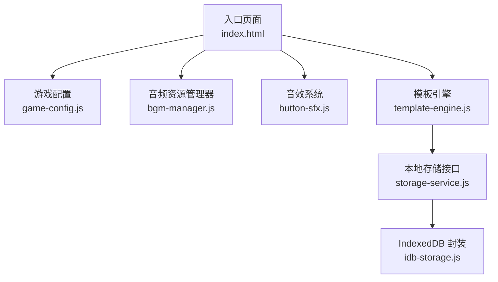
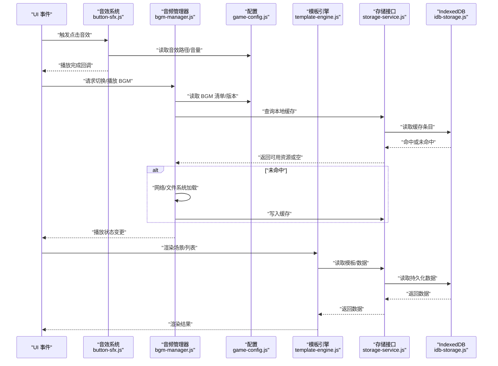
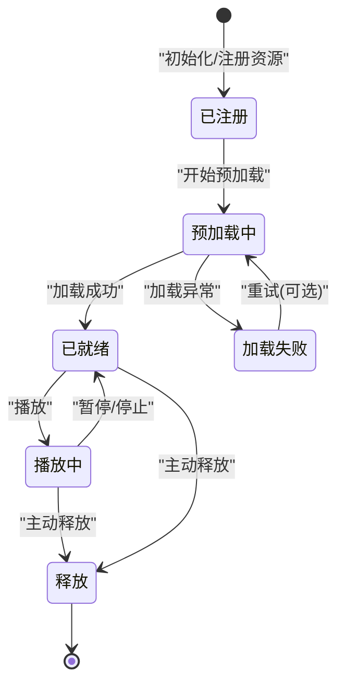
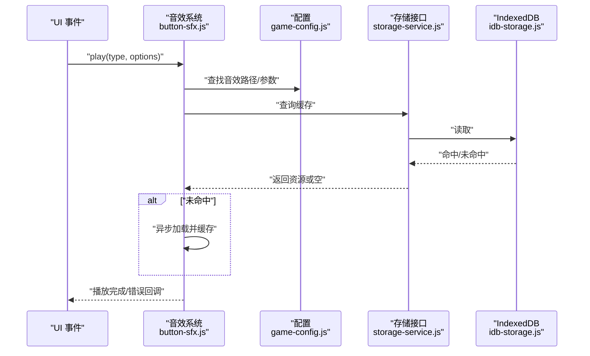
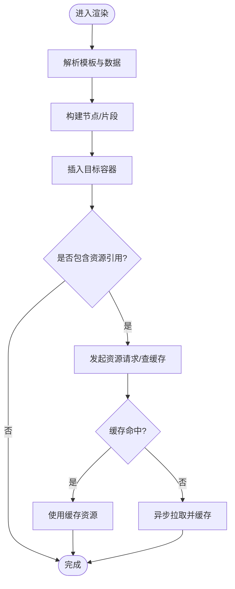
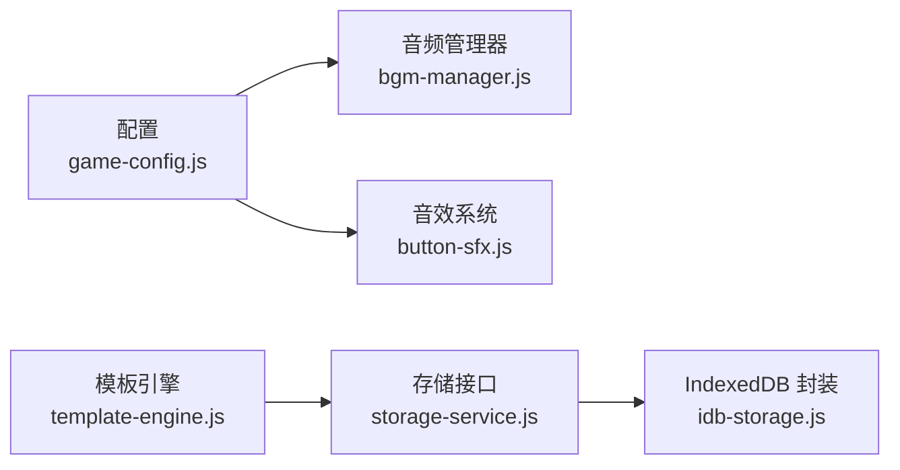
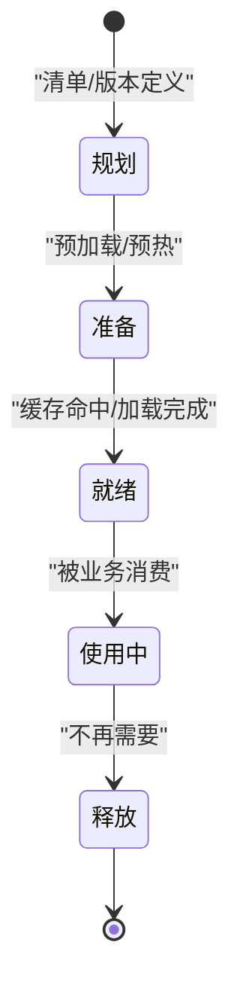
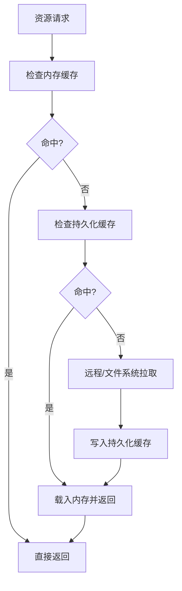

# 资源管理架构

<cite>
**本文引用的文件**   
- [bgm-manager.js](file://module/bgm-manager.js)
- [button-sfx.js](file://module/button-sfx.js)
- [template-engine.js](file://module/template-engine.js)
- [game-config.js](file://module/game-config.js)
- [storage-service.js](file://module/storage-service.js)
- [idb-storage.js](file://module/idb-storage.js)
- [index.html](file://apk/android/app/src/main/assets/public/index.html)
</cite>

## 目录
1. [简介](#简介)
2. [项目结构](#项目结构)
3. [核心组件](#核心组件)
4. [架构总览](#架构总览)
5. [详细组件分析](#详细组件分析)
6. [依赖关系分析](#依赖关系分析)
7. [性能考量](#性能考量)
8. [故障排查指南](#故障排查指南)
9. [结论](#结论)
10. [附录](#附录)

## 简介
本架构文档面向“姬侠传”资源管理系统，聚焦多媒体资源（音频、音效）与模板引擎的设计与协作。文档覆盖以下主题：
- 音频资源管理器与音效系统职责边界与交互
- 模板引擎在资源渲染中的角色
- 资源加载、缓存与预加载机制
- 资源版本管理与动态加载方案
- 内存优化、异步加载与错误处理策略
- 资源生命周期图与缓存策略图

## 项目结构
资源相关代码主要位于前端模块目录中，关键文件如下：
- 音频与音效：bgm-manager.js、button-sfx.js
- 模板引擎：template-engine.js
- 配置与存储：game-config.js、storage-service.js、idb-storage.js
- 入口页面：index.html

图表来源
- [index.html](file://apk/android/app/src/main/assets/public/index.html)
- [game-config.js](file://module/game-config.js)
- [bgm-manager.js](file://module/bgm-manager.js)
- [button-sfx.js](file://module/button-sfx.js)
- [template-engine.js](file://module/template-engine.js)
- [storage-service.js](file://module/storage-service.js)
- [idb-storage.js](file://module/idb-storage.js)

章节来源
- [index.html](file://apk/android/app/src/main/assets/public/index.html)
- [game-config.js](file://module/game-config.js)
- [bgm-manager.js](file://module/bgm-manager.js)
- [button-sfx.js](file://module/button-sfx.js)
- [template-engine.js](file://module/template-engine.js)
- [storage-service.js](file://module/storage-service.js)
- [idb-storage.js](file://module/idb-storage.js)

## 核心组件
- 音频资源管理器（BGM 管理器）
  - 负责背景音乐资源的加载、播放控制、音量与交叉淡入淡出、队列与状态管理。
  - 提供统一的 API 供业务层调用，屏蔽底层 Audio 对象差异。
- 音效系统（SFX）
  - 负责短促音效的即时播放，支持并发播放、优先级与静音开关。
  - 通常与 UI 事件绑定，强调低延迟与高吞吐。
- 模板引擎
  - 负责将数据模型渲染为可展示内容，并可在渲染过程中按需触发资源加载或更新。
  - 与存储层解耦，通过统一接口读写持久化数据。
- 配置与存储
  - game-config.js 集中管理资源路径、版本、默认参数等。
  - storage-service.js 抽象存储后端，idb-storage.js 基于 IndexedDB 实现离线缓存。

章节来源
- [bgm-manager.js](file://module/bgm-manager.js)
- [button-sfx.js](file://module/button-sfx.js)
- [template-engine.js](file://module/template-engine.js)
- [game-config.js](file://module/game-config.js)
- [storage-service.js](file://module/storage-service.js)
- [idb-storage.js](file://module/idb-storage.js)

## 架构总览
整体采用分层与模块化设计：
- 表现层：HTML 页面与 UI 事件驱动
- 业务层：音频/音效管理器、模板引擎
- 基础设施层：配置与存储抽象及 IndexedDB 实现

图表来源
- [button-sfx.js](file://module/button-sfx.js)
- [bgm-manager.js](file://module/bgm-manager.js)
- [game-config.js](file://module/game-config.js)
- [template-engine.js](file://module/template-engine.js)
- [storage-service.js](file://module/storage-service.js)
- [idb-storage.js](file://module/idb-storage.js)

## 详细组件分析

### 音频资源管理器（BGM 管理器）
职责与能力
- 资源发现与清单解析：从配置中获取 BGM 清单、分组与元信息。
- 加载与缓存：优先使用本地缓存，未命中则进行异步加载并回填缓存。
- 播放控制：播放、暂停、停止、循环、淡入淡出、音量与声道控制。
- 状态机：维护当前曲目、队列、缓冲进度与错误状态。
- 错误恢复：网络失败重试、降级到默认曲目、用户提示。

资源生命周期
- 注册 -> 预加载 -> 就绪 -> 播放 -> 释放/回收

图表来源
- [bgm-manager.js](file://module/bgm-manager.js)
- [game-config.js](file://module/game-config.js)
- [storage-service.js](file://module/storage-service.js)
- [idb-storage.js](file://module/idb-storage.js)

章节来源
- [bgm-manager.js](file://module/bgm-manager.js)
- [game-config.js](file://module/game-config.js)
- [storage-service.js](file://module/storage-service.js)
- [idb-storage.js](file://module/idb-storage.js)

### 音效系统（SFX）
职责与能力
- 短音效即时播放，支持多实例并发。
- 与 UI 事件强耦合，提供低延迟播放 API。
- 音量与静音控制，按类型/优先级过滤。
- 资源预取与缓存，避免首帧卡顿。

典型调用序列
- UI 事件 -> 音效系统 -> 配置读取 -> 播放/缓存 -> 回调

图表来源
- [button-sfx.js](file://module/button-sfx.js)
- [game-config.js](file://module/game-config.js)
- [storage-service.js](file://module/storage-service.js)
- [idb-storage.js](file://module/idb-storage.js)

章节来源
- [button-sfx.js](file://module/button-sfx.js)
- [game-config.js](file://module/game-config.js)
- [storage-service.js](file://module/storage-service.js)
- [idb-storage.js](file://module/idb-storage.js)

### 模板引擎
职责与能力
- 将数据模型渲染为视图片段，支持条件分支、循环与局部模板。
- 在渲染阶段按需触发资源引用（如图片、音频占位），配合资源管理器进行懒加载。
- 与存储层解耦，通过统一接口读取模板与数据。

渲染流程
- 输入数据 -> 解析模板 -> 生成 DOM/文本 -> 插入容器 -> 触发资源懒加载

图表来源
- [template-engine.js](file://module/template-engine.js)
- [storage-service.js](file://module/storage-service.js)
- [idb-storage.js](file://module/idb-storage.js)

章节来源
- [template-engine.js](file://module/template-engine.js)
- [storage-service.js](file://module/storage-service.js)
- [idb-storage.js](file://module/idb-storage.js)

### 配置与存储
- 配置中心（game-config.js）
  - 集中管理资源路径、版本、默认参数、功能开关。
  - 为音频/音效/模板提供统一的数据源。
- 存储抽象（storage-service.js）
  - 定义统一的读写接口，屏蔽后端差异。
- IndexedDB 实现（idb-storage.js）
  - 提供大容量、异步、事务化的本地缓存能力。

章节来源
- [game-config.js](file://module/game-config.js)
- [storage-service.js](file://module/storage-service.js)
- [idb-storage.js](file://module/idb-storage.js)

## 依赖关系分析
- 模块内聚与耦合
  - bgm-manager.js 与 button-sfx.js 均依赖 game-config.js 获取资源清单与参数。
  - template-engine.js 依赖 storage-service.js 以解耦具体存储实现。
  - storage-service.js 依赖 idb-storage.js 作为默认持久化后端。
- 外部依赖
  - 浏览器原生 Audio/WebAudio API（由音频/音效模块内部封装）。
  - IndexedDB（由 idb-storage.js 封装）。

图表来源
- [game-config.js](file://module/game-config.js)
- [bgm-manager.js](file://module/bgm-manager.js)
- [button-sfx.js](file://module/button-sfx.js)
- [template-engine.js](file://module/template-engine.js)
- [storage-service.js](file://module/storage-service.js)
- [idb-storage.js](file://module/idb-storage.js)

章节来源
- [game-config.js](file://module/game-config.js)
- [bgm-manager.js](file://module/bgm-manager.js)
- [button-sfx.js](file://module/button-sfx.js)
- [template-engine.js](file://module/template-engine.js)
- [storage-service.js](file://module/storage-service.js)
- [idb-storage.js](file://module/idb-storage.js)

## 性能考量
- 异步加载
  - 所有 I/O（网络/磁盘/IndexedDB）采用异步 API，避免阻塞主线程。
  - 对热点资源进行预加载，降低首帧与首次交互延迟。
- 缓存策略
  - 多级缓存：内存缓存（短期）、IndexedDB（长期）。
  - 缓存键包含版本号与资源指纹，确保一致性。
- 内存优化
  - 及时释放不再使用的音频实例；对大资源采用分块/流式加载。
  - 限制并发加载数量，避免峰值占用过高。
- 错误处理
  - 超时与重试策略，失败时回退到默认资源或降级模式。
  - 上报错误上下文（资源标识、来源、错误码）便于定位。

[本节为通用指导，不直接分析具体文件]

## 故障排查指南
- 常见问题
  - 音效无法播放：检查权限与用户手势要求、音量与静音设置、资源路径是否正确。
  - BGM 切换卡顿：确认预加载是否完成、是否存在并发过载、缓存是否命中。
  - 模板渲染空白：检查模板语法、数据字段映射、存储读取是否成功。
- 定位步骤
  - 查看配置项与资源清单是否匹配。
  - 检查存储层读写日志与 IndexedDB 条目。
  - 复现最小用例，逐步隔离问题模块。

章节来源
- [bgm-manager.js](file://module/bgm-manager.js)
- [button-sfx.js](file://module/button-sfx.js)
- [template-engine.js](file://module/template-engine.js)
- [storage-service.js](file://module/storage-service.js)
- [idb-storage.js](file://module/idb-storage.js)

## 结论
本架构通过清晰的模块划分与统一的配置/存储抽象，实现了音频与音效的高效管理以及模板渲染的资源协同。结合预加载、缓存与异步策略，系统在用户体验与性能之间取得平衡。后续可进一步引入资源指纹与增量更新、更细粒度的内存池与连接池，以提升可扩展性与稳定性。

[本节为总结性内容，不直接分析具体文件]

## 附录

### 资源生命周期图（概念）

[本图为概念示意，无需图表来源]

### 缓存策略图（概念）

[本图为概念示意，无需图表来源]