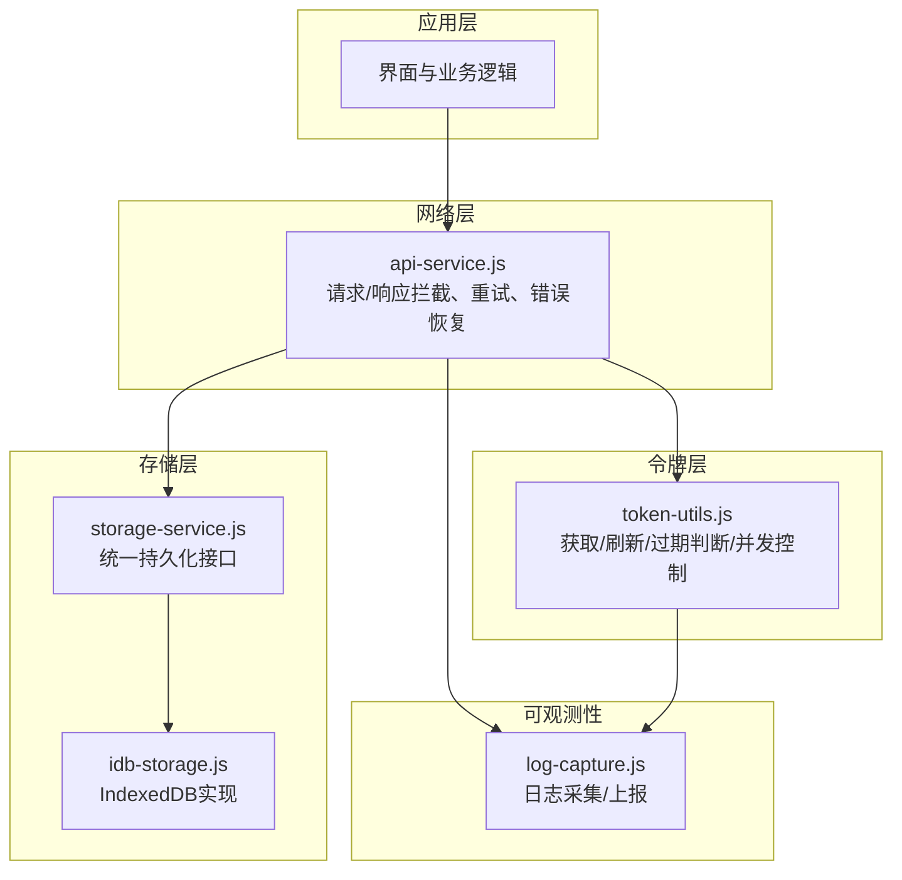
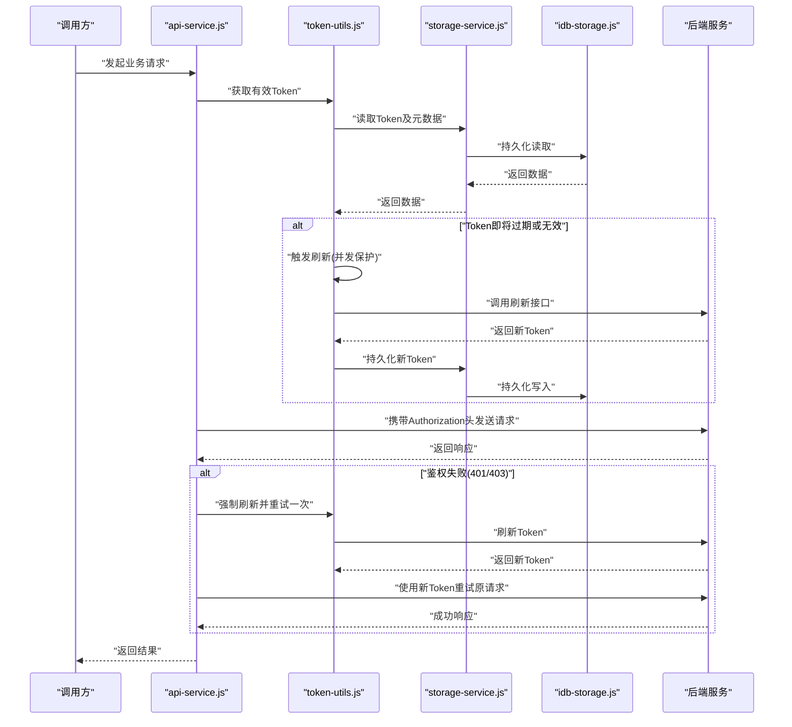
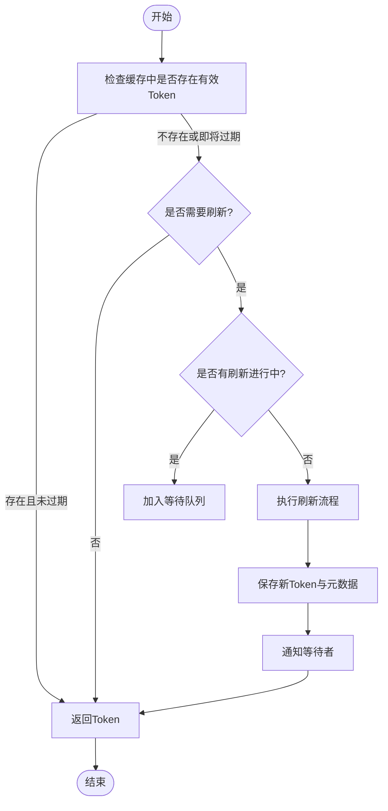
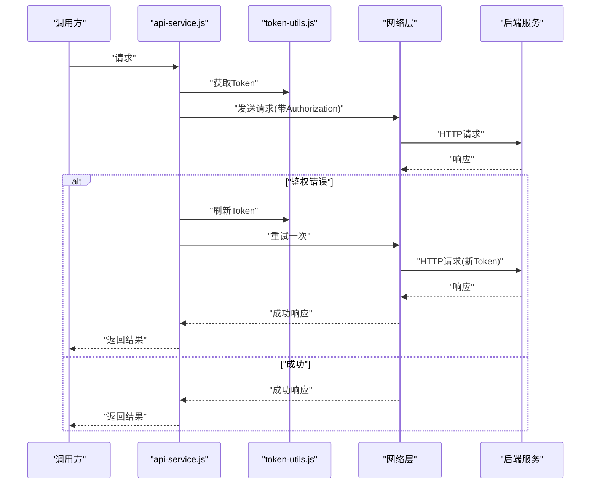
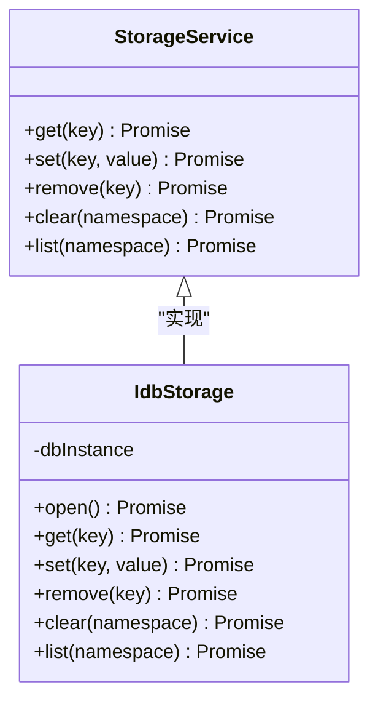
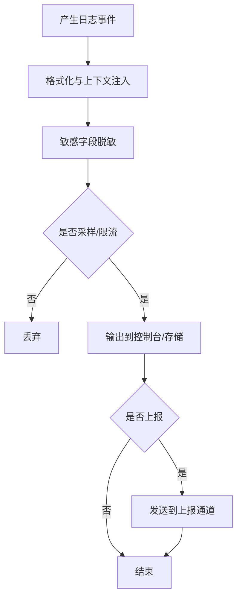
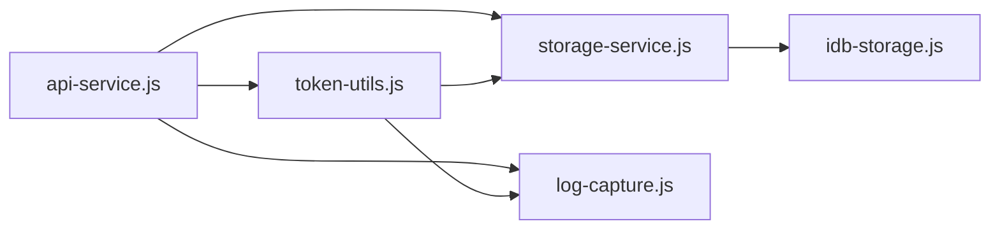

# Token管理机制

<cite>
**本文引用的文件**   
- [api-service.js](file://module/api-service.js)
- [token-utils.js](file://module/token-utils.js)
- [storage-service.js](file://module/storage-service.js)
- [idb-storage.js](file://module/idb-storage.js)
- [log-capture.js](file://module/log-capture.js)
</cite>

## 目录
1. [简介](#简介)
2. [项目结构](#项目结构)
3. [核心组件](#核心组件)
4. [架构总览](#架构总览)
5. [详细组件分析](#详细组件分析)
6. [依赖关系分析](#依赖关系分析)
7. [性能考虑](#性能考虑)
8. [故障排查指南](#故障排查指南)
9. [结论](#结论)
10. [附录](#附录)

## 简介
本文件面向“姬侠传”前端工程，系统化梳理并完善Token管理机制。内容覆盖Token的获取、刷新、缓存与失效处理；安全存储策略与加密机制；与API服务的集成（含自动重试与错误恢复）；多用户场景下的隔离与管理；监控、日志记录与故障排查方法；以及安全最佳实践与性能优化建议。文档同时提供代码级架构图与流程图，帮助开发者快速理解与扩展实现。

## 项目结构
本项目采用模块化组织方式，与Token管理相关的核心模块位于 module 目录下：
- api-service.js：封装HTTP请求、拦截器、重试与错误恢复逻辑
- token-utils.js：提供Token生命周期操作（生成、校验、刷新、过期判断等）
- storage-service.js：统一持久化接口（读写、命名空间、序列化/反序列化）
- idb-storage.js：基于IndexedDB的持久化实现
- log-capture.js：日志采集与上报能力

图表来源
- [api-service.js](file://module/api-service.js)
- [token-utils.js](file://module/token-utils.js)
- [storage-service.js](file://module/storage-service.js)
- [idb-storage.js](file://module/idb-storage.js)
- [log-capture.js](file://module/log-capture.js)

章节来源
- [api-service.js](file://module/api-service.js)
- [token-utils.js](file://module/token-utils.js)
- [storage-service.js](file://module/storage-service.js)
- [idb-storage.js](file://module/idb-storage.js)
- [log-capture.js](file://module/log-capture.js)

## 核心组件
- 令牌工具（token-utils.js）
  - 职责：Token的创建、解析、有效期计算、刷新触发、并发刷新保护、状态查询
  - 关键能力：
    - 获取当前有效Token（必要时触发刷新）
    - 刷新流程（支持幂等与去重）
    - 过期判定（含提前刷新窗口）
    - 清理与重置（登出或异常时）
- 存储服务（storage-service.js / idb-storage.js）
  - 职责：跨会话持久化Token及其元数据（如过期时间、刷新令牌、用户标识等）
  - 关键能力：
    - 命名空间隔离（按用户或会话）
    - 原子写入与读取
    - 版本兼容与迁移
- API服务（api-service.js）
  - 职责：统一发起网络请求，注入Token、处理鉴权失败、自动重试与错误恢复
  - 关键能力：
    - 请求拦截：附加Authorization头
    - 响应拦截：识别401/403等鉴权错误，触发刷新后重试
    - 重试策略：指数退避、最大重试次数、抖动
    - 熔断与降级：连续失败时的快速失败与提示
- 日志采集（log-capture.js）
  - 职责：结构化日志收集、分级输出、可选上报
  - 关键能力：
    - 敏感信息脱敏
    - 采样与限流
    - 上下文关联（用户ID、请求ID等）

章节来源
- [token-utils.js](file://module/token-utils.js)
- [storage-service.js](file://module/storage-service.js)
- [idb-storage.js](file://module/idb-storage.js)
- [api-service.js](file://module/api-service.js)
- [log-capture.js](file://module/log-capture.js)

## 架构总览
下图展示Token在请求链路中的流转与协作关系：

图表来源
- [api-service.js](file://module/api-service.js)
- [token-utils.js](file://module/token-utils.js)
- [storage-service.js](file://module/storage-service.js)
- [idb-storage.js](file://module/idb-storage.js)

## 详细组件分析

### 令牌工具（token-utils.js）
- 设计要点
  - 单例与全局状态：维护当前用户域名的Token集合，避免跨用户污染
  - 并发刷新保护：同一时刻仅允许一个刷新任务，其余请求排队等待
  - 提前刷新窗口：在过期前N秒主动刷新，降低边界抖动导致的失败率
  - 幂等刷新：刷新接口需支持重复调用且返回一致结果
- 关键流程
  - 获取Token：若存在且未过期则直接返回；否则进入刷新流程
  - 刷新流程：检查是否已有刷新进行中；若无则发起刷新并更新本地缓存
  - 失效处理：登出或检测到服务端拒绝时，清空对应命名空间的Token
- 复杂度与性能
  - 读取/写入为O(1)
  - 刷新为异步I/O，受网络延迟影响；通过并发保护避免风暴
- 错误处理
  - 刷新失败：回退到旧Token并标记下次必刷；记录日志并上报
  - 存储失败：降级为内存态，并在可用时重试持久化

图表来源
- [token-utils.js](file://module/token-utils.js)

章节来源
- [token-utils.js](file://module/token-utils.js)

### API服务（api-service.js）
- 设计要点
  - 请求拦截：从令牌工具获取最新Token并注入Authorization头
  - 响应拦截：对鉴权错误进行统一处理，触发刷新后重试一次
  - 重试策略：指数退避+随机抖动，限制最大重试次数
  - 熔断与降级：连续失败达到阈值时快速失败并提示用户
- 关键流程
  - 正常路径：带Token请求→成功返回
  - 鉴权失败路径：捕获401/403→刷新Token→重试一次→返回
  - 网络异常路径：按策略重试→失败则抛出可诊断的错误
- 错误处理
  - 区分网络错误与服务端错误
  - 对刷新失败进行特殊处理，避免无限循环
  - 记录关键上下文（URL、状态码、耗时、用户ID）

图表来源
- [api-service.js](file://module/api-service.js)
- [token-utils.js](file://module/token-utils.js)

章节来源
- [api-service.js](file://module/api-service.js)

### 存储服务（storage-service.js / idb-storage.js）
- 设计要点
  - 抽象接口：统一的get/set/remove/list/clear等方法
  - 命名空间：以用户ID或会话ID作为键空间前缀，确保多用户隔离
  - 持久化：默认使用IndexedDB，具备事务性与高容量优势
  - 兼容性：提供版本字段与迁移钩子，便于后续升级
- 关键流程
  - 写入：序列化→落盘→确认
  - 读取：读取→反序列化→校验
  - 删除：按命名空间批量清理
- 错误处理
  - 磁盘不可用或配额不足时降级为内存态
  - 记录错误并尝试恢复

图表来源
- [storage-service.js](file://module/storage-service.js)
- [idb-storage.js](file://module/idb-storage.js)

章节来源
- [storage-service.js](file://module/storage-service.js)
- [idb-storage.js](file://module/idb-storage.js)

### 日志采集（log-capture.js）
- 设计要点
  - 结构化日志：包含时间戳、级别、模块、消息、上下文
  - 敏感信息脱敏：自动过滤Token、密码等字段
  - 采样与限流：高频日志降采样，避免阻塞主线程
  - 上报通道：可选将关键错误上报至远端
- 关键流程
  - 捕获：拦截console与自定义事件
  - 处理：格式化、脱敏、采样
  - 输出：控制台/存储/上报

图表来源
- [log-capture.js](file://module/log-capture.js)

章节来源
- [log-capture.js](file://module/log-capture.js)

## 依赖关系分析
- 组件耦合
  - api-service.js 依赖 token-utils.js 与 storage-service.js
  - token-utils.js 依赖 storage-service.js
  - storage-service.js 依赖 idb-storage.js
  - 各组件均可向 log-capture.js 输出日志
- 外部依赖
  - IndexedDB用于持久化
  - 浏览器网络API用于HTTP通信
- 潜在风险
  - 循环依赖：应确保模块间单向依赖
  - 竞态条件：刷新与写入需加锁或队列化
  - 存储配额：大对象或频繁写入需做压缩与批处理

图表来源
- [api-service.js](file://module/api-service.js)
- [token-utils.js](file://module/token-utils.js)
- [storage-service.js](file://module/storage-service.js)
- [idb-storage.js](file://module/idb-storage.js)
- [log-capture.js](file://module/log-capture.js)

章节来源
- [api-service.js](file://module/api-service.js)
- [token-utils.js](file://module/token-utils.js)
- [storage-service.js](file://module/storage-service.js)
- [idb-storage.js](file://module/idb-storage.js)
- [log-capture.js](file://module/log-capture.js)

## 性能考虑
- 减少不必要的刷新
  - 设置合理的提前刷新窗口，避免临界点抖动
  - 合并多次刷新请求，保证幂等
- 并发控制
  - 使用队列或信号量限制并发刷新
  - 对等待请求进行Promise复用，避免重复网络开销
- 存储优化
  - 批量写入与最小化序列化体积
  - 定期清理过期数据与无用快照
- 网络优化
  - 合理设置超时与重试上限
  - 启用连接复用与缓存（在不影响安全的前提下）

[本节为通用指导，不直接分析具体文件]

## 故障排查指南
- 常见问题定位
  - Token未注入：检查请求拦截器是否正确附加Authorization头
  - 刷新死循环：确认刷新接口幂等性与错误分支退出条件
  - 多用户串扰：验证命名空间隔离是否生效
  - 存储失败：检查IndexedDB权限与配额，观察降级行为
- 日志与指标
  - 关注鉴权失败次数、刷新成功率、重试次数、平均耗时
  - 开启调试模式时保留必要上下文，但务必脱敏
- 复现场景
  - 模拟弱网、服务端5xx、401/403、存储不可用等异常路径
  - 使用回放工具重现问题，逐步缩小范围

章节来源
- [api-service.js](file://module/api-service.js)
- [token-utils.js](file://module/token-utils.js)
- [storage-service.js](file://module/storage-service.js)
- [idb-storage.js](file://module/idb-storage.js)
- [log-capture.js](file://module/log-capture.js)

## 结论
通过分层设计与明确职责，Token管理在本项目中实现了高内聚、低耦合的可维护架构。结合自动重试、错误恢复、并发保护与持久化隔离，能够在复杂网络与多用户场景下保持稳定与安全。配合完善的日志与监控，可显著提升排障效率与系统可观测性。

[本节为总结性内容，不直接分析具体文件]

## 附录

### 安全最佳实践
- 传输安全
  - 始终使用HTTPS，严格校验证书
- 存储安全
  - 避免明文存储敏感字段；如需持久化，结合平台提供的安全存储能力
  - 对Token进行最小化暴露，仅在需要时加载到内存
- 刷新安全
  - 刷新接口需具备防重放与签名校验
  - 刷新失败时及时失效旧Token，防止被劫持利用
- 最小权限
  - 按需申请权限，避免过度授权
- 审计与脱敏
  - 所有日志必须脱敏，禁止记录完整Token

[本节为通用指导，不直接分析具体文件]

### 多用户隔离与管理策略
- 命名空间隔离
  - 以用户ID或会话ID作为键空间前缀，确保不同用户Token互不影响
- 切换与清理
  - 用户切换时，先完成当前请求再切换上下文，随后清理旧用户Token
- 并发与一致性
  - 针对同一用户的刷新操作进行串行化，避免并发写冲突

[本节为通用指导，不直接分析具体文件]

### 监控与告警建议
- 关键指标
  - 刷新成功率、鉴权失败率、重试次数分布、P95/P99耗时
- 告警规则
  - 刷新失败率突增、连续鉴权失败、存储写入失败
- 可视化
  - 建立看板展示趋势与热点错误

[本节为通用指导，不直接分析具体文件]