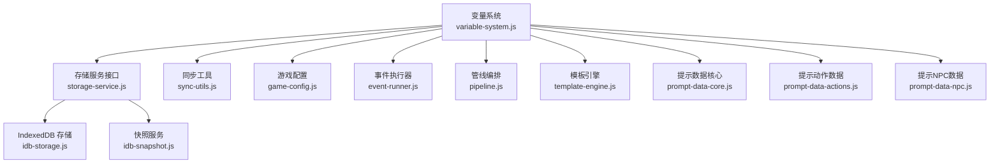
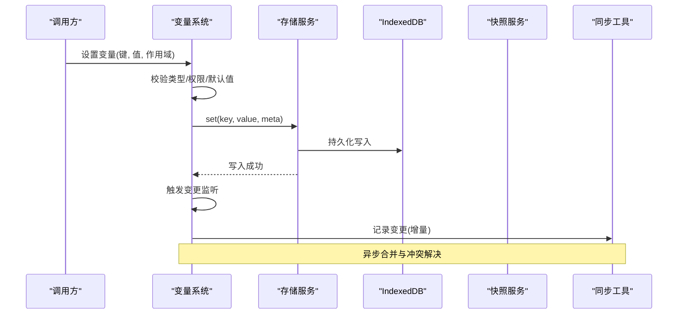
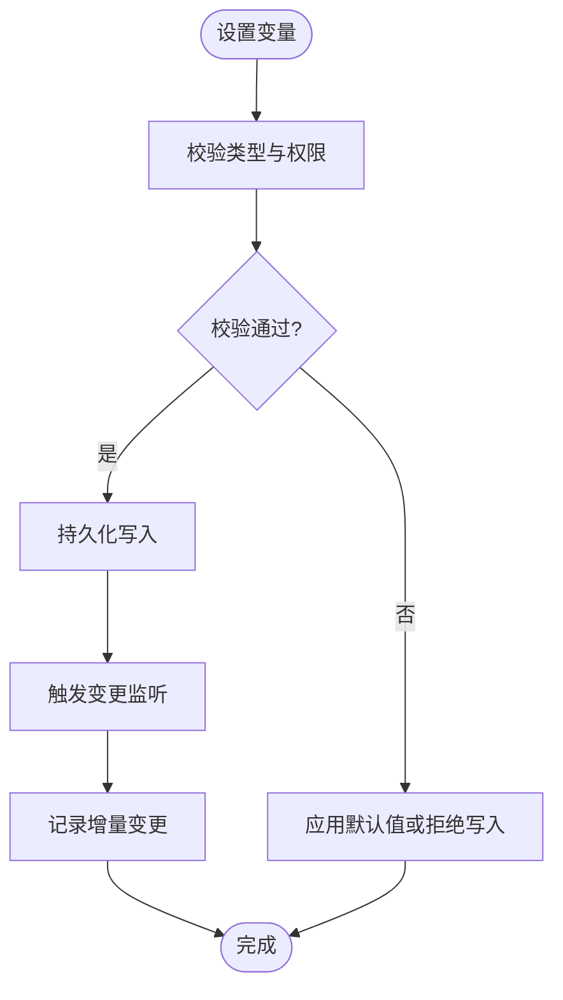
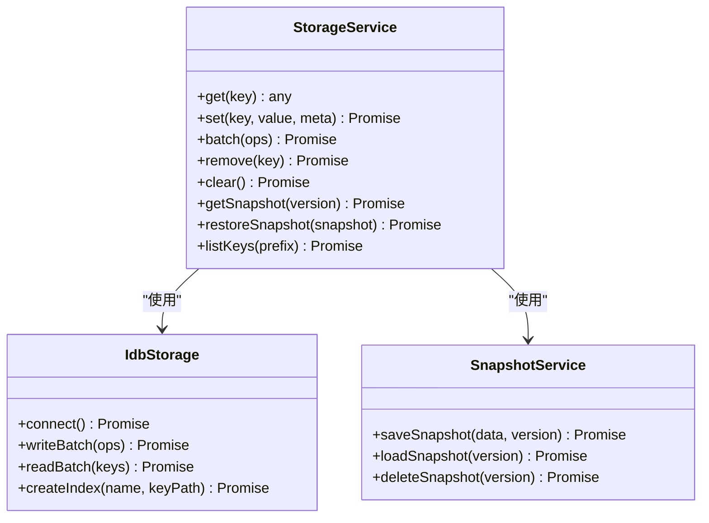
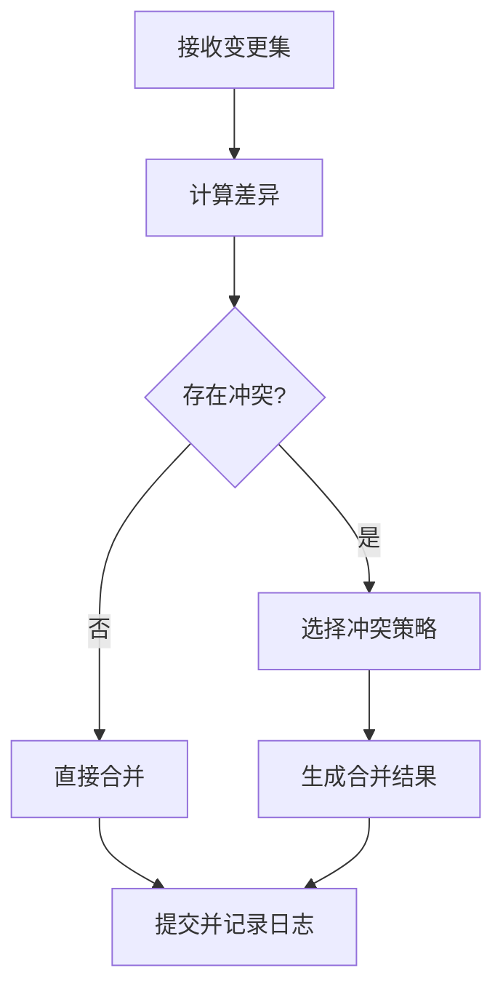
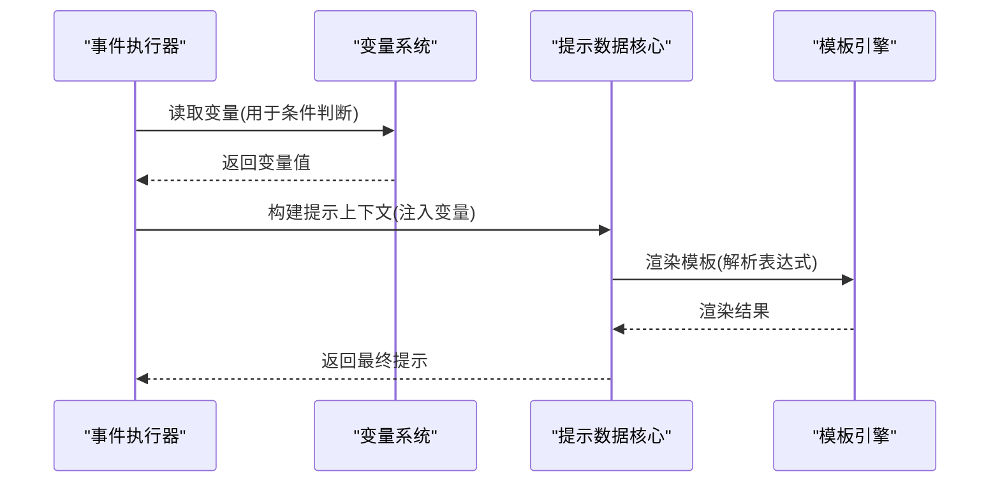
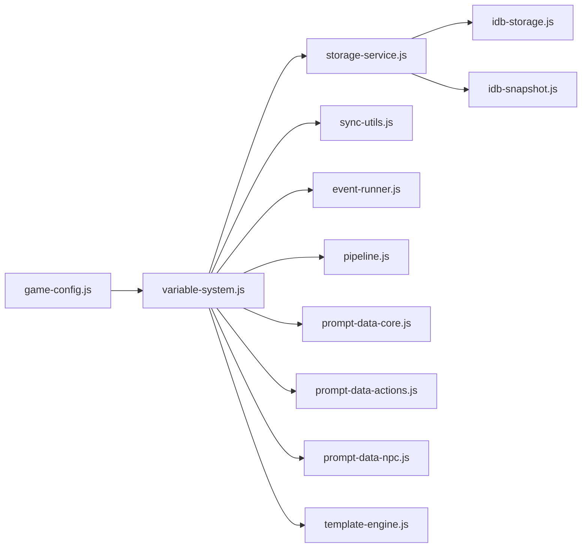

# 变量管理系统

<cite>
**本文引用的文件**   
- [variable-system.js](file://module/variable-system.js)
- [storage-service.js](file://module/storage-service.js)
- [idb-storage.js](file://module/idb-storage.js)
- [idb-snapshot.js](file://module/idb-snapshot.js)
- [sync-utils.js](file://module/sync-utils.js)
- [game-config.js](file://module/game-config.js)
- [pipeline.js](file://module/pipeline.js)
- [event-runner.js](file://module/event-runner.js)
- [prompt-data-core.js](file://module/prompt-data-core.js)
- [prompt-data-actions.js](file://module/prompt-data-actions.js)
- [prompt-data-npc.js](file://module/prompt-data-npc.js)
- [template-engine.js](file://module/template-engine.js)
- [log-capture.js](file://module/log-capture.js)
</cite>

## 目录
1. [简介](#简介)
2. [项目结构](#项目结构)
3. [核心组件](#核心组件)
4. [架构总览](#架构总览)
5. [详细组件分析](#详细组件分析)
6. [依赖关系分析](#依赖关系分析)
7. [性能考虑](#性能考虑)
8. [故障排查指南](#故障排查指南)
9. [结论](#结论)
10. [附录：API与使用示例](#附录api与使用示例)

## 简介
本文件为“姬侠传”变量管理系统的综合文档，围绕变量的定义、作用域与生命周期、类型系统与校验、默认值处理、与存储服务的集成（持久化与同步）、访问模式与权限控制、变更监听机制、调试工具、性能优化与最佳实践进行系统化说明。目标是帮助开发者快速理解并扩展变量系统，确保在复杂剧情、事件与提示构建流程中稳定高效地运行。

## 项目结构
变量系统位于前端模块层，核心实现集中在 module/variable-system.js，并与存储服务、快照、同步工具、配置、事件执行、模板引擎等模块协作。整体采用分层设计：
- 变量内核：负责变量注册、解析、作用域、生命周期、类型校验与默认值。
- 存储层：通过 storage-service.js 抽象，底层由 idb-storage.js 提供 IndexedDB 能力，idb-snapshot.js 提供快照能力。
- 同步层：sync-utils.js 提供增量同步与冲突解决策略。
- 业务集成：pipeline.js、event-runner.js、prompt-data-*.js、template-engine.js 等消费变量数据。

图表来源
- [variable-system.js](file://module/variable-system.js)
- [storage-service.js](file://module/storage-service.js)
- [idb-storage.js](file://module/idb-storage.js)
- [idb-snapshot.js](file://module/idb-snapshot.js)
- [sync-utils.js](file://module/sync-utils.js)
- [game-config.js](file://module/game-config.js)
- [event-runner.js](file://module/event-runner.js)
- [pipeline.js](file://module/pipeline.js)
- [template-engine.js](file://module/template-engine.js)
- [prompt-data-core.js](file://module/prompt-data-core.js)
- [prompt-data-actions.js](file://module/prompt-data-actions.js)
- [prompt-data-npc.js](file://module/prompt-data-npc.js)

章节来源
- [variable-system.js](file://module/variable-system.js)
- [storage-service.js](file://module/storage-service.js)
- [idb-storage.js](file://module/idb-storage.js)
- [idb-snapshot.js](file://module/idb-snapshot.js)
- [sync-utils.js](file://module/sync-utils.js)
- [game-config.js](file://module/game-config.js)
- [pipeline.js](file://module/pipeline.js)
- [event-runner.js](file://module/event-runner.js)
- [prompt-data-core.js](file://module/prompt-data-core.js)
- [prompt-data-actions.js](file://module/prompt-data-actions.js)
- [prompt-data-npc.js](file://module/prompt-data-npc.js)
- [template-engine.js](file://module/template-engine.js)

## 核心组件
- 变量内核（Variable Core）
  - 变量注册与元数据：名称、类型、默认值、作用域、可见性、读写权限、校验规则、变更回调。
  - 作用域与生命周期：全局、场景、角色、会话级作用域；创建、激活、销毁与清理。
  - 类型系统与校验：基础类型、复合类型、自定义校验器；失败回退到默认值或拒绝写入。
  - 默认值与合并策略：按作用域优先级合并，支持覆盖与继承。
  - 访问模式与权限：只读/读写、读取白名单、写入黑名单、审计日志。
  - 变更监听：订阅/取消订阅、批量通知、防抖节流。
- 存储服务（Storage Service）
  - 统一接口：get/set/batch/getSnapshot/restoreSnapshot/listKeys 等。
  - 持久化策略：内存优先、IndexedDB 落盘、增量更新、事务保护。
  - 快照与恢复：全量/增量快照、版本标记、回滚。
- 同步工具（Sync Utils）
  - 增量同步：基于时间戳/版本号合并。
  - 冲突解决：最后写入胜出、字段级合并、策略可插拔。
- 集成点
  - 事件执行器：事件读写变量，触发副作用。
  - 提示数据构建：将变量注入提示上下文。
  - 模板引擎：渲染文本时解析变量表达式。

章节来源
- [variable-system.js](file://module/variable-system.js)
- [storage-service.js](file://module/storage-service.js)
- [idb-storage.js](file://module/idb-storage.js)
- [idb-snapshot.js](file://module/idb-snapshot.js)
- [sync-utils.js](file://module/sync-utils.js)

## 架构总览
变量系统以“内核 + 存储 + 同步 + 集成”的分层架构组织，保证高内聚、低耦合。变量内核暴露稳定的 API，存储服务屏蔽底层差异，同步工具保障一致性，上层业务按需消费。

图表来源
- [variable-system.js](file://module/variable-system.js)
- [storage-service.js](file://module/storage-service.js)
- [idb-storage.js](file://module/idb-storage.js)
- [idb-snapshot.js](file://module/idb-snapshot.js)
- [sync-utils.js](file://module/sync-utils.js)

## 详细组件分析

### 变量内核（Variable System）
- 变量定义与元数据
  - 字段包括：名称、类型、默认值、作用域、可见性、读写权限、校验器、变更回调、版本/时间戳。
  - 支持嵌套对象与数组的字段级操作。
- 作用域与生命周期
  - 作用域层级：全局 > 场景 > 角色 > 会话。
  - 生命周期钩子：onCreate、onActivate、onDeactivate、onDestroy。
  - 自动清理：会话结束或场景切换时释放资源。
- 类型系统与校验
  - 内置类型：字符串、数字、布尔、对象、数组、枚举、日期。
  - 自定义校验：返回布尔或错误信息；失败时回退默认值或抛出异常。
  - 类型转换：宽松模式下尝试自动转换，严格模式下拒绝非法类型。
- 默认值与合并策略
  - 按作用域优先级合并，后者优先覆盖前者。
  - 支持部分覆盖与深合并。
- 访问模式与权限
  - 读取权限：白名单控制；写入权限：黑名单控制。
  - 审计日志：记录关键写操作与失败原因。
- 变更监听
  - 订阅路径：支持精确键与通配符路径。
  - 通知策略：即时、批量、防抖节流。
  - 取消订阅：避免内存泄漏。

图表来源
- [variable-system.js](file://module/variable-system.js)

章节来源
- [variable-system.js](file://module/variable-system.js)

### 存储服务（Storage Service）
- 统一接口
  - get/set/batch/getAll/keys/remove/clear 等。
  - 支持事务与重试。
- 持久化策略
  - 内存缓存 + IndexedDB 落盘。
  - 批量写入减少 IO 次数。
  - 失败回退与降级策略。
- 快照与恢复
  - 全量快照：保存完整状态。
  - 增量快照：仅保存变更键。
  - 恢复：按版本回滚或合并。

图表来源
- [storage-service.js](file://module/storage-service.js)
- [idb-storage.js](file://module/idb-storage.js)
- [idb-snapshot.js](file://module/idb-snapshot.js)

章节来源
- [storage-service.js](file://module/storage-service.js)
- [idb-storage.js](file://module/idb-storage.js)
- [idb-snapshot.js](file://module/idb-snapshot.js)

### 同步工具（Sync Utils）
- 增量同步
  - 基于版本号/时间戳的增量合并。
  - 支持字段级合并与冲突检测。
- 冲突解决
  - 策略：最后写入胜出、按优先级合并、自定义策略。
  - 冲突日志：记录冲突键与解决结果。
- 一致性保障
  - 幂等写入与去重。
  - 失败重试与补偿。

图表来源
- [sync-utils.js](file://module/sync-utils.js)

章节来源
- [sync-utils.js](file://module/sync-utils.js)

### 集成点与消费方
- 事件执行器（Event Runner）
  - 事件读写变量，触发副作用与分支逻辑。
- 提示数据构建（Prompt Data）
  - 将变量注入提示上下文，支持条件过滤与格式化。
- 模板引擎（Template Engine）
  - 渲染文本时解析变量表达式，支持函数调用与过滤器。

图表来源
- [event-runner.js](file://module/event-runner.js)
- [prompt-data-core.js](file://module/prompt-data-core.js)
- [template-engine.js](file://module/template-engine.js)
- [variable-system.js](file://module/variable-system.js)

章节来源
- [event-runner.js](file://module/event-runner.js)
- [prompt-data-core.js](file://module/prompt-data-core.js)
- [prompt-data-npc.js](file://module/prompt-data-npc.js)
- [prompt-data-actions.js](file://module/prompt-data-actions.js)
- [template-engine.js](file://module/template-engine.js)
- [variable-system.js](file://module/variable-system.js)

## 依赖关系分析
变量系统依赖存储服务与同步工具，同时被事件执行器、提示数据构建与模板引擎消费。配置模块提供默认行为与开关。

图表来源
- [game-config.js](file://module/game-config.js)
- [variable-system.js](file://module/variable-system.js)
- [storage-service.js](file://module/storage-service.js)
- [idb-storage.js](file://module/idb-storage.js)
- [idb-snapshot.js](file://module/idb-snapshot.js)
- [sync-utils.js](file://module/sync-utils.js)
- [event-runner.js](file://module/event-runner.js)
- [pipeline.js](file://module/pipeline.js)
- [prompt-data-core.js](file://module/prompt-data-core.js)
- [prompt-data-actions.js](file://module/prompt-data-actions.js)
- [prompt-data-npc.js](file://module/prompt-data-npc.js)
- [template-engine.js](file://module/template-engine.js)

章节来源
- [game-config.js](file://module/game-config.js)
- [variable-system.js](file://module/variable-system.js)
- [storage-service.js](file://module/storage-service.js)
- [idb-storage.js](file://module/idb-storage.js)
- [idb-snapshot.js](file://module/idb-snapshot.js)
- [sync-utils.js](file://module/sync-utils.js)
- [event-runner.js](file://module/event-runner.js)
- [pipeline.js](file://module/pipeline.js)
- [prompt-data-core.js](file://module/prompt-data-core.js)
- [prompt-data-actions.js](file://module/prompt-data-actions.js)
- [prompt-data-npc.js](file://module/prompt-data-npc.js)
- [template-engine.js](file://module/template-engine.js)

## 性能考虑
- 批量写入与合并：减少 IndexedDB 操作次数，提升吞吐。
- 变更监听优化：防抖与节流，避免频繁渲染。
- 作用域隔离：缩小热路径影响范围，降低锁竞争。
- 懒加载与缓存：按需加载大对象，热点数据常驻内存。
- 快照策略：增量快照减小体积，恢复时选择性合并。
- 异步流水线：非阻塞渲染与数据处理，提升响应速度。

[本节为通用指导，不直接分析具体文件]

## 故障排查指南
- 常见问题
  - 类型校验失败：检查变量定义与传入值类型，启用严格模式定位问题。
  - 权限不足：确认读写白名单/黑名单配置。
  - 同步冲突：查看冲突日志，调整合并策略。
  - 存储失败：检查 IndexedDB 可用性与配额。
- 调试工具
  - 日志捕获：集中记录变量变更、错误与性能指标。
  - 快照对比：比较前后快照差异，定位异常变更。
  - 监控面板：实时观察变量变化与监听触发。

章节来源
- [log-capture.js](file://module/log-capture.js)
- [idb-snapshot.js](file://module/idb-snapshot.js)
- [sync-utils.js](file://module/sync-utils.js)
- [variable-system.js](file://module/variable-system.js)

## 结论
变量管理系统通过清晰的分层与职责划分，提供了强大的变量定义、作用域与生命周期控制、类型校验与默认值处理、持久化与同步、访问权限与变更监听能力。结合事件执行、提示数据构建与模板引擎，形成完整的运行时变量生态。建议在生产环境中启用严格校验、增量快照与冲突日志，以获得更好的稳定性与可观测性。

[本节为总结，不直接分析具体文件]

## 附录：API与使用示例
以下为变量系统的常用操作与示例（以路径引用代替代码内容）：

- 变量定义与注册
  - 参考路径：[变量定义与注册](file://module/variable-system.js)
- 设置与读取变量
  - 参考路径：[设置变量](file://module/variable-system.js)、[读取变量](file://module/variable-system.js)
- 作用域与生命周期
  - 参考路径：[作用域管理](file://module/variable-system.js)、[生命周期钩子](file://module/variable-system.js)
- 类型校验与默认值
  - 参考路径：[类型系统](file://module/variable-system.js)、[默认值合并](file://module/variable-system.js)
- 权限控制与审计
  - 参考路径：[权限控制](file://module/variable-system.js)、[审计日志](file://module/log-capture.js)
- 变更监听
  - 参考路径：[订阅与通知](file://module/variable-system.js)
- 存储与快照
  - 参考路径：[存储服务接口](file://module/storage-service.js)、[IndexedDB 存储](file://module/idb-storage.js)、[快照服务](file://module/idb-snapshot.js)
- 同步与冲突解决
  - 参考路径：[增量同步](file://module/sync-utils.js)、[冲突策略](file://module/sync-utils.js)
- 事件与提示集成
  - 参考路径：[事件执行器](file://module/event-runner.js)、[提示数据核心](file://module/prompt-data-core.js)、[提示动作数据](file://module/prompt-data-actions.js)、[提示NPC数据](file://module/prompt-data-npc.js)、[模板引擎](file://module/template-engine.js)

章节来源
- [variable-system.js](file://module/variable-system.js)
- [storage-service.js](file://module/storage-service.js)
- [idb-storage.js](file://module/idb-storage.js)
- [idb-snapshot.js](file://module/idb-snapshot.js)
- [sync-utils.js](file://module/sync-utils.js)
- [event-runner.js](file://module/event-runner.js)
- [prompt-data-core.js](file://module/prompt-data-core.js)
- [prompt-data-actions.js](file://module/prompt-data-actions.js)
- [prompt-data-npc.js](file://module/prompt-data-npc.js)
- [template-engine.js](file://module/template-engine.js)
- [log-capture.js](file://module/log-capture.js)