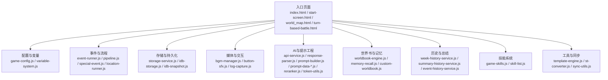
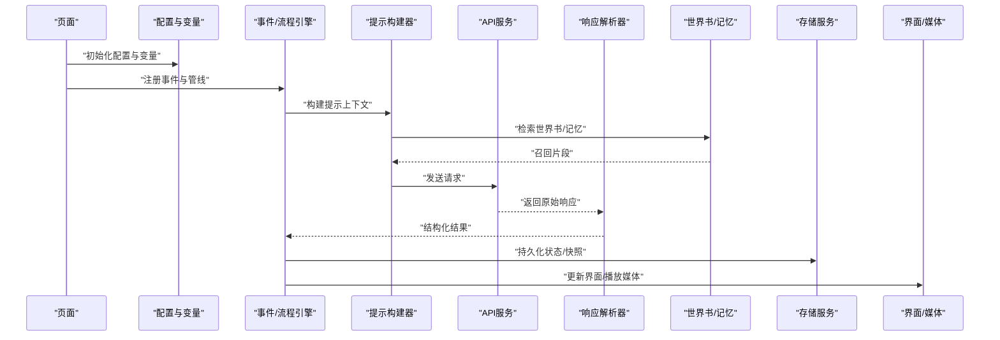
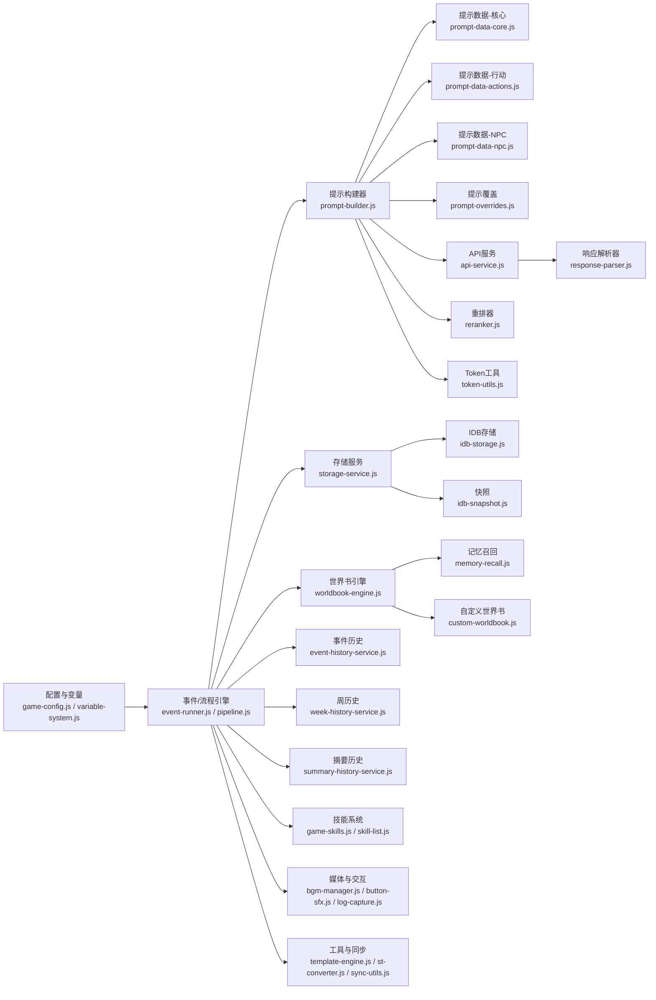
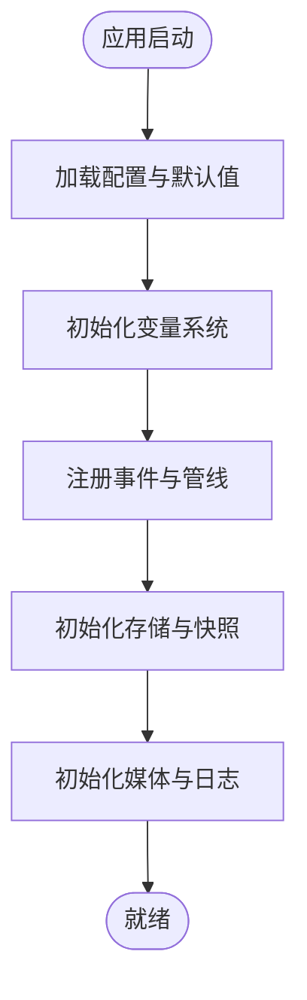
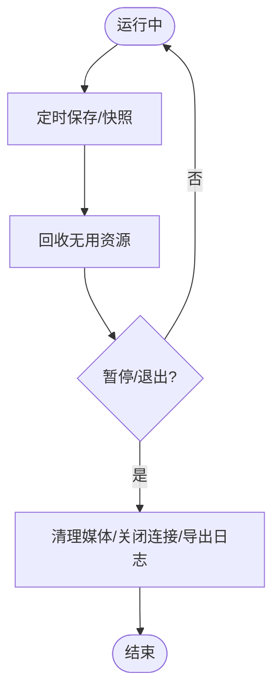

# 核心系统

<cite>
**本文引用的文件**   
- [index.html](file://index.html)
- [start-screen.html](file://start-screen.html)
- [world_map.html](file://world_map.html)
- [turn-based-battle.html](file://turn-based-battle.html)
- [module/game-config.js](file://module/game-config.js)
- [module/variable-system.js](file://module/variable-system.js)
- [module/event-runner.js](file://module/event-runner.js)
- [module/pipeline.js](file://module/pipeline.js)
- [module/storage-service.js](file://module/storage-service.js)
- [module/idb-storage.js](file://module/idb-storage.js)
- [module/idb-snapshot.js](file://module/idb-snapshot.js)
- [module/bgm-manager.js](file://module/bgm-manager.js)
- [module/button-sfx.js](file://module/button-sfx.js)
- [module/log-capture.js](file://module/log-capture.js)
- [module/api-service.js](file://module/api-service.js)
- [module/response-parser.js](file://module/response-parser.js)
- [module/template-engine.js](file://module/template-engine.js)
- [module/worldbook-engine.js](file://module/worldbook-engine.js)
- [module/memory-recall.js](file://module/memory-recall.js)
- [module/special-event.js](file://module/special-event.js)
- [module/location-runner.js](file://module/location-runner.js)
- [module/week-history-service.js](file://module/week-history-service.js)
- [module/summary-history-service.js](file://module/summary-history-service.js)
- [module/event-history-service.js](file://module/event-history-service.js)
- [module/prompt-builder.js](file://module/prompt-builder.js)
- [module/prompt-data-core.js](file://module/prompt-data-core.js)
- [module/prompt-data-actions.js](file://module/prompt-data-actions.js)
- [module/prompt-data-npc.js](file://module/prompt-data-npc.js)
- [module/prompt-overrides.js](file://module/prompt-overrides.js)
- [module/reranker.js](file://module/reranker.js)
- [module/token-utils.js](file://module/token-utils.js)
- [module/custom-worldbook.js](file://module/custom-worldbook.js)
- [module/sync-utils.js](file://module/sync-utils.js)
- [module/st-converter.js](file://module/st-converter.js)
- [module/game-skills.js](file://module/game-skills.js)
- [module/skill-list.js](file://module/skill-list.js)
</cite>

## 目录
1. [简介](#简介)
2. [项目结构](#项目结构)
3. [核心组件](#核心组件)
4. [架构总览](#架构总览)
5. [详细组件分析](#详细组件分析)
6. [依赖关系分析](#依赖关系分析)
7. [性能考虑](#性能考虑)
8. [故障排查指南](#故障排查指南)
9. [结论](#结论)
10. [附录](#附录)

## 简介
本文件面向“姬侠传”游戏的核心系统，聚焦于引擎工作原理与扩展点。内容覆盖：
- 游戏循环、状态管理与事件驱动机制
- 变量系统与配置管理
- 流程控制与状态持久化（含快照）
- 各子系统协作与数据传递
- 初始化、运行时管理与资源清理
- 核心API使用示例与最佳实践
- 为开发者提供深入理解与扩展指导

## 项目结构
本项目采用模块化前端架构，HTML页面作为入口，业务逻辑集中在 module 目录下的独立脚本中。关键入口与模块职责如下：
- 入口页面：index.html、start-screen.html、world_map.html、turn-based-battle.html
- 配置与变量：game-config.js、variable-system.js
- 事件与流程：event-runner.js、pipeline.js、special-event.js、location-runner.js
- 存储与持久化：storage-service.js、idb-storage.js、idb-snapshot.js
- 媒体与交互：bgm-manager.js、button-sfx.js、log-capture.js
- AI与提示工程：api-service.js、response-parser.js、prompt-builder.js、prompt-data-*.js、reranker.js、token-utils.js
- 世界书与记忆：worldbook-engine.js、memory-recall.js、custom-worldbook.js
- 历史与总结：week-history-service.js、summary-history-service.js、event-history-service.js
- 技能系统：game-skills.js、skill-list.js
- 工具与同步：template-engine.js、st-converter.js、sync-utils.js

图表来源
- [index.html](file://index.html)
- [start-screen.html](file://start-screen.html)
- [world_map.html](file://world_map.html)
- [turn-based-battle.html](file://turn-based-battle.html)
- [module/game-config.js](file://module/game-config.js)
- [module/variable-system.js](file://module/variable-system.js)
- [module/event-runner.js](file://module/event-runner.js)
- [module/pipeline.js](file://module/pipeline.js)
- [module/storage-service.js](file://module/storage-service.js)
- [module/idb-storage.js](file://module/idb-storage.js)
- [module/idb-snapshot.js](file://module/idb-snapshot.js)
- [module/bgm-manager.js](file://module/bgm-manager.js)
- [module/button-sfx.js](file://module/button-sfx.js)
- [module/log-capture.js](file://module/log-capture.js)
- [module/api-service.js](file://module/api-service.js)
- [module/response-parser.js](file://module/response-parser.js)
- [module/prompt-builder.js](file://module/prompt-builder.js)
- [module/prompt-data-core.js](file://module/prompt-data-core.js)
- [module/prompt-data-actions.js](file://module/prompt-data-actions.js)
- [module/prompt-data-npc.js](file://module/prompt-data-npc.js)
- [module/prompt-overrides.js](file://module/prompt-overrides.js)
- [module/reranker.js](file://module/reranker.js)
- [module/token-utils.js](file://module/token-utils.js)
- [module/worldbook-engine.js](file://module/worldbook-engine.js)
- [module/memory-recall.js](file://module/memory-recall.js)
- [module/custom-worldbook.js](file://module/custom-worldbook.js)
- [module/week-history-service.js](file://module/week-history-service.js)
- [module/summary-history-service.js](file://module/summary-history-service.js)
- [module/event-history-service.js](file://module/event-history-service.js)
- [module/game-skills.js](file://module/game-skills.js)
- [module/skill-list.js](file://module/skill-list.js)
- [module/template-engine.js](file://module/template-engine.js)
- [module/st-converter.js](file://module/st-converter.js)
- [module/sync-utils.js](file://module/sync-utils.js)

章节来源
- [index.html](file://index.html)
- [start-screen.html](file://start-screen.html)
- [world_map.html](file://world_map.html)
- [turn-based-battle.html](file://turn-based-battle.html)
- [module/game-config.js](file://module/game-config.js)
- [module/variable-system.js](file://module/variable-system.js)
- [module/event-runner.js](file://module/event-runner.js)
- [module/pipeline.js](file://module/pipeline.js)
- [module/storage-service.js](file://module/storage-service.js)
- [module/idb-storage.js](file://module/idb-storage.js)
- [module/idb-snapshot.js](file://module/idb-snapshot.js)
- [module/bgm-manager.js](file://module/bgm-manager.js)
- [module/button-sfx.js](file://module/button-sfx.js)
- [module/log-capture.js](file://module/log-capture.js)
- [module/api-service.js](file://module/api-service.js)
- [module/response-parser.js](file://module/response-parser.js)
- [module/prompt-builder.js](file://module/prompt-builder.js)
- [module/prompt-data-core.js](file://module/prompt-data-core.js)
- [module/prompt-data-actions](file://module/prompt-data-actions.js)
- [module/prompt-data-npc.js](file://module/prompt-data-npc.js)
- [module/prompt-overrides.js](file://module/prompt-overrides.js)
- [module/reranker.js](file://module/reranker.js)
- [module/token-utils.js](file://module/token-utils.js)
- [module/worldbook-engine.js](file://module/worldbook-engine.js)
- [module/memory-recall.js](file://module/memory-recall.js)
- [module/custom-worldbook.js](file://module/custom-worldbook.js)
- [module/week-history-service.js](file://module/week-history-service.js)
- [module/summary-history-service.js](file://module/summary-history-service.js)
- [module/event-history-service.js](file://module/event-history-service.js)
- [module/game-skills.js](file://module/game-skills.js)
- [module/skill-list.js](file://module/skill-list.js)
- [module/template-engine.js](file://module/template-engine.js)
- [module/st-converter.js](file://module/st-converter.js)
- [module/sync-utils.js](file://module/sync-utils.js)

## 核心组件
本节概述核心子系统及其职责边界与交互方式。

- 配置与变量系统
  - 负责全局配置加载、默认值合并、运行时变量读写与变更通知
  - 典型职责：读取 game-config.js；维护 variable-system.js 中的命名空间与类型约束；在事件或流程节点中读写变量
- 事件与流程引擎
  - 以事件为中心驱动流程推进，支持条件分支、动作执行、跳转与回调
  - 典型职责：event-runner.js 解析并调度事件；pipeline.js 编排步骤；special-event.js 处理特殊剧情；location-runner.js 驱动地点相关流程
- 存储与持久化
  - 统一封装 IndexedDB 与本地存储，提供键值存取、批量写入、快照能力
  - 典型职责：storage-service.js 抽象接口；idb-storage.js 实现 IndexedDB；idb-snapshot.js 提供快照/回滚
- 媒体与交互
  - 管理背景音乐、音效播放与日志捕获
  - 典型职责：bgm-manager.js 控制音频生命周期；button-sfx.js 注入点击反馈；log-capture.js 收集运行期日志
- AI与提示工程
  - 构建提示词、调用外部 API、解析响应、重排与截断
  - 典型职责：prompt-builder.js 组装上下文；prompt-data-*.js 提供结构化数据；api-service.js 发起请求；response-parser.js 解析返回；reranker.js 排序；token-utils.js 统计与裁剪
- 世界书与记忆
  - 维护可扩展的世界知识、检索与召回、自定义条目
  - 典型职责：worldbook-engine.js 索引与查询；memory-recall.js 召回策略；custom-worldbook.js 动态扩展
- 历史与总结
  - 记录事件、周度进度与摘要，支撑长期一致性
  - 典型职责：event-history-service.js 事件历史；week-history-service.js 周维度汇总；summary-history-service.js 摘要生成与更新
- 技能系统
  - 定义技能列表、判定与效果执行
  - 典型职责：skill-list.js 定义技能元数据；game-skills.js 执行与结算
- 工具与同步
  - 模板渲染、格式转换、跨端同步等通用能力
  - 典型职责：template-engine.js 模板引擎；st-converter.js 存档转换；sync-utils.js 同步辅助

章节来源
- [module/game-config.js](file://module/game-config.js)
- [module/variable-system.js](file://module/variable-system.js)
- [module/event-runner.js](file://module/event-runner.js)
- [module/pipeline.js](file://module/pipeline.js)
- [module/special-event.js](file://module/special-event.js)
- [module/location-runner.js](file://module/location-runner.js)
- [module/storage-service.js](file://module/storage-service.js)
- [module/idb-storage.js](file://module/idb-storage.js)
- [module/idb-snapshot.js](file://module/idb-snapshot.js)
- [module/bgm-manager.js](file://module/bgm-manager.js)
- [module/button-sfx.js](file://module/button-sfx.js)
- [module/log-capture.js](file://module/log-capture.js)
- [module/api-service.js](file://module/api-service.js)
- [module/response-parser.js](file://module/response-parser.js)
- [module/prompt-builder.js](file://module/prompt-builder.js)
- [module/prompt-data-core.js](file://module/prompt-data-core.js)
- [module/prompt-data-actions.js](file://module/prompt-data-actions.js)
- [module/prompt-data-npc.js](file://module/prompt-data-npc.js)
- [module/prompt-overrides.js](file://module/prompt-overrides.js)
- [module/reranker.js](file://module/reranker.js)
- [module/token-utils.js](file://module/token-utils.js)
- [module/worldbook-engine.js](file://module/worldbook-engine.js)
- [module/memory-recall.js](file://module/memory-recall.js)
- [module/custom-worldbook.js](file://module/custom-worldbook.js)
- [module/week-history-service.js](file://module/week-history-service.js)
- [module/summary-history-service.js](file://module/summary-history-service.js)
- [module/event-history-service.js](file://module/event-history-service.js)
- [module/game-skills.js](file://module/game-skills.js)
- [module/skill-list.js](file://module/skill-list.js)
- [module/template-engine.js](file://module/template-engine.js)
- [module/st-converter.js](file://module/st-converter.js)
- [module/sync-utils.js](file://module/sync-utils.js)

## 架构总览
下图展示从页面初始化到事件驱动、AI交互、存储与UI更新的端到端流程。

图表来源
- [module/game-config.js](file://module/game-config.js)
- [module/variable-system.js](file://module/variable-system.js)
- [module/event-runner.js](file://module/event-runner.js)
- [module/pipeline.js](file://module/pipeline.js)
- [module/prompt-builder.js](file://module/prompt-builder.js)
- [module/api-service.js](file://module/api-service.js)
- [module/response-parser.js](file://module/response-parser.js)
- [module/worldbook-engine.js](file://module/worldbook-engine.js)
- [module/memory-recall.js](file://module/memory-recall.js)
- [module/storage-service.js](file://module/storage-service.js)
- [module/idb-storage.js](file://module/idb-storage.js)
- [module/idb-snapshot.js](file://module/idb-snapshot.js)
- [module/bgm-manager.js](file://module/bgm-manager.js)
- [module/button-sfx.js](file://module/button-sfx.js)

## 详细组件分析

### 配置与变量系统
- 设计要点
  - 配置分层：默认配置 + 用户覆盖 + 运行时修正
  - 变量命名空间：按模块划分，避免冲突
  - 类型校验与默认值：保障稳定性
  - 变更通知：事件驱动更新UI或下游系统
- 关键API（概念性说明）
  - 获取/设置变量：get/set
  - 批量读写：batchGet/batchSet
  - 监听变更：onVarChange
  - 重置与迁移：reset/migrate
- 最佳实践
  - 将易变数值放入变量系统，静态文本放入配置
  - 对关键变量增加校验与回退默认值
  - 通过事件订阅而非轮询感知变化

章节来源
- [module/game-config.js](file://module/game-config.js)
- [module/variable-system.js](file://module/variable-system.js)

### 事件与流程引擎
- 设计要点
  - 事件总线：统一注册、分发、优先级与去抖
  - 流程管线：顺序、并行、条件分支、重试与超时
  - 钩子与中间件：在关键阶段插入逻辑（如埋点、保存）
- 关键API（概念性说明）
  - 注册事件：on(event, handler)
  - 触发事件：emit(event, payload)
  - 管线编排：pipe(steps).run()
  - 条件与分支：when/if-else
- 最佳实践
  - 将长耗时操作放入异步步骤，避免阻塞主线程
  - 为每个步骤提供错误恢复路径
  - 使用幂等事件保证可重入与回放

章节来源
- [module/event-runner.js](file://module/event-runner.js)
- [module/pipeline.js](file://module/pipeline.js)
- [module/special-event.js](file://module/special-event.js)
- [module/location-runner.js](file://module/location-runner.js)

### 存储与持久化（含快照）
- 设计要点
  - 统一接口：KV、事务、批量、分页
  - 持久化后端：IndexedDB 为主，兼容降级
  - 快照机制：全量/增量快照、版本化、回滚
- 关键API（概念性说明）
  - 基本存取：put/get/del
  - 批量：multiPut/multiGet
  - 快照：snapshot/saveSnapshot/loadSnapshot/rollback
- 最佳实践
  - 大对象分片存储，避免单次写入过大
  - 定期自动快照，结合差异压缩
  - 失败重试与幂等写入

章节来源
- [module/storage-service.js](file://module/storage-service.js)
- [module/idb-storage.js](file://module/idb-storage.js)
- [module/idb-snapshot.js](file://module/idb-snapshot.js)

### AI与提示工程
- 设计要点
  - 提示构建：角色设定、世界书引用、对话历史、行动选项
  - 响应解析：结构化输出、容错与补全
  - 重排与截断：基于相关性/重要性排序，控制Token预算
- 关键API（概念性说明）
  - 构建提示：buildPrompt(context)
  - 调用API：callAPI(prompt)
  - 解析响应：parseResponse(raw)
  - 重排与裁剪：rerank(items), trimToBudget(text, budget)
- 最佳实践
  - 将世界书召回结果按需注入，避免上下文爆炸
  - 对模型输出进行严格校验与回退策略
  - 缓存常用片段，减少重复计算

章节来源
- [module/prompt-builder.js](file://module/prompt-builder.js)
- [module/prompt-data-core.js](file://module/prompt-data-core.js)
- [module/prompt-data-actions.js](file://module/prompt-data-actions.js)
- [module/prompt-data-npc.js](file://module/prompt-data-npc.js)
- [module/prompt-overrides.js](file://module/prompt-overrides.js)
- [module/api-service.js](file://module/api-service.js)
- [module/response-parser.js](file://module/response-parser.js)
- [module/reranker.js](file://module/reranker.js)
- [module/token-utils.js](file://module/token-utils.js)

### 世界书与记忆
- 设计要点
  - 索引结构：主题/实体/时间线多维索引
  - 召回策略：关键词+向量相似度混合
  - 自定义扩展：运行时追加条目与权重调整
- 关键API（概念性说明）
  - 添加条目：addEntry(entry)
  - 检索召回：recall(query, options)
  - 更新权重：updateWeight(id, delta)
- 最佳实践
  - 控制条目粒度，避免碎片化
  - 定期合并与去重，保持索引整洁
  - 对高价值信息提升权重，增强一致性

章节来源
- [module/worldbook-engine.js](file://module/worldbook-engine.js)
- [module/memory-recall.js](file://module/memory-recall.js)
- [module/custom-worldbook.js](file://module/custom-worldbook.js)

### 历史与总结
- 设计要点
  - 事件历史：不可变追加，支持回溯
  - 周度汇总：周期性聚合，便于概览
  - 摘要生成：压缩长历史，保留关键事实
- 关键API（概念性说明）
  - 记录事件：appendEvent(evt)
  - 生成周报：generateWeeklySummary()
  - 生成摘要：summarize(history, budget)
- 最佳实践
  - 对高频事件做合并与降噪
  - 摘要需保留因果链与关键决策
  - 历史与摘要分离存储，便于不同用途

章节来源
- [module/event-history-service.js](file://module/event-history-service.js)
- [module/week-history-service.js](file://module/week-history-service.js)
- [module/summary-history-service.js](file://module/summary-history-service.js)

### 技能系统
- 设计要点
  - 技能元数据：名称、冷却、消耗、效果描述
  - 执行流程：前置检查→消耗→效果→结算
  - 组合与派生：基础技能合成高级技能
- 关键API（概念性说明）
  - 注册技能：registerSkill(skill)
  - 执行技能：executeSkill(target, caster, context)
  - 查询可用：listAvailable(caster, context)
- 最佳实践
  - 将副作用最小化，确保可测试与可回放
  - 对复杂效果拆分为原子步骤
  - 使用常量与枚举避免魔法字符串

章节来源
- [module/skill-list.js](file://module/skill-list.js)
- [module/game-skills.js](file://module/game-skills.js)

### 媒体与交互
- 设计要点
  - 音频生命周期：预加载、播放、淡入淡出、并发控制
  - 音效反馈：按钮点击、成功/失败提示音
  - 日志采集：分级、过滤、导出
- 关键API（概念性说明）
  - 播放BGM：playBGM(track, loop)
  - 播放音效：playSFX(name)
  - 日志：info/warn/error/export
- 最佳实践
  - 根据场景切换BGM，避免重叠
  - 音效音量低于BGM，不干扰叙事
  - 日志脱敏，避免敏感信息泄露

章节来源
- [module/bgm-manager.js](file://module/bgm-manager.js)
- [module/button-sfx.js](file://module/button-sfx.js)
- [module/log-capture.js](file://module/log-capture.js)

### 工具与同步
- 设计要点
  - 模板引擎：占位符替换、条件渲染、循环
  - 存档转换：旧版格式到新版的迁移
  - 同步工具：多端一致性与冲突解决
- 关键API（概念性说明）
  - 渲染模板：render(template, data)
  - 转换存档：convertSt(oldData)
  - 同步：syncWithRemote(conflictResolver)
- 最佳实践
  - 模板尽量简单，复杂逻辑下沉至JS
  - 转换脚本幂等，支持多次运行
  - 同步时优先保留最新修改，必要时人工介入

章节来源
- [module/template-engine.js](file://module/template-engine.js)
- [module/st-converter.js](file://module/st-converter.js)
- [module/sync-utils.js](file://module/sync-utils.js)

## 依赖关系分析
下图展示核心模块间的直接依赖关系，有助于识别耦合点与潜在循环依赖。

图表来源
- [module/game-config.js](file://module/game-config.js)
- [module/variable-system.js](file://module/variable-system.js)
- [module/event-runner.js](file://module/event-runner.js)
- [module/pipeline.js](file://module/pipeline.js)
- [module/prompt-builder.js](file://module/prompt-builder.js)
- [module/prompt-data-core.js](file://module/prompt-data-core.js)
- [module/prompt-data-actions.js](file://module/prompt-data-actions.js)
- [module/prompt-data-npc.js](file://module/prompt-data-npc.js)
- [module/prompt-overrides.js](file://module/prompt-overrides.js)
- [module/api-service.js](file://module/api-service.js)
- [module/response-parser.js](file://module/response-parser.js)
- [module/reranker.js](file://module/reranker.js)
- [module/token-utils.js](file://module/token-utils.js)
- [module/storage-service.js](file://module/storage-service.js)
- [module/idb-storage.js](file://module/idb-storage.js)
- [module/idb-snapshot.js](file://module/idb-snapshot.js)
- [module/worldbook-engine.js](file://module/worldbook-engine.js)
- [module/memory-recall.js](file://module/memory-recall.js)
- [module/custom-worldbook.js](file://module/custom-worldbook.js)
- [module/event-history-service.js](file://module/event-history-service.js)
- [module/week-history-service.js](file://module/week-history-service.js)
- [module/summary-history-service.js](file://module/summary-history-service.js)
- [module/game-skills.js](file://module/game-skills.js)
- [module/skill-list.js](file://module/skill-list.js)
- [module/bgm-manager.js](file://module/bgm-manager.js)
- [module/button-sfx.js](file://module/button-sfx.js)
- [module/log-capture.js](file://module/log-capture.js)
- [module/template-engine.js](file://module/template-engine.js)
- [module/st-converter.js](file://module/st-converter.js)
- [module/sync-utils.js](file://module/sync-utils.js)

## 性能考虑
- 事件与管线
  - 避免在主线程执行长时间任务，使用队列与分片
  - 对高频事件进行节流/防抖
- 存储与快照
  - 批量写入优于逐条写入
  - 增量快照配合压缩，降低I/O压力
- AI与提示
  - 控制上下文大小，仅注入必要世界书片段
  - 对响应解析结果缓存，减少重复计算
- 媒体
  - 预加载常用音频，按需释放
  - 限制同时播放的音效数量

[本节为通用建议，无需代码来源]

## 故障排查指南
- 常见问题定位
  - 配置未生效：检查默认值覆盖顺序与变量命名空间
  - 事件未触发：确认注册时机与事件名一致性
  - 存储失败：检查权限、存储空间与事务回滚
  - AI无响应：查看网络状态、Token预算与解析容错
  - 世界书召回不准：调整权重与召回策略参数
- 诊断工具
  - 日志采集：分级输出、导出与分析
  - 快照对比：比较前后状态差异
  - 提示调试：打印构建后的完整提示与召回片段

章节来源
- [module/log-capture.js](file://module/log-capture.js)
- [module/idb-snapshot.js](file://module/idb-snapshot.js)
- [module/prompt-builder.js](file://module/prompt-builder.js)
- [module/memory-recall.js](file://module/memory-recall.js)

## 结论
本系统以事件驱动为核心，围绕配置与变量、流程管线、AI提示工程、世界书与记忆、存储与快照、历史与总结、技能系统以及媒体与工具模块协同工作。通过清晰的职责边界与标准化API，既保证了系统的可维护性与可扩展性，也为开发者提供了丰富的扩展点。建议在新增功能时遵循现有模式，优先复用已有模块能力，并通过事件与变量系统进行解耦。

[本节为总结性内容，无需代码来源]

## 附录

### 系统初始化流程（概念图）

[此图为概念流程，不映射具体源码，故无图表来源]

### 运行时管理与资源清理（概念图）

[此图为概念流程，不映射具体源码，故无图表来源]

### 核心API使用示例与最佳实践（概念性说明）
- 配置与变量
  - 示例：在事件处理器中读取玩家属性并更新UI
  - 最佳实践：对关键属性设置默认值与校验
- 事件与流程
  - 示例：在用户点击后触发“开始战斗”事件，进入战斗流程
  - 最佳实践：为每个步骤提供错误恢复与日志
- 存储与快照
  - 示例：每回合结束后保存关键状态，并在异常时回滚
  - 最佳实践：使用批量写入与事务
- AI与提示
  - 示例：构建包含世界书召回结果的提示，调用API并解析
  - 最佳实践：控制Token预算，解析失败时回退到默认分支
- 世界书与记忆
  - 示例：在对话中追加新事实，并提升重要实体权重
  - 最佳实践：定期合并与去重
- 历史与总结
  - 示例：每周生成摘要，用于快速回顾
  - 最佳实践：摘要保留因果链与关键决策
- 技能系统
  - 示例：玩家选择技能后，执行前置检查与效果结算
  - 最佳实践：将副作用最小化，确保可回放
- 媒体与交互
  - 示例：根据场景切换BGM，并在关键操作播放音效
  - 最佳实践：控制并发与音量平衡
- 工具与同步
  - 示例：渲染模板生成剧情文本，转换旧存档为新格式
  - 最佳实践：模板简洁，转换脚本幂等

[本节为概念性说明，不映射具体源码，故无章节来源]