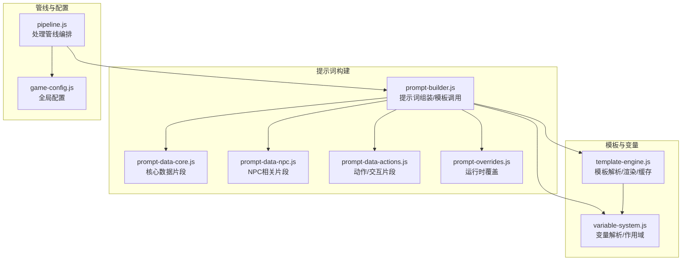
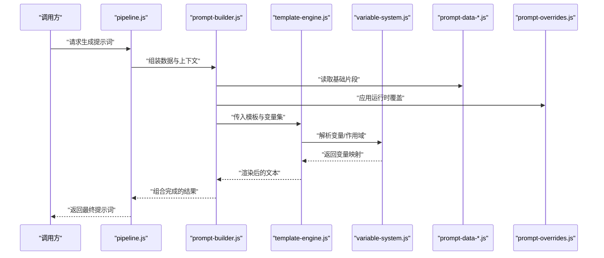
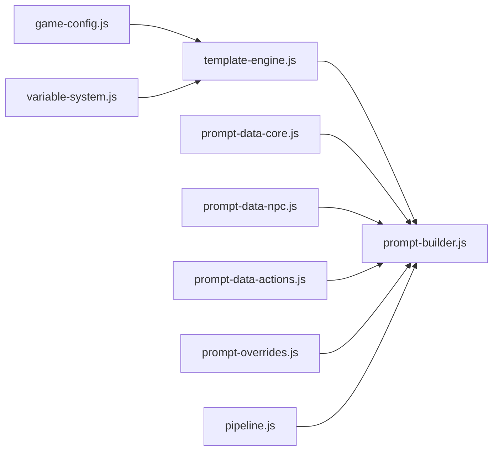
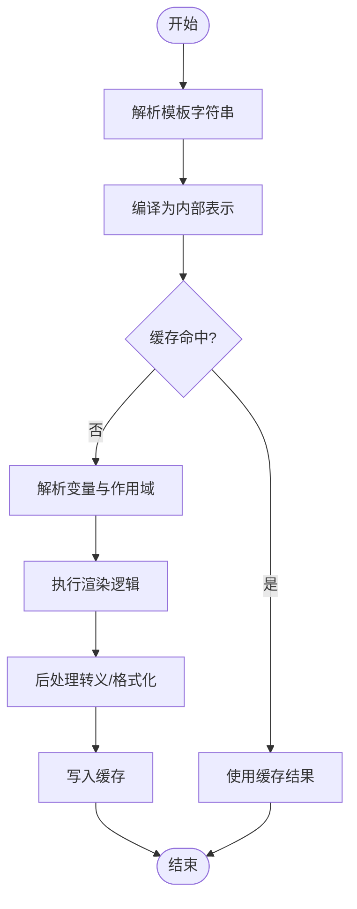

# 模板引擎系统

<cite>
**本文引用的文件**   
- [template-engine.js](file://module/template-engine.js)
- [prompt-builder.js](file://module/prompt-builder.js)
- [variable-system.js](file://module/variable-system.js)
- [pipeline.js](file://module/pipeline.js)
- [game-config.js](file://module/game-config.js)
- [prompt-data-core.js](file://module/prompt-data-core.js)
- [prompt-data-npc.js](file://module/prompt-data-npc.js)
- [prompt-data-actions.js](file://module/prompt-data-actions.js)
- [prompt-overrides.js](file://module/prompt-overrides.js)
</cite>

## 目录
1. [简介](#简介)
2. [项目结构](#项目结构)
3. [核心组件](#核心组件)
4. [架构总览](#架构总览)
5. [详细组件分析](#详细组件分析)
6. [依赖关系分析](#依赖关系分析)
7. [性能与缓存策略](#性能与缓存策略)
8. [模板语法与渲染机制](#模板语法与渲染机制)
9. [与提示词构建器的集成](#与提示词构建器的集成)
10. [开发规范与扩展指南](#开发规范与扩展指南)
11. [调试技巧与常见问题](#调试技巧与常见问题)
12. [结论](#结论)

## 简介
本文件面向内容创作者与开发者，系统化阐述“姬侠传”中的模板引擎系统。文档覆盖设计原理、渲染流程、模板语法（变量插值、条件渲染）、缓存与性能优化、与提示词构建器的集成方式（动态内容与上下文注入），并提供开发规范、自定义标签扩展方法与调试排障建议，帮助读者快速上手并高效产出高质量剧情与对话内容。

## 项目结构
围绕模板引擎的核心代码位于 module 目录下，关键文件包括：
- template-engine.js：模板解析、编译、渲染与缓存
- variable-system.js：变量解析与作用域管理
- prompt-builder.js：提示词组装与模板调用入口
- pipeline.js：整体处理管线，串联数据准备、模板渲染与后处理
- game-config.js：全局配置项（如是否启用缓存、默认分隔符等）
- prompt-data-*.js：不同来源的提示词数据片段
- prompt-overrides.js：运行时覆盖与优先级控制

图表来源
- [template-engine.js](file://module/template-engine.js)
- [variable-system.js](file://module/variable-system.js)
- [prompt-builder.js](file://module/prompt-builder.js)
- [prompt-data-core.js](file://module/prompt-data-core.js)
- [prompt-data-npc.js](file://module/prompt-data-npc.js)
- [prompt-data-actions.js](file://module/prompt-data-actions.js)
- [prompt-overrides.js](file://module/prompt-overrides.js)
- [pipeline.js](file://module/pipeline.js)
- [game-config.js](file://module/game-config.js)

章节来源
- [template-engine.js](file://module/template-engine.js)
- [variable-system.js](file://module/variable-system.js)
- [prompt-builder.js](file://module/prompt-builder.js)
- [pipeline.js](file://module/pipeline.js)
- [game-config.js](file://module/game-config.js)
- [prompt-data-core.js](file://module/prompt-data-core.js)
- [prompt-data-npc.js](file://module/prompt-data-npc.js)
- [prompt-data-actions.js](file://module/prompt-data-actions.js)
- [prompt-overrides.js](file://module/prompt-overrides.js)

## 核心组件
- 模板引擎（template-engine.js）
  - 负责模板字符串的解析、编译为可执行渲染函数、变量替换、条件分支与循环、内置过滤器与辅助函数、结果拼接与输出。
  - 提供缓存层，避免重复解析与编译带来的开销。
- 变量系统（variable-system.js）
  - 维护变量作用域链、命名空间、默认值与缺失处理、类型转换与格式化。
  - 支持从游戏状态、用户输入、外部数据源注入变量。
- 提示词构建器（prompt-builder.js）
  - 聚合多来源数据片段，按规则组合成最终提示词；在需要时调用模板引擎进行渲染。
  - 负责将上下文信息（角色、地点、事件、时间等）注入到模板变量中。
- 管线（pipeline.js）
  - 编排数据准备、模板渲染、后处理与日志记录等阶段，保证可扩展与可观测性。
- 配置（game-config.js）
  - 集中管理模板引擎开关、缓存策略、分隔符、错误处理模式等全局选项。

章节来源
- [template-engine.js](file://module/template-engine.js)
- [variable-system.js](file://module/variable-system.js)
- [prompt-builder.js](file://module/prompt-builder.js)
- [pipeline.js](file://module/pipeline.js)
- [game-config.js](file://module/game-config.js)

## 架构总览
模板引擎作为渲染内核，被提示词构建器按需调用；变量系统为其提供数据支撑；管线统一调度各模块；配置决定行为与性能特征。

图表来源
- [pipeline.js](file://module/pipeline.js)
- [prompt-builder.js](file://module/prompt-builder.js)
- [template-engine.js](file://module/template-engine.js)
- [variable-system.js](file://module/variable-system.js)
- [prompt-data-core.js](file://module/prompt-data-core.js)
- [prompt-data-npc.js](file://module/prompt-data-npc.js)
- [prompt-data-actions.js](file://module/prompt-data-actions.js)
- [prompt-overrides.js](file://module/prompt-overrides.js)

## 详细组件分析

### 模板引擎（template-engine.js）
- 功能要点
  - 模板解析：识别占位符、控制流标记、过滤器与辅助函数调用。
  - 编译期优化：将模板转换为内部表示或函数，减少运行时判断。
  - 渲染期执行：基于变量映射填充内容，支持嵌套作用域与短路求值。
  - 缓存策略：对已解析/编译的模板进行缓存，命中则直接复用。
  - 错误处理：捕获未定义变量、语法错误、过滤器异常，提供回退值或警告。
- 关键接口（概念说明）
  - 加载与注册：注册自定义标签、过滤器、辅助函数。
  - 渲染入口：接收模板字符串与变量对象，返回渲染结果。
  - 缓存操作：获取/设置/清空缓存，支持按键名或前缀管理。
- 复杂度与性能
  - 解析与编译通常为 O(n)（n 为模板长度）。
  - 渲染阶段受变量查找深度与控制流复杂度影响，合理的作用域与缓存可显著降低开销。
- 扩展点
  - 自定义标签：通过注册表添加新指令，实现业务语义化片段。
  - 过滤器：对变量值进行格式化、过滤、转换。
  - 辅助函数：暴露通用工具方法给模板使用。

章节来源
- [template-engine.js](file://module/template-engine.js)

### 变量系统（variable-system.js）
- 功能要点
  - 作用域链：支持多层级变量环境，优先最近作用域。
  - 命名空间：以点号路径访问深层属性，支持安全访问与默认值。
  - 类型与格式：数字、布尔、日期、富文本等类型的自动处理与格式化。
  - 缺失处理：未定义变量的回退策略（空串、默认值、错误抛出）。
- 性能考量
  - 变量查找采用哈希映射，平均 O(1)。
  - 批量注入与合并可减少多次查找成本。
- 扩展点
  - 自定义解析器：针对特定数据类型或来源（如网络、本地存储）的变量解析。
  - 钩子：在变量解析前后插入逻辑（如脱敏、审计）。

章节来源
- [variable-system.js](file://module/variable-system.js)

### 提示词构建器（prompt-builder.js）
- 功能要点
  - 数据聚合：从 core/npc/actions 等数据模块收集片段。
  - 上下文注入：将当前场景、角色、历史、偏好等注入变量系统。
  - 模板调用：根据策略选择模板并渲染，必要时进行二次拼装。
  - 覆盖机制：允许运行时覆盖默认片段或变量。
- 与模板引擎协作
  - 构建器负责“组装”，模板引擎负责“渲染”。两者解耦，便于测试与替换。
- 扩展点
  - 新增数据源：实现新的 prompt-data-* 模块并在构建器中注册。
  - 覆盖策略：在 prompt-overrides.js 中定义覆盖规则与优先级。

章节来源
- [prompt-builder.js](file://module/prompt-builder.js)
- [prompt-data-core.js](file://module/prompt-data-core.js)
- [prompt-data-npc.js](file://module/prompt-data-npc.js)
- [prompt-data-actions.js](file://module/prompt-data-actions.js)
- [prompt-overrides.js](file://module/prompt-overrides.js)

### 管线（pipeline.js）
- 功能要点
  - 阶段编排：数据准备 → 模板渲染 → 后处理（校验、统计、日志）。
  - 错误传播：捕获异常并上报，支持降级策略。
  - 可观测性：记录关键指标（耗时、命中率、失败率）。
- 扩展点
  - 中间件式插件：在任意阶段插入自定义逻辑。

章节来源
- [pipeline.js](file://module/pipeline.js)

### 配置（game-config.js）
- 功能要点
  - 模板开关：是否启用模板引擎、是否开启缓存。
  - 行为参数：分隔符、默认值策略、错误模式（静默/告警/抛错）。
  - 性能参数：缓存大小上限、过期策略、并发限制。
- 扩展点
  - 环境区分：开发/生产环境的不同配置。

章节来源
- [game-config.js](file://module/game-config.js)

## 依赖关系分析
- 耦合度
  - 模板引擎仅依赖变量系统与配置，保持低耦合。
  - 提示词构建器依赖多个数据模块与覆盖模块，属于高内聚的业务编排层。
- 间接依赖
  - 管线通过构建器间接依赖所有数据模块与模板引擎。
- 潜在环依赖
  - 应避免在数据模块中反向引用构建器或模板引擎，防止循环依赖。

图表来源
- [template-engine.js](file://module/template-engine.js)
- [variable-system.js](file://module/variable-system.js)
- [prompt-builder.js](file://module/prompt-builder.js)
- [prompt-data-core.js](file://module/prompt-data-core.js)
- [prompt-data-npc.js](file://module/prompt-data-npc.js)
- [prompt-data-actions.js](file://module/prompt-data-actions.js)
- [prompt-overrides.js](file://module/prompt-overrides.js)
- [pipeline.js](file://module/pipeline.js)
- [game-config.js](file://module/game-config.js)

章节来源
- [template-engine.js](file://module/template-engine.js)
- [variable-system.js](file://module/variable-system.js)
- [prompt-builder.js](file://module/prompt-builder.js)
- [prompt-data-core.js](file://module/prompt-data-core.js)
- [prompt-data-npc.js](file://module/prompt-data-npc.js)
- [prompt-data-actions.js](file://module/prompt-data-actions.js)
- [prompt-overrides.js](file://module/prompt-overrides.js)
- [pipeline.js](file://module/pipeline.js)
- [game-config.js](file://module/game-config.js)

## 性能与缓存策略
- 模板缓存
  - 键策略：基于模板原文或规范化后的模板指纹。
  - 生命周期：LRU 或 TTL 过期，结合内存占用监控。
  - 失效策略：当模板更新或配置变更时主动清理对应缓存。
- 变量解析优化
  - 预计算常用变量，减少重复查找。
  - 批量合并作用域，避免多次遍历。
- 渲染优化
  - 短路求值：在条件分支中尽早退出。
  - 惰性求值：仅在需要时计算复杂表达式。
- 监控与调优
  - 记录缓存命中率、解析耗时、渲染耗时。
  - 对热点模板进行专项优化（拆分、抽取公共片段）。

章节来源
- [template-engine.js](file://module/template-engine.js)
- [variable-system.js](file://module/variable-system.js)
- [game-config.js](file://module/game-config.js)

## 模板语法与渲染机制
- 变量插值
  - 基本插值：在模板中使用占位符引用变量，支持点号路径访问。
  - 默认值：当变量缺失时使用默认值或空串。
  - 类型转换：自动将数值、布尔、日期等转换为期望格式。
- 条件渲染
  - if/else 分支：根据变量布尔值或比较结果决定是否渲染某段内容。
  - 嵌套条件：支持多层嵌套，注意可读性与性能。
- 循环与列表
  - for 循环：遍历数组或对象集合，支持索引与迭代控制。
  - 空集合处理：无数据时渲染占位或跳过。
- 过滤器与辅助函数
  - 过滤器：对变量值进行格式化、截取、转义等。
  - 辅助函数：提供通用能力（如时间格式化、随机选择、拼接）。
- 自定义标签
  - 标签注册：在引擎中注册新指令，实现业务语义化片段。
  - 参数传递：支持位置参数与命名参数。
  - 作用域继承：自定义标签可访问父作用域变量。
- 渲染流程（概念图）

[此图为概念流程图，不直接映射具体源码文件]

## 与提示词构建器的集成
- 集成方式
  - 构建器负责数据准备与上下文注入，模板引擎负责渲染。
  - 通过变量系统将运行时上下文（角色、地点、事件、偏好）注入模板。
- 动态内容生成
  - 根据玩家选择、NPC 状态、世界书条目动态生成提示词片段。
  - 使用条件渲染与循环组织大量可选内容。
- 上下文注入
  - 核心上下文：时间、地点、天气、主角状态。
  - NPC 上下文：好感度、记忆、近期互动。
  - 动作上下文：可用行动、技能、资源。
- 覆盖与优先级
  - 运行时覆盖：通过 prompt-overrides.js 调整默认片段或变量。
  - 优先级：覆盖 > 运行时注入 > 默认数据。

章节来源
- [prompt-builder.js](file://module/prompt-builder.js)
- [variable-system.js](file://module/variable-system.js)
- [prompt-data-core.js](file://module/prompt-data-core.js)
- [prompt-data-npc.js](file://module/prompt-data-npc.js)
- [prompt-data-actions.js](file://module/prompt-data-actions.js)
- [prompt-overrides.js](file://module/prompt-overrides.js)

## 开发规范与扩展指南
- 模板编写规范
  - 命名清晰：变量与标签名称应表达业务含义。
  - 模块化：将大模板拆分为小片段，提高复用与维护性。
  - 安全性：对用户输入进行转义与校验，避免注入风险。
- 自定义标签扩展
  - 注册流程：在引擎中注册标签处理器，定义参数与渲染逻辑。
  - 作用域：确保标签能访问必要上下文，避免隐式依赖。
  - 测试：为每个自定义标签编写用例，覆盖边界情况。
- 过滤器与辅助函数
  - 单一职责：每个过滤器只做一件事，易于组合。
  - 幂等性：相同输入产生相同输出，便于缓存。
- 版本与兼容性
  - 向后兼容：新增字段或标签时保留旧版行为。
  - 迁移脚本：提供从旧模板到新模板的自动迁移工具。

章节来源
- [template-engine.js](file://module/template-engine.js)
- [variable-system.js](file://module/variable-system.js)

## 调试技巧与常见问题
- 调试技巧
  - 启用详细日志：记录模板解析、变量解析、渲染过程的关键步骤。
  - 断点与追踪：在关键函数处设置断点，观察变量变化。
  - 最小复现：提取问题模板与变量，构造最小用例定位问题。
- 常见问题
  - 变量未定义：检查作用域链与注入顺序，确认命名空间正确。
  - 条件不生效：验证布尔值与比较逻辑，注意类型转换。
  - 循环性能差：减少复杂表达式，提前过滤数据。
  - 缓存不一致：确认缓存键策略与失效时机，避免脏读。
- 故障恢复
  - 降级策略：渲染失败时返回默认文本或空片段。
  - 错误上报：记录错误堆栈与上下文，便于后续分析。

章节来源
- [template-engine.js](file://module/template-engine.js)
- [variable-system.js](file://module/variable-system.js)
- [pipeline.js](file://module/pipeline.js)

## 结论
模板引擎系统通过清晰的职责划分与良好的扩展点，为“姬侠传”提供了灵活高效的提示词生成能力。配合变量系统与构建器，可实现丰富的动态内容与上下文注入；借助缓存与性能优化，保障在高负载下的稳定表现。遵循开发规范与调试实践，可显著提升模板质量与开发效率。