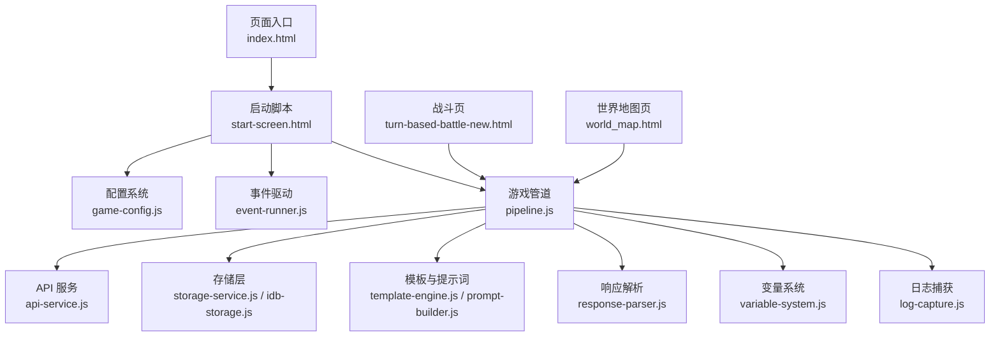
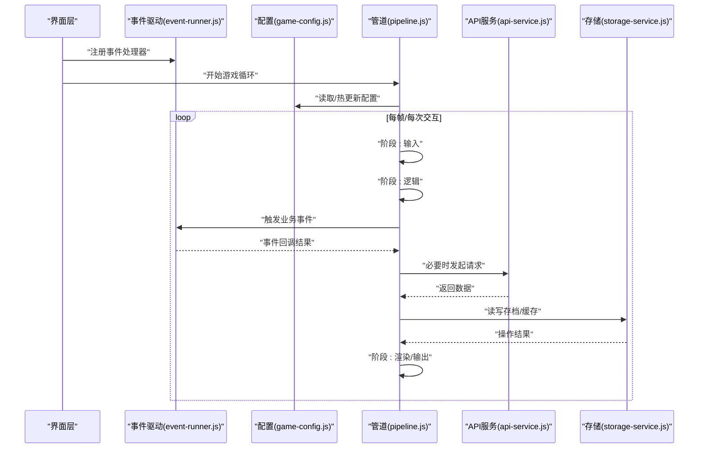
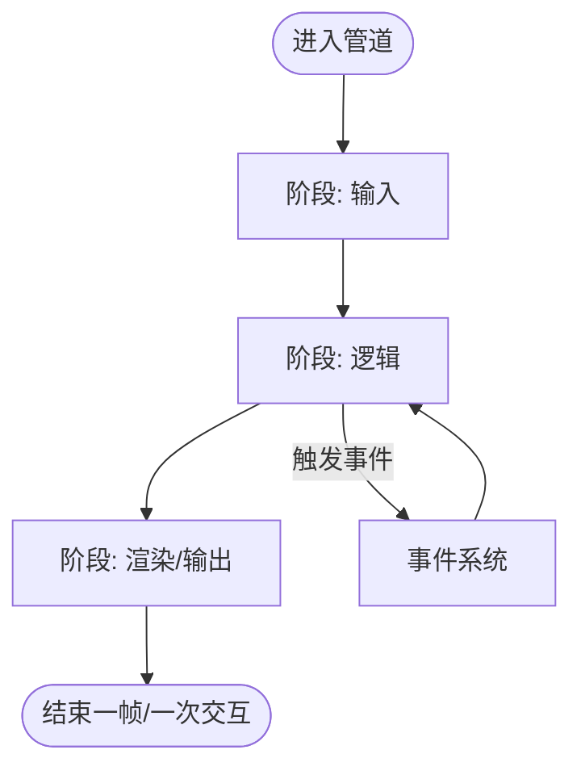
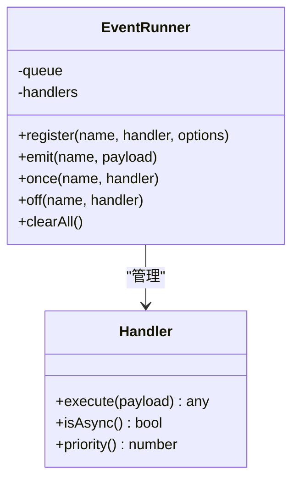
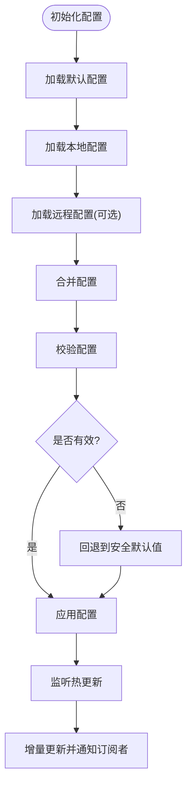
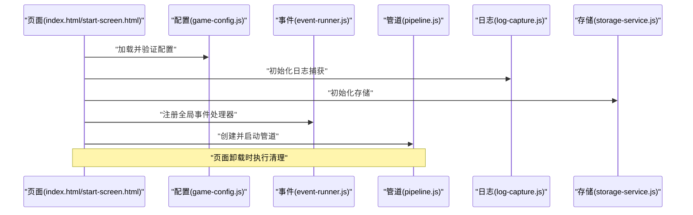
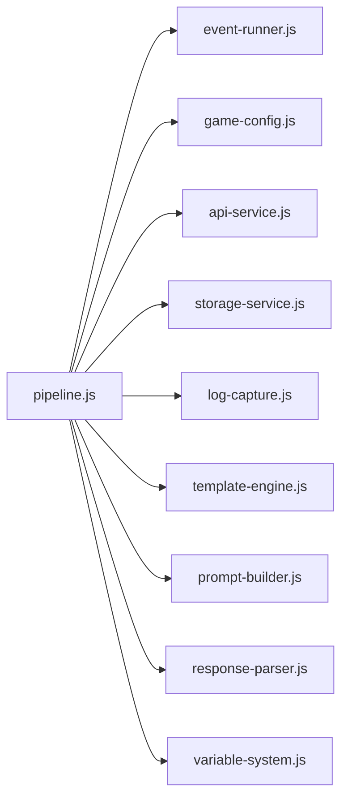

# 游戏引擎系统

<cite>
**本文引用的文件**   
- [pipeline.js](file://module/pipeline.js)
- [event-runner.js](file://module/event-runner.js)
- [game-config.js](file://module/game-config.js)
- [index.html](file://index.html)
- [start-screen.html](file://start-screen.html)
- [turn-based-battle-new.html](file://turn-based-battle-new.html)
- [world_map.html](file://world_map.html)
- [api-service.js](file://module/api-service.js)
- [storage-service.js](file://module/storage-service.js)
- [idb-storage.js](file://module/idb-storage.js)
- [log-capture.js](file://module/log-capture.js)
- [template-engine.js](file://module/template-engine.js)
- [prompt-builder.js](file://module/prompt-builder.js)
- [response-parser.js](file://module/response-parser.js)
- [variable-system.js](file://module/variable-system.js)
- [game-events.js](file://module/game-events.js)
</cite>

## 目录
1. [简介](#简介)
2. [项目结构](#项目结构)
3. [核心组件](#核心组件)
4. [架构总览](#架构总览)
5. [详细组件分析](#详细组件分析)
6. [依赖关系分析](#依赖关系分析)
7. [性能考量](#性能考量)
8. [故障排查指南](#故障排查指南)
9. [结论](#结论)
10. [附录](#附录)

## 简介
本文件面向“姬侠传”游戏引擎，聚焦以下目标：
- 深入解释游戏循环机制、状态管理架构与流程控制逻辑
- 详细说明 pipeline.js 中的游戏管道处理机制（阶段划分、数据流转、错误处理）
- 阐述 event-runner.js 的事件驱动架构（事件注册、触发机制、异步处理）
- 解释 game-config.js 的配置管理系统（配置加载、验证、热更新）
- 提供游戏初始化流程、运行时管理与资源清理的完整实现细节
- 给出核心 API 的使用示例与扩展开发指导

## 项目结构
本项目采用模块化组织方式，核心引擎能力集中在 module 目录下，页面入口位于根目录 HTML 文件。关键模块职责如下：
- pipeline.js：定义并执行游戏主循环与处理管线，串联输入、逻辑、渲染等阶段
- event-runner.js：提供事件总线与调度器，支持同步/异步事件处理
- game-config.js：集中管理配置项，负责加载、校验与热更新
- api-service.js：封装外部服务调用（如网络请求）
- storage-service.js / idb-storage.js：持久化存储抽象与 IndexedDB 实现
- log-capture.js：日志捕获与上报
- template-engine.js / prompt-builder.js / response-parser.js：提示词构建与响应解析
- variable-system.js：变量系统与上下文管理
- game-events.js：全局事件常量与默认事件流

图表来源
- [index.html](file://index.html)
- [start-screen.html](file://start-screen.html)
- [pipeline.js](file://module/pipeline.js)
- [event-runner.js](file://module/event-runner.js)
- [game-config.js](file://module/game-config.js)
- [api-service.js](file://module/api-service.js)
- [storage-service.js](file://module/storage-service.js)
- [idb-storage.js](file://module/idb-storage.js)
- [template-engine.js](file://module/template-engine.js)
- [prompt-builder.js](file://module/prompt-builder.js)
- [response-parser.js](file://module/response-parser.js)
- [variable-system.js](file://module/variable-system.js)
- [log-capture.js](file://module/log-capture.js)
- [turn-based-battle-new.html](file://turn-based-battle-new.html)
- [world_map.html](file://world_map.html)

章节来源
- [index.html](file://index.html)
- [start-screen.html](file://start-screen.html)
- [pipeline.js](file://module/pipeline.js)
- [event-runner.js](file://module/event-runner.js)
- [game-config.js](file://module/game-config.js)

## 核心组件
本节概述三大核心组件的职责与交互边界：
- 游戏管道（pipeline.js）
  - 将每帧或每次用户交互划分为若干阶段（如输入、逻辑、渲染、输出），按顺序执行
  - 维护运行期状态，提供阶段钩子与错误拦截
- 事件驱动（event-runner.js）
  - 提供事件注册、监听、触发与生命周期回调
  - 支持同步与异步处理器，具备优先级与去重策略
- 配置管理（game-config.js）
  - 统一加载配置源（本地、远程、默认值）
  - 提供校验、合并与热更新能力，确保运行时一致性

章节来源
- [pipeline.js](file://module/pipeline.js)
- [event-runner.js](file://module/event-runner.js)
- [game-config.js](file://module/game-config.js)

## 架构总览
整体架构围绕“事件驱动 + 管道处理”的双核模式展开：
- 事件驱动负责解耦业务模块，通过事件总线协调各子系统
- 管道负责在每一帧或每个交互周期内有序推进游戏状态
- 配置系统在启动时注入全局上下文，并在运行时按需热更新
- 存储与 API 作为基础设施，为业务提供数据与网络能力

图表来源
- [event-runner.js](file://module/event-runner.js)
- [game-config.js](file://module/game-config.js)
- [pipeline.js](file://module/pipeline.js)
- [api-service.js](file://module/api-service.js)
- [storage-service.js](file://module/storage-service.js)

## 详细组件分析

### 游戏管道（pipeline.js）
- 阶段划分
  - 输入阶段：收集用户输入与设备事件
  - 逻辑阶段：计算状态变更、AI、物理、规则判定
  - 渲染/输出阶段：生成画面、音效、UI 更新与日志
- 数据流转
  - 每阶段接收上一阶段的上下文对象，产出新的上下文
  - 中间状态可被事件系统广播，供其他模块消费
- 错误处理
  - 单阶段异常捕获与记录，避免中断整个循环
  - 提供重试、降级与恢复策略（例如回滚到上一帧快照）
- 扩展点
  - 新增阶段：在管道中插入自定义阶段，遵循统一的上下文契约
  - 钩子函数：在阶段前后执行监控、埋点或调试逻辑

图表来源
- [pipeline.js](file://module/pipeline.js)
- [event-runner.js](file://module/event-runner.js)

章节来源
- [pipeline.js](file://module/pipeline.js)

### 事件驱动（event-runner.js）
- 事件注册
  - 支持命名空间与通配符匹配
  - 可设置处理器优先级与一次性执行标记
- 触发机制
  - 同步触发：立即执行所有匹配的处理器
  - 异步触发：将任务放入队列，按序执行，避免阻塞主循环
- 异步处理
  - 处理器可返回 Promise，事件调度器等待完成后再继续
  - 支持超时与取消，防止长时间挂起
- 错误隔离
  - 单个处理器异常不影响其他处理器
  - 提供全局错误回调用于统一上报

图表来源
- [event-runner.js](file://module/event-runner.js)

章节来源
- [event-runner.js](file://module/event-runner.js)

### 配置管理（game-config.js）
- 配置加载
  - 合并默认配置、本地持久化与远程配置
  - 支持多环境（开发/测试/生产）切换
- 配置验证
  - 类型检查、必填字段校验、范围限制
  - 失败时回退到安全默认值并记录告警
- 热更新
  - 运行时动态更新配置项，通知订阅者
  - 对敏感配置提供版本对比与回滚
- 使用建议
  - 仅通过配置接口访问配置，避免直接修改内部对象
  - 对影响性能的配置项进行批量更新与节流

图表来源
- [game-config.js](file://module/game-config.js)

章节来源
- [game-config.js](file://module/game-config.js)

### 游戏初始化流程
- 页面入口
  - index.html 引入基础样式与脚本
  - start-screen.html 负责引导用户并启动引擎
- 启动步骤
  - 加载并验证配置（game-config.js）
  - 初始化事件系统（event-runner.js）
  - 创建并启动管道（pipeline.js）
  - 初始化存储与日志（storage-service.js / log-capture.js）
  - 准备模板与提示词（template-engine.js / prompt-builder.js）
- 资源清理
  - 页面卸载前停止管道、释放事件监听、关闭连接与定时器
  - 清理缓存与临时文件，避免内存泄漏

图表来源
- [index.html](file://index.html)
- [start-screen.html](file://start-screen.html)
- [game-config.js](file://module/game-config.js)
- [event-runner.js](file://module/event-runner.js)
- [pipeline.js](file://module/pipeline.js)
- [log-capture.js](file://module/log-capture.js)
- [storage-service.js](file://module/storage-service.js)

章节来源
- [index.html](file://index.html)
- [start-screen.html](file://start-screen.html)
- [game-config.js](file://module/game-config.js)
- [event-runner.js](file://module/event-runner.js)
- [pipeline.js](file://module/pipeline.js)
- [log-capture.js](file://module/log-capture.js)
- [storage-service.js](file://module/storage-service.js)

### 运行时管理与资源清理
- 运行时管理
  - 管道暂停/恢复：用于切后台、弹窗交互或调试
  - 帧率控制：根据设备性能动态调整
  - 状态快照：在关键节点保存上下文，便于回滚
- 资源清理
  - 事件监听器注销
  - 定时器与动画帧取消
  - 网络连接断开与存储句柄关闭
  - 大对象引用置空，辅助垃圾回收

章节来源
- [pipeline.js](file://module/pipeline.js)
- [event-runner.js](file://module/event-runner.js)
- [storage-service.js](file://module/storage-service.js)
- [idb-storage.js](file://module/idb-storage.js)

### 核心 API 使用示例与扩展开发指导
- 事件系统
  - 注册事件处理器：在模块初始化时绑定事件名与回调
  - 触发事件：在逻辑阶段或用户交互后发出事件
  - 异步处理器：返回 Promise 以等待耗时操作完成
- 配置系统
  - 读取配置：通过配置接口获取当前生效值
  - 订阅热更新：监听配置变更并刷新相关模块
  - 安全默认值：为缺失键提供兜底值
- 管道扩展
  - 新增阶段：在管道中插入自定义阶段，遵循上下文契约
  - 钩子函数：在阶段前后执行监控、埋点或调试逻辑
- 典型场景
  - 战斗页（turn-based-battle-new.html）：在逻辑阶段处理回合制规则，在渲染阶段更新战斗 UI
  - 世界地图（world_map.html）：在输入阶段处理导航，在逻辑阶段计算位置与事件

章节来源
- [event-runner.js](file://module/event-runner.js)
- [game-config.js](file://module/game-config.js)
- [pipeline.js](file://module/pipeline.js)
- [turn-based-battle-new.html](file://turn-based-battle-new.html)
- [world_map.html](file://world_map.html)

## 依赖关系分析
- 组件耦合
  - 管道依赖事件系统与配置系统，形成松耦合的业务编排
  - 事件系统独立于具体业务，仅关注分发与生命周期
  - 配置系统为全局唯一事实来源，避免分散的状态不一致
- 外部依赖
  - API 服务与存储层作为基础设施，被管道按需调用
  - 日志与模板/提示词工具为通用支撑能力
- 潜在风险
  - 避免在事件处理器中进行阻塞式 I/O
  - 配置热更新需保证幂等性与原子性

图表来源
- [pipeline.js](file://module/pipeline.js)
- [event-runner.js](file://module/event-runner.js)
- [game-config.js](file://module/game-config.js)
- [api-service.js](file://module/api-service.js)
- [storage-service.js](file://module/storage-service.js)
- [log-capture.js](file://module/log-capture.js)
- [template-engine.js](file://module/template-engine.js)
- [prompt-builder.js](file://module/prompt-builder.js)
- [response-parser.js](file://module/response-parser.js)
- [variable-system.js](file://module/variable-system.js)

章节来源
- [pipeline.js](file://module/pipeline.js)
- [event-runner.js](file://module/event-runner.js)
- [game-config.js](file://module/game-config.js)
- [api-service.js](file://module/api-service.js)
- [storage-service.js](file://module/storage-service.js)
- [log-capture.js](file://module/log-capture.js)
- [template-engine.js](file://module/template-engine.js)
- [prompt-builder.js](file://module/prompt-builder.js)
- [response-parser.js](file://module/response-parser.js)
- [variable-system.js](file://module/variable-system.js)

## 性能考量
- 事件处理器应轻量且非阻塞，复杂任务异步化
- 管道阶段尽量无副作用，减少不必要的 DOM 操作
- 配置热更新采用增量推送，避免全量重建
- 存储读写批量合并，降低 IndexedDB 压力
- 日志采样与分级，避免高频写入影响帧率

## 故障排查指南
- 常见问题
  - 事件未触发：检查事件名与命名空间是否正确，确认处理器已注册
  - 配置不生效：查看校验日志，确认默认值与远程配置优先级
  - 管道卡顿：定位耗时阶段，优化逻辑或拆分任务
  - 存储失败：检查权限与容量，必要时降级到内存缓存
- 诊断手段
  - 启用详细日志与埋点，记录关键阶段耗时
  - 使用快照对比定位状态差异
  - 对异步事件添加超时与取消机制

章节来源
- [log-capture.js](file://module/log-capture.js)
- [pipeline.js](file://module/pipeline.js)
- [event-runner.js](file://module/event-runner.js)
- [game-config.js](file://module/game-config.js)
- [storage-service.js](file://module/storage-service.js)
- [idb-storage.js](file://module/idb-storage.js)

## 结论
“姬侠传”游戏引擎以事件驱动与管道处理为核心，结合配置管理与基础设施服务，形成了高内聚、低耦合的可扩展架构。通过清晰的阶段划分、健壮的错误处理与完善的运行时管理，引擎能够稳定支撑多种玩法与页面形态。建议在扩展开发中遵循统一的上下文契约与异步最佳实践，以确保系统的可维护性与性能表现。

## 附录
- 相关页面与模块
  - 战斗页：turn-based-battle-new.html
  - 世界地图页：world_map.html
  - 全局事件常量：game-events.js
  - 变量系统：variable-system.js
  - 响应解析：response-parser.js
  - 提示词构建：prompt-builder.js
  - 模板引擎：template-engine.js
  - 索引数据库存储：idb-storage.js

章节来源
- [turn-based-battle-new.html](file://turn-based-battle-new.html)
- [world_map.html](file://world_map.html)
- [game-events.js](file://module/game-events.js)
- [variable-system.js](file://module/variable-system.js)
- [response-parser.js](file://module/response-parser.js)
- [prompt-builder.js](file://module/prompt-builder.js)
- [template-engine.js](file://module/template-engine.js)
- [idb-storage.js](file://module/idb-storage.js)