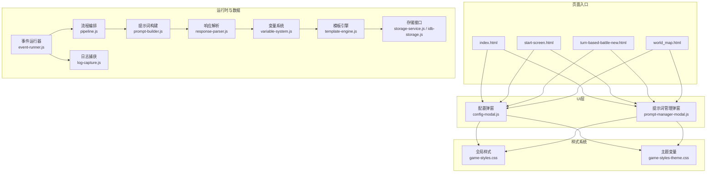
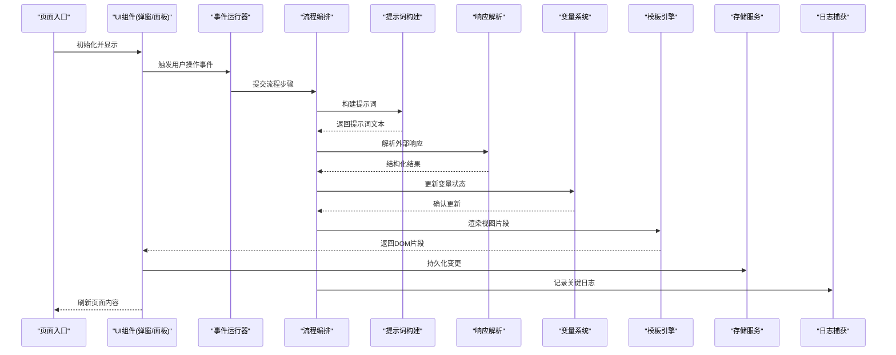
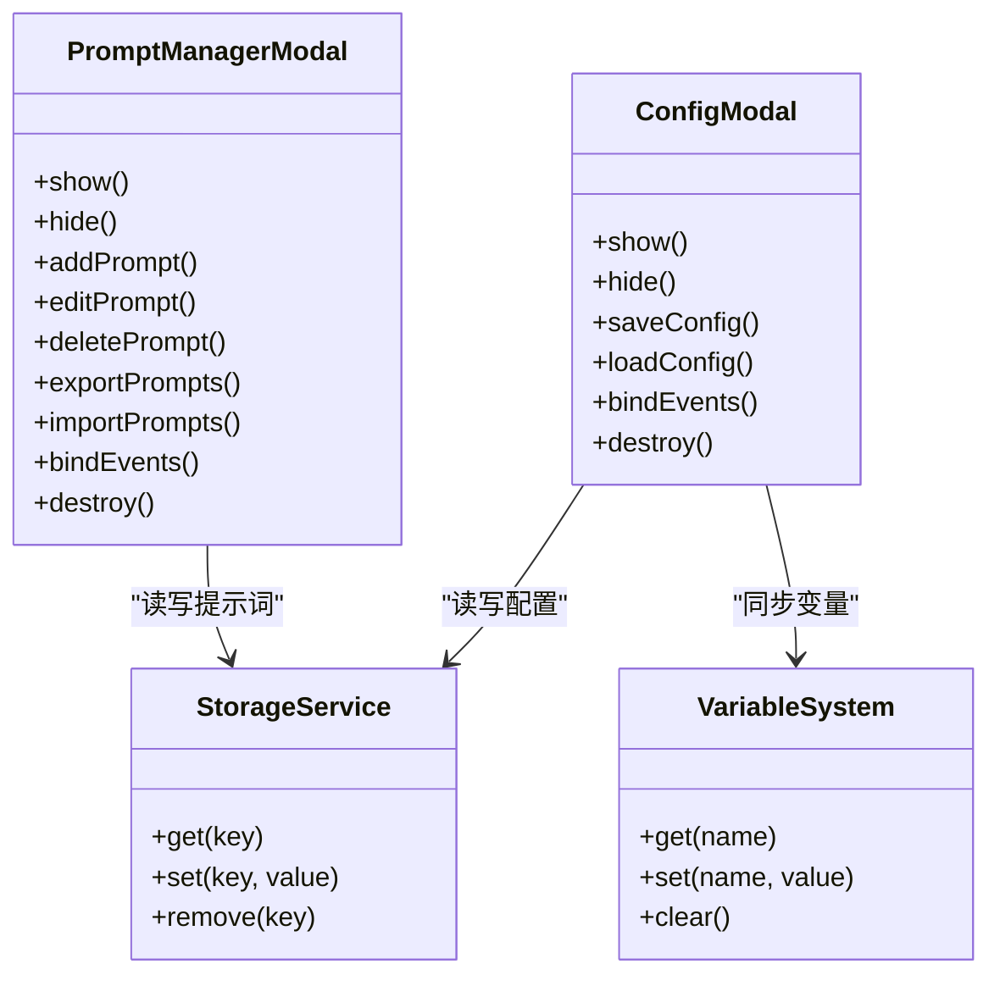
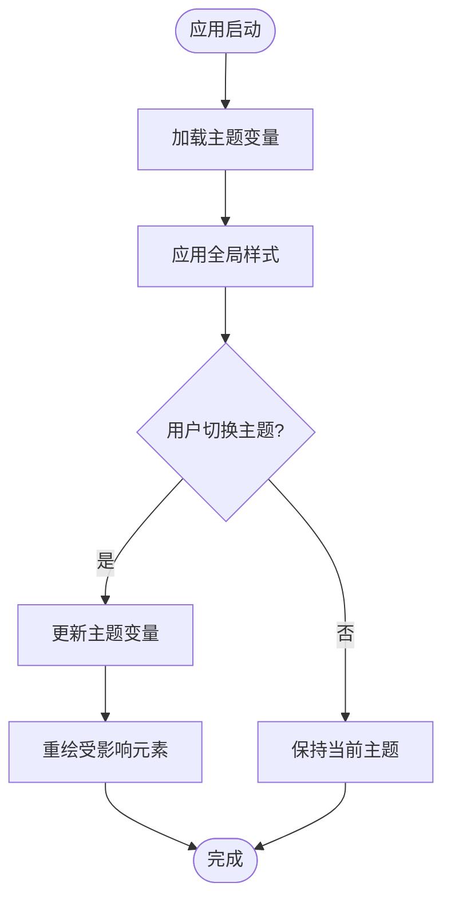
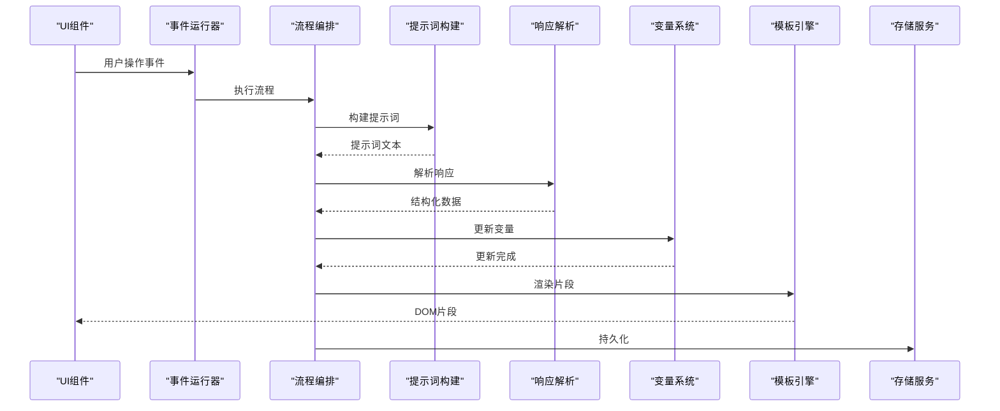
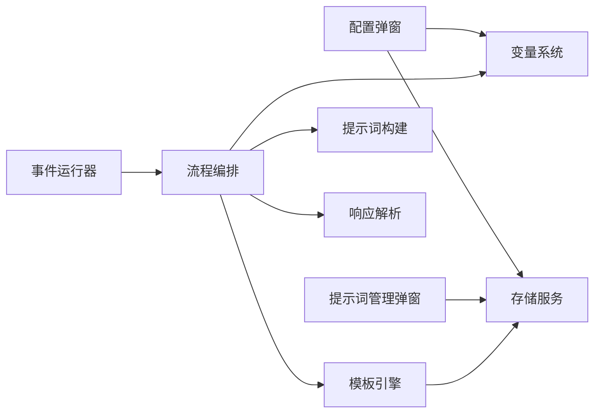

# UI组件架构设计

<cite>
**本文引用的文件**   
- [index.html](file://index.html)
- [start-screen.html](file://start-screen.html)
- [turn-based-battle-new.html](file://turn-based-battle-new.html)
- [world_map.html](file://world_map.html)
- [game-styles.css](file://module/game-styles.css)
- [game-styles-theme.css](file://module/game-styles-theme.css)
- [game-config.js](file://module/game-config.js)
- [game-helpers.js](file://module/game-helpers.js)
- [game-utils.js](file://module/game-utils.js)
- [event-runner.js](file://module/event-runner.js)
- [pipeline.js](file://module/pipeline.js)
- [prompt-builder.js](file://module/prompt-builder.js)
- [response-parser.js](file://module/response-parser.js)
- [variable-system.js](file://module/variable-system.js)
- [template-engine.js](file://module/template-engine.js)
- [storage-service.js](file://module/storage-service.js)
- [idb-storage.js](file://module/idb-storage.js)
- [log-capture.js](file://module/log-capture.js)
- [config-modal.js](file://ui/config-modal.js)
- [prompt-manager-modal.js](file://ui/prompt-manager-modal.js)
</cite>

## 目录
1. [引言](#引言)
2. [项目结构](#项目结构)
3. [核心组件](#核心组件)
4. [架构总览](#架构总览)
5. [详细组件分析](#详细组件分析)
6. [依赖关系分析](#依赖关系分析)
7. [性能考虑](#性能考虑)
8. [故障排查指南](#故障排查指南)
9. [结论](#结论)
10. [附录](#附录)

## 引言
本技术文档面向“姬侠传”前端UI系统的架构设计与开发规范，聚焦以下目标：
- 阐述UI系统的整体架构模式与组件化原则
- 明确模块划分策略与依赖管理机制
- 梳理CSS样式系统与主题变量组织方式、命名规范
- 解释组件生命周期管理与状态同步机制
- 提供组件复用与扩展的最佳实践
- 给出响应式设计与跨平台适配方案
- 为开发者提供完整的UI架构参考与开发规范

## 项目结构
本项目采用“页面级HTML + 模块化JS/CSS”的轻量架构。UI层由若干HTML入口承载不同场景（主界面、战斗、世界地图等），业务逻辑与UI渲染通过模块化脚本协作完成；样式系统以全局样式与主题变量分离的方式组织，便于多主题切换与统一维护。

图表来源
- [index.html](file://index.html)
- [start-screen.html](file://start-screen.html)
- [turn-based-battle-new.html](file://turn-based-battle-new.html)
- [world_map.html](file://world_map.html)
- [config-modal.js](file://ui/config-modal.js)
- [prompt-manager-modal.js](file://ui/prompt-manager-modal.js)
- [game-styles.css](file://module/game-styles.css)
- [game-styles-theme.css](file://module/game-styles-theme.css)
- [event-runner.js](file://module/event-runner.js)
- [pipeline.js](file://module/pipeline.js)
- [prompt-builder.js](file://module/prompt-builder.js)
- [response-parser.js](file://module/response-parser.js)
- [variable-system.js](file://module/variable-system.js)
- [template-engine.js](file://module/template-engine.js)
- [storage-service.js](file://module/storage-service.js)
- [idb-storage.js](file://module/idb-storage.js)
- [log-capture.js](file://module/log-capture.js)

章节来源
- [index.html](file://index.html)
- [start-screen.html](file://start-screen.html)
- [turn-based-battle-new.html](file://turn-based-battle-new.html)
- [world_map.html](file://world_map.html)
- [game-styles.css](file://module/game-styles.css)
- [game-styles-theme.css](file://module/game-styles-theme.css)
- [config-modal.js](file://ui/config-modal.js)
- [prompt-manager-modal.js](file://ui/prompt-manager-modal.js)
- [event-runner.js](file://module/event-runner.js)
- [pipeline.js](file://module/pipeline.js)
- [prompt-builder.js](file://module/prompt-builder.js)
- [response-parser.js](file://module/response-parser.js)
- [variable-system.js](file://module/variable-system.js)
- [template-engine.js](file://module/template-engine.js)
- [storage-service.js](file://module/storage-service.js)
- [idb-storage.js](file://module/idb-storage.js)
- [log-capture.js](file://module/log-capture.js)

## 核心组件
- 页面容器与路由分发
  - 各HTML入口负责加载基础样式与必要脚本，并初始化对应页面的UI与交互。
- UI弹窗组件
  - 配置弹窗与提示词管理弹窗作为通用对话框，提供设置与提示词编辑能力，遵循统一的显示/隐藏与遮罩行为。
- 样式系统
  - 全局样式定义布局、排版与通用控件风格；主题变量集中管理颜色、字号、间距等可替换值，支持动态切换。
- 运行时与数据流
  - 事件运行器驱动业务流程；流程编排串联提示词构建、响应解析、变量更新与模板渲染；存储接口持久化关键状态；日志捕获辅助调试。

章节来源
- [config-modal.js](file://ui/config-modal.js)
- [prompt-manager-modal.js](file://ui/prompt-manager-modal.js)
- [game-styles.css](file://module/game-styles.css)
- [game-styles-theme.css](file://module/game-styles-theme.css)
- [event-runner.js](file://module/event-runner.js)
- [pipeline.js](file://module/pipeline.js)
- [prompt-builder.js](file://module/prompt-builder.js)
- [response-parser.js](file://module/response-parser.js)
- [variable-system.js](file://module/variable-system.js)
- [template-engine.js](file://module/template-engine.js)
- [storage-service.js](file://module/storage-service.js)
- [idb-storage.js](file://module/idb-storage.js)
- [log-capture.js](file://module/log-capture.js)

## 架构总览
UI系统采用“页面-组件-服务”的分层模型：
- 页面层：HTML入口承载具体场景，负责挂载UI与绑定交互。
- 组件层：弹窗、面板、列表等可复用UI单元，封装展示与交互细节。
- 服务层：事件、流程、提示词、解析、变量、模板、存储、日志等服务，提供业务能力与数据支撑。

图表来源
- [event-runner.js](file://module/event-runner.js)
- [pipeline.js](file://module/pipeline.js)
- [prompt-builder.js](file://module/prompt-builder.js)
- [response-parser.js](file://module/response-parser.js)
- [variable-system.js](file://module/variable-system.js)
- [template-engine.js](file://module/template-engine.js)
- [storage-service.js](file://module/storage-service.js)
- [idb-storage.js](file://module/idb-storage.js)
- [log-capture.js](file://module/log-capture.js)

## 详细组件分析

### 弹窗组件（配置弹窗与提示词管理弹窗）
- 职责边界
  - 配置弹窗：提供游戏相关设置的查看与修改入口，保存至本地存储。
  - 提示词管理弹窗：提供提示词的增删改查与批量导入导出。
- 生命周期
  - 创建：在页面初始化时注册事件监听与默认值。
  - 显示/隐藏：通过类名或属性控制可见性与遮罩层。
  - 销毁：关闭时清理事件监听与临时状态。
- 状态同步
  - 与变量系统联动，读取/写入配置项；与存储服务同步持久化。
- 交互规范
  - 键盘可达性、焦点管理、ESC关闭、点击遮罩关闭。

图表来源
- [config-modal.js](file://ui/config-modal.js)
- [prompt-manager-modal.js](file://ui/prompt-manager-modal.js)
- [storage-service.js](file://module/storage-service.js)
- [variable-system.js](file://module/variable-system.js)

章节来源
- [config-modal.js](file://ui/config-modal.js)
- [prompt-manager-modal.js](file://ui/prompt-manager-modal.js)
- [storage-service.js](file://module/storage-service.js)
- [variable-system.js](file://module/variable-system.js)

### 样式系统与主题变量
- 组织结构
  - 全局样式：定义布局、排版、通用控件、动画与响应式断点。
  - 主题变量：集中定义颜色、字体、阴影、圆角等可替换值，供全局样式引用。
- 命名规范
  - 变量命名建议采用语义化前缀+用途+变体，如“颜色-背景-主色”、“尺寸-间距-小”。
  - CSS类名采用BEM或类似约定，确保可读性与可维护性。
- 主题切换
  - 通过切换根节点上的主题标识或注入不同的变量集实现；避免硬编码颜色值。
- 响应式适配
  - 使用媒体查询与相对单位；对移动端优先进行布局优化。

图表来源
- [game-styles.css](file://module/game-styles.css)
- [game-styles-theme.css](file://module/game-styles-theme.css)

章节来源
- [game-styles.css](file://module/game-styles.css)
- [game-styles-theme.css](file://module/game-styles-theme.css)

### 运行时与数据流（事件-流程-提示词-解析-变量-模板-存储）
- 事件运行器
  - 接收用户输入与系统事件，分派到相应处理函数。
- 流程编排
  - 将多个步骤组合成可复用的流程，支持条件分支与错误恢复。
- 提示词构建
  - 根据上下文与变量生成提示词文本，支持模板插值。
- 响应解析
  - 将外部响应转换为结构化数据，提取关键字段。
- 变量系统
  - 提供变量的读取、写入、订阅与批量更新能力。
- 模板引擎
  - 基于变量与数据结构渲染视图片段，减少手动DOM操作。
- 存储服务
  - 抽象持久化接口，底层可对接IndexedDB或其他后端。

图表来源
- [event-runner.js](file://module/event-runner.js)
- [pipeline.js](file://module/pipeline.js)
- [prompt-builder.js](file://module/prompt-builder.js)
- [response-parser.js](file://module/response-parser.js)
- [variable-system.js](file://module/variable-system.js)
- [template-engine.js](file://module/template-engine.js)
- [storage-service.js](file://module/storage-service.js)
- [idb-storage.js](file://module/idb-storage.js)

章节来源
- [event-runner.js](file://module/event-runner.js)
- [pipeline.js](file://module/pipeline.js)
- [prompt-builder.js](file://module/prompt-builder.js)
- [response-parser.js](file://module/response-parser.js)
- [variable-system.js](file://module/variable-system.js)
- [template-engine.js](file://module/template-engine.js)
- [storage-service.js](file://module/storage-service.js)
- [idb-storage.js](file://module/idb-storage.js)

### 页面入口与场景集成
- 主界面
  - 加载全局样式与主题变量，初始化弹窗与基础交互。
- 开始界面
  - 提供快速入口与引导流程，绑定跳转与配置入口。
- 战斗界面
  - 集成战斗流程与UI反馈，强调实时性与低延迟渲染。
- 世界地图
  - 展示地图与地点信息，支持缩放与导航。

章节来源
- [index.html](file://index.html)
- [start-screen.html](file://start-screen.html)
- [turn-based-battle-new.html](file://turn-based-battle-new.html)
- [world_map.html](file://world_map.html)

## 依赖关系分析
- 组件耦合
  - 弹窗组件依赖存储服务与变量系统，避免直接访问DOM细节。
  - 流程编排依赖提示词构建、响应解析、变量系统与模板引擎，形成清晰的数据管道。
- 外部依赖
  - 存储服务可能依赖浏览器API（如IndexedDB）或自定义后端接口。
- 循环依赖
  - 通过事件总线或回调解耦，避免模块间直接相互引用导致循环。

图表来源
- [config-modal.js](file://ui/config-modal.js)
- [prompt-manager-modal.js](file://ui/prompt-manager-modal.js)
- [storage-service.js](file://module/storage-service.js)
- [variable-system.js](file://module/variable-system.js)
- [event-runner.js](file://module/event-runner.js)
- [pipeline.js](file://module/pipeline.js)
- [prompt-builder.js](file://module/prompt-builder.js)
- [response-parser.js](file://module/response-parser.js)
- [template-engine.js](file://module/template-engine.js)

章节来源
- [config-modal.js](file://ui/config-modal.js)
- [prompt-manager-modal.js](file://ui/prompt-manager-modal.js)
- [storage-service.js](file://module/storage-service.js)
- [variable-system.js](file://module/variable-system.js)
- [event-runner.js](file://module/event-runner.js)
- [pipeline.js](file://module/pipeline.js)
- [prompt-builder.js](file://module/prompt-builder.js)
- [response-parser.js](file://module/response-parser.js)
- [template-engine.js](file://module/template-engine.js)

## 性能考虑
- 渲染优化
  - 使用模板引擎批量更新DOM，减少频繁操作；对长列表采用虚拟滚动或分页。
- 事件节流与防抖
  - 对高频事件（滚动、输入）进行节流/防抖，降低主线程压力。
- 资源加载
  - 按需加载模块与图片，预加载关键资源；使用懒加载提升首屏速度。
- 主题切换
  - 仅更新受影响的CSS变量，避免全量重绘。
- 存储I/O
  - 合并多次写入，异步持久化，避免阻塞UI。

[本节为通用指导，不直接分析具体文件]

## 故障排查指南
- 日志捕获
  - 启用日志捕获，记录关键流程与异常堆栈，定位问题源头。
- 常见问题
  - 主题未生效：检查变量注入顺序与覆盖规则。
  - 弹窗无法关闭：检查事件监听是否重复绑定或未正确移除。
  - 数据不同步：确认变量更新后是否触发模板渲染与存储持久化。
- 调试建议
  - 在关键路径添加断点与日志输出；使用浏览器开发者工具监控网络与存储。

章节来源
- [log-capture.js](file://module/log-capture.js)

## 结论
本UI架构以页面为入口、组件为单元、服务为支撑，结合样式与主题变量体系，实现了清晰的职责边界与良好的可扩展性。通过事件-流程-数据管道的协同，保证了UI与业务逻辑的一致性与可维护性。遵循本文档的规范与实践，可有效提升团队协作效率与产品质量。

[本节为总结性内容，不直接分析具体文件]

## 附录
- 开发规范建议
  - 模块命名与目录组织保持一致；公共能力抽取为独立模块。
  - 样式与主题变量集中管理，禁止在组件内硬编码样式值。
  - 所有用户输入需校验与容错；对外部响应进行严格解析与降级处理。
  - 单元测试与回归测试覆盖关键流程与组件。
- 响应式与跨平台适配
  - 移动端优先设计；使用相对单位与弹性布局；针对不同屏幕密度优化资源。
  - 针对Capacitor/Hybrid环境注意权限与API差异，必要时提供兼容层。

[本节为通用指导，不直接分析具体文件]