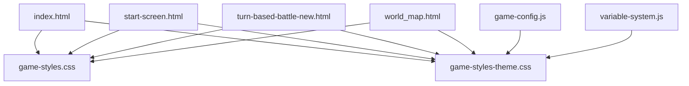
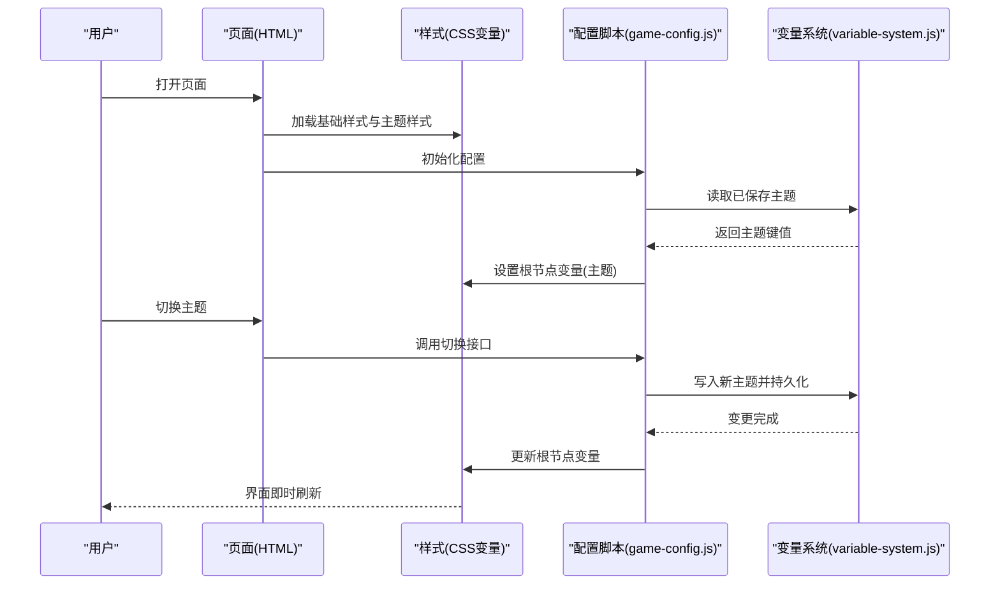
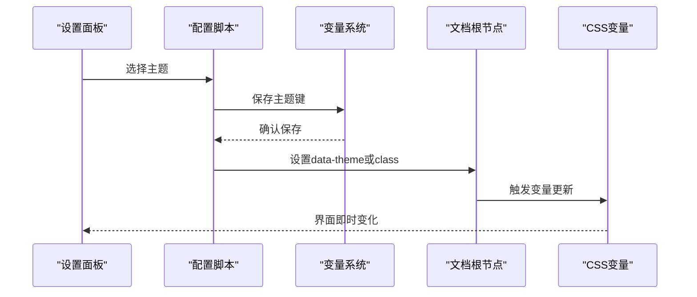
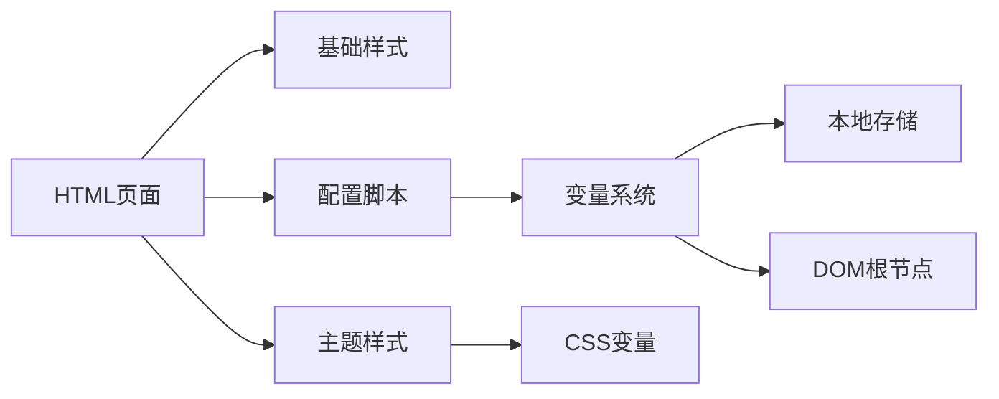

# 主题与样式系统

<cite>
**本文引用的文件**   
- [game-styles-theme.css](file://module/game-styles-theme.css)
- [game-styles.css](file://module/game-styles.css)
- [index.html](file://apk/android/app/src/main/assets/public/index.html)
- [start-screen.html](file://apk/android/app/src/main/assets/public/start-screen.html)
- [turn-based-battle-new.html](file://apk/android/app/src/main/assets/public/turn-based-battle-new.html)
- [world_map.html](file://apk/android/app/src/main/assets/public/world_map.html)
- [game-config.js](file://module/game-config.js)
- [variable-system.js](file://module/variable-system.js)
</cite>

## 目录
1. [简介](#简介)
2. [项目结构](#项目结构)
3. [核心组件](#核心组件)
4. [架构总览](#架构总览)
5. [详细组件分析](#详细组件分析)
6. [依赖关系分析](#依赖关系分析)
7. [性能考虑](#性能考虑)
8. [故障排查指南](#故障排查指南)
9. [结论](#结论)
10. [附录](#附录)

## 简介
本文件面向UI设计师与前端开发者，系统化阐述“姬侠传”主题与样式体系。内容涵盖CSS变量系统与主题切换机制、游戏风格定义规范、样式组织结构、动态主题切换方案与性能优化、响应式设计与移动端适配技巧、自定义主题创建与覆盖方法，以及CSS模块化组织与最佳实践建议。目标是提供一套可操作、可扩展、可维护的主题开发参考。

## 项目结构
主题与样式相关资源主要位于以下位置：
- 样式层：模块级样式与主题变量集中管理
- 页面层：各HTML入口按需引入样式与脚本
- 配置与变量：运行时主题与变量注入点

图表来源
- [index.html](file://apk/android/app/src/main/assets/public/index.html)
- [start-screen.html](file://apk/android/app/src/main/assets/public/start-screen.html)
- [turn-based-battle-new.html](file://apk/android/app/src/main/assets/public/turn-based-battle-new.html)
- [world_map.html](file://apk/android/app/src/main/assets/public/world_map.html)
- [game-styles.css](file://module/game-styles.css)
- [game-styles-theme.css](file://module/game-styles-theme.css)
- [game-config.js](file://module/game-config.js)
- [variable-system.js](file://module/variable-system.js)

章节来源
- [index.html](file://apk/android/app/src/main/assets/public/index.html)
- [start-screen.html](file://apk/android/app/src/main/assets/public/start-screen.html)
- [turn-based-battle-new.html](file://apk/android/app/src/main/assets/public/turn-based-battle-new.html)
- [world_map.html](file://apk/android/app/src/main/assets/public/world_map.html)
- [game-styles.css](file://module/game-styles.css)
- [game-styles-theme.css](file://module/game-styles-theme.css)
- [game-config.js](file://module/game-config.js)
- [variable-system.js](file://module/variable-system.js)

## 核心组件
- CSS变量系统（主题根变量）
  - 通过根节点声明全局语义化变量，如颜色、字体、间距、阴影等，供全应用复用。
  - 变量命名遵循“作用域-用途-变体”的约定，便于扩展与维护。
- 主题样式层
  - 将默认主题与多套主题变量集中管理，按数据属性或类名切换。
  - 提供基础样式与组件样式分离，确保主题仅影响变量而不侵入布局逻辑。
- 运行时注入与配置
  - 在页面加载时由配置脚本读取用户偏好并设置根节点变量。
  - 变量系统负责持久化与热更新，避免整页重渲染。
- 页面集成
  - 各HTML页面统一引入基础样式与主题样式，保证一致性。

章节来源
- [game-styles-theme.css](file://module/game-styles-theme.css)
- [game-styles.css](file://module/game-styles.css)
- [game-config.js](file://module/game-config.js)
- [variable-system.js](file://module/variable-system.js)

## 架构总览
主题系统采用“变量驱动 + 运行时注入”的轻量架构：
- 设计侧：以CSS变量为唯一主题源，所有组件只读变量。
- 运行侧：配置脚本根据用户选择或系统偏好设置根节点变量；变量系统负责持久化与变更广播。
- 页面侧：HTML仅引入样式与脚本，不关心主题细节。

图表来源
- [index.html](file://apk/android/app/src/main/assets/public/index.html)
- [game-styles.css](file://module/game-styles.css)
- [game-styles-theme.css](file://module/game-styles-theme.css)
- [game-config.js](file://module/game-config.js)
- [variable-system.js](file://module/variable-system.js)

## 详细组件分析

### CSS变量系统与主题切换机制
- 变量分层
  - 基础层：通用色板、字号、行高、圆角、阴影等。
  - 业务层：按钮、卡片、对话框、列表等组件变量。
  - 场景层：战斗、地图、对话等场景变量。
- 主题切换策略
  - 基于根节点数据属性或类名切换主题集合。
  - 切换过程仅修改变量值，避免重新计算布局，提升性能。
- 持久化与恢复
  - 使用本地存储记录用户选择，页面初始化时自动恢复。
- 兼容性
  - 对不支持CSS变量的环境提供降级策略（如硬编码回退）。

章节来源
- [game-styles-theme.css](file://module/game-styles-theme.css)
- [game-styles.css](file://module/game-styles.css)
- [variable-system.js](file://module/variable-system.js)

#### 主题切换时序图

图表来源
- [game-config.js](file://module/game-config.js)
- [variable-system.js](file://module/variable-system.js)
- [game-styles-theme.css](file://module/game-styles-theme.css)

### 游戏风格定义规范与样式组织结构
- 命名规范
  - 变量名采用小写中划线分隔，前缀体现作用域，例如“color-primary”、“spacing-md”。
  - 组件变量以组件名为前缀，避免冲突。
- 文件组织
  - 基础样式与组件样式集中在基础样式文件。
  - 主题变量与主题集合集中在主题样式文件。
- 层级关系
  - 基础样式优先于主题变量，主题变量优先于具体组件样式覆盖。
- 场景扩展
  - 新增场景只需追加变量集合，无需改动组件实现。

章节来源
- [game-styles.css](file://module/game-styles.css)
- [game-styles-theme.css](file://module/game-styles-theme.css)

### 动态主题切换技术方案与性能优化
- 方案要点
  - 使用CSS变量作为单一事实源，切换即改值。
  - 通过配置脚本集中处理用户偏好与持久化。
  - 变量系统提供变更回调，用于联动非CSS状态（如动画开关）。
- 性能优化
  - 批量更新：合并多次变量设置为一次DOM写入。
  - 防抖节流：高频交互下限制更新频率。
  - 最小重绘：避免直接操作布局属性，仅更新变量。
  - 懒加载：仅在需要时加载额外主题资源。

章节来源
- [game-config.js](file://module/game-config.js)
- [variable-system.js](file://module/variable-system.js)
- [game-styles-theme.css](file://module/game-styles-theme.css)

### 响应式设计与移动端适配技巧
- 断点策略
  - 以常见移动端宽度为基准，逐步增加桌面端断点。
- 布局弹性
  - 使用相对单位与容器查询，减少固定尺寸。
- 触控友好
  - 增大点击区域，合理间距，避免误触。
- 性能考量
  - 图片与媒体资源按设备密度与带宽自适应。
  - 避免复杂滤镜与过度阴影在低端设备上造成卡顿。

章节来源
- [game-styles.css](file://module/game-styles.css)
- [game-styles-theme.css](file://module/game-styles-theme.css)

### 自定义主题创建指南与样式覆盖方法
- 步骤概览
  - 复制现有主题变量集合，重命名为新主题键。
  - 在主题文件中注册新主题，并在配置脚本中暴露选项。
  - 在页面初始化时支持选择并持久化新主题。
- 覆盖策略
  - 优先覆盖变量而非重写样式规则。
  - 若需局部覆盖，使用更具体的选择器或BEM类名。
- 验证与回归
  - 在不同屏幕尺寸与深色/浅色模式下验证可读性与对比度。
  - 检查关键组件在主题切换后的表现一致性。

章节来源
- [game-styles-theme.css](file://module/game-styles-theme.css)
- [game-config.js](file://module/game-config.js)

### CSS模块化组织与最佳实践
- 模块划分
  - 基础样式：重置、排版、网格、工具类。
  - 组件样式：按钮、卡片、表单、导航等。
  - 主题样式：变量集合与主题切换逻辑。
- 命名约定
  - 变量与作用域一致，避免跨域污染。
  - 组件类名采用BEM或类似约定，提高可维护性。
- 版本与迁移
  - 保留废弃变量别名，逐步迁移至新命名。
  - 发布主题前进行自动化校验（变量完整性、对比度检测）。

章节来源
- [game-styles.css](file://module/game-styles.css)
- [game-styles-theme.css](file://module/game-styles-theme.css)

## 依赖关系分析
主题系统的关键依赖如下：
- HTML页面依赖基础样式与主题样式。
- 配置脚本依赖变量系统进行持久化与注入。
- 变量系统依赖本地存储与DOM API。

图表来源
- [index.html](file://apk/android/app/src/main/assets/public/index.html)
- [game-styles.css](file://module/game-styles.css)
- [game-styles-theme.css](file://module/game-styles-theme.css)
- [game-config.js](file://module/game-config.js)
- [variable-system.js](file://module/variable-system.js)

章节来源
- [index.html](file://apk/android/app/src/main/assets/public/index.html)
- [game-styles.css](file://module/game-styles.css)
- [game-styles-theme.css](file://module/game-styles-theme.css)
- [game-config.js](file://module/game-config.js)
- [variable-system.js](file://module/variable-system.js)

## 性能考虑
- 变量更新路径短：仅修改根节点变量，浏览器内部高效传播。
- 避免布局抖动：不直接读写布局属性，减少强制同步布局。
- 资源加载优化：按需加载主题资源，首屏最小化。
- 动画与过渡：合理使用CSS过渡，避免昂贵动画。
- 低端设备兼容：降低滤镜与阴影强度，提供简化主题。

[本节为通用指导，不涉及具体文件分析]

## 故障排查指南
- 主题未生效
  - 检查根节点是否设置了正确的数据属性或类名。
  - 确认主题样式文件已正确引入且未被其他样式覆盖。
- 变量缺失或命名错误
  - 核对变量命名与作用域，确保组件引用一致。
  - 在控制台查看CSS变量解析结果。
- 切换卡顿
  - 检查是否存在频繁DOM操作或布局重排。
  - 使用性能分析工具定位瓶颈。
- 移动端显示异常
  - 验证断点与相对单位的使用。
  - 检查触控区域与字体大小是否符合移动端规范。

章节来源
- [game-styles-theme.css](file://module/game-styles-theme.css)
- [game-styles.css](file://module/game-styles.css)
- [game-config.js](file://module/game-config.js)
- [variable-system.js](file://module/variable-system.js)

## 结论
本主题与样式系统以CSS变量为核心，结合配置脚本与变量系统实现轻量、高性能的动态主题切换。通过清晰的模块化组织与命名规范，设计师与开发者可以高效创建与扩展主题，同时保障跨设备的一致体验。建议在后续迭代中持续完善变量字典、自动化校验与主题预览工具，进一步提升协作效率与质量。

[本节为总结，不涉及具体文件分析]

## 附录
- 快速上手清单
  - 在主题文件中添加新变量集合。
  - 在配置脚本中注册新主题选项。
  - 在页面初始化时读取并应用用户偏好。
- 常用变量类别
  - 颜色：主色、辅助色、文本色、背景色。
  - 排版：字号、行高、字重、字族。
  - 间距：边距、内边距、栅格间距。
  - 效果：圆角、阴影、透明度。
- 推荐工具
  - 浏览器开发者工具中的CSS变量面板。
  - 对比度检测插件。
  - 性能分析与内存快照工具。

[本节为补充信息，不涉及具体文件分析]