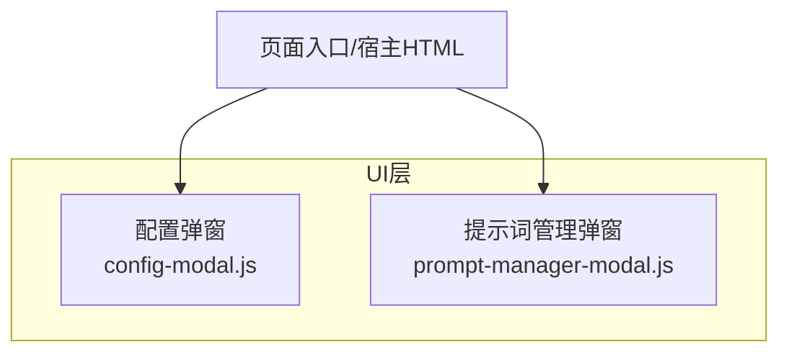
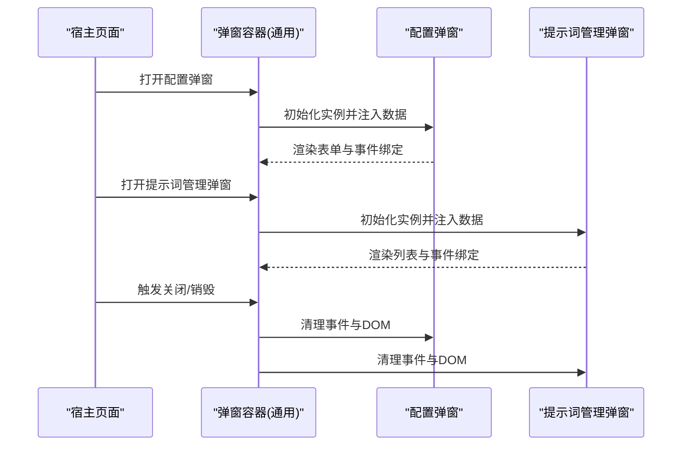
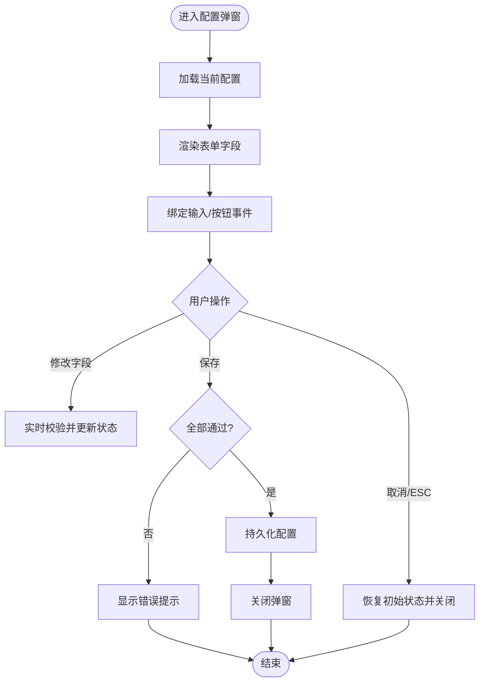
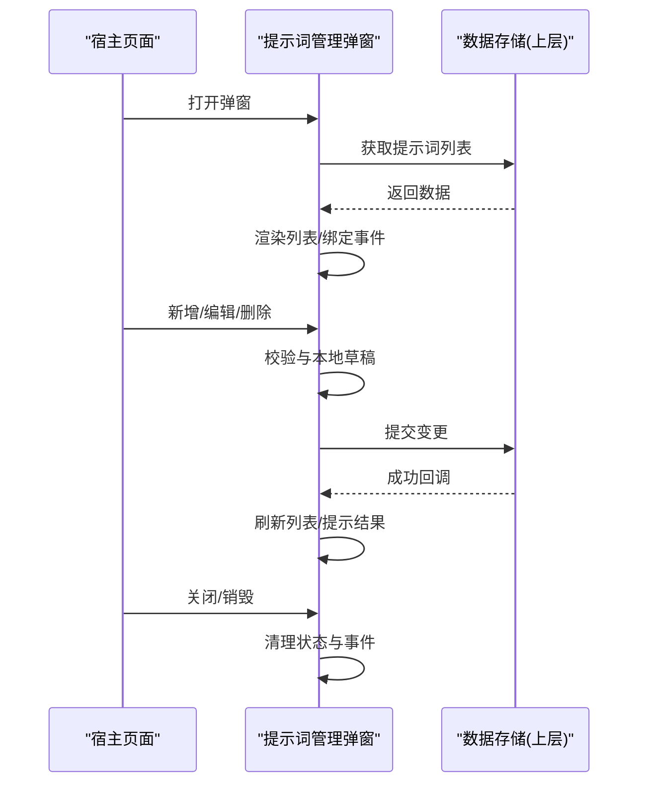
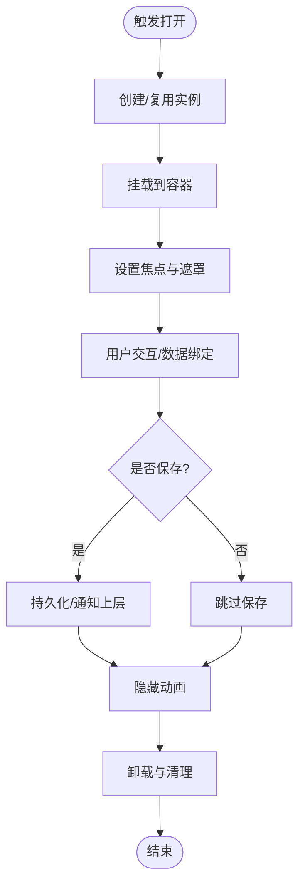
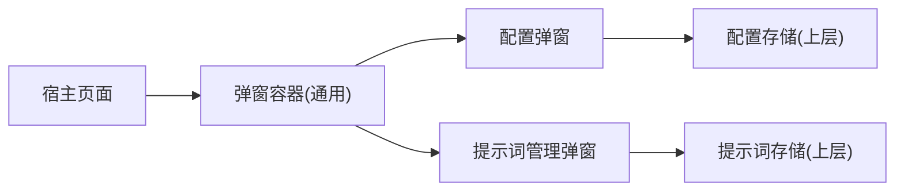

# 弹窗系统实现

<cite>
**本文引用的文件**   
- [config-modal.js](file://ui/config-modal.js)
- [prompt-manager-modal.js](file://ui/prompt-manager-modal.js)
</cite>

## 目录
1. [简介](#简介)
2. [项目结构](#项目结构)
3. [核心组件](#核心组件)
4. [架构总览](#架构总览)
5. [详细组件分析](#详细组件分析)
6. [依赖关系分析](#依赖关系分析)
7. [性能考虑](#性能考虑)
8. [故障排查指南](#故障排查指南)
9. [结论](#结论)
10. [附录：API参考与开发指南](#附录api参考与开发指南)

## 简介
本文件为“姬侠传”前端弹窗系统的技术文档，聚焦于模态框的创建、显示、隐藏与销毁机制，生命周期管理、事件绑定与状态同步原理；并深入说明配置弹窗与提示词管理弹窗的实现细节（表单验证、数据绑定、用户交互处理）、层级管理与焦点控制机制。同时提供自定义弹窗组件的开发指南与API参考，包含移动端触摸事件处理与性能优化技巧，帮助前端开发者快速上手与扩展。

## 项目结构
弹窗相关代码位于 ui 目录下，包含两个主要模块：
- 配置弹窗：用于编辑游戏/应用配置项
- 提示词管理弹窗：用于增删改查提示词条目

图表来源
- [config-modal.js](file://ui/config-modal.js)
- [prompt-manager-modal.js](file://ui/prompt-manager-modal.js)

章节来源
- [config-modal.js](file://ui/config-modal.js)
- [prompt-manager-modal.js](file://ui/prompt-manager-modal.js)

## 核心组件
- 配置弹窗
  - 职责：渲染配置表单、校验输入、保存或重置配置、关闭弹窗
  - 关键能力：表单字段映射、即时预览/联动、错误提示、本地持久化（由上层服务负责）
- 提示词管理弹窗
  - 职责：展示提示词列表、新增/编辑/删除条目、搜索过滤、批量操作
  - 关键能力：列表渲染、分页/虚拟滚动（可选）、确认对话框、撤销/回滚（可选）

章节来源
- [config-modal.js](file://ui/config-modal.js)
- [prompt-manager-modal.js](file://ui/prompt-manager-modal.js)

## 架构总览
弹窗系统采用“轻量容器 + 业务弹窗”的分层设计：
- 容器层：负责DOM挂载、z-index层级、焦点管理、遮罩点击关闭、ESC关闭等通用行为
- 业务层：各具体弹窗（配置弹窗、提示词管理弹窗）实现自身的数据模型、表单逻辑与交互流程

图表来源
- [config-modal.js](file://ui/config-modal.js)
- [prompt-manager-modal.js](file://ui/prompt-manager-modal.js)

## 详细组件分析

### 配置弹窗（config-modal.js）
- 生命周期
  - 创建：实例化时读取默认配置，生成表单节点
  - 显示：插入到容器，设置焦点到首个可交互元素
  - 隐藏：收起动画后移除焦点，保留实例以便复用
  - 销毁：解绑所有事件，释放引用，从DOM移除
- 数据绑定与验证
  - 双向绑定：表单字段变化更新内部状态，提交时合并到全局配置
  - 验证规则：必填、长度、格式、范围等，实时反馈错误信息
  - 联动逻辑：某些字段变更会触发其他字段可见性或默认值更新
- 用户交互
  - 保存：校验通过后调用存储接口，成功后关闭弹窗
  - 取消/关闭：丢弃未保存更改，恢复初始状态
  - 键盘导航：Tab顺序合理，Esc关闭，Enter提交（在合适场景）

图表来源
- [config-modal.js](file://ui/config-modal.js)

章节来源
- [config-modal.js](file://ui/config-modal.js)

### 提示词管理弹窗（prompt-manager-modal.js）
- 生命周期
  - 创建：拉取提示词列表，构建表格/卡片视图
  - 显示：定位焦点到搜索框或新增按钮
  - 隐藏：收起动画后清空临时状态（如编辑草稿）
  - 销毁：解绑列表项事件、分页控件事件、搜索输入防抖监听
- 数据绑定与验证
  - 列表项：名称、内容、标签等字段，支持在线编辑与离线草稿
  - 新增/编辑：基础校验（非空、长度限制），冲突检测（唯一性）
  - 删除：二次确认，支持撤销（可选）
- 用户交互
  - 搜索/过滤：按名称或标签筛选，支持模糊匹配
  - 分页/滚动加载：大数据量下按需渲染
  - 批量操作：全选、批量删除、导出导入（可选）

图表来源
- [prompt-manager-modal.js](file://ui/prompt-manager-modal.js)

章节来源
- [prompt-manager-modal.js](file://ui/prompt-manager-modal.js)

### 概念性总览（不绑定具体源码）
以下流程图概括了弹窗通用流程，适用于任意弹窗类型：

[此图为概念流程，无需图表来源]

## 依赖关系分析
- 组件内聚
  - 配置弹窗与提示词管理弹窗各自封装完整的数据流与交互逻辑，内聚度高
- 外部耦合
  - 与上层存储/配置服务存在松耦合调用（通过函数/事件回调）
  - 与宿主页面通过统一容器进行通信（打开/关闭/销毁）

图表来源
- [config-modal.js](file://ui/config-modal.js)
- [prompt-manager-modal.js](file://ui/prompt-manager-modal.js)

章节来源
- [config-modal.js](file://ui/config-modal.js)
- [prompt-manager-modal.js](file://ui/prompt-manager-modal.js)

## 性能考虑
- DOM与事件
  - 避免重复挂载：优先复用已创建的弹窗实例
  - 事件委托：对列表项使用事件委托减少监听器数量
  - 防抖/节流：搜索输入、滚动加载使用防抖/节流
- 渲染优化
  - 大数据列表：分页或虚拟滚动，仅渲染可视区域
  - 增量更新：局部替换而非整表重绘
- 内存管理
  - 显式解绑：关闭/销毁时清理定时器、事件监听、弱引用缓存
  - 避免闭包泄漏：及时释放大对象引用
- 移动端
  - 触摸穿透：遮罩阻止背景滚动，必要时使用 passive 事件
  - 软键盘适配：动态调整视口高度，避免遮挡输入区

[本节为通用指导，无需章节来源]

## 故障排查指南
- 常见问题
  - 弹窗无法关闭：检查遮罩点击与ESC事件是否被拦截或冒泡异常
  - 焦点丢失：确保打开时主动设置焦点，关闭前恢复焦点
  - 表单不生效：确认字段ID/选择器一致，事件绑定时机正确
  - 列表不更新：确认数据源变更回调已触发，且渲染方法被调用
- 调试建议
  - 打印生命周期钩子日志（创建/显示/隐藏/销毁）
  - 断点验证事件绑定与解绑
  - 使用浏览器性能面板观察重排/重绘热点

章节来源
- [config-modal.js](file://ui/config-modal.js)
- [prompt-manager-modal.js](file://ui/prompt-manager-modal.js)

## 结论
弹窗系统以通用容器承载业务弹窗，实现了清晰的职责分离与良好的可扩展性。配置弹窗与提示词管理弹窗分别覆盖了典型表单与列表场景，具备完善的生命周期、事件绑定与状态同步机制。遵循本文档的API与最佳实践，可快速扩展更多弹窗类型并保持统一的体验与性能表现。

[本节为总结，无需章节来源]

## 附录：API参考与开发指南

### 通用弹窗容器API（建议）
- open(options)
  - 作用：打开指定类型的弹窗
  - 参数：type、data、onClose、onSave 等
- close()
  - 作用：关闭当前弹窗
- destroy()
  - 作用：彻底销毁实例，释放资源
- setFocus(elementOrSelector)
  - 作用：将焦点移动到指定元素
- setZIndex(level)
  - 作用：设置层级，保证多弹窗堆叠顺序

章节来源
- [config-modal.js](file://ui/config-modal.js)
- [prompt-manager-modal.js](file://ui/prompt-manager-modal.js)

### 配置弹窗API（示例）
- init(configData)
  - 作用：初始化表单数据
- validate()
  - 作用：执行表单校验，返回校验结果
- save()
  - 作用：提交配置，触发持久化
- reset()
  - 作用：恢复初始状态

章节来源
- [config-modal.js](file://ui/config-modal.js)

### 提示词管理弹窗API（示例）
- loadList(params)
  - 作用：加载提示词列表（支持分页/过滤）
- add(item)
  - 作用：新增条目
- update(id, item)
  - 作用：更新条目
- remove(id)
  - 作用：删除条目
- search(keyword)
  - 作用：关键词检索

章节来源
- [prompt-manager-modal.js](file://ui/prompt-manager-modal.js)

### 自定义弹窗开发指南
- 步骤
  - 定义模板：准备HTML片段或模板字符串
  - 实例化：调用容器 open(type, data)
  - 绑定事件：在 onShow 中注册交互事件
  - 数据流：在 onSave/onCancel 中处理结果
  - 清理：在 onClose/destroy 中解绑事件与定时器
- 注意事项
  - 保持单一职责：每个弹窗只处理一个业务域
  - 明确边界：与上层服务的接口契约清晰
  - 可访问性：提供键盘导航与屏幕阅读器支持
  - 移动端适配：处理触摸、软键盘与横竖屏切换

章节来源
- [config-modal.js](file://ui/config-modal.js)
- [prompt-manager-modal.js](file://ui/prompt-manager-modal.js)