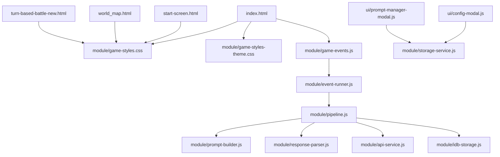
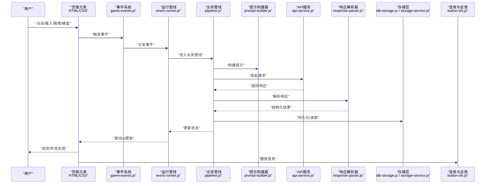
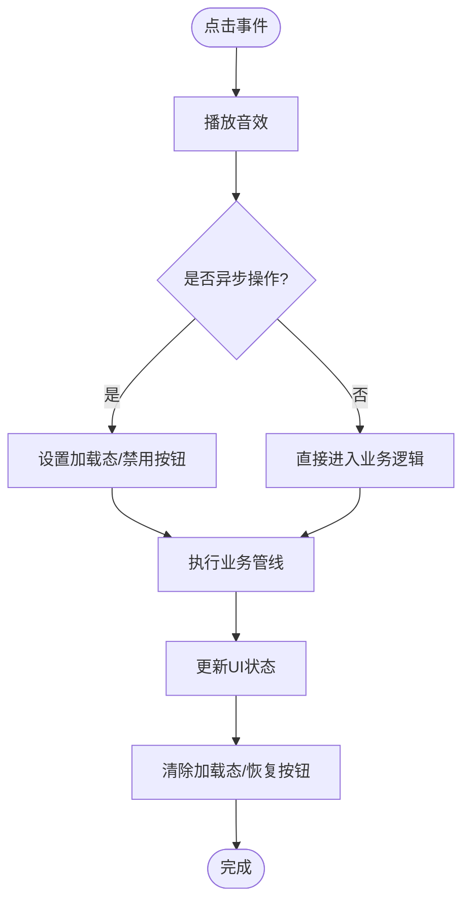
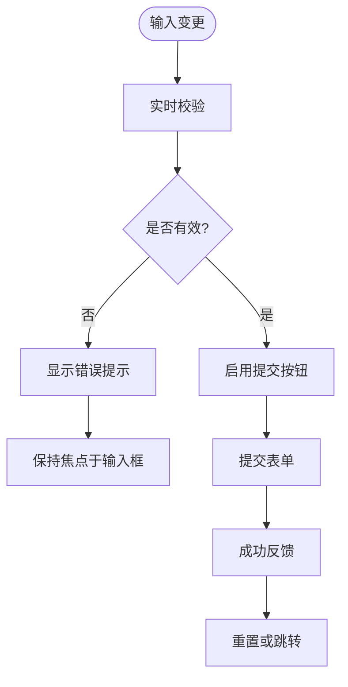
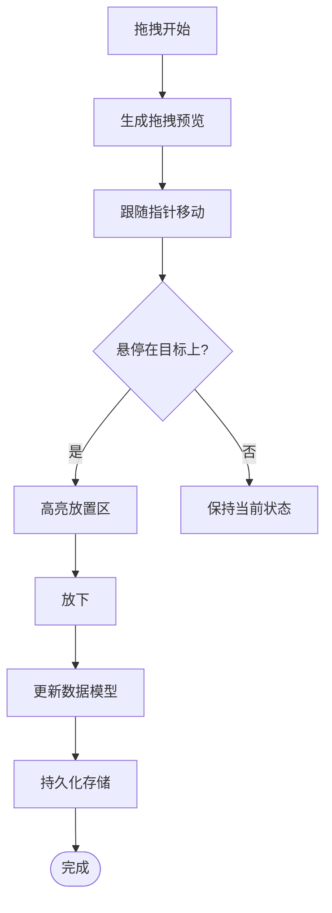
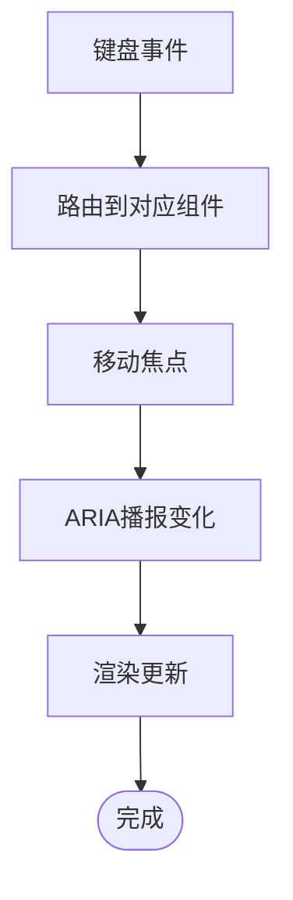
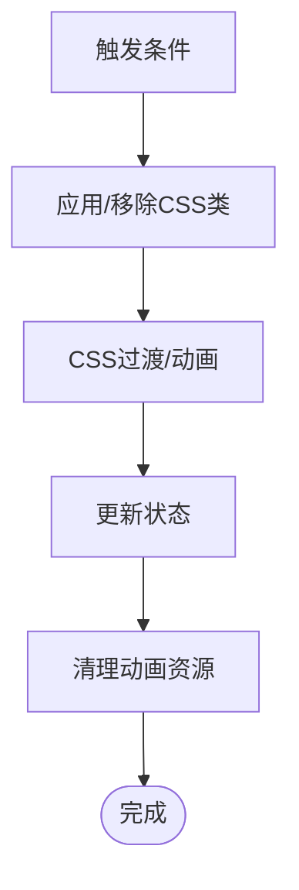
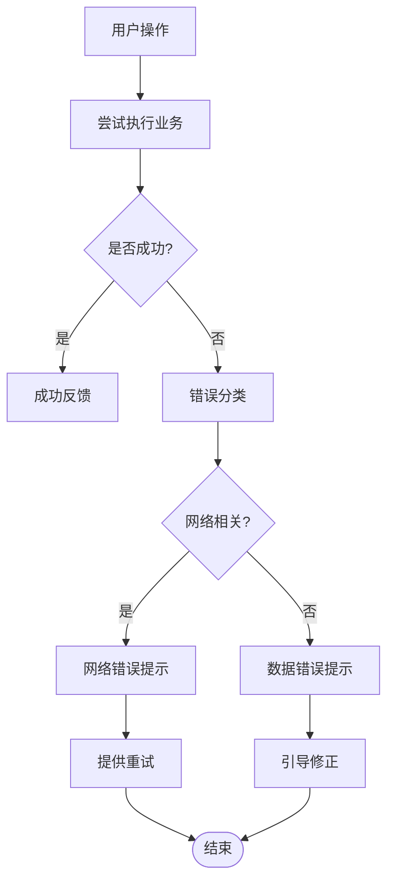
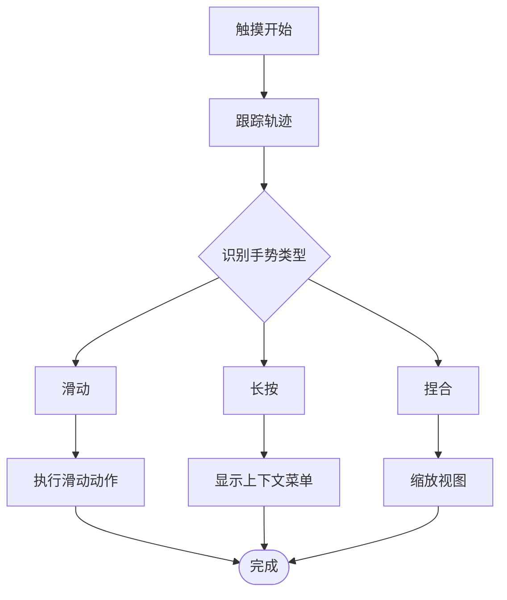
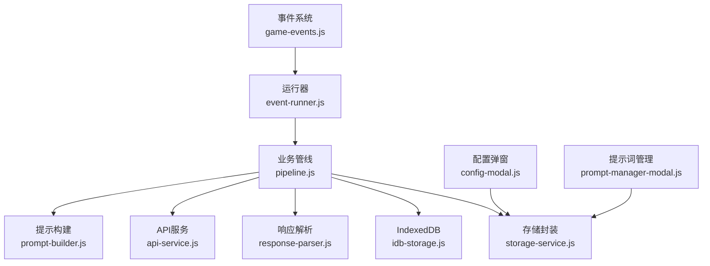

# 用户交互设计

<cite>
**本文引用的文件**   
- [index.html](file://index.html)
- [start-screen.html](file://start-screen.html)
- [world_map.html](file://world_map.html)
- [turn-based-battle-new.html](file://turn-based-battle-new.html)
- [game-styles.css](file://module/game-styles.css)
- [game-styles-theme.css](file://module/game-styles-theme.css)
- [button-sfx.js](file://module/button-sfx.js)
- [game-events.js](file://module/game-events.js)
- [event-runner.js](file://module/event-runner.js)
- [pipeline.js](file://module/pipeline.js)
- [prompt-builder.js](file://module/prompt-builder.js)
- [response-parser.js](file://module/response-parser.js)
- [api-service.js](file://module/api-service.js)
- [idb-storage.js](file://module/idb-storage.js)
- [storage-service.js](file://module/storage-service.js)
- [config-modal.js](file://ui/config-modal.js)
- [prompt-manager-modal.js](file://ui/prompt-manager-modal.js)
</cite>

## 目录
1. [引言](#引言)
2. [项目结构](#项目结构)
3. [核心组件](#核心组件)
4. [架构总览](#架构总览)
5. [详细组件分析](#详细组件分析)
6. [依赖分析](#依赖分析)
7. [性能考虑](#性能考虑)
8. [故障排查指南](#故障排查指南)
9. [结论](#结论)
10. [附录](#附录)

## 引言
本技术文档聚焦“姬侠传”的用户交互设计与实现，覆盖按钮点击、表单输入、拖拽操作、键盘导航、屏幕阅读器支持、动画与过渡、反馈与错误处理、移动端手势识别与触摸优化等关键方面。文档面向UI/UX设计师与前端开发者，提供从交互流程到代码落地的完整指南，确保一致、可访问、高性能的跨端体验。

## 项目结构
本项目采用多页面HTML入口配合模块化JS/CSS的组织方式：
- 页面入口：首页、开始界面、世界地图、回合制战斗等独立HTML页面
- 样式层：全局样式与主题变量分离，便于统一视觉规范
- 交互层：事件总线、按钮音效、运行时管线、提示构建与响应解析
- 数据层：本地存储（IndexedDB）与服务封装
- UI弹窗：配置弹窗与提示词管理弹窗

图表来源
- [index.html](file://index.html)
- [start-screen.html](file://start-screen.html)
- [world_map.html](file://world_map.html)
- [turn-based-battle-new.html](file://turn-based-battle-new.html)
- [game-styles.css](file://module/game-styles.css)
- [game-styles-theme.css](file://module/game-styles-theme.css)
- [game-events.js](file://module/game-events.js)
- [event-runner.js](file://module/event-runner.js)
- [pipeline.js](file://module/pipeline.js)
- [prompt-builder.js](file://module/prompt-builder.js)
- [response-parser.js](file://module/response-parser.js)
- [api-service.js](file://module/api-service.js)
- [idb-storage.js](file://module/idb-storage.js)
- [storage-service.js](file://module/storage-service.js)
- [config-modal.js](file://ui/config-modal.js)
- [prompt-manager-modal.js](file://ui/prompt-manager-modal.js)

章节来源
- [index.html](file://index.html)
- [start-screen.html](file://start-screen.html)
- [world_map.html](file://world_map.html)
- [turn-based-battle-new.html](file://turn-based-battle-new.html)
- [game-styles.css](file://module/game-styles.css)
- [game-styles-theme.css](file://module/game-styles-theme.css)
- [game-events.js](file://module/game-events.js)
- [event-runner.js](file://module/event-runner.js)
- [pipeline.js](file://module/pipeline.js)
- [prompt-builder.js](file://module/prompt-builder.js)
- [response-parser.js](file://module/response-parser.js)
- [api-service.js](file://module/api-service.js)
- [idb-storage.js](file://module/idb-storage.js)
- [storage-service.js](file://module/storage-service.js)
- [config-modal.js](file://ui/config-modal.js)
- [prompt-manager-modal.js](file://ui/prompt-manager-modal.js)

## 核心组件
- 全局样式与主题
  - 通过CSS变量定义颜色、字号、间距、圆角、阴影等，保证一致的视觉语言与暗/亮主题切换能力。
  - 建议将主题变量集中管理，并提供类名切换机制以适配不同设备与用户偏好。
- 事件系统与运行管线
  - 事件系统负责捕获用户动作并分发；运行管线串联提示构建、API调用、响应解析与状态更新。
  - 按钮音效模块为交互提供即时听觉反馈，增强确认感。
- 数据存储与服务
  - 本地持久化使用IndexedDB，服务层封装读写与快照逻辑，保障离线可用性与快速恢复。
- UI弹窗
  - 配置弹窗与提示词管理弹窗提供设置与内容编辑入口，需遵循统一的焦点管理与无障碍语义。

章节来源
- [game-styles.css](file://module/game-styles.css)
- [game-styles-theme.css](file://module/game-styles-theme.css)
- [game-events.js](file://module/game-events.js)
- [event-runner.js](file://module/event-runner.js)
- [pipeline.js](file://module/pipeline.js)
- [prompt-builder.js](file://module/prompt-builder.js)
- [response-parser.js](file://module/response-parser.js)
- [api-service.js](file://module/api-service.js)
- [idb-storage.js](file://module/idb-storage.js)
- [storage-service.js](file://module/storage-service.js)
- [button-sfx.js](file://module/button-sfx.js)
- [config-modal.js](file://ui/config-modal.js)
- [prompt-manager-modal.js](file://ui/prompt-manager-modal.js)

## 架构总览
下图展示从用户输入到界面更新的端到端交互链路，包括事件捕获、提示构建、网络请求、响应解析与UI渲染。

图表来源
- [game-events.js](file://module/game-events.js)
- [event-runner.js](file://module/event-runner.js)
- [pipeline.js](file://module/pipeline.js)
- [prompt-builder.js](file://module/prompt-builder.js)
- [api-service.js](file://module/api-service.js)
- [response-parser.js](file://module/response-parser.js)
- [idb-storage.js](file://module/idb-storage.js)
- [storage-service.js](file://module/storage-service.js)
- [button-sfx.js](file://module/button-sfx.js)

## 详细组件分析

### 按钮点击与即时反馈
- 交互目标
  - 所有可交互按钮需提供清晰的视觉状态（默认、悬停、按下、禁用），并在点击时提供即时反馈（高亮、缩放、音效）。
- 实现要点
  - 在事件系统中注册点击监听，优先执行音效与微动效，再进入业务管线。
  - 对异步操作显示加载态，避免重复提交。
  - 对不可用状态进行禁用与提示。
- 无障碍
  - 按钮必须具有语义标签与aria属性，支持键盘Enter/Space激活。
  - 焦点可见性需满足对比度要求。

图表来源
- [game-events.js](file://module/game-events.js)
- [button-sfx.js](file://module/button-sfx.js)
- [pipeline.js](file://module/pipeline.js)

章节来源
- [game-events.js](file://module/game-events.js)
- [button-sfx.js](file://module/button-sfx.js)
- [pipeline.js](file://module/pipeline.js)

### 表单输入与校验
- 交互目标
  - 输入框具备占位符、实时校验、错误提示与成功反馈；支持回车提交与Tab顺序导航。
- 实现要点
  - 在输入事件中触发轻量级校验，延迟提交以避免频繁计算。
  - 错误信息应靠近输入控件，使用aria-live或role="alert"通知屏幕阅读器。
  - 对敏感输入（如密码）提供可见/隐藏切换。
- 无障碍
  - 每个输入关联label或aria-label；错误文本使用aria-describedby指向对应说明。

图表来源
- [game-events.js](file://module/game-events.js)
- [prompt-manager-modal.js](file://ui/prompt-manager-modal.js)

章节来源
- [game-events.js](file://module/game-events.js)
- [prompt-manager-modal.js](file://ui/prompt-manager-modal.js)

### 拖拽操作与重排
- 交互目标
  - 列表项支持拖拽排序，提供拖拽中预览、放置区域高亮与回退机制。
- 实现要点
  - 使用原生拖放API或Pointer Events，统一处理移动、放下、取消。
  - 在拖拽过程中维护临时数据结构，放下后合并至持久化存储。
  - 提供撤销/重做能力，防止误操作。
- 无障碍
  - 为可拖拽元素添加draggable与aria-grabbed；提供键盘替代方案（方向键移动+回车确认）。

图表来源
- [game-events.js](file://module/game-events.js)
- [idb-storage.js](file://module/idb-storage.js)

章节来源
- [game-events.js](file://module/game-events.js)
- [idb-storage.js](file://module/idb-storage.js)

### 键盘导航与屏幕阅读器支持
- 交互目标
  - 全功能可通过键盘完成；屏幕阅读器能正确朗读界面状态与变化。
- 实现要点
  - 自定义焦点顺序，确保Tab顺序符合阅读逻辑。
  - 使用aria-*属性描述动态内容变化；对重要更新使用aria-live区域播报。
  - 对话框弹出时锁定焦点，Esc关闭并恢复焦点。
- 无障碍
  - 所有图标按钮提供文本等价；图片提供alt；表单字段提供明确标签。

图表来源
- [game-events.js](file://module/game-events.js)
- [config-modal.js](file://ui/config-modal.js)

章节来源
- [game-events.js](file://module/game-events.js)
- [config-modal.js](file://ui/config-modal.js)

### 动画效果与过渡动画
- 设计规范
  - 使用CSS变量控制时长、缓动曲线与透明度，保持一致的节奏与层次。
  - 仅对关键路径使用动画（打开/关闭、加载、成功/失败），避免干扰阅读。
- 技术实现
  - 通过类名切换触发过渡；复杂动画使用requestAnimationFrame或Web Animations API。
  - 尊重系统“减少动态效果”偏好，自动降级为静态过渡。
- 性能
  - 优先使用transform与opacity；避免布局抖动与强制同步布局。

图表来源
- [game-styles.css](file://module/game-styles.css)
- [game-styles-theme.css](file://module/game-styles-theme.css)

章节来源
- [game-styles.css](file://module/game-styles.css)
- [game-styles-theme.css](file://module/game-styles-theme.css)

### 交互反馈与错误处理
- 反馈策略
  - 即时反馈：点击音效、按钮状态、进度条。
  - 阶段反馈：加载中骨架屏、步骤指示器。
  - 结果反馈：成功/失败提示，必要时提供重试入口。
- 错误处理
  - 网络异常：超时、断网、服务端错误分类提示。
  - 数据异常：格式校验失败、缺失必填项、版本不兼容。
  - 统一错误上报与日志采集，便于定位问题。

图表来源
- [api-service.js](file://module/api-service.js)
- [response-parser.js](file://module/response-parser.js)
- [pipeline.js](file://module/pipeline.js)

章节来源
- [api-service.js](file://module/api-service.js)
- [response-parser.js](file://module/response-parser.js)
- [pipeline.js](file://module/pipeline.js)

### 移动端手势识别与触摸优化
- 手势策略
  - 滑动返回、长按菜单、双指缩放（如适用）、捏合调整。
  - 区分滚动容器与手势区域，避免冲突。
- 触摸优化
  - 增大触控目标尺寸，合理间距；防抖与节流避免误触。
  - 使用Pointer Events统一鼠标/触摸/笔输入。
- 无障碍
  - 为手势提供键盘与语音替代；长震动/声音作为辅助反馈。

图表来源
- [game-events.js](file://module/game-events.js)

章节来源
- [game-events.js](file://module/game-events.js)

### 页面与场景交互示例

#### 开始界面
- 主要交互
  - 开始游戏、设置、帮助入口；选择难度或角色。
- 用户体验原则
  - 首屏聚焦单一主行动；次要操作弱化但可达。
  - 首次启动提供简短引导。

章节来源
- [start-screen.html](file://start-screen.html)

#### 世界地图
- 主要交互
  - 地点选择、路线规划、快捷传送。
- 用户体验原则
  - 地图元素清晰分层；选中态与路径高亮一致。
  - 提供缩放与平移，兼顾小屏可读性。

章节来源
- [world_map.html](file://world_map.html)

#### 回合制战斗
- 主要交互
  - 技能选择、行动确认、结果反馈。
- 用户体验原则
  - 每回合信息密度适中；关键决策点提供二次确认。
  - 战斗动画克制，不影响可读性。

章节来源
- [turn-based-battle-new.html](file://turn-based-battle-new.html)

## 依赖分析
- 耦合关系
  - 事件系统为松耦合中枢，各页面通过事件总线解耦具体实现。
  - 业务管线聚合提示构建、API调用、响应解析与存储，职责清晰。
- 外部依赖
  - IndexedDB用于本地持久化；浏览器API用于动画与手势。
- 潜在风险
  - 避免循环依赖；将通用逻辑下沉至工具模块。
  - 对第三方库引入最小化，降低体积与维护成本。

图表来源
- [game-events.js](file://module/game-events.js)
- [event-runner.js](file://module/event-runner.js)
- [pipeline.js](file://module/pipeline.js)
- [prompt-builder.js](file://module/prompt-builder.js)
- [api-service.js](file://module/api-service.js)
- [response-parser.js](file://module/response-parser.js)
- [idb-storage.js](file://module/idb-storage.js)
- [storage-service.js](file://module/storage-service.js)
- [config-modal.js](file://ui/config-modal.js)
- [prompt-manager-modal.js](file://ui/prompt-manager-modal.js)

章节来源
- [game-events.js](file://module/game-events.js)
- [event-runner.js](file://module/event-runner.js)
- [pipeline.js](file://module/pipeline.js)
- [prompt-builder.js](file://module/prompt-builder.js)
- [api-service.js](file://module/api-service.js)
- [response-parser.js](file://module/response-parser.js)
- [idb-storage.js](file://module/idb-storage.js)
- [storage-service.js](file://module/storage-service.js)
- [config-modal.js](file://ui/config-modal.js)
- [prompt-manager-modal.js](file://ui/prompt-manager-modal.js)

## 性能考虑
- 渲染性能
  - 批量DOM更新，避免频繁重排；使用虚拟列表处理大数据集。
  - 图片懒加载与按需加载，减少首屏压力。
- 交互性能
  - 事件委托减少监听器数量；对高频事件使用节流/防抖。
  - 动画使用GPU加速属性，避免阻塞主线程。
- 存储性能
  - IndexedDB写入合并与事务优化；定期清理无用快照。

[本节为通用指导，无需列出具体文件来源]

## 故障排查指南
- 常见问题
  - 按钮无响应：检查事件绑定与禁用状态；确认音效与加载态逻辑未阻塞。
  - 表单无法提交：校验规则与必填项；查看控制台错误与网络请求。
  - 拖拽失效：确认pointer/mouse事件兼容；检查容器overflow与z-index。
  - 键盘不可用：核对tabindex与focus管理；验证aria-live播报。
  - 动画卡顿：排查强制同步布局与过度重绘；开启硬件加速。
- 调试建议
  - 使用浏览器开发者工具的Performance与Accessibility面板。
  - 记录关键交互日志与错误堆栈，结合时间戳定位问题。

章节来源
- [game-events.js](file://module/game-events.js)
- [pipeline.js](file://module/pipeline.js)
- [api-service.js](file://module/api-service.js)
- [idb-storage.js](file://module/idb-storage.js)

## 结论
通过统一的事件系统、清晰的业务管线与完善的样式主题，姬侠传实现了跨端一致的交互体验。建议在后续迭代中持续完善无障碍支持、手势兼容与性能优化，确保在不同设备与用户群体上的可用性。

[本节为总结，无需列出具体文件来源]

## 附录
- 术语
  - 事件系统：负责捕获与分发用户输入的核心模块。
  - 业务管线：串联提示构建、网络请求、响应解析与状态更新的流程。
  - 无障碍：使残障用户也能平等获取信息与完成任务的设计实践。
- 参考页面
  - 首页、开始界面、世界地图、回合制战斗页面入口。

章节来源
- [index.html](file://index.html)
- [start-screen.html](file://start-screen.html)
- [world_map.html](file://world_map.html)
- [turn-based-battle-new.html](file://turn-based-battle-new.html)