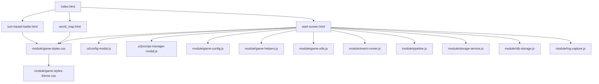
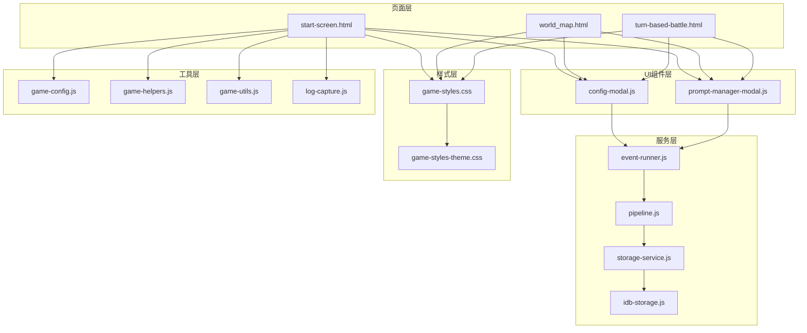
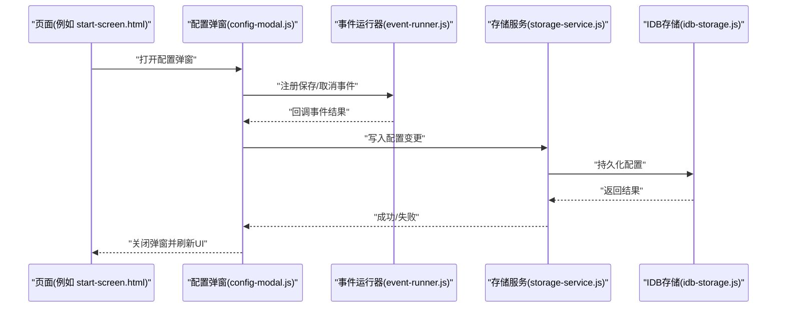
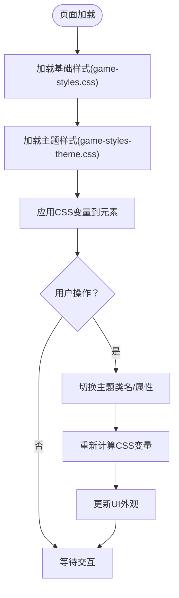
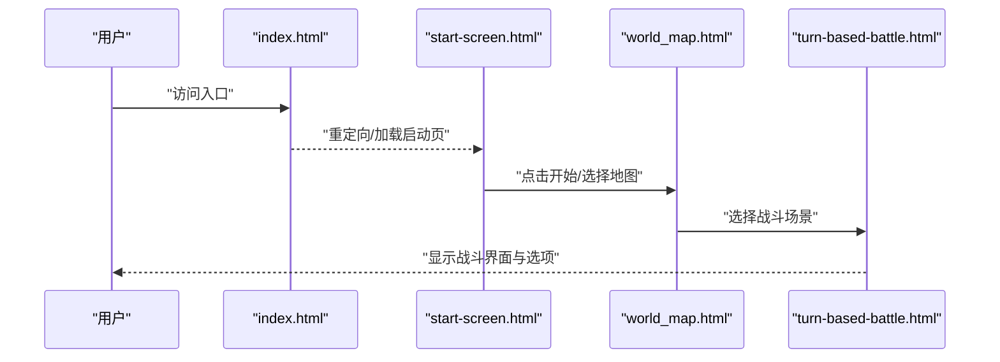
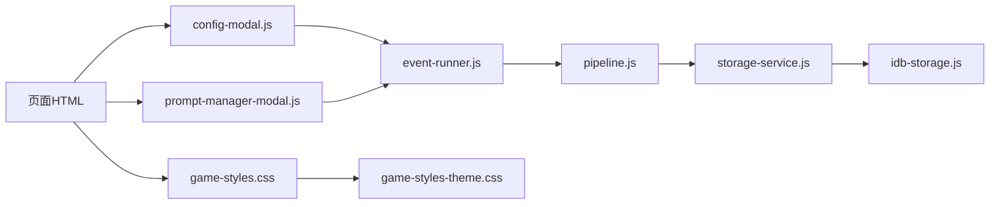

# 用户界面系统

<cite>
**本文引用的文件**   
- [index.html](file://apk/android/app/src/main/assets/public/index.html)
- [start-screen.html](file://apk/android/app/src/main/assets/public/start-screen.html)
- [world_map.html](file://apk/android/app/src/main/assets/public/world_map.html)
- [turn-based-battle.html](file://apk/android/app/src/main/assets/public/turn-based-battle.html)
- [game-styles.css](file://apk/android/app/src/main/assets/public/module/game-styles.css)
- [game-styles-theme.css](file://apk/android/app/src/main/assets/public/module/game-styles-theme.css)
- [config-modal.js](file://apk/android/app/src/main/assets/public/ui/config-modal.js)
- [prompt-manager-modal.js](file://apk/android/app/src/main/assets/public/ui/prompt-manager-modal.js)
- [game-config.js](file://apk/android/app/src/main/assets/public/module/game-config.js)
- [game-helpers.js](file://apk/android/app/src/main/assets/public/module/game-helpers.js)
- [game-utils.js](file://apk/android/app/src/main/assets/public/module/game-utils.js)
- [event-runner.js](file://apk/android/app/src/main/assets/public/module/event-runner.js)
- [pipeline.js](file://apk/android/app/src/main/assets/public/module/pipeline.js)
- [storage-service.js](file://apk/android/app/src/main/assets/public/module/storage-service.js)
- [idb-storage.js](file://apk/android/app/src/main/assets/public/module/idb-storage.js)
- [log-capture.js](file://apk/android/app/src/main/assets/public/module/log-capture.js)
</cite>

## 目录
1. [简介](#简介)
2. [项目结构](#项目结构)
3. [核心组件](#核心组件)
4. [架构总览](#架构总览)
5. [详细组件分析](#详细组件分析)
6. [依赖关系分析](#依赖关系分析)
7. [性能考虑](#性能考虑)
8. [故障排查指南](#故障排查指南)
9. [结论](#结论)
10. [附录](#附录)

## 简介
本技术文档面向“姬侠传”前端用户界面系统，聚焦UI组件架构与复用机制、弹窗系统（模态框管理、事件绑定、状态同步）、主题系统与样式管理（CSS变量、动态主题切换、响应式）、用户交互流程与页面路由逻辑，并提供自定义UI组件开发指南、移动端适配与性能优化方案。文档以仓库中实际存在的HTML入口、模块脚本与样式文件为依据，帮助前端开发者快速理解并扩展UI子系统。

## 项目结构
前端资源位于 assets/public 下，采用多页面应用（MPA）组织方式：
- 页面入口：index.html、start-screen.html、world_map.html、turn-based-battle.html 等
- UI层：ui 目录下的配置弹窗与提示管理器
- 样式层：module 下的全局样式与主题样式
- 业务模块：module 下的游戏配置、工具函数、事件运行器、流水线、存储服务等

图表来源
- [index.html](file://apk/android/app/src/main/assets/public/index.html)
- [start-screen.html](file://apk/android/app/src/main/assets/public/start-screen.html)
- [world_map.html](file://apk/android/app/src/main/assets/public/world_map.html)
- [turn-based-battle.html](file://apk/android/app/src/main/assets/public/turn-based-battle.html)
- [game-styles.css](file://apk/android/app/src/main/assets/public/module/game-styles.css)
- [game-styles-theme.css](file://apk/android/app/src/main/assets/public/module/game-styles-theme.css)
- [config-modal.js](file://apk/android/app/src/main/assets/public/ui/config-modal.js)
- [prompt-manager-modal.js](file://apk/android/app/src/main/assets/public/ui/prompt-manager-modal.js)
- [game-config.js](file://apk/android/app/src/main/assets/public/module/game-config.js)
- [game-helpers.js](file://apk/android/app/src/main/assets/public/module/game-helpers.js)
- [game-utils.js](file://apk/android/app/src/main/assets/public/module/game-utils.js)
- [event-runner.js](file://apk/android/app/src/main/assets/public/module/event-runner.js)
- [pipeline.js](file://apk/android/app/src/main/assets/public/module/pipeline.js)
- [storage-service.js](file://apk/android/app/src/main/assets/public/module/storage-service.js)
- [idb-storage.js](file://apk/android/app/src/main/assets/public/module/idb-storage.js)
- [log-capture.js](file://apk/android/app/src/main/assets/public/module/log-capture.js)

章节来源
- [index.html](file://apk/android/app/src/main/assets/public/index.html)
- [start-screen.html](file://apk/android/app/src/main/assets/public/start-screen.html)
- [world_map.html](file://apk/android/app/src/main/assets/public/world_map.html)
- [turn-based-battle.html](file://apk/android/app/src/main/assets/public/turn-based-battle.html)
- [game-styles.css](file://apk/android/app/src/main/assets/public/module/game-styles.css)
- [game-styles-theme.css](file://apk/android/app/src/main/assets/public/module/game-styles-theme.css)
- [config-modal.js](file://apk/android/app/src/main/assets/public/ui/config-modal.js)
- [prompt-manager-modal.js](file://apk/android/app/src/main/assets/public/ui/prompt-manager-modal.js)
- [game-config.js](file://apk/android/app/src/main/assets/public/module/game-config.js)
- [game-helpers.js](file://apk/android/app/src/main/assets/public/module/game-helpers.js)
- [game-utils.js](file://apk/android/app/src/main/assets/public/module/game-utils.js)
- [event-runner.js](file://apk/android/app/src/main/assets/public/module/event-runner.js)
- [pipeline.js](file://apk/android/app/src/main/assets/public/module/pipeline.js)
- [storage-service.js](file://apk/android/app/src/main/assets/public/module/storage-service.js)
- [idb-storage.js](file://apk/android/app/src/main/assets/public/module/idb-storage.js)
- [log-capture.js](file://apk/android/app/src/main/assets/public/module/log-capture.js)

## 核心组件
- 页面容器与布局
  - index.html 作为主入口，负责加载基础结构与公共脚本；各功能页面通过独立HTML文件承载不同场景的DOM与交互。
  - start-screen.html、world_map.html、turn-based-battle.html 分别承担启动页、世界地图、回合制战斗等场景。
- UI弹窗组件
  - ui/config-modal.js 提供配置弹窗能力，支持打开/关闭、表单渲染、数据回写。
  - ui/prompt-manager-modal.js 提供提示/消息弹窗能力，用于通知、确认、信息展示。
- 样式与主题
  - module/game-styles.css 定义全局布局、组件样式、响应式断点。
  - module/game-styles-theme.css 定义主题变量与主题切换逻辑，配合CSS变量实现动态换肤。
- 运行时与工具
  - module/game-config.js 集中管理游戏配置项（如语言、音效、难度等）。
  - module/game-helpers.js 与 module/game-utils.js 提供通用辅助方法（时间格式化、字符串处理、事件封装等）。
  - module/event-runner.js 驱动事件执行流程，协调UI与业务逻辑。
  - module/pipeline.js 编排任务管线，统一处理异步流程与错误传播。
  - module/storage-service.js 与 module/idb-storage.js 封装持久化接口，屏蔽IndexedDB细节。
  - module/log-capture.js 捕获控制台日志，便于调试与问题定位。

章节来源
- [config-modal.js](file://apk/android/app/src/main/assets/public/ui/config-modal.js)
- [prompt-manager-modal.js](file://apk/android/app/src/main/assets/public/ui/prompt-manager-modal.js)
- [game-styles.css](file://apk/android/app/src/main/assets/public/module/game-styles.css)
- [game-styles-theme.css](file://apk/android/app/src/main/assets/public/module/game-styles-theme.css)
- [game-config.js](file://apk/android/app/src/main/assets/public/module/game-config.js)
- [game-helpers.js](file://apk/android/app/src/main/assets/public/module/game-helpers.js)
- [game-utils.js](file://apk/android/app/src/main/assets/public/module/game-utils.js)
- [event-runner.js](file://apk/android/app/src/main/assets/public/module/event-runner.js)
- [pipeline.js](file://apk/android/app/src/main/assets/public/module/pipeline.js)
- [storage-service.js](file://apk/android/app/src/main/assets/public/module/storage-service.js)
- [idb-storage.js](file://apk/android/app/src/main/assets/public/module/idb-storage.js)
- [log-capture.js](file://apk/android/app/src/main/assets/public/module/log-capture.js)

## 架构总览
整体采用“页面+模块”的松耦合架构：
- 页面层：每个HTML页面负责自身DOM与初始化逻辑，按需引入公共样式与脚本。
- 组件层：ui 目录下的弹窗组件为可复用的UI单元，通过API暴露打开/关闭、设置内容等方法。
- 服务层：storage-service、event-runner、pipeline 等模块提供跨页面共享的能力。
- 样式层：通过CSS变量与主题样式分离，实现动态主题切换与响应式布局。

图表来源
- [start-screen.html](file://apk/android/app/src/main/assets/public/start-screen.html)
- [world_map.html](file://apk/android/app/src/main/assets/public/world_map.html)
- [turn-based-battle.html](file://apk/android/app/src/main/assets/public/turn-based-battle.html)
- [config-modal.js](file://apk/android/app/src/main/assets/public/ui/config-modal.js)
- [prompt-manager-modal.js](file://apk/android/app/src/main/assets/public/ui/prompt-manager-modal.js)
- [event-runner.js](file://apk/android/app/src/main/assets/public/module/event-runner.js)
- [pipeline.js](file://apk/android/app/src/main/assets/public/module/pipeline.js)
- [storage-service.js](file://apk/android/app/src/main/assets/public/module/storage-service.js)
- [idb-storage.js](file://apk/android/app/src/main/assets/public/module/idb-storage.js)
- [game-styles.css](file://apk/android/app/src/main/assets/public/module/game-styles.css)
- [game-styles-theme.css](file://apk/android/app/src/main/assets/public/module/game-styles-theme.css)
- [game-config.js](file://apk/android/app/src/main/assets/public/module/game-config.js)
- [game-helpers.js](file://apk/android/app/src/main/assets/public/module/game-helpers.js)
- [game-utils.js](file://apk/android/app/src/main/assets/public/module/game-utils.js)
- [log-capture.js](file://apk/android/app/src/main/assets/public/module/log-capture.js)

## 详细组件分析

### 弹窗系统（模态框管理、事件绑定、状态同步）
- 设计要点
  - 统一管理：通过 config-modal.js 与 prompt-manager-modal.js 提供统一的打开/关闭API，避免在页面内重复实现遮罩与焦点管理。
  - 事件绑定：组件内部对按钮、输入框、键盘事件进行集中绑定，确保行为一致且易于测试。
  - 状态同步：弹窗内容与外部状态双向同步，修改表单后自动更新配置或触发后续流程。
- 典型调用序列（配置弹窗）

图表来源
- [config-modal.js](file://apk/android/app/src/main/assets/public/ui/config-modal.js)
- [prompt-manager-modal.js](file://apk/android/app/src/main/assets/public/ui/prompt-manager-modal.js)
- [event-runner.js](file://apk/android/app/src/main/assets/public/module/event-runner.js)
- [storage-service.js](file://apk/android/app/src/main/assets/public/module/storage-service.js)
- [idb-storage.js](file://apk/android/app/src/main/assets/public/module/idb-storage.js)

章节来源
- [config-modal.js](file://apk/android/app/src/main/assets/public/ui/config-modal.js)
- [prompt-manager-modal.js](file://apk/android/app/src/main/assets/public/ui/prompt-manager-modal.js)
- [event-runner.js](file://apk/android/app/src/main/assets/public/module/event-runner.js)
- [storage-service.js](file://apk/android/app/src/main/assets/public/module/storage-service.js)
- [idb-storage.js](file://apk/android/app/src/main/assets/public/module/idb-storage.js)

### 主题系统与样式管理（CSS变量、动态主题切换、响应式设计）
- 主题变量
  - game-styles-theme.css 定义主题色板、字体、阴影、圆角等变量，供全局样式引用。
- 动态切换
  - 通过切换根节点上的主题类名或属性，使CSS变量值变化，从而实时改变UI外观。
- 响应式布局
  - game-styles.css 使用媒体查询与弹性布局，适配手机、平板、桌面端。
- 样式加载顺序
  - 先加载基础样式，再加载主题样式，确保主题覆盖生效。

图表来源
- [game-styles.css](file://apk/android/app/src/main/assets/public/module/game-styles.css)
- [game-styles-theme.css](file://apk/android/app/src/main/assets/public/module/game-styles-theme.css)

章节来源
- [game-styles.css](file://apk/android/app/src/main/assets/public/module/game-styles.css)
- [game-styles-theme.css](file://apk/android/app/src/main/assets/public/module/game-styles-theme.css)

### 用户交互流程与页面路由逻辑
- 路由策略
  - 基于多页面应用，通过链接跳转或窗口导航在不同HTML页面间切换。
  - 页面初始化时根据URL参数或本地配置决定默认视图。
- 交互流程
  - 启动页引导用户进入世界地图或战斗场景。
  - 世界地图提供地点选择与事件触发入口。
  - 战斗页面驱动回合制流程，结合事件运行器与流水线处理动作与反馈。

图表来源
- [index.html](file://apk/android/app/src/main/assets/public/index.html)
- [start-screen.html](file://apk/android/app/src/main/assets/public/start-screen.html)
- [world_map.html](file://apk/android/app/src/main/assets/public/world_map.html)
- [turn-based-battle.html](file://apk/android/app/src/main/assets/public/turn-based-battle.html)

章节来源
- [index.html](file://apk/android/app/src/main/assets/public/index.html)
- [start-screen.html](file://apk/android/app/src/main/assets/public/start-screen.html)
- [world_map.html](file://apk/android/app/src/main/assets/public/world_map.html)
- [turn-based-battle.html](file://apk/android/app/src/main/assets/public/turn-based-battle.html)

### 自定义UI组件开发指南与最佳实践
- 组件职责单一
  - 每个组件只负责一个明确的UI职责（如配置弹窗、提示弹窗），避免臃肿。
- API设计清晰
  - 对外暴露 open/close/setContent/updateState 等方法，保持调用一致性。
- 事件解耦
  - 使用事件运行器或发布订阅模式，将UI事件与业务逻辑解耦。
- 样式隔离
  - 组件样式尽量限定在组件作用域内，避免污染全局样式。
- 可测试性
  - 为关键路径编写单元测试与集成测试，确保弹窗状态与数据同步正确。

章节来源
- [config-modal.js](file://apk/android/app/src/main/assets/public/ui/config-modal.js)
- [prompt-manager-modal.js](file://apk/android/app/src/main/assets/public/ui/prompt-manager-modal.js)
- [event-runner.js](file://apk/android/app/src/main/assets/public/module/event-runner.js)
- [game-helpers.js](file://apk/android/app/src/main/assets/public/module/game-helpers.js)
- [game-utils.js](file://apk/android/app/src/main/assets/public/module/game-utils.js)

### 移动端适配与性能优化技术方案
- 移动端适配
  - 使用响应式断点与相对单位，保证在小屏设备上的可读性与触控体验。
  - 针对触摸设备优化点击区域与手势交互。
- 性能优化
  - 延迟加载非关键资源，减少首屏体积。
  - 使用缓存与增量更新，降低重复计算与网络请求。
  - 控制弹窗层级与动画复杂度，避免阻塞主线程。
- 存储优化
  - 通过 storage-service 与 idb-storage 抽象持久化接口，批量写入与事务提交提升效率。

章节来源
- [game-styles.css](file://apk/android/app/src/main/assets/public/module/game-styles.css)
- [storage-service.js](file://apk/android/app/src/main/assets/public/module/storage-service.js)
- [idb-storage.js](file://apk/android/app/src/main/assets/public/module/idb-storage.js)

## 依赖关系分析
- 组件耦合度
  - 弹窗组件依赖事件运行器与存储服务，形成稳定的上下行通信链路。
- 直接依赖
  - 页面直接引入UI组件与样式；UI组件间接依赖工具与服务。
- 潜在循环依赖
  - 当前结构未发现明显循环依赖，建议持续监控模块导入关系。
- 外部依赖
  - 主要依赖浏览器原生API（DOM、CSS变量、IndexedDB），无重型第三方库。

图表来源
- [config-modal.js](file://apk/android/app/src/main/assets/public/ui/config-modal.js)
- [prompt-manager-modal.js](file://apk/android/app/src/main/assets/public/ui/prompt-manager-modal.js)
- [event-runner.js](file://apk/android/app/src/main/assets/public/module/event-runner.js)
- [pipeline.js](file://apk/android/app/src/main/assets/public/module/pipeline.js)
- [storage-service.js](file://apk/android/app/src/main/assets/public/module/storage-service.js)
- [idb-storage.js](file://apk/android/app/src/main/assets/public/module/idb-storage.js)
- [game-styles.css](file://apk/android/app/src/main/assets/public/module/game-styles.css)
- [game-styles-theme.css](file://apk/android/app/src/main/assets/public/module/game-styles-theme.css)

章节来源
- [config-modal.js](file://apk/android/app/src/main/assets/public/ui/config-modal.js)
- [prompt-manager-modal.js](file://apk/android/app/src/main/assets/public/ui/prompt-manager-modal.js)
- [event-runner.js](file://apk/android/app/src/main/assets/public/module/event-runner.js)
- [pipeline.js](file://apk/android/app/src/main/assets/public/module/pipeline.js)
- [storage-service.js](file://apk/android/app/src/main/assets/public/module/storage-service.js)
- [idb-storage.js](file://apk/android/app/src/main/assets/public/module/idb-storage.js)
- [game-styles.css](file://apk/android/app/src/main/assets/public/module/game-styles.css)
- [game-styles-theme.css](file://apk/android/app/src/main/assets/public/module/game-styles-theme.css)

## 性能考虑
- 首屏加载
  - 精简入口HTML，按需加载模块脚本，避免一次性引入全部依赖。
- 渲染优化
  - 减少不必要的DOM操作，批量更新样式与文本。
- 内存管理
  - 及时移除不再使用的监听器与定时器，防止内存泄漏。
- 主题切换
  - 使用CSS变量切换主题，避免频繁替换整块样式，提高切换性能。

[本节为通用指导，不直接分析具体文件]

## 故障排查指南
- 日志捕获
  - 使用 log-capture.js 捕获控制台输出，便于定位UI异常与异步错误。
- 常见问题
  - 弹窗无法关闭：检查事件绑定是否被覆盖或销毁。
  - 主题未生效：确认样式加载顺序与变量作用域。
  - 配置未持久化：检查 storage-service 与 idb-storage 的错误分支。
- 调试建议
  - 在关键路径添加断点与日志，观察事件流与数据流向。

章节来源
- [log-capture.js](file://apk/android/app/src/main/assets/public/module/log-capture.js)
- [config-modal.js](file://apk/android/app/src/main/assets/public/ui/config-modal.js)
- [prompt-manager-modal.js](file://apk/android/app/src/main/assets/public/ui/prompt-manager-modal.js)
- [storage-service.js](file://apk/android/app/src/main/assets/public/module/storage-service.js)
- [idb-storage.js](file://apk/android/app/src/main/assets/public/module/idb-storage.js)

## 结论
“姬侠传”UI系统以多页面为基础，结合可复用的弹窗组件、清晰的样式与主题管理、以及稳健的事件与存储服务，形成了可扩展、易维护的前端架构。遵循本文档的开发指南与最佳实践，可进一步提升UI组件质量与用户体验。

[本节为总结性内容，不直接分析具体文件]

## 附录
- 参考文件清单
  - 页面入口与场景：index.html、start-screen.html、world_map.html、turn-based-battle.html
  - UI组件：config-modal.js、prompt-manager-modal.js
  - 样式与主题：game-styles.css、game-styles-theme.css
  - 运行时与工具：game-config.js、game-helpers.js、game-utils.js、event-runner.js、pipeline.js、storage-service.js、idb-storage.js、log-capture.js

[本节为索引性内容，不直接分析具体文件]