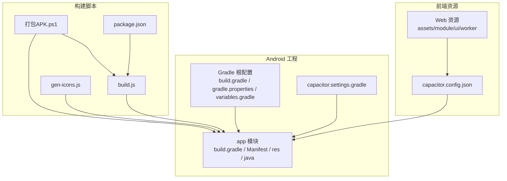
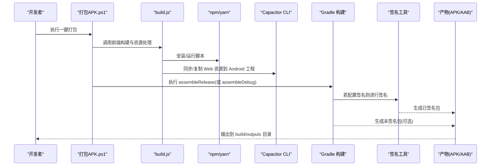
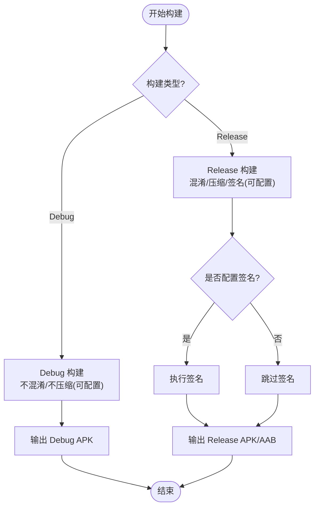
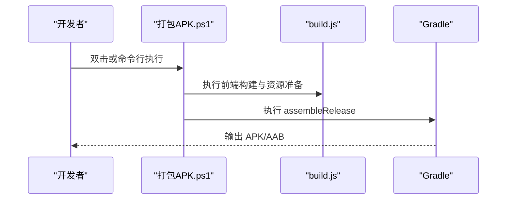
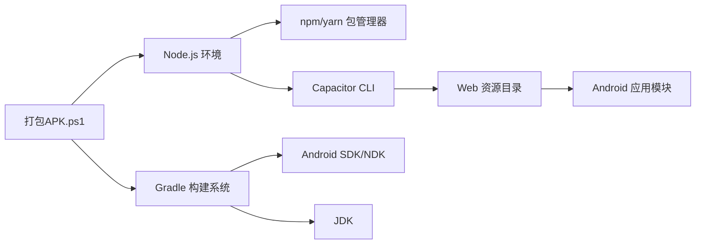

# APK打包与发布

<cite>
**本文引用的文件**   
- [apk/android/app/build.gradle](file://apk/android/app/build.gradle)
- [apk/android/app/proguard-rules.pro](file://apk/android/app/proguard-rules.pro)
- [apk/android/gradle.properties](file://apk/android/gradle.properties)
- [apk/android/variables.gradle](file://apk/android/variables.gradle)
- [apk/android/capacitor.settings.gradle](file://apk/android/capacitor.settings.gradle)
- [apk/android/build.gradle](file://apk/android/build.gradle)
- [apk/android/app/src/main/AndroidManifest.xml](file://apk/android/app/src/main/AndroidManifest.xml)
- [apk/android/app/src/main/res/values/strings.xml](file://apk/android/app/src/main/res/values/strings.xml)
- [apk/android/app/src/main/res/values/styles.xml](file://apk/android/app/src/main/res/values/styles.xml)
- [apk/android/app/src/main/java/com/jihaitang/jxz/MainActivity.java](file://apk/android/app/src/main/java/com/jihaitang/jxz/MainActivity.java)
- [apk/capacitor.config.json](file://apk/capacitor.config.json)
- [apk/package.json](file://apk/package.json)
- [apk/build.js](file://apk/build.js)
- [apk/gen-icons.js](file://apk/gen-icons.js)
- [打包APK.ps1](file://打包APK.ps1)
- [开发文档/apk打包方案.md](file://开发文档/apk打包方案.md)
</cite>

## 目录
1. [简介](#简介)
2. [项目结构](#项目结构)
3. [核心组件](#核心组件)
4. [架构总览](#架构总览)
5. [详细组件分析](#详细组件分析)
6. [依赖关系分析](#依赖关系分析)
7. [性能考虑](#性能考虑)
8. [故障排查指南](#故障排查指南)
9. [结论](#结论)
10. [附录](#附录)

## 简介
本指南面向使用 Capacitor 构建的 Android 应用，提供从开发到发布的完整 APK 打包与发布操作手册。内容涵盖：
- 完整打包流程与步骤要求
- 应用签名配置与安全注意事项
- 代码混淆与资源优化配置
- 自动化打包脚本（PowerShell 与 JavaScript）使用方法
- 不同发布渠道的适配要求
- 常见问题排查与解决方案

## 项目结构
本项目采用 Capacitor 将 Web 前端工程封装为原生 Android 应用。关键目录与职责如下：
- apk/android：Android 原生工程与 Gradle 构建配置
- apk：Capacitor 配置、Node 构建脚本与图标生成脚本
- assets、module、ui、worker 等：Web 前端资源与逻辑（由 Capacitor 注入到 APK）
- 根目录 PowerShell 脚本：一键打包入口

图表来源
- [apk/capacitor.config.json](file://apk/capacitor.config.json)
- [apk/build.js](file://apk/build.js)
- [apk/gen-icons.js](file://apk/gen-icons.js)
- [apk/package.json](file://apk/package.json)
- [apk/android/app/build.gradle](file://apk/android/app/build.gradle)
- [apk/android/build.gradle](file://apk/android/build.gradle)
- [apk/android/gradle.properties](file://apk/android/gradle.properties)
- [apk/android/variables.gradle](file://apk/android/variables.gradle)
- [apk/android/capacitor.settings.gradle](file://apk/android/capacitor.settings.gradle)

章节来源
- [apk/capacitor.config.json](file://apk/capacitor.config.json)
- [apk/build.js](file://apk/build.js)
- [apk/gen-icons.js](file://apk/gen-icons.js)
- [apk/package.json](file://apk/package.json)
- [apk/android/app/build.gradle](file://apk/android/app/build.gradle)
- [apk/android/build.gradle](file://apk/android/build.gradle)
- [apk/android/gradle.properties](file://apk/android/gradle.properties)
- [apk/android/variables.gradle](file://apk/android/variables.gradle)
- [apk/android/capacitor.settings.gradle](file://apk/android/capacitor.settings.gradle)

## 核心组件
- Android 应用模块
  - 构建脚本：定义版本信息、依赖、混淆与签名相关选项
  - 清单与资源：声明权限、主题、字符串与应用图标
  - 主 Activity：承载 WebView 并桥接 Capacitor 插件
- Capacitor 配置
  - 指定 Web 资源目录、插件行为、调试开关等
- 构建脚本
  - Node 脚本：执行前端构建、资源处理、生成图标
  - PowerShell 脚本：串联 Node 与 Gradle，完成一键打包
- Gradle 全局配置
  - 统一版本、仓库、JVM 参数、是否启用混淆与压缩等

章节来源
- [apk/android/app/build.gradle](file://apk/android/app/build.gradle)
- [apk/android/app/src/main/AndroidManifest.xml](file://apk/android/app/src/main/AndroidManifest.xml)
- [apk/android/app/src/main/res/values/strings.xml](file://apk/android/app/src/main/res/values/strings.xml)
- [apk/android/app/src/main/res/values/styles.xml](file://apk/android/app/src/main/res/values/styles.xml)
- [apk/android/app/src/main/java/com/jihaitang/jxz/MainActivity.java](file://apk/android/app/src/main/java/com/jihaitang/jxz/MainActivity.java)
- [apk/capacitor.config.json](file://apk/capacitor.config.json)
- [apk/build.js](file://apk/build.js)
- [apk/gen-icons.js](file://apk/gen-icons.js)
- [apk/package.json](file://apk/package.json)
- [apk/android/build.gradle](file://apk/android/build.gradle)
- [apk/android/gradle.properties](file://apk/android/gradle.properties)
- [apk/android/variables.gradle](file://apk/android/variables.gradle)

## 架构总览
下图展示从“一键打包”到“输出 APK/AAB”的关键调用链与数据流。

图表来源
- [打包APK.ps1](file://打包APK.ps1)
- [apk/build.js](file://apk/build.js)
- [apk/package.json](file://apk/package.json)
- [apk/capacitor.config.json](file://apk/capacitor.config.json)
- [apk/android/app/build.gradle](file://apk/android/app/build.gradle)

## 详细组件分析

### Android 应用模块与构建配置
- 构建目标与产物
  - 支持 Debug 与 Release 构建变体；Release 默认开启混淆与资源压缩
- 版本与元信息
  - 版本号、名称、图标、启动页等在清单与资源中声明
- 混淆与压缩
  - 通过 ProGuard/R8 规则文件控制保留类与方法
  - 可结合 Gradle 属性开关混淆与资源压缩
- 签名配置
  - 在 Gradle 中配置 keystore 路径、别名、密码等信息
  - 建议通过环境变量注入敏感信息，避免硬编码

图表来源
- [apk/android/app/build.gradle](file://apk/android/app/build.gradle)
- [apk/android/app/proguard-rules.pro](file://apk/android/app/proguard-rules.pro)
- [apk/android/gradle.properties](file://apk/android/gradle.properties)

章节来源
- [apk/android/app/build.gradle](file://apk/android/app/build.gradle)
- [apk/android/app/proguard-rules.pro](file://apk/android/app/proguard-rules.pro)
- [apk/android/gradle.properties](file://apk/android/gradle.properties)
- [apk/android/variables.gradle](file://apk/android/variables.gradle)
- [apk/android/app/src/main/AndroidManifest.xml](file://apk/android/app/src/main/AndroidManifest.xml)
- [apk/android/app/src/main/res/values/strings.xml](file://apk/android/app/src/main/res/values/strings.xml)
- [apk/android/app/src/main/res/values/styles.xml](file://apk/android/app/src/main/res/values/styles.xml)
- [apk/android/app/src/main/java/com/jihaitang/jxz/MainActivity.java](file://apk/android/app/src/main/java/com/jihaitang/jxz/MainActivity.java)

### Capacitor 配置与前端集成
- 资源目录映射
  - 指定 Web 资源目录，确保构建后资源被复制到 Android 工程
- 插件与权限
  - 按需启用插件，并在清单中声明所需权限
- 调试与日志
  - 开发阶段可开启调试模式，便于定位问题

章节来源
- [apk/capacitor.config.json](file://apk/capacitor.config.json)
- [apk/android/app/src/main/AndroidManifest.xml](file://apk/android/app/src/main/AndroidManifest.xml)

### 构建脚本与自动化
- Node 构建脚本
  - 负责前端构建、资源拷贝、图标生成等前置步骤
- PowerShell 一键打包
  - 串联 Node 与 Gradle，自动执行构建、混淆、签名与产物整理
- package.json 脚本
  - 暴露常用命令，便于本地快速迭代

图表来源
- [打包APK.ps1](file://打包APK.ps1)
- [apk/build.js](file://apk/build.js)
- [apk/package.json](file://apk/package.json)

章节来源
- [打包APK.ps1](file://打包APK.ps1)
- [apk/build.js](file://apk/build.js)
- [apk/gen-icons.js](file://apk/gen-icons.js)
- [apk/package.json](file://apk/package.json)

### 应用签名配置与安全注意事项
- 签名位置
  - 在 Gradle 构建脚本中配置 keystore 路径、别名、密码
- 安全建议
  - 使用环境变量或 CI 密钥管理注入敏感信息
  - 不要将 keystore 与密码提交至版本库
  - 妥善保管私钥，定期轮换
- 产物校验
  - 使用签名验证工具确认签名有效且一致

章节来源
- [apk/android/app/build.gradle](file://apk/android/app/build.gradle)
- [apk/android/gradle.properties](file://apk/android/gradle.properties)

### 代码混淆与资源优化
- 混淆规则
  - 通过 ProGuard/R8 规则文件保留必要类、方法、反射入口
- 资源压缩
  - 在 Release 构建中启用资源压缩与无用资源剔除
- 性能权衡
  - 谨慎添加 keep 规则，避免过度保留导致体积增大

章节来源
- [apk/android/app/proguard-rules.pro](file://apk/android/app/proguard-rules.pro)
- [apk/android/app/build.gradle](file://apk/android/app/build.gradle)
- [apk/android/gradle.properties](file://apk/android/gradle.properties)

### 多渠道打包与适配方案
- 构建变体
  - 利用 flavor 区分渠道（如应用商店、内部测试、企业分发）
- 差异化配置
  - 针对不同渠道设置不同的包名、图标、主题、权限与后端地址
- 产物命名
  - 在产物文件名中包含渠道与版本信息，便于追踪

章节来源
- [apk/android/app/build.gradle](file://apk/android/app/build.gradle)
- [apk/android/variables.gradle](file://apk/android/variables.gradle)

## 依赖关系分析
- 外部依赖
  - Gradle、Android SDK、Java/JDK、Node.js、Capacitor CLI
- 内部依赖
  - 构建脚本依赖 Node 环境；PowerShell 脚本依赖 Node 与 Gradle
  - Android 模块依赖 Capacitor 运行时与插件

图表来源
- [打包APK.ps1](file://打包APK.ps1)
- [apk/build.js](file://apk/build.js)
- [apk/package.json](file://apk/package.json)
- [apk/capacitor.config.json](file://apk/capacitor.config.json)
- [apk/android/app/build.gradle](file://apk/android/app/build.gradle)

章节来源
- [打包APK.ps1](file://打包APK.ps1)
- [apk/build.js](file://apk/build.js)
- [apk/package.json](file://apk/package.json)
- [apk/capacitor.config.json](file://apk/capacitor.config.json)
- [apk/android/app/build.gradle](file://apk/android/app/build.gradle)

## 性能考虑
- 构建速度
  - 启用并行构建与缓存；合理划分任务，减少重复工作
- 产物体积
  - 启用资源压缩与图片优化；移除未使用的资源与依赖
- 运行时性能
  - 合理使用混淆策略，避免误删关键反射入口
  - 对大资源进行懒加载与分片加载

[本节为通用指导，无需特定文件引用]

## 故障排查指南
- 无法找到 Java 或 Gradle
  - 检查 JDK 与 Gradle 版本是否与工程要求匹配
  - 确认 PATH 与环境变量配置正确
- 构建失败提示缺少依赖
  - 清理缓存并重新安装依赖；检查网络与镜像源
- 资源未生效
  - 确认 Capacitor 配置指向正确的 Web 资源目录
  - 执行资源同步后再构建
- 签名错误
  - 核对 keystore 路径、别名与密码
  - 使用签名验证工具检查签名一致性
- 混淆导致崩溃
  - 逐步缩小 keep 范围，定位缺失保留规则
  - 查看混淆后的堆栈并进行反混淆

章节来源
- [apk/android/app/build.gradle](file://apk/android/app/build.gradle)
- [apk/android/gradle.properties](file://apk/android/gradle.properties)
- [apk/capacitor.config.json](file://apk/capacitor.config.json)
- [开发文档/apk打包方案.md](file://开发文档/apk打包方案.md)

## 结论
通过本指南，您可以基于现有工程完成从开发到发布的完整 APK 打包流程。重点在于：
- 正确使用一键打包脚本，减少手工操作
- 规范签名管理与安全实践
- 合理配置混淆与资源优化，平衡体积与稳定性
- 针对多渠道制定差异化构建策略
- 建立完善的故障排查与回归验证流程

[本节为总结性内容，无需特定文件引用]

## 附录
- 参考文档
  - 项目内打包方案说明：[开发文档/apk打包方案.md](file://开发文档/apk打包方案.md)
- 常用命令
  - 本地构建与调试：参考 package.json 中的脚本命令
  - 一键打包：执行根目录 PowerShell 脚本

章节来源
- [开发文档/apk打包方案.md](file://开发文档/apk打包方案.md)
- [apk/package.json](file://apk/package.json)
- [打包APK.ps1](file://打包APK.ps1)