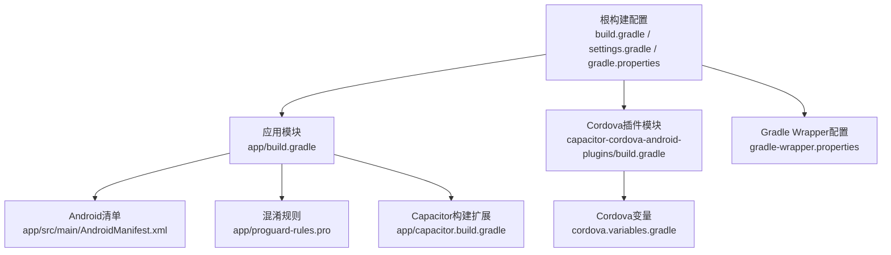
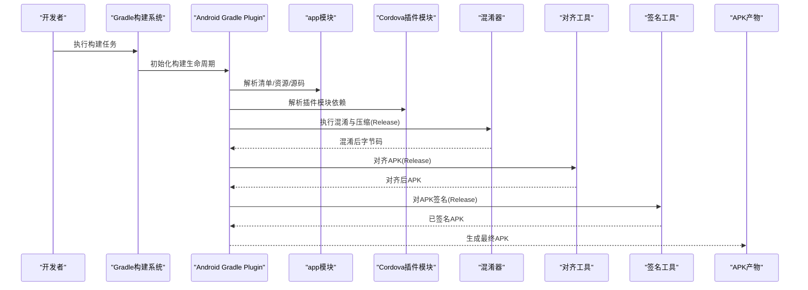
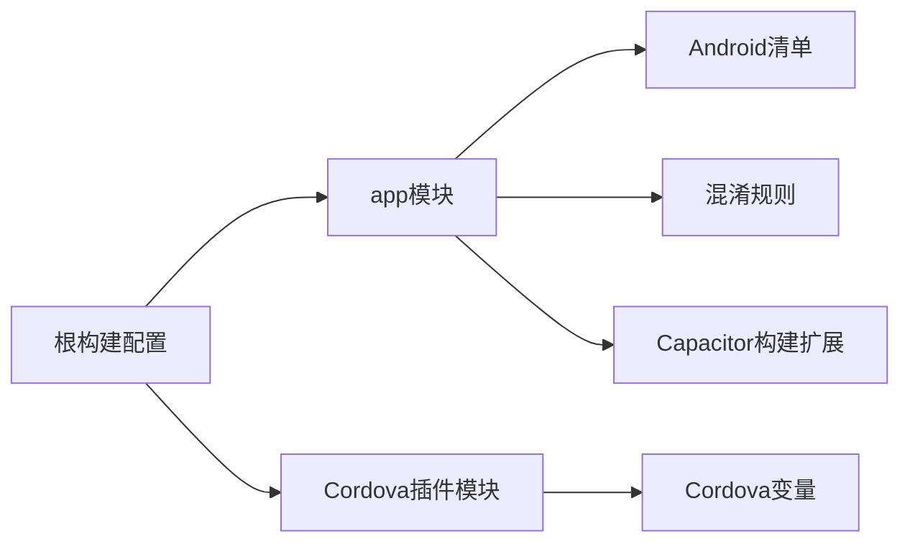
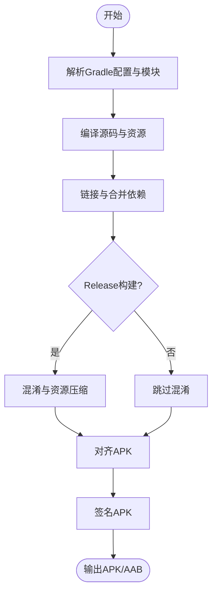

# Android构建配置

<cite>
**本文引用的文件**   
- [apk/android/build.gradle](file://apk/android/build.gradle)
- [apk/android/app/build.gradle](file://apk/android/app/build.gradle)
- [apk/android/app/proguard-rules.pro](file://apk/android/app/proguard-rules.pro)
- [apk/android/gradle.properties](file://apk/android/gradle.properties)
- [apk/android/settings.gradle](file://apk/android/settings.gradle)
- [apk/android/capacitor.settings.gradle](file://apk/android/capacitor.settings.gradle)
- [apk/android/variables.gradle](file://apk/android/variables.gradle)
- [apk/android/gradle/wrapper/gradle-wrapper.properties](file://apk/android/gradle/wrapper/gradle-wrapper.properties)
- [apk/android/app/src/main/AndroidManifest.xml](file://apk/android/app/src/main/AndroidManifest.xml)
- [apk/android/app/capacitor.build.gradle](file://apk/android/app/capacitor.build.gradle)
- [apk/android/capacitor-cordova-android-plugins/build.gradle](file://apk/android/capacitor-cordova-android-plugins/build.gradle)
- [apk/android/capacitor-cordova-android-plugins/cordova.variables.gradle](file://apk/android/capacitor-cordova-android-plugins/cordova.variables.gradle)
- [apk/build.js](file://apk/build.js)
- [打包APK.ps1](file://打包APK.ps1)
</cite>

## 目录
1. [简介](#简介)
2. [项目结构](#项目结构)
3. [核心组件](#核心组件)
4. [架构总览](#架构总览)
5. [详细组件分析](#详细组件分析)
6. [依赖关系分析](#依赖关系分析)
7. [性能考虑](#性能考虑)
8. [故障排查指南](#故障排查指南)
9. [结论](#结论)
10. [附录](#附录)

## 简介
本文件面向Android与Capacitor混合工程，系统化梳理Gradle构建配置结构与各模块职责，重点解析app模块的构建脚本（依赖管理、签名、混淆、资源优化等），说明Gradle属性与项目级设置，阐述多模块构建流程与依赖管理策略，并提供构建性能优化技巧、常见问题排查方法以及自动化构建脚本使用指南。文档以仓库中实际存在的Gradle脚本与配置文件为依据，帮助读者快速理解并高效维护该项目的构建体系。

## 项目结构
本项目采用“根Gradle + app主模块 + Capacitor插件模块”的多模块结构：
- 根目录包含全局构建脚本、Gradle Wrapper与属性配置，用于统一版本与构建行为。
- app模块为应用入口，负责编译Java/Kotlin代码、打包资源、生成APK/AAB。
- capacitor-cordova-android-plugins模块由Capacitor/Cordova生态引入，提供原生桥接能力。
- 顶层JS/PowerShell脚本用于自动化构建流程。

图表来源
- [apk/android/build.gradle](file://apk/android/build.gradle)
- [apk/android/settings.gradle](file://apk/android/settings.gradle)
- [apk/android/gradle.properties](file://apk/android/gradle.properties)
- [apk/android/app/build.gradle](file://apk/android/app/build.gradle)
- [apk/android/app/src/main/AndroidManifest.xml](file://apk/android/app/src/main/AndroidManifest.xml)
- [apk/android/app/proguard-rules.pro](file://apk/android/app/proguard-rules.pro)
- [apk/android/app/capacitor.build.gradle](file://apk/android/app/capacitor.build.gradle)
- [apk/android/capacitor-cordova-android-plugins/build.gradle](file://apk/android/capacitor-cordova-android-plugins/build.gradle)
- [apk/android/capacitor-cordova-android-plugins/cordova.variables.gradle](file://apk/android/capacitor-cordova-android-plugins/cordova.variables.gradle)
- [apk/android/gradle/wrapper/gradle-wrapper.properties](file://apk/android/gradle/wrapper/gradle-wrapper.properties)

章节来源
- [apk/android/build.gradle](file://apk/android/build.gradle)
- [apk/android/settings.gradle](file://apk/android/settings.gradle)
- [apk/android/gradle.properties](file://apk/android/gradle.properties)
- [apk/android/app/build.gradle](file://apk/android/app/build.gradle)
- [apk/android/app/src/main/AndroidManifest.xml](file://apk/android/app/src/main/AndroidManifest.xml)
- [apk/android/app/proguard-rules.pro](file://apk/android/app/proguard-rules.pro)
- [apk/android/app/capacitor.build.gradle](file://apk/android/app/capacitor.build.gradle)
- [apk/android/capacitor-cordova-android-plugins/build.gradle](file://apk/android/capacitor-cordova-android-plugins/build.gradle)
- [apk/android/capacitor-cordova-android-plugins/cordova.variables.gradle](file://apk/android/capacitor-cordova-android-plugins/cordova.variables.gradle)
- [apk/android/gradle/wrapper/gradle-wrapper.properties](file://apk/android/gradle/wrapper/gradle-wrapper.properties)

## 核心组件
- 根构建脚本：集中声明Android Gradle Plugin与工具链版本，供子模块复用，避免版本漂移。
- 应用模块构建脚本：定义应用ID、编译目标、依赖库、签名、混淆、资源处理、产物输出等。
- Gradle属性：控制并行、守护进程、内存、缓存等构建行为。
- Settings与Capacitor集成：注册模块、加载Capacitor相关配置。
- Cordova插件模块：提供Capacitor/Cordova桥接所需原生能力。
- 自动化脚本：封装本地或CI环境下的打包命令与参数。

章节来源
- [apk/android/build.gradle](file://apk/android/build.gradle)
- [apk/android/app/build.gradle](file://apk/android/app/build.gradle)
- [apk/android/gradle.properties](file://apk/android/gradle.properties)
- [apk/android/settings.gradle](file://apk/android/settings.gradle)
- [apk/android/capacitor.settings.gradle](file://apk/android/capacitor.settings.gradle)
- [apk/android/capacitor-cordova-android-plugins/build.gradle](file://apk/android/capacitor-cordova-android-plugins/build.gradle)

## 架构总览
下图展示从源码到APK的关键构建阶段与参与组件的关系。

图表来源
- [apk/android/app/build.gradle](file://apk/android/app/build.gradle)
- [apk/android/app/proguard-rules.pro](file://apk/android/app/proguard-rules.pro)
- [apk/android/capacitor-cordova-android-plugins/build.gradle](file://apk/android/capacitor-cordova-android-plugins/build.gradle)

## 详细组件分析

### 根构建脚本与全局配置
- 作用：集中声明Android Gradle Plugin版本、Google服务插件版本、Kotlin版本等，确保全项目一致。
- 关键点：
  - 通过classpath引入AGP与相关插件。
  - 可配合根级ext块定义共享版本号，供子模块引用。
  - 与settings.gradle协同，决定模块可见性与顺序。

章节来源
- [apk/android/build.gradle](file://apk/android/build.gradle)
- [apk/android/settings.gradle](file://apk/android/settings.gradle)

### 应用模块构建脚本（app）
- 作用：定义应用包名、编译SDK、依赖、签名、混淆、资源处理、构建变体、产物路径等。
- 关键维度：
  - 依赖管理：声明implementation/api/debugImplementation等依赖；可与根级版本目录或变量统一管理。
  - 签名配置：在release构建类型中配置keystore路径、别名、密码等，支持从环境变量或外部文件读取。
  - 代码混淆：启用minifyEnabled与shrinkResources，结合proguard-rules.pro进行裁剪与混淆。
  - 资源优化：启用资源压缩与重命名，减少APK体积。
  - 构建变体：debug/release差异配置（如日志开关、调试图标、网络代理等）。
  - 产物输出：自定义APK/AAB输出文件名与目录，便于发布归档。

章节来源
- [apk/android/app/build.gradle](file://apk/android/app/build.gradle)
- [apk/android/app/proguard-rules.pro](file://apk/android/app/proguard-rules.pro)

### Gradle属性与项目级设置
- 作用：控制Gradle运行期行为，提升构建速度与稳定性。
- 常见项：
  - 并行与守护进程：开启多线程与后台守护以提升速度。
  - 内存与JVM参数：合理分配堆大小与元空间，避免OOM。
  - 构建缓存与增量编译：启用缓存与增量编译，缩短冷/热构建时间。
  - 网络与代理：配置镜像源与代理，加速依赖下载。
  - Android特定：NDK/SDK路径、R8/ProGuard选项、资源压缩开关等。

章节来源
- [apk/android/gradle.properties](file://apk/android/gradle.properties)

### Settings与Capacitor集成
- 作用：注册模块、加载Capacitor相关配置，使Capacitor插件与Web前端资源正确纳入构建。
- 关键点：
  - 通过include声明模块。
  - 引入Capacitor提供的settings片段，自动注入必要任务与路径。

章节来源
- [apk/android/settings.gradle](file://apk/android/settings.gradle)
- [apk/android/capacitor.settings.gradle](file://apk/android/capacitor.settings.gradle)

### Cordova插件模块
- 作用：提供Capacitor/Cordova桥接所需的原生实现与资源。
- 关键点：
  - 独立模块，被app模块依赖。
  - 可能包含自身变量脚本与资源，需与主模块协调版本与API兼容。

章节来源
- [apk/android/capacitor-cordova-android-plugins/build.gradle](file://apk/android/capacitor-cordova-android-plugins/build.gradle)
- [apk/android/capacitor-cordova-android-plugins/cordova.variables.gradle](file://apk/android/capacitor-cordova-android-plugins/cordova.variables.gradle)

### Android清单与权限
- 作用：声明应用组件、权限、启动模式、主题等，是构建与安装的基础。
- 建议：
  - 按需申请权限，避免过度授权。
  - 明确application标签中的必要属性（如usesCleartextTraffic、networkSecurityConfig等）。

章节来源
- [apk/android/app/src/main/AndroidManifest.xml](file://apk/android/app/src/main/AndroidManifest.xml)

### Capacitor构建扩展
- 作用：在app模块中扩展Capacitor相关构建逻辑（如资源拷贝、插件扫描等）。
- 建议：
  - 遵循Capacitor官方约定，避免覆盖默认任务导致异常。
  - 如需自定义，尽量通过afterEvaluate或Task钩子安全扩展。

章节来源
- [apk/android/app/capacitor.build.gradle](file://apk/android/app/capacitor.build.gradle)

### 混淆与资源优化
- 混淆：
  - 在release构建类型启用minifyEnabled与shrinkResources。
  - 将规则写入proguard-rules.pro，按模块/功能组织，避免误删反射与第三方库类。
- 资源优化：
  - 启用资源压缩与重命名，清理未使用资源。
  - 注意动态加载的资源不要被误删，必要时添加keep规则。

章节来源
- [apk/android/app/build.gradle](file://apk/android/app/build.gradle)
- [apk/android/app/proguard-rules.pro](file://apk/android/app/proguard-rules.pro)

### 自动化构建脚本
- JS脚本：封装npm/yarn命令，调用Gradle任务完成构建与打包。
- PowerShell脚本：封装Windows环境下的打包流程，支持传入签名信息与构建变体。
- 建议：
  - 将敏感信息（密钥、密码）通过环境变量注入，避免硬编码。
  - 在CI中复用同一套脚本，保证一致性。

章节来源
- [apk/build.js](file://apk/build.js)
- [打包APK.ps1](file://打包APK.ps1)

## 依赖关系分析
- 模块耦合：
  - app模块直接依赖capacitor-cordova-android-plugins模块。
  - 两者共同受根级AGP与工具链版本约束。
- 外部依赖：
  - Android SDK/NDK、Gradle Wrapper、第三方库（由各自模块声明）。
- 潜在风险：
  - 版本不一致导致冲突（AGP、Kotlin、Support/AndroidX）。
  - 混淆规则缺失导致运行时崩溃。
  - 资源压缩误删动态资源。

图表来源
- [apk/android/build.gradle](file://apk/android/build.gradle)
- [apk/android/app/build.gradle](file://apk/android/app/build.gradle)
- [apk/android/capacitor-cordova-android-plugins/build.gradle](file://apk/android/capacitor-cordova-android-plugins/build.gradle)
- [apk/android/app/src/main/AndroidManifest.xml](file://apk/android/app/src/main/AndroidManifest.xml)
- [apk/android/app/proguard-rules.pro](file://apk/android/app/proguard-rules.pro)
- [apk/android/app/capacitor.build.gradle](file://apk/android/app/capacitor.build.gradle)
- [apk/android/capacitor-cordova-android-plugins/cordova.variables.gradle](file://apk/android/capacitor-cordova-android-plugins/cordova.variables.gradle)

章节来源
- [apk/android/build.gradle](file://apk/android/build.gradle)
- [apk/android/app/build.gradle](file://apk/android/app/build.gradle)
- [apk/android/capacitor-cordova-android-plugins/build.gradle](file://apk/android/capacitor-cordova-android-plugins/build.gradle)

## 性能考虑
- 构建加速
  - 启用并行构建与守护进程，合理设置JVM堆大小。
  - 启用构建缓存与增量编译，利用远程缓存（CI场景）。
  - 使用Gradle Wrapper锁定版本，避免环境差异。
- 依赖优化
  - 使用BOM或版本目录统一管理依赖版本，减少冲突。
  - 仅引入必要依赖，避免传递性依赖膨胀。
- 资源与混淆
  - 启用资源压缩与重命名，定期清理无用资源。
  - 精细化混淆规则，避免过度保守导致体积增大。
- 产物优化
  - 使用AAB替代APK，降低分发体积。
  - 拆分ABI与语言资源，按需下发。

[本节为通用指导，不直接分析具体文件]

## 故障排查指南
- 构建失败
  - 检查AGP与Kotlin版本兼容性。
  - 查看Gradle控制台错误栈，定位具体任务与原因。
  - 确认Android SDK/NDK路径与权限。
- 依赖冲突
  - 使用./gradlew :app:dependencies查看依赖树。
  - 通过exclude或强制版本解决冲突。
- 混淆问题
  - 针对反射、序列化、第三方库添加keep规则。
  - 使用ProGuard/R8日志定位被移除的类与方法。
- 资源丢失
  - 检查资源压缩是否误删动态资源，添加keep规则。
  - 验证资源路径与命名规范。
- 签名与打包
  - 校验keystore路径、别名、密码与环境变量注入。
  - 确认签名算法与平台要求匹配。

章节来源
- [apk/android/app/build.gradle](file://apk/android/app/build.gradle)
- [apk/android/app/proguard-rules.pro](file://apk/android/app/proguard-rules.pro)
- [apk/android/gradle.properties](file://apk/android/gradle.properties)

## 结论
通过对根构建脚本、app模块、Capacitor与Cordova插件模块的系统梳理，明确了该Android工程的构建结构与关键配置点。围绕依赖管理、签名、混淆与资源优化，提供了可操作的优化建议与排障方法。借助自动化脚本与Gradle属性调优，可在本地与CI环境中稳定高效地产出高质量产物。

[本节为总结性内容，不直接分析具体文件]

## 附录

### 构建流程概览（概念图）

[此图为概念流程，不映射具体文件，故无图表来源]

### 常用Gradle任务与命令
- 列出所有任务：./gradlew tasks
- 查看依赖树：./gradlew :app:dependencies
- 构建Debug：./gradlew assembleDebug
- 构建Release：./gradlew assembleRelease
- 清理构建：./gradlew clean

[本节为通用指导，不直接分析具体文件]