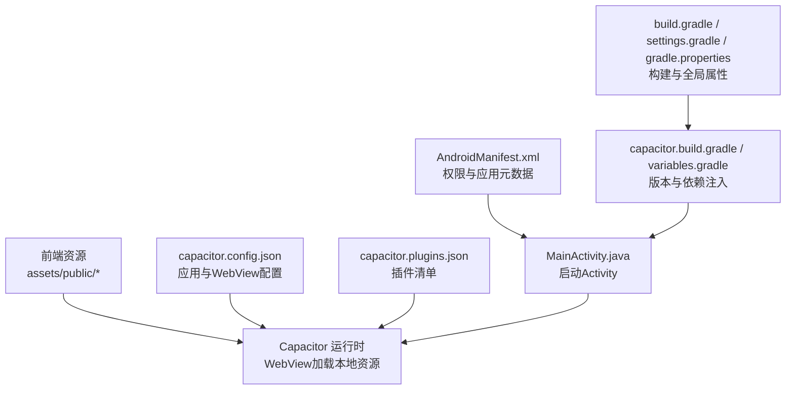
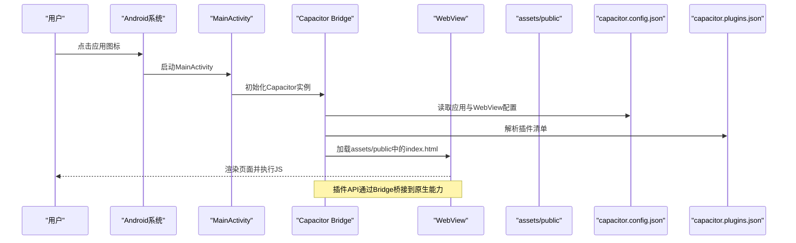
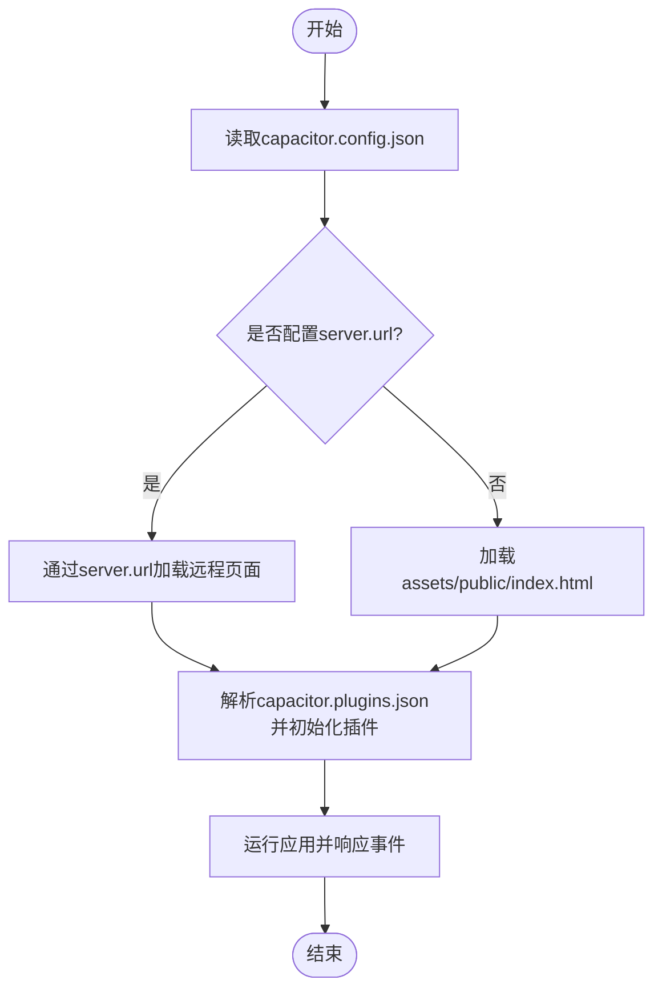
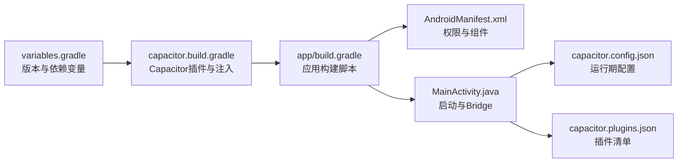

# Capacitor配置与集成

<cite>
**本文引用的文件**   
- [capacitor.config.json](file://apk/android/app/src/main/assets/public/capacitor.config.json)
- [capacitor.plugins.json](file://apk/android/app/src/main/assets/public/capacitor.plugins.json)
- [MainActivity.java](file://apk/android/app/src/main/java/com/jihaitang/jxz/MainActivity.java)
- [AndroidManifest.xml](file://apk/android/app/src/main/AndroidManifest.xml)
- [build.gradle](file://apk/android/app/build.gradle)
- [capacitor.build.gradle](file://apk/android/app/capacitor.build.gradle)
- [variables.gradle](file://apk/android/variables.gradle)
- [settings.gradle](file://apk/android/settings.gradle)
- [gradle.properties](file://apk/android/gradle.properties)
</cite>

## 目录
1. [简介](#简介)
2. [项目结构](#项目结构)
3. [核心组件](#核心组件)
4. [架构总览](#架构总览)
5. [详细组件分析](#详细组件分析)
6. [依赖关系分析](#依赖关系分析)
7. [性能考虑](#性能考虑)
8. [故障排查指南](#故障排查指南)
9. [结论](#结论)
10. [附录](#附录)

## 简介
本文件面向使用Capacitor将Web应用打包为Android应用的开发者，聚焦于Capacitor在Android平台的配置与集成。文档围绕以下目标展开：
- 解释capacitor.config.json的结构与关键参数（应用基本信息、Web视图行为、插件管理等）
- 说明Android平台特定的Capacitor配置项与最佳实践
- 阐述插件系统配置方法与自定义插件集成流程
- 提供常见问题解决方案与性能优化建议
- 给出实际配置示例与调试技巧，帮助快速搭建与排障

## 项目结构
本项目采用“前端资源 + Android原生工程”的混合结构。Capacitor的核心配置文件位于Android工程的assets目录下，构建产物由Gradle脚本生成并注入到Android应用中。

图表来源
- [capacitor.config.json:1-200](file://apk/android/app/src/main/assets/public/capacitor.config.json#L1-L200)
- [capacitor.plugins.json:1-200](file://apk/android/app/src/main/assets/public/capacitor.plugins.json#L1-L200)
- [MainActivity.java:1-200](file://apk/android/app/src/main/java/com/jihaitang/jxz/MainActivity.java#L1-L200)
- [AndroidManifest.xml:1-200](file://apk/android/app/src/main/AndroidManifest.xml#L1-L200)
- [capacitor.build.gradle:1-200](file://apk/android/app/capacitor.build.gradle#L1-L200)
- [variables.gradle:1-200](file://apk/android/variables.gradle#L1-L200)
- [build.gradle:1-200](file://apk/android/app/build.gradle#L1-L200)
- [settings.gradle:1-200](file://apk/android/settings.gradle#L1-L200)
- [gradle.properties:1-200](file://apk/android/gradle.properties#L1-L200)

章节来源
- [capacitor.config.json:1-200](file://apk/android/app/src/main/assets/public/capacitor.config.json#L1-L200)
- [capacitor.plugins.json:1-200](file://apk/android/app/src/main/assets/public/capacitor.plugins.json#L1-L200)
- [MainActivity.java:1-200](file://apk/android/app/src/main/java/com/jihaitang/jxz/MainActivity.java#L1-L200)
- [AndroidManifest.xml:1-200](file://apk/android/app/src/main/AndroidManifest.xml#L1-L200)
- [capacitor.build.gradle:1-200](file://apk/android/app/capacitor.build.gradle#L1-L200)
- [variables.gradle:1-200](file://apk/android/variables.gradle#L1-L200)
- [build.gradle:1-200](file://apk/android/app/build.gradle#L1-L200)
- [settings.gradle:1-200](file://apk/android/settings.gradle#L1-L200)
- [gradle.properties:1-200](file://apk/android/gradle.properties#L1-L200)

## 核心组件
- 应用与运行期配置
  - capacitor.config.json：定义应用标识、默认URL、窗口行为、安全策略、插件白名单等
  - capacitor.plugins.json：声明启用的插件及其可选配置
- Android入口与系统集成
  - MainActivity.java：Capacitor Activity实现，负责初始化Bridge、加载Web内容、处理生命周期
  - AndroidManifest.xml：声明应用元数据、权限、Intent过滤器等
- 构建与依赖注入
  - capacitor.build.gradle：Capacitor Gradle插件与依赖注入逻辑
  - variables.gradle：集中管理Capacitor版本、AndroidX、Kotlin等变量
  - build.gradle / settings.gradle / gradle.properties：项目构建、模块设置与全局属性

章节来源
- [capacitor.config.json:1-200](file://apk/android/app/src/main/assets/public/capacitor.config.json#L1-L200)
- [capacitor.plugins.json:1-200](file://apk/android/app/src/main/assets/public/capacitor.plugins.json#L1-L200)
- [MainActivity.java:1-200](file://apk/android/app/src/main/java/com/jihaitang/jxz/MainActivity.java#L1-L200)
- [AndroidManifest.xml:1-200](file://apk/android/app/src/main/AndroidManifest.xml#L1-L200)
- [capacitor.build.gradle:1-200](file://apk/android/app/capacitor.build.gradle#L1-L200)
- [variables.gradle:1-200](file://apk/android/variables.gradle#L1-L200)
- [build.gradle:1-200](file://apk/android/app/build.gradle#L1-L200)
- [settings.gradle:1-200](file://apk/android/settings.gradle#L1-L200)
- [gradle.properties:1-200](file://apk/android/gradle.properties#L1-L200)

## 架构总览
下图展示了从应用启动到Web内容渲染的关键路径，以及配置文件的生效位置。

图表来源
- [MainActivity.java:1-200](file://apk/android/app/src/main/java/com/jihaitang/jxz/MainActivity.java#L1-L200)
- [capacitor.config.json:1-200](file://apk/android/app/src/main/assets/public/capacitor.config.json#L1-L200)
- [capacitor.plugins.json:1-200](file://apk/android/app/src/main/assets/public/capacitor.plugins.json#L1-L200)

## 详细组件分析

### capacitor.config.json 结构与参数
该文件是Capacitor运行期的核心配置，通常包含如下类别：
- 应用基本信息
  - appId：包名标识
  - appName：显示名称
  - webDir：Web资源目录（通常为public或dist）
- Web视图与加载策略
  - server.url：开发服务器地址（用于热重载）
  - server.allowMixedContent：是否允许混合内容
  - server.hostname：主机名（用于localhost映射）
  - backgroundColor：背景色
  - clearCache：是否清理缓存
  - allowNavigationToExternalUrls：是否允许导航到外部URL
- 安全与跨域
  - security：包括webviewSecurity、allowFileAccessFromFileURLs、allowUniversalAccessFromFileURLs等
- 插件与桥接
  - plugins：启用插件列表及插件级配置
- 其他行为
  - androidScheme、androidPathPrefix、androidAllowFileScheme等

章节来源
- [capacitor.config.json:1-200](file://apk/android/app/src/main/assets/public/capacitor.config.json#L1-L200)

### capacitor.plugins.json 插件清单
- 作用：声明需要注入的插件及其配置项
- 常见字段：
  - name：插件包名或类名
  - options：插件特定配置对象
- 注意事项：
  - 仅列出已安装且被Gradle引入的插件
  - 避免重复声明导致冲突
  - 某些插件需要在AndroidManifest中声明权限或Activity

章节来源
- [capacitor.plugins.json:1-200](file://apk/android/app/src/main/assets/public/capacitor.plugins.json#L1-L200)

### MainActivity.java 启动流程
- 职责：
  - 继承CapacitorActivity
  - 初始化Capacitor实例与Bridge
  - 加载Web资源（优先server.url，否则本地assets）
  - 处理生命周期回调（onResume/onPause等）
- 关键点：
  - 若配置了server.url，则通过远程地址加载；否则加载本地assets/public下的入口页
  - 可在此处注册自定义插件或覆盖默认行为

章节来源
- [MainActivity.java:1-200](file://apk/android/app/src/main/java/com/jihaitang/jxz/MainActivity.java#L1-L200)

### AndroidManifest.xml 权限与元数据
- 常用项：
  - application节点：应用图标、主题、网络与安全策略
  - uses-permission：网络、存储、相机、麦克风等
  - activity节点：主Activity声明、屏幕方向、全屏模式
  - provider：文件共享（如FileProvider）
- 与Capacitor的关系：
  - 部分插件需要额外权限或组件声明
  - 安全相关策略会影响WebView访问本地文件或跨域资源

章节来源
- [AndroidManifest.xml:1-200](file://apk/android/app/src/main/AndroidManifest.xml#L1-L200)

### Gradle构建与依赖注入
- capacitor.build.gradle
  - 引入Capacitor Gradle插件
  - 根据capacitor.config.json与capacitor.plugins.json注入依赖
  - 生成R类与资源映射
- variables.gradle
  - 集中定义Capacitor版本、AndroidX、Kotlin版本等
  - 便于统一升级与一致性管理
- build.gradle / settings.gradle / gradle.properties
  - 构建选项、JVM参数、仓库源、签名信息等

章节来源
- [capacitor.build.gradle:1-200](file://apk/android/app/capacitor.build.gradle#L1-L200)
- [variables.gradle:1-200](file://apk/android/variables.gradle#L1-L200)
- [build.gradle:1-200](file://apk/android/app/build.gradle#L1-L200)
- [settings.gradle:1-200](file://apk/android/settings.gradle#L1-L200)
- [gradle.properties:1-200](file://apk/android/gradle.properties#L1-L200)

### 插件系统与自定义插件集成流程
- 第三方插件
  - 在package.json中安装插件
  - 在capacitor.plugins.json中声明插件与配置
  - 在AndroidManifest中按需添加权限或组件
- 自定义插件
  - 创建Android模块（Java/Kotlin），实现Plugin基类
  - 暴露方法供JS调用（@CapacitorPlugin注解）
  - 在capacitor.plugins.json中注册插件类名
  - 在MainActivity中确保插件被扫描与注册
- 调试技巧
  - 使用Chrome DevTools连接WebView进行断点调试
  - 查看Logcat输出定位原生侧错误
  - 检查capacitor.config.json中server.url以启用远程调试

章节来源
- [capacitor.plugins.json:1-200](file://apk/android/app/src/main/assets/public/capacitor.plugins.json#L1-L200)
- [MainActivity.java:1-200](file://apk/android/app/src/main/java/com/jihaitang/jxz/MainActivity.java#L1-L200)
- [AndroidManifest.xml:1-200](file://apk/android/app/src/main/AndroidManifest.xml#L1-L200)

### 配置流程图（概念性）

[此图为概念性流程图，不直接映射具体源码文件]

## 依赖关系分析
Capacitor在Android端的依赖主要由Gradle脚本与Capacitor运行时组成，核心关系如下：

图表来源
- [variables.gradle:1-200](file://apk/android/variables.gradle#L1-L200)
- [capacitor.build.gradle:1-200](file://apk/android/app/capacitor.build.gradle#L1-L200)
- [build.gradle:1-200](file://apk/android/app/build.gradle#L1-L200)
- [AndroidManifest.xml:1-200](file://apk/android/app/src/main/AndroidManifest.xml#L1-L200)
- [MainActivity.java:1-200](file://apk/android/app/src/main/java/com/jihaitang/jxz/MainActivity.java#L1-L200)
- [capacitor.config.json:1-200](file://apk/android/app/src/main/assets/public/capacitor.config.json#L1-L200)
- [capacitor.plugins.json:1-200](file://apk/android/app/src/main/assets/public/capacitor.plugins.json#L1-L200)

章节来源
- [variables.gradle:1-200](file://apk/android/variables.gradle#L1-L200)
- [capacitor.build.gradle:1-200](file://apk/android/app/capacitor.build.gradle#L1-L200)
- [build.gradle:1-200](file://apk/android/app/build.gradle#L1-L200)
- [AndroidManifest.xml:1-200](file://apk/android/app/src/main/AndroidManifest.xml#L1-L200)
- [MainActivity.java:1-200](file://apk/android/app/src/main/java/com/jihaitang/jxz/MainActivity.java#L1-L200)
- [capacitor.config.json:1-200](file://apk/android/app/src/main/assets/public/capacitor.config.json#L1-L200)
- [capacitor.plugins.json:1-200](file://apk/android/app/src/main/assets/public/capacitor.plugins.json#L1-L200)

## 性能考虑
- 资源加载
  - 合理设置webDir与clearCache，避免不必要的缓存污染
  - 生产环境建议使用本地静态资源而非远程server.url
- WebView优化
  - 关闭不必要的特性（如混合内容、文件协议访问）
  - 控制JavaScript执行开销，避免在主线程做重型计算
- 插件调用
  - 减少频繁的原生桥接调用，合并请求或使用批量接口
  - 对耗时操作使用异步与后台线程
- 构建与分发
  - 使用ProGuard/R8混淆与压缩（参考proguard-rules.pro）
  - 合理设置Gradle并行与增量编译

[本节为通用指导，不直接分析具体文件]

## 故障排查指南
- 无法加载页面
  - 检查capacitor.config.json中的server.url与webDir
  - 确认assets/public下存在入口HTML
  - 查看Logcat中WebView加载错误信息
- 插件未生效
  - 核对capacitor.plugins.json中插件名称与配置
  - 确认插件已在Gradle中引入并在AndroidManifest中声明必要权限
  - 在MainActivity中确认插件注册顺序
- 权限问题
  - 在AndroidManifest中添加所需权限
  - 运行时动态申请（如相机、存储）
- 调试技巧
  - 使用Chrome DevTools连接WebView
  - 开启Capacitor日志输出，定位Bridge通信异常
  - 逐步注释插件配置，隔离问题来源

章节来源
- [capacitor.config.json:1-200](file://apk/android/app/src/main/assets/public/capacitor.config.json#L1-L200)
- [capacitor.plugins.json:1-200](file://apk/android/app/src/main/assets/public/capacitor.plugins.json#L1-L200)
- [MainActivity.java:1-200](file://apk/android/app/src/main/java/com/jihaitang/jxz/MainActivity.java#L1-L200)
- [AndroidManifest.xml:1-200](file://apk/android/app/src/main/AndroidManifest.xml#L1-L200)

## 结论
通过正确配置capacitor.config.json与capacitor.plugins.json，并结合Android端MainActivity、AndroidManifest与Gradle脚本，可以稳定地将Web应用打包为Android应用。遵循本文的最佳实践与排障建议，有助于提升构建效率与运行性能，并降低集成成本。

[本节为总结性内容，不直接分析具体文件]

## 附录
- 实际配置示例（路径引用）
  - 应用与WebView配置示例：[capacitor.config.json](file://apk/android/app/src/main/assets/public/capacitor.config.json)
  - 插件清单示例：[capacitor.plugins.json](file://apk/android/app/src/main/assets/public/capacitor.plugins.json)
  - 启动Activity示例：[MainActivity.java](file://apk/android/app/src/main/java/com/jihaitang/jxz/MainActivity.java)
  - 权限与元数据示例：[AndroidManifest.xml](file://apk/android/app/src/main/AndroidManifest.xml)
  - 构建与依赖注入示例：[capacitor.build.gradle](file://apk/android/app/capacitor.build.gradle)、[variables.gradle](file://apk/android/variables.gradle)、[build.gradle](file://apk/android/app/build.gradle)、[settings.gradle](file://apk/android/settings.gradle)、[gradle.properties](file://apk/android/gradle.properties)

[本节为索引性内容，不直接分析具体文件]