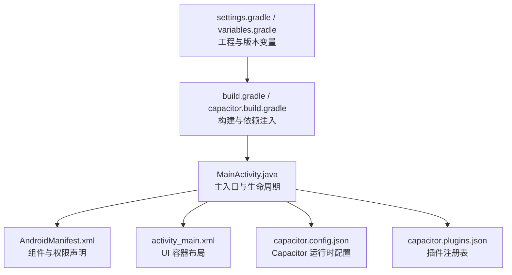
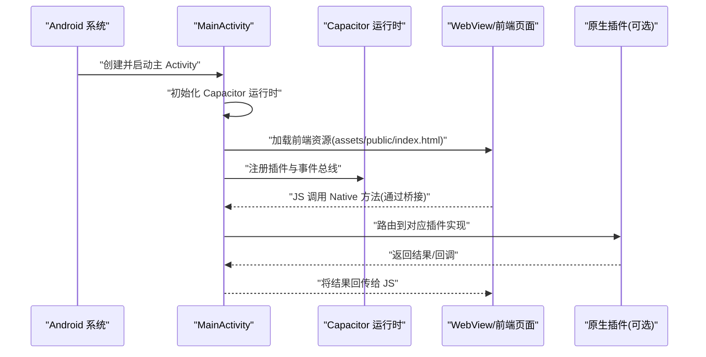
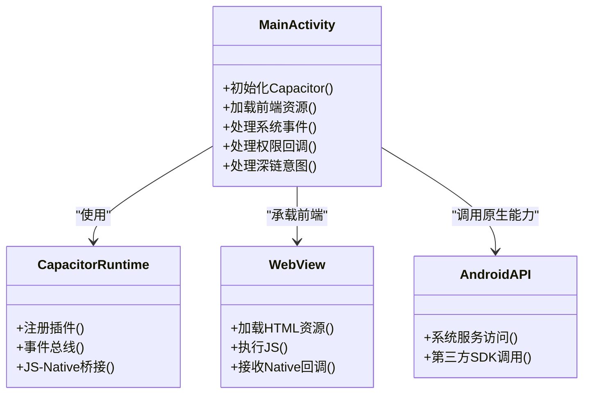
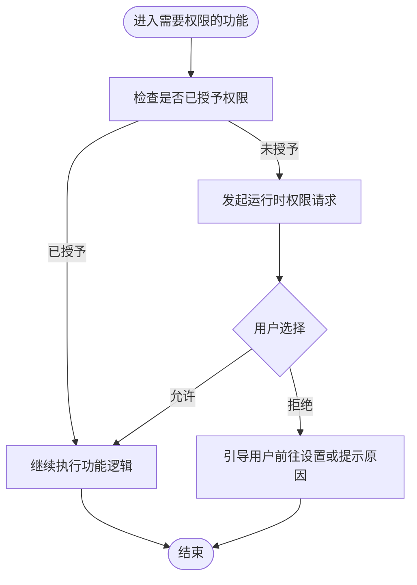
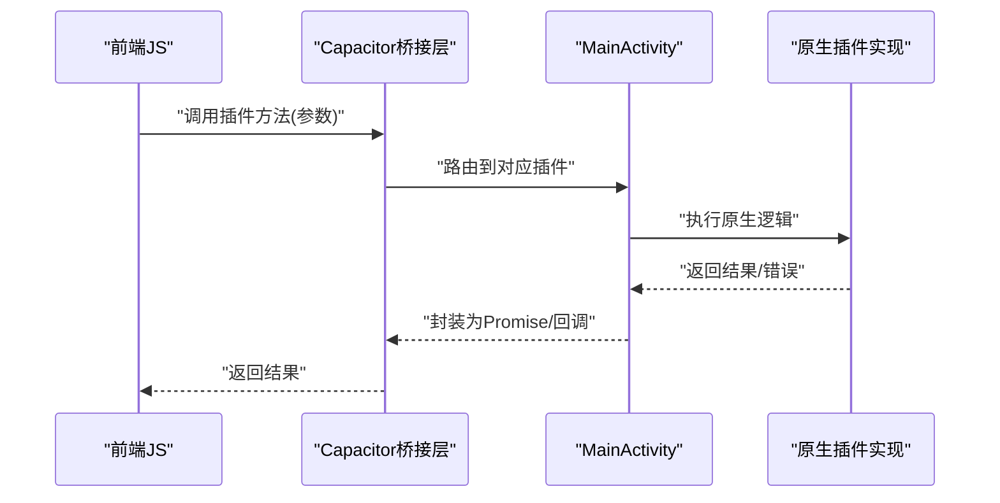
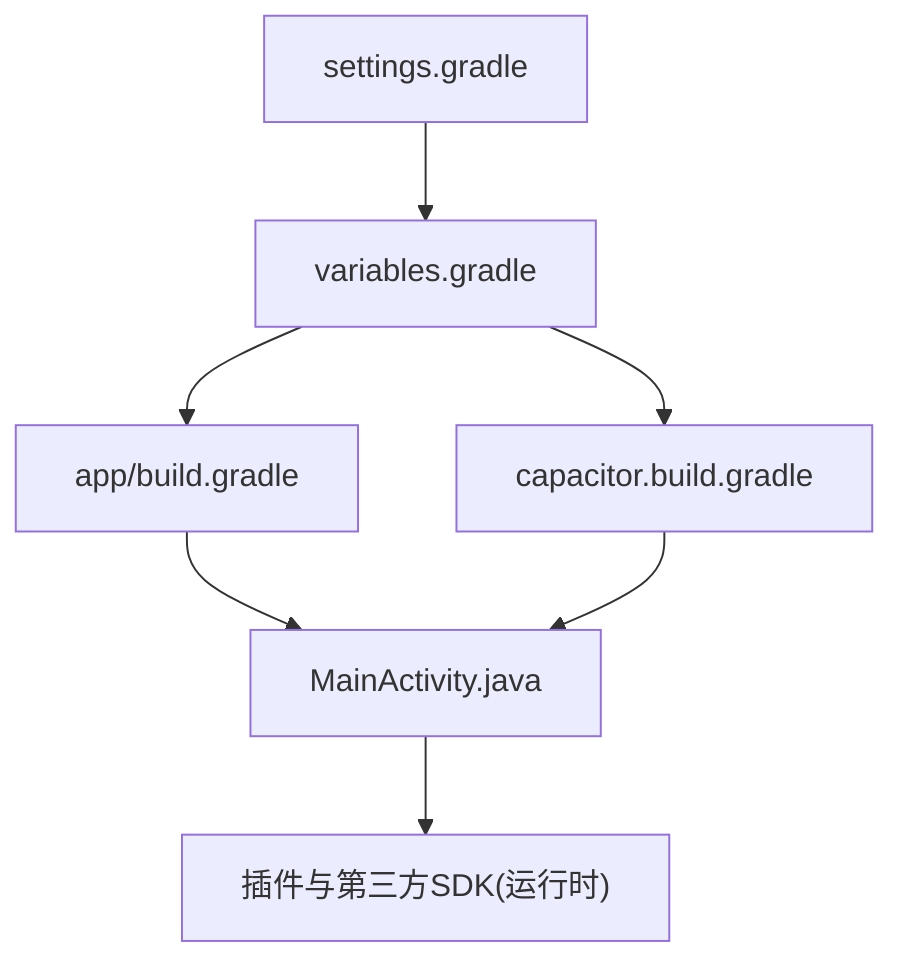

# 原生功能集成

<cite>
**本文引用的文件**   
- [MainActivity.java](file://apk/android/app/src/main/java/com/jihaitang/jxz/MainActivity.java)
- [AndroidManifest.xml](file://apk/android/app/src/main/AndroidManifest.xml)
- [activity_main.xml](file://apk/android/app/src/main/res/layout/activity_main.xml)
- [capacitor.config.json](file://apk/android/app/src/main/assets/public/capacitor.config.json)
- [capacitor.plugins.json](file://apk/android/app/src/main/assets/public/capacitor.plugins.json)
- [build.gradle](file://apk/android/app/build.gradle)
- [capacitor.build.gradle](file://apk/android/app/capacitor.build.gradle)
- [settings.gradle](file://apk/android/settings.gradle)
- [variables.gradle](file://apk/android/variables.gradle)
</cite>

## 目录
1. [简介](#简介)
2. [项目结构](#项目结构)
3. [核心组件](#核心组件)
4. [架构总览](#架构总览)
5. [详细组件分析](#详细组件分析)
6. [依赖关系分析](#依赖关系分析)
7. [性能考虑](#性能考虑)
8. [故障排查指南](#故障排查指南)
9. [结论](#结论)
10. [附录](#附录)

## 简介
本技术文档聚焦于基于 Capacitor 的 Android 原生能力集成，围绕以下目标展开：
- 深入解析 MainActivity.java 的原生 Activity 实现与生命周期管理要点
- 说明 AndroidManifest.xml 清单文件的权限声明与组件配置规范
- 阐述 Capacitor 原生桥接机制的原理与使用方法
- 指导如何调用 Android 原生 API 与集成第三方 SDK
- 提供权限管理的最佳实践与安全注意事项
- 给出原生功能扩展开发指南与调试技巧，帮助开发者充分利用移动设备原生能力

## 项目结构
本项目采用 Capacitor 混合应用模式，Android 原生工程位于 apk/android 目录下。关键路径与职责如下：
- apk/android/app/src/main/java/com/jihaitang/jxz/MainActivity.java：应用主入口 Activity，承载 WebView 并接入 Capacitor 运行时
- apk/android/app/src/main/AndroidManifest.xml：应用清单，声明组件、权限、启动项等
- apk/android/app/src/main/res/layout/activity_main.xml：Activity 布局，通常包含 Capacitor 提供的容器视图
- apk/android/app/src/main/assets/public/capacitor.config.json：Capacitor 前端资源与运行时配置
- apk/android/app/src/main/assets/public/capacitor.plugins.json：已注册插件清单（由构建流程生成）
- apk/android/app/build.gradle 与 capacitor.build.gradle：应用级构建脚本与 Capacitor 插件注入
- apk/android/settings.gradle 与 variables.gradle：Gradle 设置与版本变量

图表来源
- [MainActivity.java](file://apk/android/app/src/main/java/com/jihaitang/jxz/MainActivity.java)
- [AndroidManifest.xml](file://apk/android/app/src/main/AndroidManifest.xml)
- [activity_main.xml](file://apk/android/app/src/main/res/layout/activity_main.xml)
- [capacitor.config.json](file://apk/android/app/src/main/assets/public/capacitor.config.json)
- [capacitor.plugins.json](file://apk/android/app/src/main/assets/public/capacitor.plugins.json)
- [build.gradle](file://apk/android/app/build.gradle)
- [capacitor.build.gradle](file://apk/android/app/capacitor.build.gradle)
- [settings.gradle](file://apk/android/settings.gradle)
- [variables.gradle](file://apk/android/variables.gradle)

章节来源
- [MainActivity.java](file://apk/android/app/src/main/java/com/jihaitang/jxz/MainActivity.java)
- [AndroidManifest.xml](file://apk/android/app/src/main/AndroidManifest.xml)
- [activity_main.xml](file://apk/android/app/src/main/res/layout/activity_main.xml)
- [capacitor.config.json](file://apk/android/app/src/main/assets/public/capacitor.config.json)
- [capacitor.plugins.json](file://apk/android/app/src/main/assets/public/capacitor.plugins.json)
- [build.gradle](file://apk/android/app/build.gradle)
- [capacitor.build.gradle](file://apk/android/app/capacitor.build.gradle)
- [settings.gradle](file://apk/android/settings.gradle)
- [variables.gradle](file://apk/android/variables.gradle)

## 核心组件
- MainActivity.java
  - 作为应用主入口，负责初始化 Capacitor 运行时、加载前端资源、处理系统事件与生命周期回调
  - 通过 Capacitor 暴露的接口与 JavaScript 层进行双向通信
- AndroidManifest.xml
  - 声明应用包名、主 Activity、启动模式、主题、网络与存储等权限
  - 配置 Intent Filter 以支持深链与外部唤起
- activity_main.xml
  - 定义 UI 容器，通常为 Capacitor 提供的 WebView 容器或自定义根布局
- Capacitor 配置文件
  - capacitor.config.json：定义前端资源路径、窗口行为、安全策略等
  - capacitor.plugins.json：记录已安装与注册的插件信息，供运行时加载

章节来源
- [MainActivity.java](file://apk/android/app/src/main/java/com/jihaitang/jxz/MainActivity.java)
- [AndroidManifest.xml](file://apk/android/app/src/main/AndroidManifest.xml)
- [activity_main.xml](file://apk/android/app/src/main/res/layout/activity_main.xml)
- [capacitor.config.json](file://apk/android/app/src/main/assets/public/capacitor.config.json)
- [capacitor.plugins.json](file://apk/android/app/src/main/assets/public/capacitor.plugins.json)

## 架构总览
下图展示了从应用启动到 Capacitor 桥接调用的整体流程，包括 Activity 生命周期、WebView 加载、插件注册与 JS-Native 通信。

图表来源
- [MainActivity.java](file://apk/android/app/src/main/java/com/jihaitang/jxz/MainActivity.java)
- [capacitor.config.json](file://apk/android/app/src/main/assets/public/capacitor.config.json)
- [capacitor.plugins.json](file://apk/android/app/src/main/assets/public/capacitor.plugins.json)

## 详细组件分析

### MainActivity.java 分析与生命周期管理
- 角色与职责
  - 作为应用主入口，负责 Capacitor 运行时的初始化与前端资源的加载
  - 处理系统事件（如返回键、屏幕旋转、内存警告等），并通过 Capacitor 转发给前端
  - 维护与 WebView 的交互通道，确保 JS 与 Native 的双向通信稳定
- 生命周期关键点
  - onCreate/onResume/onPause/onDestroy：用于初始化与释放资源、保存状态、恢复状态
  - onActivityResult/onRequestPermissionsResult：处理请求码回调与动态权限结果
  - onNewIntent：处理外部唤起与深链场景
- 与 Capacitor 的集成
  - 通过 Capacitor 提供的 API 注册插件、监听事件、分发消息
  - 在需要时直接调用 Android 原生 API 或通过插件封装后暴露给 JS

章节来源
- [MainActivity.java](file://apk/android/app/src/main/java/com/jihaitang/jxz/MainActivity.java)

#### 类图（概念映射）

图表来源
- [MainActivity.java](file://apk/android/app/src/main/java/com/jihaitang/jxz/MainActivity.java)

### AndroidManifest.xml 清单配置与权限声明
- 组件配置
  - 声明主 Activity、启动模式、主题、图标等
  - 配置 Intent Filter 以支持外部链接与深链跳转
- 权限声明
  - 网络访问、存储读写、相机、麦克风、位置等按需声明
  - 遵循最小权限原则，避免过度授权
- 安全相关
  - 针对 Android 10+ 的分区存储适配
  - 对敏感权限进行运行时申请与用户提示

章节来源
- [AndroidManifest.xml](file://apk/android/app/src/main/AndroidManifest.xml)

#### 流程图（权限申请与处理）

图表来源
- [AndroidManifest.xml](file://apk/android/app/src/main/AndroidManifest.xml)
- [MainActivity.java](file://apk/android/app/src/main/java/com/jihaitang/jxz/MainActivity.java)

### Capacitor 原生桥接机制原理与使用方法
- 原理概述
  - Capacitor 在 Android 端通过桥接层将 JS 调用转换为原生方法调用
  - 插件通过注解或约定式注册，将 JS 方法与原生实现绑定
  - 事件总线用于从 Native 向前端推送事件与数据
- 使用方法
  - 在前端通过 Capacitor 插件 API 调用原生能力
  - 在后端实现插件类，并在构建时注册到插件清单
  - 通过事件总线订阅/发布事件，实现异步通知

章节来源
- [capacitor.config.json](file://apk/android/app/src/main/assets/public/capacitor.config.json)
- [capacitor.plugins.json](file://apk/android/app/src/main/assets/public/capacitor.plugins.json)
- [MainActivity.java](file://apk/android/app/src/main/java/com/jihaitang/jxz/MainActivity.java)

#### 序列图（JS 调用原生插件）

图表来源
- [MainActivity.java](file://apk/android/app/src/main/java/com/jihaitang/jxz/MainActivity.java)
- [capacitor.plugins.json](file://apk/android/app/src/main/assets/public/capacitor.plugins.json)

### 调用 Android 原生 API 与第三方 SDK 集成
- 调用原生 API
  - 在 MainActivity 或独立插件中直接调用 Android 系统 API
  - 通过 Capacitor 事件总线或返回值将结果传递给前端
- 集成第三方 SDK
  - 在 build.gradle 中添加依赖
  - 在初始化阶段完成 SDK 初始化（如日志、统计、支付等）
  - 封装为统一接口，便于前端调用

章节来源
- [build.gradle](file://apk/android/app/build.gradle)
- [capacitor.build.gradle](file://apk/android/app/capacitor.build.gradle)
- [MainActivity.java](file://apk/android/app/src/main/java/com/jihaitang/jxz/MainActivity.java)

### 权限管理最佳实践与安全考虑
- 最小权限原则：仅声明与使用所需权限
- 运行时权限：在 Android 6.0+ 上动态申请，并提供友好的用户引导
- 隐私合规：明确告知用户数据用途，提供关闭与退出选项
- 数据安全：避免在日志中输出敏感信息；对输入进行校验与过滤
- 网络安全：启用 HTTPS，必要时配置证书固定与内容安全策略

章节来源
- [AndroidManifest.xml](file://apk/android/app/src/main/AndroidManifest.xml)
- [MainActivity.java](file://apk/android/app/src/main/java/com/jihaitang/jxz/MainActivity.java)

### 原生功能扩展开发指南与调试技巧
- 开发指南
  - 新增插件：实现原生方法，注册到插件清单，前端通过 Capacitor 调用
  - 事件驱动：使用事件总线在 Native 与 JS 之间传递消息
  - 配置管理：通过 capacitor.config.json 控制前端行为与窗口属性
- 调试技巧
  - 使用 Android Studio 调试 Java 代码与 Gradle 构建
  - 使用 Chrome DevTools 调试 WebView 中的前端代码
  - 查看 Capacitor 日志与桥接消息，定位 JS-Native 通信问题

章节来源
- [capacitor.config.json](file://apk/android/app/src/main/assets/public/capacitor.config.json)
- [capacitor.plugins.json](file://apk/android/app/src/main/assets/public/capacitor.plugins.json)
- [MainActivity.java](file://apk/android/app/src/main/java/com/jihaitang/jxz/MainActivity.java)

## 依赖关系分析
- 构建与依赖
  - settings.gradle 与 variables.gradle 统一管理工程与版本变量
  - app/build.gradle 与 capacitor.build.gradle 负责应用依赖与 Capacitor 插件注入
- 运行时依赖
  - MainActivity 依赖 Capacitor 运行时与 WebView
  - 插件与第三方 SDK 通过 Gradle 引入并在运行时被桥接层发现与调用

图表来源
- [settings.gradle](file://apk/android/settings.gradle)
- [variables.gradle](file://apk/android/variables.gradle)
- [build.gradle](file://apk/android/app/build.gradle)
- [capacitor.build.gradle](file://apk/android/app/capacitor.build.gradle)
- [MainActivity.java](file://apk/android/app/src/main/java/com/jihaitang/jxz/MainActivity.java)

章节来源
- [settings.gradle](file://apk/android/settings.gradle)
- [variables.gradle](file://apk/android/variables.gradle)
- [build.gradle](file://apk/android/app/build.gradle)
- [capacitor.build.gradle](file://apk/android/app/capacitor.build.gradle)

## 性能考虑
- 减少不必要的权限与后台任务，降低系统开销
- 合理管理 WebView 生命周期，避免频繁重建
- 对大对象与图片等资源进行压缩与缓存
- 避免在主线程执行耗时操作，使用异步与线程池
- 监控内存与 CPU 占用，及时优化热点路径

[本节为通用性能建议，不直接分析具体文件]

## 故障排查指南
- 常见问题
  - 权限被拒：检查运行时权限申请与用户引导逻辑
  - 插件未注册：确认插件清单与构建脚本是否正确注入
  - 深链无效：核对 Intent Filter 与启动模式配置
  - 崩溃与异常：查看 Android Studio 日志与 Capacitor 桥接日志
- 定位步骤
  - 在 MainActivity 的关键生命周期点添加日志
  - 使用断点调试 JS-Native 调用链路
  - 逐步缩小范围，验证插件与第三方 SDK 的初始化顺序

章节来源
- [MainActivity.java](file://apk/android/app/src/main/java/com/jihaitang/jxz/MainActivity.java)
- [AndroidManifest.xml](file://apk/android/app/src/main/AndroidManifest.xml)

## 结论
通过对 MainActivity.java 与 AndroidManifest.xml 的分析，结合 Capacitor 的桥接机制与插件体系，可以高效地扩展 Android 原生能力。遵循最小权限与运行时权限的最佳实践，配合完善的调试手段，能够显著提升应用的稳定性与用户体验。建议在扩展新功能时，优先通过插件化方式封装原生逻辑，保持前后端解耦与可维护性。

[本节为总结性内容，不直接分析具体文件]

## 附录
- 参考文件路径
  - 主入口与生命周期：[MainActivity.java](file://apk/android/app/src/main/java/com/jihaitang/jxz/MainActivity.java)
  - 清单与权限：[AndroidManifest.xml](file://apk/android/app/src/main/AndroidManifest.xml)
  - 布局容器：[activity_main.xml](file://apk/android/app/src/main/res/layout/activity_main.xml)
  - Capacitor 配置：[capacitor.config.json](file://apk/android/app/src/main/assets/public/capacitor.config.json)、[capacitor.plugins.json](file://apk/android/app/src/main/assets/public/capacitor.plugins.json)
  - 构建与依赖：[build.gradle](file://apk/android/app/build.gradle)、[capacitor.build.gradle](file://apk/android/app/capacitor.build.gradle)、[settings.gradle](file://apk/android/settings.gradle)、[variables.gradle](file://apk/android/variables.gradle)