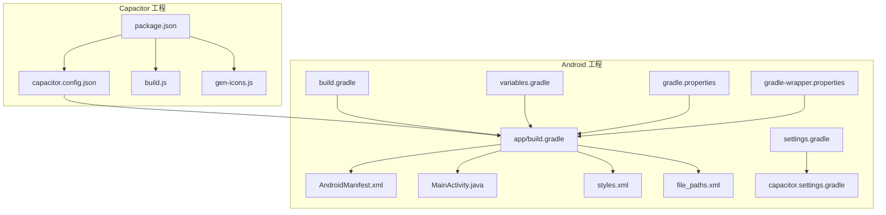
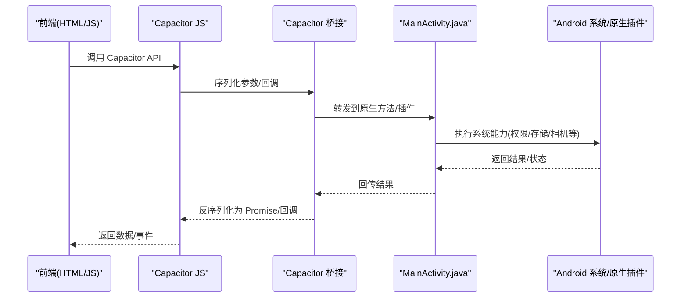
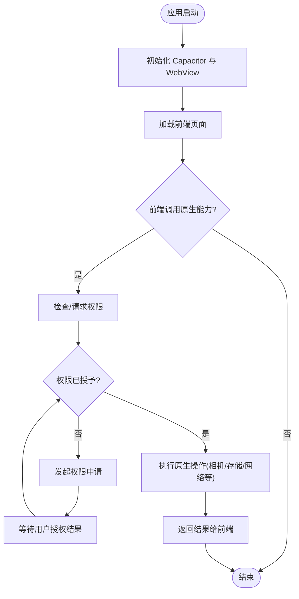
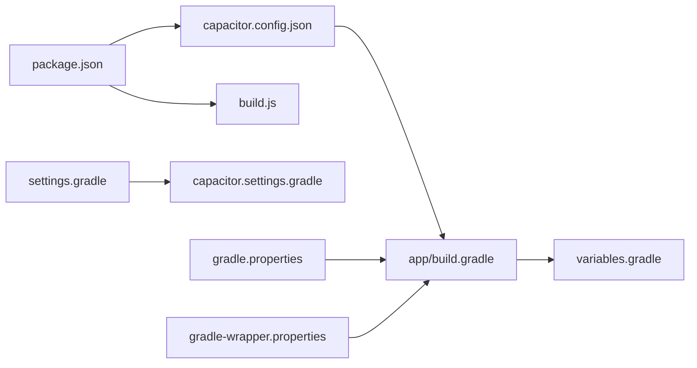

# 移动端部署

<cite>
**本文引用的文件**   
- [apk/package.json](file://apk/package.json)
- [apk/capacitor.config.json](file://apk/capacitor.config.json)
- [apk/build.js](file://apk/build.js)
- [apk/gen-icons.js](file://apk/gen-icons.js)
- [apk/android/app/src/main/AndroidManifest.xml](file://apk/android/app/src/main/AndroidManifest.xml)
- [apk/android/app/src/main/java/com/jihaitang/jxz/MainActivity.java](file://apk/android/app/src/main/java/com/jihaitang/jxz/MainActivity.java)
- [apk/android/app/src/main/res/values/styles.xml](file://apk/android/app/src/main/res/values/styles.xml)
- [apk/android/app/src/main/res/xml/file_paths.xml](file://apk/android/app/src/main/res/xml/file_paths.xml)
- [apk/android/app/build.gradle](file://apk/android/app/build.gradle)
- [apk/android/app/proguard-rules.pro](file://apk/android/app/proguard-rules.pro)
- [apk/android/build.gradle](file://apk/android/build.gradle)
- [apk/android/gradle.properties](file://apk/android/gradle.properties)
- [apk/android/settings.gradle](file://apk/android/settings.gradle)
- [apk/android/capacitor.settings.gradle](file://apk/android/capacitor.settings.gradle)
- [apk/android/variables.gradle](file://apk/android/variables.gradle)
- [apk/android/gradle/wrapper/gradle-wrapper.properties](file://apk/android/gradle/wrapper/gradle-wrapper.properties)
- [打包APK.ps1](file://打包APK.ps1)
</cite>

## 目录
1. [简介](#简介)
2. [项目结构](#项目结构)
3. [核心组件](#核心组件)
4. [架构总览](#架构总览)
5. [详细组件分析](#详细组件分析)
6. [依赖关系分析](#依赖关系分析)
7. [性能与发布前准备](#性能与发布前准备)
8. [故障排查指南](#故障排查指南)
9. [结论](#结论)
10. [附录](#附录)

## 简介
本文件面向“姬侠传”移动端的 Android 构建与发布，围绕 Capacitor 集成、原生桥接机制、Android 构建流程、权限与设备能力调用、应用签名与混淆、性能优化、APK 构建脚本与自动化部署，以及移动端调试与问题排查进行系统化说明。文档以仓库中实际存在的配置文件与脚本为依据，帮助开发者快速完成本地构建、测试与发布。

## 项目结构
本项目采用 Capacitor 将 Web 前端资源打包为 Android 应用。关键目录与职责如下：
- apk：Capacitor 工程根目录，包含 package.json、capacitor.config.json、构建脚本与 Android 工程
- apk/android：Android 原生工程，包含 Gradle 配置、清单、资源、主 Activity 等
- assets、module、ui、worker 等：Web 前端资源与业务逻辑（由 Capacitor 注入到 WebView）

图表来源
- [apk/package.json](file://apk/package.json)
- [apk/capacitor.config.json](file://apk/capacitor.config.json)
- [apk/build.js](file://apk/build.js)
- [apk/gen-icons.js](file://apk/gen-icons.js)
- [apk/android/app/build.gradle](file://apk/android/app/build.gradle)
- [apk/android/app/src/main/AndroidManifest.xml](file://apk/android/app/src/main/AndroidManifest.xml)
- [apk/android/app/src/main/java/com/jihaitang/jxz/MainActivity.java](file://apk/android/app/src/main/java/com/jihaitang/jxz/MainActivity.java)
- [apk/android/app/src/main/res/values/styles.xml](file://apk/android/app/src/main/res/values/styles.xml)
- [apk/android/app/src/main/res/xml/file_paths.xml](file://apk/android/app/src/main/res/xml/file_paths.xml)
- [apk/android/build.gradle](file://apk/android/build.gradle)
- [apk/android/settings.gradle](file://apk/android/settings.gradle)
- [apk/android/capacitor.settings.gradle](file://apk/android/capacitor.settings.gradle)
- [apk/android/variables.gradle](file://apk/android/variables.gradle)
- [apk/android/gradle.properties](file://apk/android/gradle.properties)
- [apk/android/gradle/wrapper/gradle-wrapper.properties](file://apk/android/gradle/wrapper/gradle-wrapper.properties)

章节来源
- [apk/package.json](file://apk/package.json)
- [apk/capacitor.config.json](file://apk/capacitor.config.json)
- [apk/android/app/build.gradle](file://apk/android/app/build.gradle)
- [apk/android/build.gradle](file://apk/android/build.gradle)
- [apk/android/settings.gradle](file://apk/android/settings.gradle)
- [apk/android/capacitor.settings.gradle](file://apk/android/capacitor.settings.gradle)
- [apk/android/variables.gradle](file://apk/android/variables.gradle)
- [apk/android/gradle.properties](file://apk/android/gradle.properties)
- [apk/android/gradle/wrapper/gradle-wrapper.properties](file://apk/android/gradle/wrapper/gradle-wrapper.properties)

## 核心组件
- Capacitor 配置与脚本
  - package.json：定义 Node 依赖与 npm 脚本入口，用于安装依赖、同步前端资源至 Android 工程、生成图标等
  - capacitor.config.json：Capacitor 运行时配置，包括应用标识、启动页、WebView 行为等
  - build.js：自定义构建脚本，可封装前端构建、资源拷贝、Capacitor 同步等步骤
  - gen-icons.js：图标生成脚本，统一处理多分辨率图标资源
- Android 工程
  - app/build.gradle：应用级 Gradle 配置，含编译版本、依赖、签名、ProGuard 规则引用等
  - AndroidManifest.xml：声明权限、Activity、Provider、IntentFilter 等
  - MainActivity.java：应用主入口，承载 WebView 并初始化 Capacitor
  - styles.xml：主题与窗口样式
  - file_paths.xml：FileProvider 路径映射，便于跨进程访问文件
  - variables.gradle：集中管理版本号、包名等变量
  - gradle.properties：Gradle 全局属性（如并行构建、内存等）
  - settings.gradle 与 capacitor.settings.gradle：模块设置与 Capacitor 插件集成
  - gradle-wrapper.properties：Gradle Wrapper 版本

章节来源
- [apk/package.json](file://apk/package.json)
- [apk/capacitor.config.json](file://apk/capacitor.config.json)
- [apk/build.js](file://apk/build.js)
- [apk/gen-icons.js](file://apk/gen-icons.js)
- [apk/android/app/build.gradle](file://apk/android/app/build.gradle)
- [apk/android/app/src/main/AndroidManifest.xml](file://apk/android/app/src/main/AndroidManifest.xml)
- [apk/android/app/src/main/java/com/jihaitang/jxz/MainActivity.java](file://apk/android/app/src/main/java/com/jihaitang/jxz/MainActivity.java)
- [apk/android/app/src/main/res/values/styles.xml](file://apk/android/app/src/main/res/values/styles.xml)
- [apk/android/app/src/main/res/xml/file_paths.xml](file://apk/android/app/src/main/res/xml/file_paths.xml)
- [apk/android/variables.gradle](file://apk/android/variables.gradle)
- [apk/android/gradle.properties](file://apk/android/gradle.properties)
- [apk/android/settings.gradle](file://apk/android/settings.gradle)
- [apk/android/capacitor.settings.gradle](file://apk/android/capacitor.settings.gradle)
- [apk/android/gradle/wrapper/gradle-wrapper.properties](file://apk/android/gradle/wrapper/gradle-wrapper.properties)

## 架构总览
Capacitor 作为桥接层，将 Web 前端与 Android 原生能力连接。前端通过 Capacitor JS API 调用原生插件或自定义桥接方法；Android 侧在 MainActivity 中注册插件与监听事件，并通过 Intent、ContentProvider、系统服务等暴露能力。

图表来源
- [apk/android/app/src/main/java/com/jihaitang/jxz/MainActivity.java](file://apk/android/app/src/main/java/com/jihaitang/jxz/MainActivity.java)
- [apk/capacitor.config.json](file://apk/capacitor.config.json)

## 详细组件分析

### Capacitor 集成与配置
- package.json
  - 负责安装 Capacitor CLI 与平台依赖，提供构建、同步、生成图标等脚本命令
- capacitor.config.json
  - 定义应用基础信息（包名、显示名称、启动页 URL）、WebView 行为（如允许混合内容、缓存策略等）
- build.js
  - 可封装前端构建产物输出、资源复制、Capacitor sync 等，形成一键构建流程
- gen-icons.js
  - 根据源图标生成不同密度与尺寸的图标资源，确保适配各屏幕密度

章节来源
- [apk/package.json](file://apk/package.json)
- [apk/capacitor.config.json](file://apk/capacitor.config.json)
- [apk/build.js](file://apk/build.js)
- [apk/gen-icons.js](file://apk/gen-icons.js)

### Android 构建与打包
- app/build.gradle
  - 指定 compileSdk/targetSdk/minSdk、应用 ID、版本信息、依赖库、签名配置、ProGuard 规则引用等
- variables.gradle
  - 集中管理版本号、包名、应用名等变量，便于统一修改
- gradle.properties
  - 控制 Gradle 构建性能（并行、守护进程、JVM 内存等）
- settings.gradle 与 capacitor.settings.gradle
  - 引入 Capacitor 插件与子模块，确保构建时正确加载
- gradle-wrapper.properties
  - 锁定 Gradle Wrapper 版本，保证构建一致性

章节来源
- [apk/android/app/build.gradle](file://apk/android/app/build.gradle)
- [apk/android/variables.gradle](file://apk/android/variables.gradle)
- [apk/android/gradle.properties](file://apk/android/gradle.properties)
- [apk/android/settings.gradle](file://apk/android/settings.gradle)
- [apk/android/capacitor.settings.gradle](file://apk/android/capacitor.settings.gradle)
- [apk/android/gradle/wrapper/gradle-wrapper.properties](file://apk/android/gradle/wrapper/gradle-wrapper.properties)

### 原生桥接与权限管理
- MainActivity.java
  - 应用主入口，承载 WebView 并初始化 Capacitor 运行环境
  - 可在此注册自定义插件、拦截生命周期事件、处理来自前端的桥接调用
- AndroidManifest.xml
  - 声明应用所需权限（如网络、存储、相机、麦克风等）
  - 配置 Activity、IntentFilter、Provider 等组件
- file_paths.xml
  - 为 FileProvider 定义安全共享路径，避免直接暴露文件系统路径
- styles.xml
  - 定义应用主题与窗口样式，影响全屏、沉浸式体验等

图表来源
- [apk/android/app/src/main/java/com/jihaitang/jxz/MainActivity.java](file://apk/android/app/src/main/java/com/jihaitang/jxz/MainActivity.java)
- [apk/android/app/src/main/AndroidManifest.xml](file://apk/android/app/src/main/AndroidManifest.xml)
- [apk/android/app/src/main/res/xml/file_paths.xml](file://apk/android/app/src/main/res/xml/file_paths.xml)
- [apk/android/app/src/main/res/values/styles.xml](file://apk/android/app/src/main/res/values/styles.xml)

章节来源
- [apk/android/app/src/main/java/com/jihaitang/jxz/MainActivity.java](file://apk/android/app/src/main/java/com/jihaitang/jxz/MainActivity.java)
- [apk/android/app/src/main/AndroidManifest.xml](file://apk/android/app/src/main/AndroidManifest.xml)
- [apk/android/app/src/main/res/xml/file_paths.xml](file://apk/android/app/src/main/res/xml/file_paths.xml)
- [apk/android/app/src/main/res/values/styles.xml](file://apk/android/app/src/main/res/values/styles.xml)

### 应用签名与混淆
- 签名
  - 在 app/build.gradle 中配置签名信息（keystore 路径、别名、密码等），用于 Release 构建
  - 建议将敏感信息放入环境变量或独立密钥文件，避免硬编码
- 混淆与压缩
  - 启用 ProGuard/R8，并在 proguard-rules.pro 中保留必要类与方法（如 Capacitor 插件、反射使用的类）
  - 针对第三方库添加 keep 规则，避免运行时崩溃

章节来源
- [apk/android/app/build.gradle](file://apk/android/app/build.gradle)
- [apk/android/app/proguard-rules.pro](file://apk/android/app/proguard-rules.pro)

### 构建脚本与自动化部署
- 构建脚本
  - 打包APK.ps1：PowerShell 脚本，封装从清理、构建到签名、输出的完整流程
  - build.js：Node 脚本，可整合前端构建、资源同步、Capacitor 同步等步骤
- 自动化部署
  - 可在 CI 环境中调用 PowerShell 或 Node 脚本，实现自动构建、签名、上传制品
  - 建议使用 Gradle Wrapper 与固定版本，确保构建可重现

章节来源
- [打包APK.ps1](file://打包APK.ps1)
- [apk/build.js](file://apk/build.js)

## 依赖关系分析
- 前端与原生
  - package.json 中的 Capacitor 依赖驱动 Android 工程同步与插件集成
  - capacitor.config.json 决定 WebView 行为与启动页
- Android 工程内部
  - app/build.gradle 依赖 variables.gradle 的公共变量
  - settings.gradle 与 capacitor.settings.gradle 共同管理模块与插件
  - gradle.properties 与 gradle-wrapper.properties 控制构建环境与版本

图表来源
- [apk/package.json](file://apk/package.json)
- [apk/capacitor.config.json](file://apk/capacitor.config.json)
- [apk/build.js](file://apk/build.js)
- [apk/android/app/build.gradle](file://apk/android/app/build.gradle)
- [apk/android/variables.gradle](file://apk/android/variables.gradle)
- [apk/android/settings.gradle](file://apk/android/settings.gradle)
- [apk/android/capacitor.settings.gradle](file://apk/android/capacitor.settings.gradle)
- [apk/android/gradle.properties](file://apk/android/gradle.properties)
- [apk/android/gradle/wrapper/gradle-wrapper.properties](file://apk/android/gradle/wrapper/gradle-wrapper.properties)

章节来源
- [apk/package.json](file://apk/package.json)
- [apk/capacitor.config.json](file://apk/capacitor.config.json)
- [apk/build.js](file://apk/build.js)
- [apk/android/app/build.gradle](file://apk/android/app/build.gradle)
- [apk/android/variables.gradle](file://apk/android/variables.gradle)
- [apk/android/settings.gradle](file://apk/android/settings.gradle)
- [apk/android/capacitor.settings.gradle](file://apk/android/capacitor.settings.gradle)
- [apk/android/gradle.properties](file://apk/android/gradle.properties)
- [apk/android/gradle/wrapper/gradle-wrapper.properties](file://apk/android/gradle/wrapper/gradle-wrapper.properties)

## 性能与发布前准备
- 构建性能
  - 调整 gradle.properties 开启并行构建与守护进程，合理设置 JVM 内存
  - 使用 Gradle Wrapper 固定版本，减少环境差异导致的构建波动
- 资源与体积
  - 使用 gen-icons.js 生成合适密度的图标，避免过大图片
  - 对静态资源进行压缩与按需加载，减少首屏体积
- 运行时性能
  - 在 WebView 中禁用不必要的特性（如调试、远程调试）
  - 合理使用缓存策略，减少重复网络请求
- 安全与合规
  - 仅声明必要的权限，遵循最小权限原则
  - 使用 FileProvider 安全共享文件，避免直接暴露路径

[本节为通用指导，不直接分析具体文件]

## 故障排查指南
- 构建失败
  - 检查 Gradle Wrapper 版本与本地 JDK 是否匹配
  - 查看 app/build.gradle 与 variables.gradle 的版本号与依赖是否一致
- 权限相关崩溃
  - 确认 AndroidManifest.xml 中已声明所需权限
  - 在运行时动态申请权限，并正确处理拒绝场景
- WebView 无法访问资源
  - 检查 capacitor.config.json 的混合内容与缓存配置
  - 确认 file_paths.xml 的路径映射是否正确
- 日志定位
  - 使用 adb logcat 过滤应用标签，捕获崩溃堆栈
  - 在前端增加错误上报与日志收集，结合原生日志定位问题

章节来源
- [apk/android/app/build.gradle](file://apk/android/app/build.gradle)
- [apk/android/variables.gradle](file://apk/android/variables.gradle)
- [apk/android/app/src/main/AndroidManifest.xml](file://apk/android/app/src/main/AndroidManifest.xml)
- [apk/capacitor.config.json](file://apk/capacitor.config.json)
- [apk/android/app/src/main/res/xml/file_paths.xml](file://apk/android/app/src/main/res/xml/file_paths.xml)

## 结论
通过 Capacitor 将 Web 前端与 Android 原生能力无缝衔接，配合 Gradle 构建系统与脚本化流程，可实现高效的本地构建与自动化发布。建议在开发阶段完善权限与资源管理，在发布前完成签名、混淆与性能调优，并结合日志与监控提升问题定位效率。

[本节为总结性内容，不直接分析具体文件]

## 附录
- 常用命令参考
  - 安装依赖与同步：参考 package.json 中的脚本
  - 构建 APK：使用打包APK.ps1 或 Gradle 命令
  - 生成图标：运行 gen-icons.js
- 最佳实践
  - 使用环境变量管理签名信息
  - 固定依赖与构建工具版本，确保可重现构建
  - 持续集成中执行构建与测试，自动产出制品

[本节为补充信息，不直接分析具体文件]