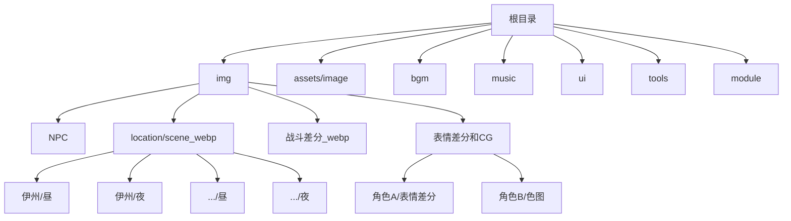
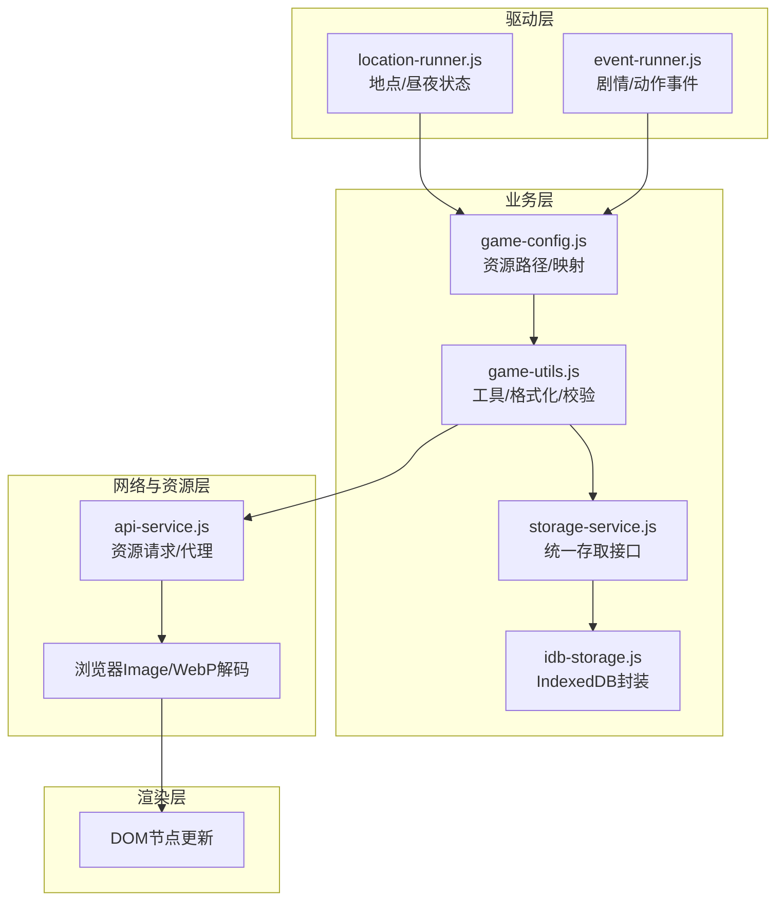
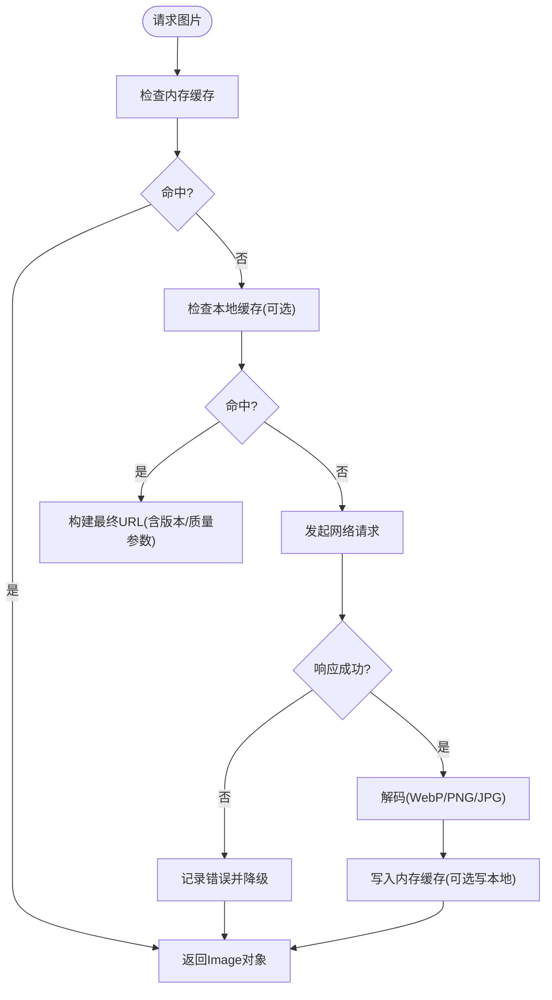
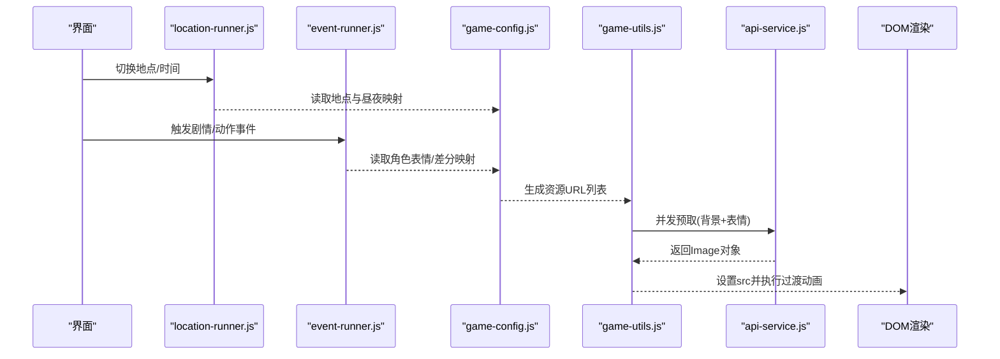
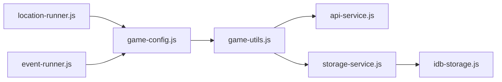

# 图片资源管理

<cite>
**本文引用的文件**   
- [index.html](file://index.html)
- [game-config.js](file://module/game-config.js)
- [game-utils.js](file://module/game-utils.js)
- [location-runner.js](file://module/location-runner.js)
- [event-runner.js](file://module/event-runner.js)
- [api-service.js](file://module/api-service.js)
- [storage-service.js](file://module/storage-service.js)
- [idb-storage.js](file://module/idb-storage.js)
- [capacitor.config.json](file://apk/capacitor.config.json)
</cite>

## 目录
1. [简介](#简介)
2. [项目结构](#项目结构)
3. [核心组件](#核心组件)
4. [架构总览](#架构总览)
5. [详细组件分析](#详细组件分析)
6. [依赖关系分析](#依赖关系分析)
7. [性能考虑](#性能考虑)
8. [故障排查指南](#故障排查指南)
9. [结论](#结论)
10. [附录](#附录)

## 简介
本技术文档面向“姬侠传”项目的图片资源管理与渲染管线，覆盖以下主题：
- 资源组织结构与分类策略（NPC立绘、场景背景、表情差分、CG等）
- 图片加载机制与缓存策略（WebP优化、懒加载、内存管理）
- 动态切换实现（昼夜场景、角色表情变化等）
- 资源压缩、格式转换与批量处理工具使用建议
- 加载性能优化与错误处理最佳实践

目标读者为前端/游戏逻辑开发者与资源工程师。

## 项目结构
图片资源按类型与场景分层组织，便于按需加载与动态切换：
- 静态通用资源：icon、crops、ground、others、static
- NPC相关：img/NPC（立绘）、img/表情差分和CG（含各角色子目录与色图/表情差分）
- 场景背景：img/location/scene_webp/{地点}/{昼|夜}（WebP格式）
- 战斗差分：img/战斗差分_webp
- 音频与UI资源：bgm、music、ui、assets/image（Capacitor打包产物）

图表来源
- [index.html](file://index.html)
- [capacitor.config.json](file://apk/capacitor.config.json)

章节来源
- [index.html:1-200](file://index.html#L1-L200)
- [capacitor.config.json:1-200](file://apk/capacitor.config.json#L1-L200)

## 核心组件
- 配置中心：集中定义资源路径、默认显示规则、昼夜状态、角色表情映射等
- 资源管理器：负责图片的预取、懒加载、缓存命中、去重与释放
- 场景与事件驱动：根据剧情/地点/时间状态触发图片切换
- 存储与持久化：本地缓存元数据与快照，减少重复请求
- WebP与格式优化：优先使用WebP，提供降级方案与占位图

章节来源
- [game-config.js:1-200](file://module/game-config.js#L1-L200)
- [game-utils.js:1-200](file://module/game-utils.js#L1-L200)
- [location-runner.js:1-200](file://module/location-runner.js#L1-L200)
- [event-runner.js:1-200](file://module/event-runner.js#L1-L200)
- [api-service.js:1-200](file://module/api-service.js#L1-L200)
- [storage-service.js:1-200](file://module/storage-service.js#L1-L200)
- [idb-storage.js:1-200](file://module/idb-storage.js#L1-L200)

## 架构总览
图片资源管理由“配置—调度—加载—缓存—渲染”五层构成，事件与位置系统作为外部驱动源。

图表来源
- [location-runner.js:1-200](file://module/location-runner.js#L1-L200)
- [event-runner.js:1-200](file://module/event-runner.js#L1-L200)
- [game-config.js:1-200](file://module/game-config.js#L1-L200)
- [game-utils.js:1-200](file://module/game-utils.js#L1-L200)
- [storage-service.js:1-200](file://module/storage-service.js#L1-L200)
- [idb-storage.js:1-200](file://module/idb-storage.js#L1-L200)
- [api-service.js:1-200](file://module/api-service.js#L1-L200)

## 详细组件分析

### 资源分类与命名规范
- NPC立绘：img/NPC/{角色}/基础或变体
- 场景背景：img/location/scene_webp/{地点}/{昼|夜}.webp
- 表情差分：img/表情差分和CG/{角色}/表情差分/{状态}.webp
- CG与色图：img/表情差分和CG/{角色}/色图/{编号}.webp
- 战斗差分：img/战斗差分_webp/{动作}/{帧}.webp
- 图标与通用：assets/image/icon、assets/image/others、assets/image/static

要点
- 以WebP为主，必要时提供PNG/JPG降级
- 名称包含语义信息（角色名、状态、时段），便于脚本解析
- 同一资源多分辨率时采用后缀区分（如_2x）

章节来源
- [game-config.js:1-200](file://module/game-config.js#L1-L200)
- [game-utils.js:1-200](file://module/game-utils.js#L1-L200)

### 图片加载机制与缓存策略
- 懒加载：仅在可见区域或即将进入的场景预取
- 预取：在用户交互前异步加载下一关键帧或相邻场景
- 缓存：内存级URL→Image对象映射；可选IndexedDB持久化大资源或缩略图
- 去重：相同URL只创建一次Image实例
- 降级：WebP不可用时回退到PNG/JPG

图表来源
- [game-utils.js:1-200](file://module/game-utils.js#L1-L200)
- [api-service.js:1-200](file://module/api-service.js#L1-L200)
- [storage-service.js:1-200](file://module/storage-service.js#L1-L200)
- [idb-storage.js:1-200](file://module/idb-storage.js#L1-L200)

章节来源
- [game-utils.js:1-200](file://module/game-utils.js#L1-L200)
- [api-service.js:1-200](file://module/api-service.js#L1-L200)
- [storage-service.js:1-200](file://module/storage-service.js#L1-L200)
- [idb-storage.js:1-200](file://module/idb-storage.js#L1-L200)

### 动态切换实现（昼夜场景、表情变化）
- 场景切换：根据当前地点与昼夜状态选择对应WebP路径，替换DOM中背景元素
- 表情切换：根据角色与表情状态码选择差分图，叠加或替换图层
- 过渡动画：淡入淡出或交叉溶解，避免闪烁

图表来源
- [location-runner.js:1-200](file://module/location-runner.js#L1-L200)
- [event-runner.js:1-200](file://module/event-runner.js#L1-L200)
- [game-config.js:1-200](file://module/game-config.js#L1-L200)
- [game-utils.js:1-200](file://module/game-utils.js#L1-L200)
- [api-service.js:1-200](file://module/api-service.js#L1-L200)

章节来源
- [location-runner.js:1-200](file://module/location-runner.js#L1-L200)
- [event-runner.js:1-200](file://module/event-runner.js#L1-L200)
- [game-config.js:1-200](file://module/game-config.js#L1-L200)
- [game-utils.js:1-200](file://module/game-utils.js#L1-L200)
- [api-service.js:1-200](file://module/api-service.js#L1-L200)

### 资源压缩、格式转换与批量处理
- 推荐格式：WebP（体积更小、解码快），对不支持环境提供PNG/JPG降级
- 压缩建议：保持视觉质量前提下降低尺寸与色彩深度；大图分块或切片
- 批量处理：
  - 扫描img与assets/image目录，输出清单与哈希
  - 自动将PNG/JPG转WebP，并生成同名降级文件
  - 校验缺失资源与无效链接，生成报告
- 工具链参考：基于Node.js脚本进行批处理与校验（可结合现有tools目录扩展）

章节来源
- [game-config.js:1-200](file://module/game-config.js#L1-L200)
- [game-utils.js:1-200](file://module/game-utils.js#L1-L200)

### 错误处理与降级策略
- 网络失败：重试（指数退避）、降级到备用资源、展示占位图
- 解码失败：回退到次优格式（如从WebP回退PNG）
- 资源缺失：记录日志、上报统计、提示管理员
- 内存压力：限制并发、及时释放不再使用的Image引用

章节来源
- [api-service.js:1-200](file://module/api-service.js#L1-L200)
- [game-utils.js:1-200](file://module/game-utils.js#L1-L200)
- [storage-service.js:1-200](file://module/storage-service.js#L1-L200)

## 依赖关系分析
- location-runner.js与event-runner.js作为外部驱动，向配置中心查询资源映射
- game-config.js维护路径模板与默认值
- game-utils.js提供URL构造、校验、并发控制等能力
- api-service.js负责实际下载与错误处理
- storage-service.js与idb-storage.js提供本地缓存与持久化

图表来源
- [location-runner.js:1-200](file://module/location-runner.js#L1-L200)
- [event-runner.js:1-200](file://module/event-runner.js#L1-L200)
- [game-config.js:1-200](file://module/game-config.js#L1-L200)
- [game-utils.js:1-200](file://module/game-utils.js#L1-L200)
- [api-service.js:1-200](file://module/api-service.js#L1-L200)
- [storage-service.js:1-200](file://module/storage-service.js#L1-L200)
- [idb-storage.js:1-200](file://module/idb-storage.js#L1-L200)

章节来源
- [location-runner.js:1-200](file://module/location-runner.js#L1-L200)
- [event-runner.js:1-200](file://module/event-runner.js#L1-L200)
- [game-config.js:1-200](file://module/game-config.js#L1-L200)
- [game-utils.js:1-200](file://module/game-utils.js#L1-L200)
- [api-service.js:1-200](file://module/api-service.js#L1-L200)
- [storage-service.js:1-200](file://module/storage-service.js#L1-L200)
- [idb-storage.js:1-200](file://module/idb-storage.js#L1-L200)

## 性能考虑
- 并发控制：限制同时加载数量，避免阻塞主线程
- 预取策略：在进入新场景前预取背景与常用表情
- 缓存命中率：提高URL规范化与版本化，确保命中
- 内存回收：离开场景后释放不再使用的Image引用
- 传输优化：启用HTTP缓存头、CDN、Gzip/Brotli
- 渲染优化：使用CSS过渡替代频繁DOM重建，减少重排重绘

[本节为通用指导，不直接分析具体文件]

## 故障排查指南
- 症状：图片不显示或黑屏
  - 检查URL是否可达、跨域是否允许、MIME类型是否正确
  - 确认WebP是否被支持，必要时回退PNG/JPG
- 症状：切换卡顿
  - 检查并发数与预取时机，适当降低并发或提前预取
  - 检查是否存在大量同步解码操作
- 症状：内存持续增长
  - 检查是否及时释放旧Image引用
  - 评估本地缓存大小与淘汰策略
- 症状：资源缺失
  - 核对资源清单与路径模板
  - 检查构建与部署流程是否遗漏文件

章节来源
- [api-service.js:1-200](file://module/api-service.js#L1-L200)
- [game-utils.js:1-200](file://module/game-utils.js#L1-L200)
- [storage-service.js:1-200](file://module/storage-service.js#L1-L200)
- [idb-storage.js:1-200](file://module/idb-storage.js#L1-L200)

## 结论
通过清晰的资源分类、统一的加载与缓存机制、以及事件驱动的动态切换，“姬侠传”的图片资源管理实现了良好的可扩展性与性能表现。建议在后续迭代中持续完善：
- 资源清单与自动化校验
- 更细粒度的预取与内存回收策略
- 完善的监控与错误上报体系

[本节为总结性内容，不直接分析具体文件]

## 附录
- 资源路径模板示例（概念说明）
  - 场景背景：img/location/scene_webp/{地点}/{昼|夜}.webp
  - 角色表情：img/表情差分和CG/{角色}/表情差分/{状态}.webp
  - CG与色图：img/表情差分和CG/{角色}/色图/{编号}.webp
  - 战斗差分：img/战斗差分_webp/{动作}/{帧}.webp
- 打包与运行
  - Capacitor配置位于apk/capacitor.config.json，用于原生容器集成与资源访问策略

章节来源
- [capacitor.config.json:1-200](file://apk/capacitor.config.json#L1-L200)