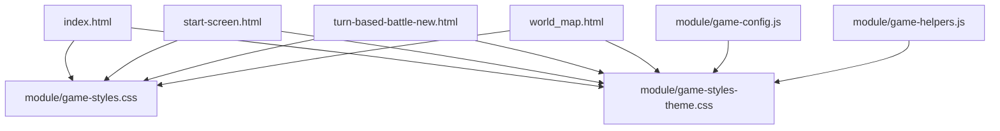
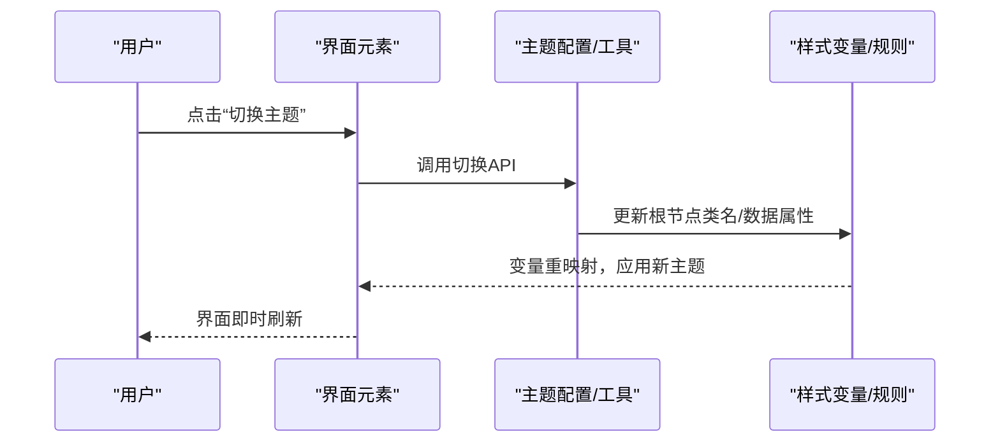
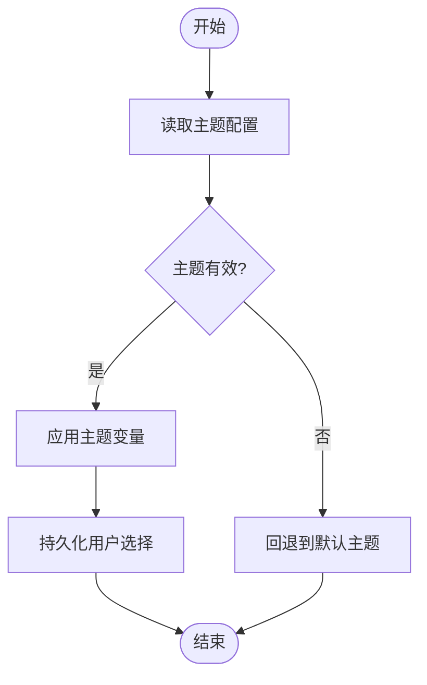
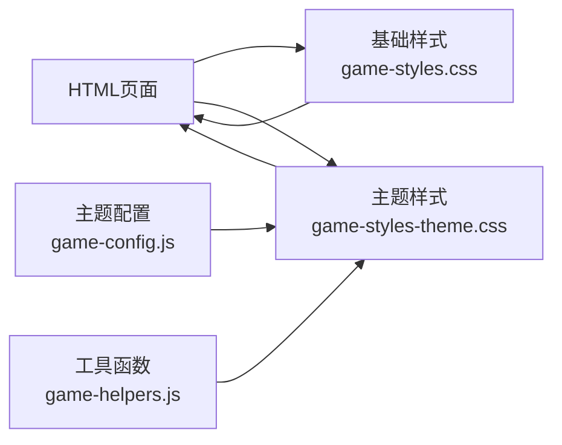

# 样式主题系统

<cite>
**本文引用的文件**   
- [game-styles.css](file://module/game-styles.css)
- [game-styles-theme.css](file://module/game-styles-theme.css)
- [index.html](file://index.html)
- [start-screen.html](file://start-screen.html)
- [turn-based-battle-new.html](file://turn-based-battle-new.html)
- [world_map.html](file://world_map.html)
- [game-config.js](file://module/game-config.js)
- [game-helpers.js](file://module/game-helpers.js)
</cite>

## 目录
1. [简介](#简介)
2. [项目结构](#项目结构)
3. [核心组件](#核心组件)
4. [架构总览](#架构总览)
5. [详细组件分析](#详细组件分析)
6. [依赖关系分析](#依赖关系分析)
7. [性能考虑](#性能考虑)
8. [故障排查指南](#故障排查指南)
9. [结论](#结论)
10. [附录](#附录)

## 简介
本技术文档围绕“姬侠传”样式主题系统，系统性阐述其CSS样式架构与主题切换机制。内容覆盖全局样式变量、组件样式规范、主题配置文件、响应式适配方案、动画与过渡实现、自定义主题开发指南、样式扩展方法、性能优化技巧以及浏览器兼容性处理，旨在为UI样式开发者提供完整的技术参考与设计规范。

## 项目结构
样式主题系统主要位于前端模块目录中，核心样式文件包括：
- 基础样式与布局：module/game-styles.css
- 主题变量与主题切换：module/game-styles-theme.css
- 页面入口与资源加载：index.html、start-screen.html、turn-based-battle-new.html、world_map.html
- 配置与工具：module/game-config.js、module/game-helpers.js

图表来源
- [index.html](file://index.html)
- [start-screen.html](file://start-screen.html)
- [turn-based-battle-new.html](file://turn-based-battle-new.html)
- [world_map.html](file://world_map.html)
- [game-styles.css](file://module/game-styles.css)
- [game-styles-theme.css](file://module/game-styles-theme.css)
- [game-config.js](file://module/game-config.js)
- [game-helpers.js](file://module/game-helpers.js)

章节来源
- [game-styles.css](file://module/game-styles.css)
- [game-styles-theme.css](file://module/game-styles-theme.css)
- [index.html](file://index.html)
- [start-screen.html](file://start-screen.html)
- [turn-based-battle-new.html](file://turn-based-battle-new.html)
- [world_map.html](file://world_map.html)
- [game-config.js](file://module/game-config.js)
- [game-helpers.js](file://module/game-helpers.js)

## 核心组件
- 全局样式变量与主题根节点
  - 通过CSS自定义属性（变量）集中管理颜色、字体、间距、圆角、阴影等设计令牌，便于统一维护与动态切换。
  - 主题切换通常基于根节点或特定容器上的类名/数据属性变化，触发变量值重算并即时生效。
- 基础样式与布局
  - 定义页面骨架、网格/弹性布局、排版层级、通用控件样式，确保一致的基础体验。
- 主题配置文件
  - 将主题相关的数据与逻辑集中在一个文件中，提供默认主题、可选主题集合、切换API与持久化策略。
- 工具与辅助函数
  - 提供读取/写入主题、计算对比度、生成可访问性提示等能力，支撑主题系统的稳定运行。

章节来源
- [game-styles.css](file://module/game-styles.css)
- [game-styles-theme.css](file://module/game-styles-theme.css)
- [game-config.js](file://module/game-config.js)
- [game-helpers.js](file://module/game-helpers.js)

## 架构总览
样式主题系统采用“变量驱动 + 类名切换 + 配置集中”的架构模式：
- 变量层：在根节点声明主题变量，所有组件通过var()引用，避免硬编码。
- 切换层：通过JS在根节点添加/移除主题类名，或更新data属性，触发变量重映射。
- 配置层：主题对象包含多套变量集与元信息（名称、描述、是否高对比度等）。
- 工具层：封装读写、校验、持久化、回退策略等通用能力。

图表来源
- [game-styles-theme.css](file://module/game-styles-theme.css)
- [game-config.js](file://module/game-config.js)
- [game-helpers.js](file://module/game-helpers.js)

## 详细组件分析

### 全局样式变量与主题根节点
- 变量组织
  - 使用命名空间前缀区分用途，如颜色、尺寸、字体、动效等，提升可读性与可维护性。
  - 提供默认值与主题覆盖值，保证降级兼容。
- 根节点策略
  - 在根节点上以类名或data属性标识当前主题，配合媒体查询与选择器组合实现细粒度控制。
- 可访问性
  - 提供高对比度主题与文本缩放支持，确保在不同设备与用户偏好下的可用性。

章节来源
- [game-styles-theme.css](file://module/game-styles-theme.css)
- [game-styles.css](file://module/game-styles.css)

### 基础样式与布局
- 布局体系
  - 采用弹性布局与网格布局结合，兼顾灵活性与一致性；关键区域使用语义化标签与BEM风格命名。
- 排版与层次
  - 统一的字号阶梯、行高与段落间距，强化阅读节奏与信息层级。
- 通用控件
  - 按钮、输入框、卡片、列表等基础控件具备一致的视觉语言与交互反馈。

章节来源
- [game-styles.css](file://module/game-styles.css)

### 主题配置文件与切换机制
- 主题数据结构
  - 每个主题包含变量映射、元信息与可选开关（如暗色模式、高对比度）。
- 切换流程
  - 读取当前主题 -> 校验有效性 -> 更新根节点标记 -> 持久化用户选择 -> 触发重渲染。
- 持久化与回退
  - 优先从本地存储恢复上次选择，若失败则回退到默认主题。

图表来源
- [game-config.js](file://module/game-config.js)
- [game-helpers.js](file://module/game-helpers.js)

章节来源
- [game-config.js](file://module/game-config.js)
- [game-helpers.js](file://module/game-helpers.js)

### 响应式设计实现方案
- 断点策略
  - 基于常用屏幕宽度设定断点，覆盖手机、平板、桌面端；在小屏优先基础上渐进增强。
- 布局适配
  - 使用相对单位与弹性/网格布局，避免固定像素导致的溢出；图片与媒体资源使用自适应比例。
- 交互适配
  - 针对触摸设备优化点击区域与手势反馈；对键盘导航与屏幕阅读器进行无障碍支持。

章节来源
- [game-styles.css](file://module/game-styles.css)
- [game-styles-theme.css](file://module/game-styles-theme.css)

### 动画效果与过渡动画
- 过渡与变换
  - 使用过渡属性实现平滑的颜色、透明度、位移变化；变换用于缩放、旋转等轻量动效。
- 关键帧动画
  - 复杂场景（如战斗特效、地图转场）使用关键帧动画，注意性能与可访问性。
- 性能优化
  - 尽量使用GPU加速的属性（transform、opacity），减少重排与重绘；合理设置动画时长与缓动函数。

章节来源
- [game-styles.css](file://module/game-styles.css)
- [game-styles-theme.css](file://module/game-styles-theme.css)

### 自定义主题开发指南与样式扩展
- 新建主题步骤
  - 在主题配置中添加新主题对象，定义变量映射与元信息；在样式文件中补充必要的覆盖规则。
- 扩展组件样式
  - 遵循BEM命名与变量引用约定，新增组件时仅引入必要变量，避免全局污染。
- 验证与测试
  - 在不同设备与浏览器下验证主题表现；检查对比度与可读性，确保符合可访问性标准。

章节来源
- [game-config.js](file://module/game-config.js)
- [game-styles-theme.css](file://module/game-styles-theme.css)
- [game-styles.css](file://module/game-styles.css)

### 页面集成与资源加载
- 页面引入
  - 各HTML页面按需引入基础样式与主题样式，确保加载顺序正确（基础样式在前，主题样式在后）。
- 运行时切换
  - 页面初始化后根据配置与本地存储决定初始主题，并提供用户切换入口。

章节来源
- [index.html](file://index.html)
- [start-screen.html](file://start-screen.html)
- [turn-based-battle-new.html](file://turn-based-battle-new.html)
- [world_map.html](file://world_map.html)
- [game-config.js](file://module/game-config.js)

## 依赖关系分析
样式主题系统与页面及脚本之间的依赖关系如下：

图表来源
- [index.html](file://index.html)
- [start-screen.html](file://start-screen.html)
- [turn-based-battle-new.html](file://turn-based-battle-new.html)
- [world_map.html](file://world_map.html)
- [game-styles.css](file://module/game-styles.css)
- [game-styles-theme.css](file://module/game-styles-theme.css)
- [game-config.js](file://module/game-config.js)
- [game-helpers.js](file://module/game-helpers.js)

章节来源
- [game-styles.css](file://module/game-styles.css)
- [game-styles-theme.css](file://module/game-styles-theme.css)
- [game-config.js](file://module/game-config.js)
- [game-helpers.js](file://module/game-helpers.js)
- [index.html](file://index.html)
- [start-screen.html](file://start-screen.html)
- [turn-based-battle-new.html](file://turn-based-battle-new.html)
- [world_map.html](file://world_map.html)

## 性能考虑
- 变量复用与最小化重绘
  - 通过CSS变量集中管理，减少重复样式；避免频繁修改布局属性，优先使用变换与透明度。
- 资源体积与加载顺序
  - 将主题样式与基础样式分离并按需加载；压缩与合并静态资源，减少请求次数。
- 动画与媒体优化
  - 限制同时运行的动画数量；使用WebP/AVIF等现代格式，并为旧浏览器提供降级方案。
- 可访问性与用户体验
  - 提供高对比度主题与减少动画选项；确保键盘导航与屏幕阅读器友好。

[本节为通用指导，不直接分析具体文件]

## 故障排查指南
- 主题未生效
  - 检查根节点类名或数据属性是否正确设置；确认主题样式加载顺序与优先级。
- 变量缺失或覆盖异常
  - 核对主题配置中的变量键名与样式引用是否一致；检查媒体查询与选择器作用域。
- 切换卡顿或闪烁
  - 评估动画复杂度与GPU加速属性使用；避免在切换过程中触发大规模重排。
- 移动端显示异常
  - 检查断点与相对单位；确认触摸区域与字体大小是否符合小屏阅读习惯。

章节来源
- [game-styles-theme.css](file://module/game-styles-theme.css)
- [game-styles.css](file://module/game-styles.css)
- [game-config.js](file://module/game-config.js)
- [game-helpers.js](file://module/game-helpers.js)

## 结论
本样式主题系统以CSS变量为核心，结合类名切换与集中配置，实现了可扩展、易维护的主题机制。通过响应式设计与动画优化，提升了跨设备与跨浏览器的用户体验。建议持续完善主题库与组件样式规范，加强可访问性与性能监控，确保长期演进的质量与效率。

[本节为总结性内容，不直接分析具体文件]

## 附录
- 术语表
  - 主题变量：用于统一管理设计令牌的CSS自定义属性。
  - 类名切换：通过在根节点添加/移除类名来改变主题的策略。
  - 响应式断点：针对不同屏幕宽度的样式切换阈值。
- 最佳实践清单
  - 使用变量而非硬编码；遵循BEM命名；保持样式模块化；重视可访问性与性能。

[本节为概念性内容，不直接分析具体文件]