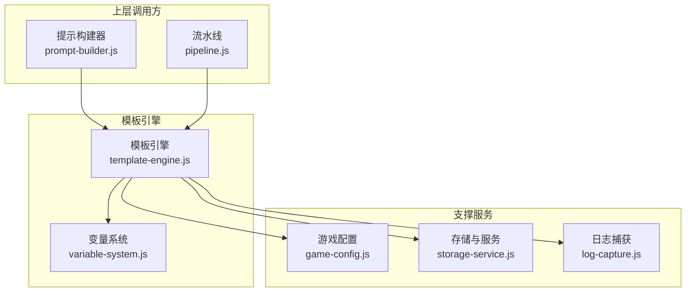
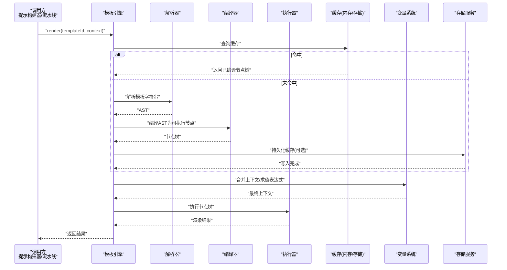
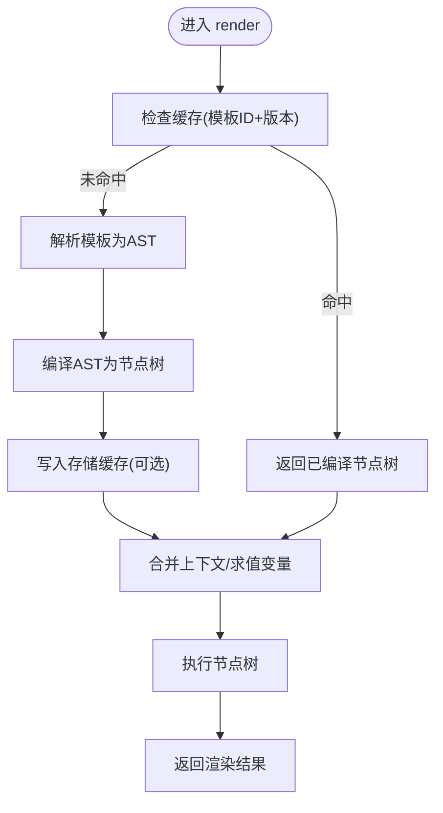
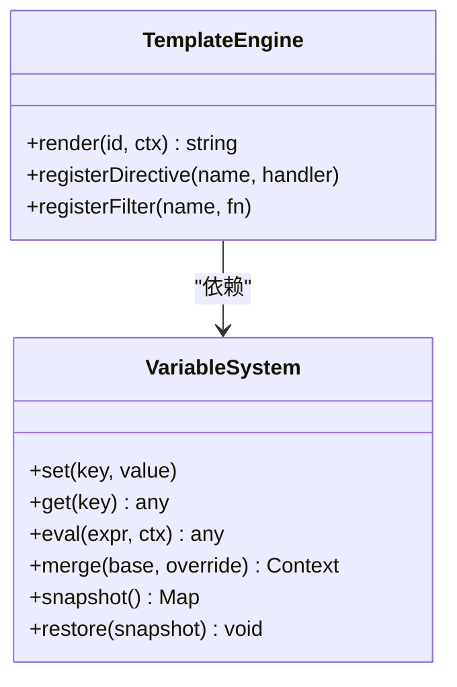
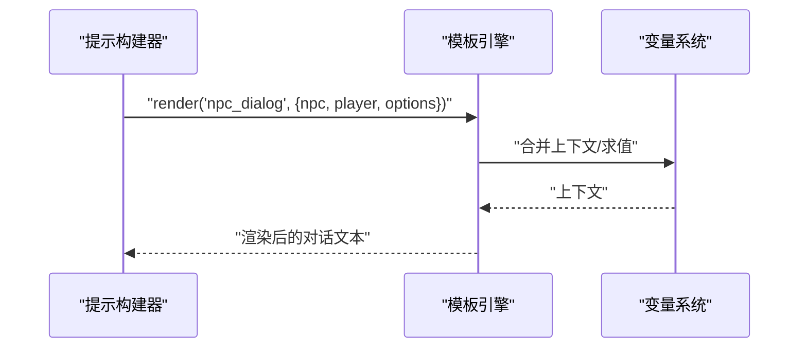
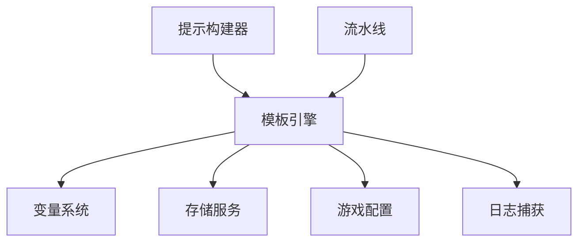

# 模板引擎系统

<cite>
**本文引用的文件**   
- [template-engine.js](file://module/template-engine.js)
- [variable-system.js](file://module/variable-system.js)
- [prompt-builder.js](file://module/prompt-builder.js)
- [pipeline.js](file://module/pipeline.js)
- [game-config.js](file://module/game-config.js)
- [storage-service.js](file://module/storage-service.js)
- [log-capture.js](file://module/log-capture.js)
</cite>

## 目录
1. [简介](#简介)
2. [项目结构](#项目结构)
3. [核心组件](#核心组件)
4. [架构总览](#架构总览)
5. [详细组件分析](#详细组件分析)
6. [依赖关系分析](#依赖关系分析)
7. [性能考虑](#性能考虑)
8. [故障排查指南](#故障排查指南)
9. [结论](#结论)
10. [附录](#附录)

## 简介
本技术文档围绕“姬侠传”模板引擎系统，系统性阐述其设计架构、核心算法与扩展机制。重点覆盖：
- 模板语法解析、变量替换、条件渲染等关键功能
- 动态内容生成机制（游戏文本、对话、界面元素）
- 模板缓存策略与性能优化
- 自定义模板开发与扩展接口使用
- 调试工具与错误排查方法

目标读者包括模板开发者、系统集成者与维护工程师。

## 项目结构
模板引擎位于前端模块层，主要职责是：
- 提供统一的模板渲染入口
- 管理变量系统与上下文
- 与提示构建器、流水线、配置与存储等子系统协作
- 输出最终可渲染的文本或结构化数据

图表来源
- [template-engine.js](file://module/template-engine.js)
- [variable-system.js](file://module/variable-system.js)
- [prompt-builder.js](file://module/prompt-builder.js)
- [pipeline.js](file://module/pipeline.js)
- [game-config.js](file://module/game-config.js)
- [storage-service.js](file://module/storage-service.js)
- [log-capture.js](file://module/log-capture.js)

章节来源
- [template-engine.js](file://module/template-engine.js)
- [variable-system.js](file://module/variable-system.js)
- [prompt-builder.js](file://module/prompt-builder.js)
- [pipeline.js](file://module/pipeline.js)
- [game-config.js](file://module/game-config.js)
- [storage-service.js](file://module/storage-service.js)
- [log-capture.js](file://module/log-capture.js)

## 核心组件
- 模板引擎：负责模板加载、解析、编译、渲染与缓存；对外暴露统一渲染接口。
- 变量系统：维护变量作用域、默认值、函数式变量、表达式求值与上下文合并。
- 提示构建器：将业务数据组装为模板输入，驱动模板引擎进行渲染。
- 流水线：编排多阶段处理（如预处理、渲染、后处理），并集成模板引擎。
- 游戏配置：提供全局开关、主题、语言、模板路径等运行时配置。
- 存储服务：持久化模板缓存、变量快照、历史结果等。
- 日志捕获：记录渲染链路中的关键事件与异常，便于定位问题。

章节来源
- [template-engine.js](file://module/template-engine.js)
- [variable-system.js](file://module/variable-system.js)
- [prompt-builder.js](file://module/prompt-builder.js)
- [pipeline.js](file://module/pipeline.js)
- [game-config.js](file://module/game-config.js)
- [storage-service.js](file://module/storage-service.js)
- [log-capture.js](file://module/log-capture.js)

## 架构总览
模板引擎采用“解析-编译-执行-缓存”的分层架构，结合变量系统的上下文注入能力，实现高内聚、低耦合的动态内容生成。

图表来源
- [template-engine.js](file://module/template-engine.js)
- [variable-system.js](file://module/variable-system.js)
- [storage-service.js](file://module/storage-service.js)

## 详细组件分析

### 模板引擎（Template Engine）
- 职责
  - 模板生命周期管理：加载、解析、编译、执行、缓存
  - 渲染入口：接收模板标识与上下文，返回渲染结果
  - 错误边界：捕获解析/编译/执行期异常，上报日志
- 关键流程
  - 解析：将模板字符串转换为抽象语法树（AST）
  - 编译：将 AST 转换为可执行节点树（含控制流、插值、循环等）
  - 执行：在给定上下文中遍历节点树，产出最终文本或结构化数据
  - 缓存：按模板ID与版本哈希缓存编译产物，支持跨会话持久化
- 扩展点
  - 自定义指令/标签注册
  - 过滤器/格式化器注册
  - 渲染钩子（前/后处理）

图表来源
- [template-engine.js](file://module/template-engine.js)
- [storage-service.js](file://module/storage-service.js)

章节来源
- [template-engine.js](file://module/template-engine.js)

### 变量系统（Variable System）
- 职责
  - 维护多层作用域（全局、场景、角色、局部）
  - 支持静态变量、函数式变量、表达式求值
  - 提供上下文合并、缺失值回退、类型转换
- 关键特性
  - 延迟求值：仅在访问时计算，避免无谓开销
  - 安全沙箱：限制危险操作，仅暴露白名单函数
  - 缓存键：基于变量快照生成稳定键，用于模板缓存
- 典型用法
  - 通过上下文对象注入变量
  - 在模板中引用变量与表达式
  - 使用函数式变量动态生成内容片段

图表来源
- [variable-system.js](file://module/variable-system.js)
- [template-engine.js](file://module/template-engine.js)

章节来源
- [variable-system.js](file://module/variable-system.js)

### 提示构建器（Prompt Builder）
- 职责
  - 将业务数据（角色、剧情、选项等）组织为模板输入
  - 选择合适模板ID与参数
  - 触发模板渲染并整合到提示词中
- 与模板引擎交互
  - 传入模板ID与上下文
  - 接收渲染结果，拼接至最终提示

图表来源
- [prompt-builder.js](file://module/prompt-builder.js)
- [template-engine.js](file://module/template-engine.js)
- [variable-system.js](file://module/variable-system.js)

章节来源
- [prompt-builder.js](file://module/prompt-builder.js)

### 流水线（Pipeline）
- 职责
  - 编排多阶段处理：预处理→模板渲染→后处理
  - 集成模板引擎作为中间阶段
  - 提供错误恢复与重试策略
- 与模板引擎交互
  - 在指定阶段调用模板渲染
  - 将渲染结果传递给后续阶段

图表来源
- [pipeline.js](file://module/pipeline.js)
- [template-engine.js](file://module/template-engine.js)

章节来源
- [pipeline.js](file://module/pipeline.js)

### 游戏配置（Game Config）
- 职责
  - 提供全局开关（是否启用缓存、调试模式、语言包）
  - 定义模板根路径、默认模板ID映射
  - 暴露运行时可热更新的配置项
- 与模板引擎交互
  - 读取模板路径与渲染策略
  - 根据配置决定是否启用缓存与日志

章节来源
- [game-config.js](file://module/game-config.js)

### 存储服务（Storage Service）
- 职责
  - 持久化模板编译产物、变量快照、渲染结果
  - 提供缓存失效与清理策略
- 与模板引擎交互
  - 读写缓存条目
  - 在启动时预热常用模板

章节来源
- [storage-service.js](file://module/storage-service.js)

### 日志捕获（Log Capture）
- 职责
  - 收集渲染链路的关键事件与异常
  - 提供结构化日志字段（模板ID、耗时、错误堆栈）
- 与模板引擎交互
  - 在解析/编译/执行阶段打点
  - 上报错误以便追踪

章节来源
- [log-capture.js](file://module/log-capture.js)

## 依赖关系分析
- 松耦合设计
  - 模板引擎仅依赖变量系统与存储服务，不直接感知上层业务
  - 提示构建器与流水线通过统一接口调用模板引擎
- 外部依赖
  - 配置中心提供运行期行为切换
  - 存储服务提供跨会话缓存能力
  - 日志系统提供可观测性

图表来源
- [prompt-builder.js](file://module/prompt-builder.js)
- [pipeline.js](file://module/pipeline.js)
- [template-engine.js](file://module/template-engine.js)
- [variable-system.js](file://module/variable-system.js)
- [storage-service.js](file://module/storage-service.js)
- [game-config.js](file://module/game-config.js)
- [log-capture.js](file://module/log-capture.js)

章节来源
- [prompt-builder.js](file://module/prompt-builder.js)
- [pipeline.js](file://module/pipeline.js)
- [template-engine.js](file://module/template-engine.js)
- [variable-system.js](file://module/variable-system.js)
- [storage-service.js](file://module/storage-service.js)
- [game-config.js](file://module/game-config.js)
- [log-capture.js](file://module/log-capture.js)

## 性能考虑
- 缓存策略
  - 内存缓存：首次渲染后缓存编译节点树，减少重复解析/编译
  - 持久化缓存：跨会话复用，降低冷启动成本
  - 失效策略：基于模板版本哈希与变量快照键，确保一致性
- 执行优化
  - 惰性求值：仅在访问变量时计算表达式
  - 批量渲染：对列表型模板进行批处理，减少上下文切换
  - 预取预热：启动时按需加载高频模板
- 资源控制
  - 限制单次渲染最大深度与长度
  - 超时保护与降级策略（返回空或占位文本）

[本节为通用性能建议，无需特定文件来源]

## 故障排查指南
- 常见问题
  - 模板未找到：检查模板ID与路径映射
  - 变量缺失：确认上下文注入与作用域优先级
  - 表达式求值失败：检查白名单函数与数据类型
  - 缓存不一致：核对版本哈希与失效策略
- 诊断步骤
  - 开启调试模式，查看渲染链路日志
  - 打印变量快照，验证上下文完整性
  - 复现最小用例，隔离问题范围
- 日志关键字段
  - 模板ID、版本、耗时、错误堆栈、上下文摘要

章节来源
- [log-capture.js](file://module/log-capture.js)
- [template-engine.js](file://module/template-engine.js)
- [variable-system.js](file://module/variable-system.js)

## 结论
模板引擎以清晰的解析-编译-执行分层与完善的变量系统为基础，结合缓存与日志能力，实现了高效、可扩展的动态内容生成机制。通过标准化接口与扩展点，开发者可快速定制模板语法、过滤器与渲染钩子，满足多样化业务需求。

[本节为总结性内容，无需特定文件来源]

## 附录

### 自定义模板开发指南
- 模板命名与路径
  - 遵循约定优于配置，集中管理模板ID与路径映射
- 语法规范
  - 变量插值：使用统一占位符
  - 条件渲染：支持 if/else 分支
  - 循环渲染：支持列表遍历与索引
  - 过滤器：对变量进行格式化与转换
- 最佳实践
  - 保持模板简洁，复杂逻辑下沉至变量系统
  - 使用小粒度模板组合，提升复用率
  - 为关键模板编写单元测试与回归用例

[本节为概念性指导，无需特定文件来源]

### 扩展接口使用说明
- 注册自定义指令/标签
  - 在模板引擎初始化时注册，提供处理器回调
- 注册过滤器/格式化器
  - 提供纯函数，接收输入并返回格式化结果
- 渲染钩子
  - 在解析/编译/执行前后插入自定义逻辑
- 注意事项
  - 避免阻塞主线程，必要时异步化
  - 严格校验输入，防止注入风险

[本节为概念性指导，无需特定文件来源]