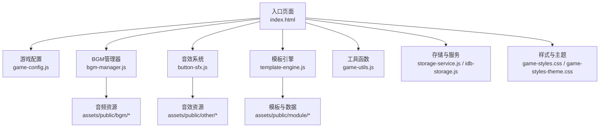
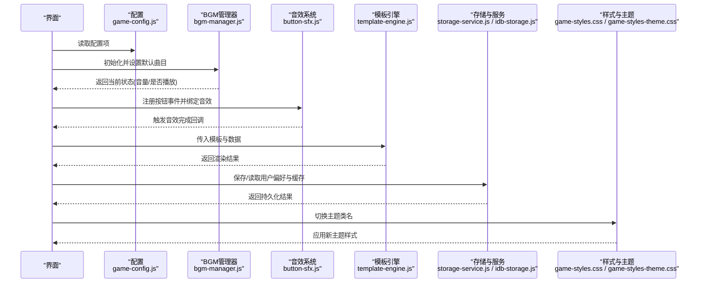
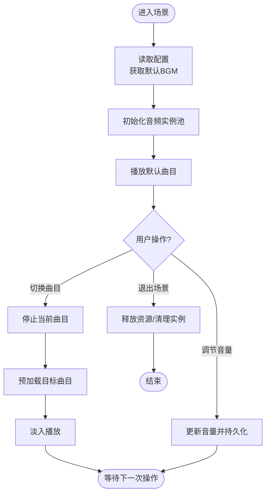
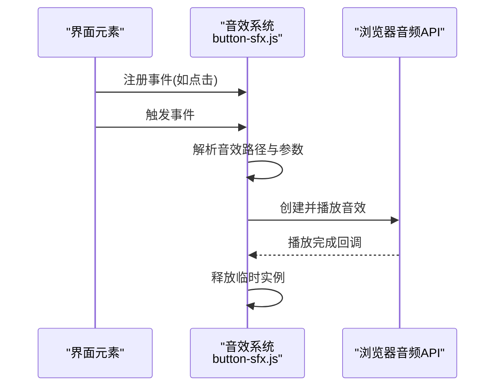
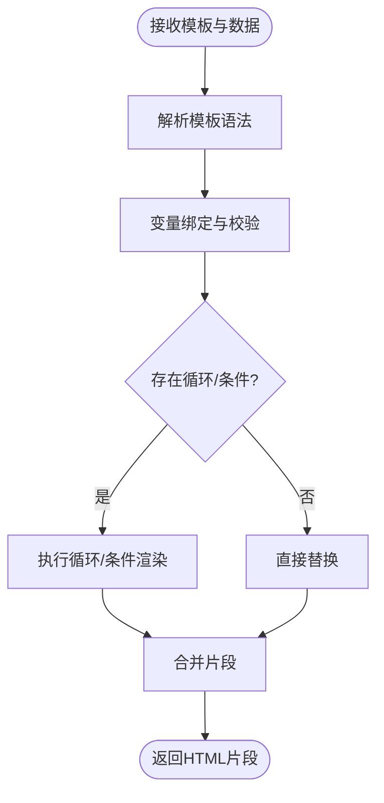
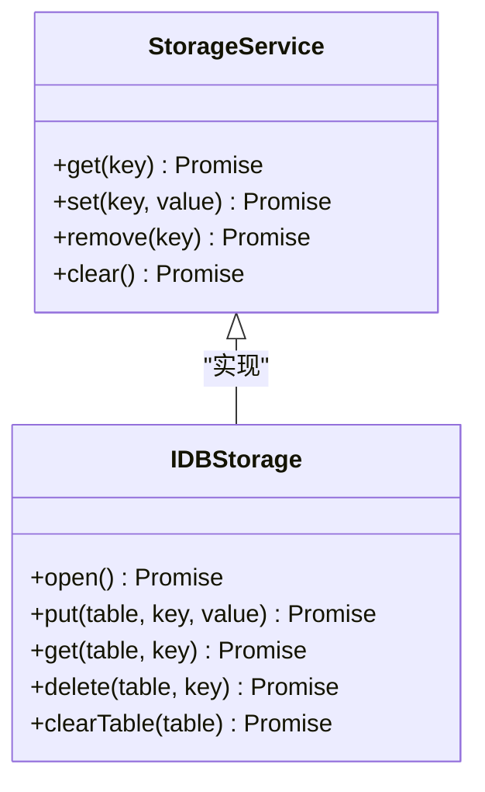
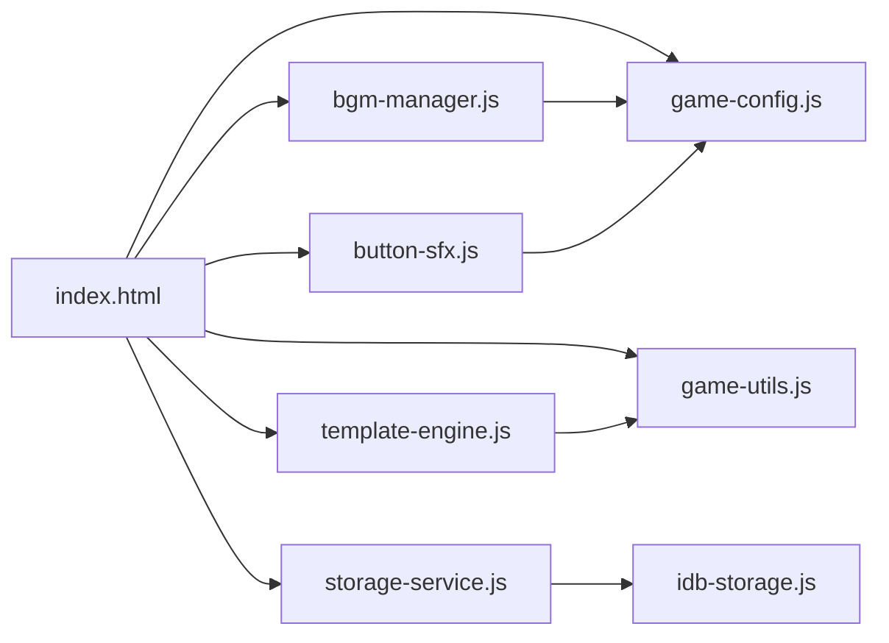

# 资源管理系统

<cite>
**本文引用的文件**   
- [bgm-manager.js](file://module/bgm-manager.js)
- [button-sfx.js](file://module/button-sfx.js)
- [template-engine.js](file://module/template-engine.js)
- [game-config.js](file://module/game-config.js)
- [game-utils.js](file://module/game-utils.js)
- [storage-service.js](file://module/storage-service.js)
- [idb-storage.js](file://module/idb-storage.js)
- [game-styles-theme.css](file://module/game-styles-theme.css)
- [game-styles.css](file://module/game-styles.css)
- [index.html](file://apk/android/app/src/main/assets/public/index.html)
</cite>

## 目录
1. [简介](#简介)
2. [项目结构](#项目结构)
3. [核心组件](#核心组件)
4. [架构总览](#架构总览)
5. [详细组件分析](#详细组件分析)
6. [依赖关系分析](#依赖关系分析)
7. [性能与优化](#性能与优化)
8. [故障排查指南](#故障排查指南)
9. [结论](#结论)
10. [附录](#附录)

## 简介
本技术文档围绕“姬侠传”资源管理系统的多媒体资源管理机制展开，重点覆盖音频播放、图片加载、缓存策略、BGM管理器、音效系统、模板引擎与动态内容生成、主题系统与样式管理等。目标是帮助开发者理解系统设计与实现细节，掌握资源组织方式与最佳实践，提升整体性能与可维护性。

## 项目结构
资源相关代码主要位于 module 目录，静态资源（音乐、图片等）位于 assets/public 与根级资源目录；样式文件位于 module 下的 CSS 文件；入口页面为 index.html。

图表来源
- [index.html](file://apk/android/app/src/main/assets/public/index.html)
- [bgm-manager.js](file://module/bgm-manager.js)
- [button-sfx.js](file://module/button-sfx.js)
- [template-engine.js](file://module/template-engine.js)
- [game-config.js](file://module/game-config.js)
- [game-utils.js](file://module/game-utils.js)
- [storage-service.js](file://module/storage-service.js)
- [idb-storage.js](file://module/idb-storage.js)
- [game-styles.css](file://module/game-styles.css)
- [game-styles-theme.css](file://module/game-styles-theme.css)

章节来源
- [index.html](file://apk/android/app/src/main/assets/public/index.html)
- [bgm-manager.js](file://module/bgm-manager.js)
- [button-sfx.js](file://module/button-sfx.js)
- [template-engine.js](file://module/template-engine.js)
- [game-config.js](file://module/game-config.js)
- [game-utils.js](file://module/game-utils.js)
- [storage-service.js](file://module/storage-service.js)
- [idb-storage.js](file://module/idb-storage.js)
- [game-styles.css](file://module/game-styles.css)
- [game-styles-theme.css](file://module/game-styles-theme.css)

## 核心组件
- BGM管理器：负责背景音乐切换、音量控制、预加载与状态同步。
- 音效系统：提供短促音效的触发机制与资源组织。
- 模板引擎：支持动态内容生成与变量替换。
- 配置与工具：集中式配置、通用工具函数。
- 存储与服务：持久化与本地缓存服务。
- 样式与主题：全局样式与主题切换机制。

章节来源
- [bgm-manager.js](file://module/bgm-manager.js)
- [button-sfx.js](file://module/button-sfx.js)
- [template-engine.js](file://module/template-engine.js)
- [game-config.js](file://module/game-config.js)
- [game-utils.js](file://module/game-utils.js)
- [storage-service.js](file://module/storage-service.js)
- [idb-storage.js](file://module/idb-storage.js)
- [game-styles.css](file://module/game-styles.css)
- [game-styles-theme.css](file://module/game-styles-theme.css)

## 架构总览
资源管理系统以“配置驱动 + 模块解耦”的方式组织，入口页面按需引入各模块，通过统一接口进行交互。BGM与音效分别管理长时背景音与短时提示音；模板引擎负责渲染动态内容；存储层提供本地缓存与快照能力；样式与主题通过CSS变量或类名切换实现。

图表来源
- [bgm-manager.js](file://module/bgm-manager.js)
- [button-sfx.js](file://module/button-sfx.js)
- [template-engine.js](file://module/template-engine.js)
- [game-config.js](file://module/game-config.js)
- [storage-service.js](file://module/storage-service.js)
- [idb-storage.js](file://module/idb-storage.js)
- [game-styles.css](file://module/game-styles.css)
- [game-styles-theme.css](file://module/game-styles-theme.css)

## 详细组件分析

### BGM管理器
职责与能力
- 管理多首背景音乐，支持按场景/情绪分类切换。
- 提供统一的音量控制接口，支持静音与淡入淡出。
- 实现预加载策略，减少切换时的卡顿。
- 暴露状态查询接口，便于UI同步显示。

关键流程
- 初始化：根据配置选择默认曲目，建立音频实例池。
- 切换：停止当前曲目，预加载目标曲目，平滑过渡播放。
- 音量：更新全局音量并持久化用户偏好。
- 预加载：在空闲时机异步加载下一首候选曲目。

图表来源
- [bgm-manager.js](file://module/bgm-manager.js)
- [game-config.js](file://module/game-config.js)

章节来源
- [bgm-manager.js](file://module/bgm-manager.js)
- [game-config.js](file://module/game-config.js)

### 音效系统
职责与能力
- 提供短促音效的统一触发接口。
- 支持多音效资源管理与优先级控制。
- 与UI事件绑定，确保交互反馈及时。

触发机制
- 事件注册：在按钮或交互元素上注册点击/悬停事件。
- 资源定位：根据事件类型映射到对应音效路径。
- 播放控制：创建临时音频实例，播放完成后自动销毁。

图表来源
- [button-sfx.js](file://module/button-sfx.js)

章节来源
- [button-sfx.js](file://module/button-sfx.js)

### 模板引擎与动态内容生成
职责与能力
- 解析模板字符串，支持变量替换与条件渲染。
- 提供数据绑定与循环渲染能力。
- 输出安全HTML片段，避免注入风险。

处理流程
- 输入：模板字符串 + 数据对象。
- 解析：识别占位符与指令。
- 渲染：执行替换与逻辑分支。
- 输出：拼接最终HTML。

图表来源
- [template-engine.js](file://module/template-engine.js)

章节来源
- [template-engine.js](file://module/template-engine.js)

### 配置与工具
- 配置中心：集中管理BGM列表、音效映射、主题开关、缓存策略等。
- 工具函数：路径拼接、格式转换、错误封装、日志记录等。

章节来源
- [game-config.js](file://module/game-config.js)
- [game-utils.js](file://module/game-utils.js)

### 存储与服务
- 存储抽象：统一读写接口，适配不同后端或本地存储。
- IndexedDB封装：提供高性能本地缓存与快照能力。
- 使用场景：用户偏好、缓存资源清单、历史快照。

图表来源
- [storage-service.js](file://module/storage-service.js)
- [idb-storage.js](file://module/idb-storage.js)

章节来源
- [storage-service.js](file://module/storage-service.js)
- [idb-storage.js](file://module/idb-storage.js)

### 主题系统与样式管理
- 样式分层：基础样式与主题样式分离，通过类名切换实现主题。
- 变量驱动：使用CSS变量统一管理颜色、字体、间距等。
- 运行时切换：监听用户设置，动态更新DOM类名与变量值。

章节来源
- [game-styles.css](file://module/game-styles.css)
- [game-styles-theme.css](file://module/game-styles-theme.css)

## 依赖关系分析
模块间依赖清晰，遵循低耦合高内聚原则。入口页面按需引入模块，模块之间通过配置与工具函数进行协作，避免直接强耦合。

图表来源
- [index.html](file://apk/android/app/src/main/assets/public/index.html)
- [bgm-manager.js](file://module/bgm-manager.js)
- [button-sfx.js](file://module/button-sfx.js)
- [template-engine.js](file://module/template-engine.js)
- [game-config.js](file://module/game-config.js)
- [game-utils.js](file://module/game-utils.js)
- [storage-service.js](file://module/storage-service.js)
- [idb-storage.js](file://module/idb-storage.js)

章节来源
- [index.html](file://apk/android/app/src/main/assets/public/index.html)
- [bgm-manager.js](file://module/bgm-manager.js)
- [button-sfx.js](file://module/button-sfx.js)
- [template-engine.js](file://module/template-engine.js)
- [game-config.js](file://module/game-config.js)
- [game-utils.js](file://module/game-utils.js)
- [storage-service.js](file://module/storage-service.js)
- [idb-storage.js](file://module/idb-storage.js)

## 性能与优化
- 音频预加载：在空闲时机异步加载候选曲目，降低切换延迟。
- 资源去重：对重复请求的资源进行缓存，避免重复下载。
- 懒加载：按需加载图片与模板片段，减少首屏压力。
- 音量与静音：提供静音开关，避免不必要的音频解码开销。
- 主题切换：通过CSS变量与类名切换，避免重新计算布局。
- 存储优化：批量写入与索引设计，提高读写效率。

[本节为通用指导，不直接分析具体文件]

## 故障排查指南
- 音频无法播放：检查浏览器自动播放策略与用户手势要求；确认音频路径与MIME类型正确。
- 音效无响应：验证事件绑定是否正确；检查音效资源是否存在与大小限制。
- 模板渲染异常：核对模板语法与数据类型；输出中间结果定位问题。
- 主题未生效：确认类名切换逻辑与CSS变量定义；检查样式加载顺序。
- 存储失败：检查IndexedDB权限与配额；捕获并记录错误堆栈。

章节来源
- [bgm-manager.js](file://module/bgm-manager.js)
- [button-sfx.js](file://module/button-sfx.js)
- [template-engine.js](file://module/template-engine.js)
- [storage-service.js](file://module/storage-service.js)
- [idb-storage.js](file://module/idb-storage.js)

## 结论
本资源管理系统通过模块化设计与清晰的职责划分，实现了高效的音频与图片资源管理、灵活的模板渲染与主题切换，以及可靠的本地缓存与持久化能力。遵循本文档的最佳实践与优化建议，可进一步提升用户体验与系统稳定性。

[本节为总结性内容，不直接分析具体文件]

## 附录
- 资源组织建议：按功能域与媒体类型分层，命名规范统一，便于检索与维护。
- 开发规范：接口契约明确、错误信息可读、日志分级输出。
- 测试要点：音频切换时序、音效触发时机、模板边界条件、主题切换一致性。

[本节为补充说明，不直接分析具体文件]