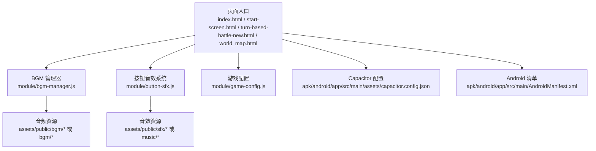
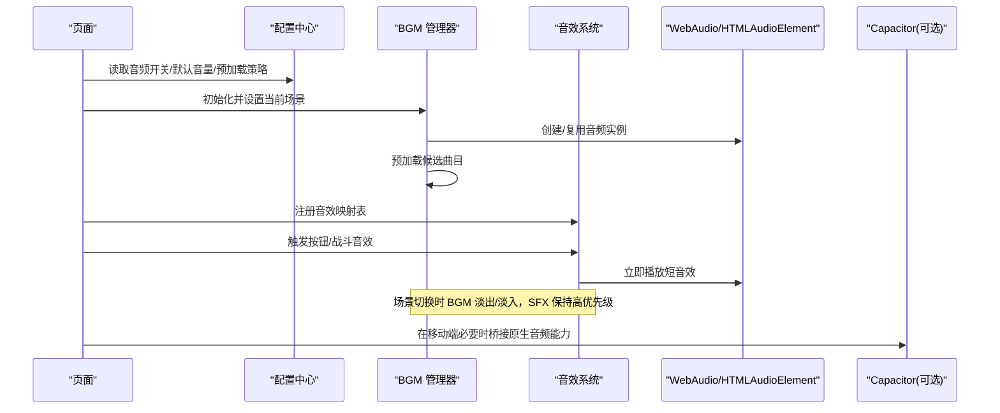
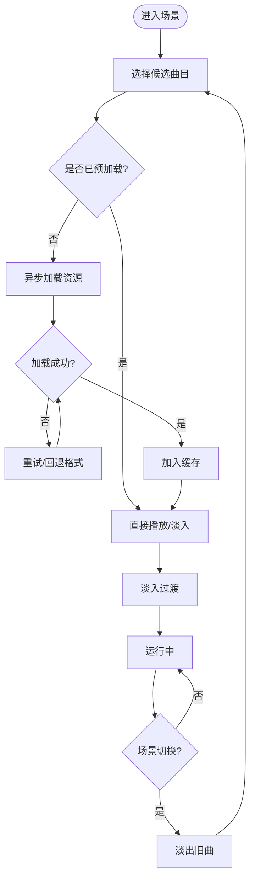
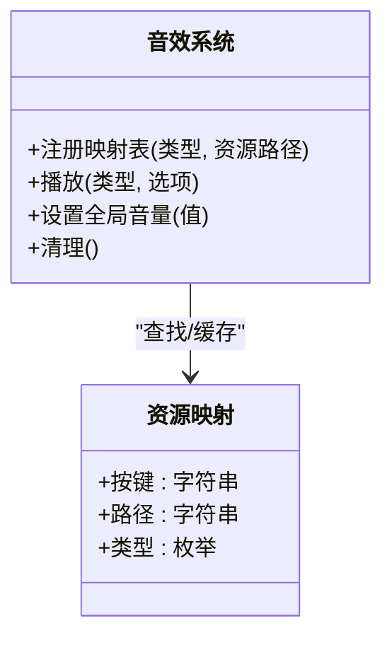
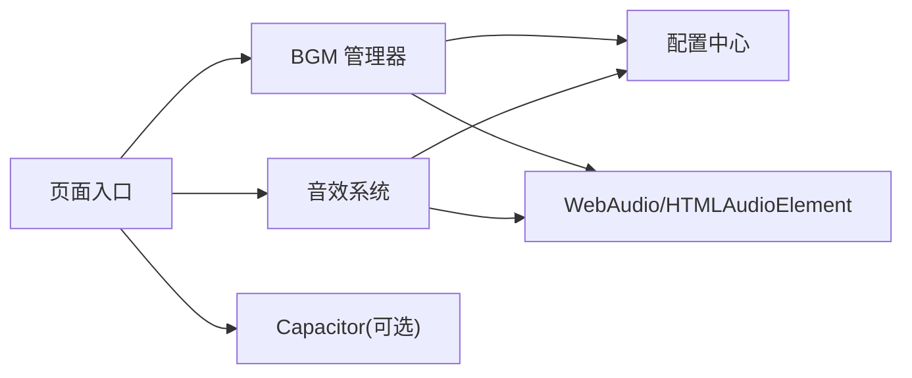

# 音频管理系统

<cite>
**本文引用的文件**   
- [bgm-manager.js](file://module/bgm-manager.js)
- [button-sfx.js](file://module/button-sfx.js)
- [game-config.js](file://module/game-config.js)
- [index.html](file://index.html)
- [start-screen.html](file://start-screen.html)
- [turn-based-battle-new.html](file://turn-based-battle-new.html)
- [world_map.html](file://world_map.html)
- [capacitor.config.json](file://apk/android/app/src/main/assets/capacitor.config.json)
- [AndroidManifest.xml](file://apk/android/app/src/main/AndroidManifest.xml)
- [build.gradle](file://apk/android/app/build.gradle)
- [ReadMe.md](file://ReadMe.md)
</cite>

## 目录
1. [简介](#简介)
2. [项目结构](#项目结构)
3. [核心组件](#核心组件)
4. [架构总览](#架构总览)
5. [详细组件分析](#详细组件分析)
6. [依赖关系分析](#依赖关系分析)
7. [性能与内存优化](#性能与内存优化)
8. [故障排查指南](#故障排查指南)
9. [结论](#结论)
10. [附录](#附录)

## 简介
本技术文档围绕“姬侠传”的音频管理系统，系统性阐述 BGM 管理器与音效系统的实现原理、资源组织方式、预加载策略、跨平台兼容性与错误恢复机制，并提供性能监控与调试方法。目标是帮助开发者快速理解并高效扩展音频功能，确保在 Web 与 Android（Capacitor）环境下获得一致、低延迟的播放体验。

## 项目结构
本项目采用模块化前端架构，音频相关能力集中在 module 目录下的专用脚本中，并通过页面入口按需引入。BGM 与音效分别由独立模块管理，配置项集中维护，便于统一开关与参数调整。

图表来源
- [index.html](file://index.html)
- [start-screen.html](file://start-screen.html)
- [turn-based-battle-new.html](file://turn-based-battle-new.html)
- [world_map.html](file://world_map.html)
- [bgm-manager.js](file://module/bgm-manager.js)
- [button-sfx.js](file://module/button-sfx.js)
- [game-config.js](file://module/game-config.js)
- [capacitor.config.json](file://apk/android/app/src/main/assets/capacitor.config.json)
- [AndroidManifest.xml](file://apk/android/app/src/main/AndroidManifest.xml)

章节来源
- [ReadMe.md](file://ReadMe.md)

## 核心组件
- BGM 管理器：负责背景音乐的选择、加载、播放控制（播放/暂停/停止）、音量调节、淡入淡出、场景切换时的平滑过渡与状态同步。
- 音效系统：负责短促音效（如按钮点击、战斗命中等）的即时触发、优先级控制与并发播放限制。
- 配置中心：提供全局音频开关、默认音量、预加载策略、格式回退列表等配置项。
- 页面集成点：各页面在初始化时订阅 BGM 事件、注册音效触发器，并在生命周期钩子中处理音频上下文恢复与资源释放。

章节来源
- [bgm-manager.js](file://module/bgm-manager.js)
- [button-sfx.js](file://module/button-sfx.js)
- [game-config.js](file://module/game-config.js)

## 架构总览
下图展示了从页面到音频子系统的关键交互路径，包括 BGM 与 SFX 的职责边界以及配置与平台适配的接入点。

图表来源
- [bgm-manager.js](file://module/bgm-manager.js)
- [button-sfx.js](file://module/button-sfx.js)
- [game-config.js](file://module/game-config.js)
- [capacitor.config.json](file://apk/android/app/src/main/assets/capacitor.config.json)

## 详细组件分析

### BGM 管理器
职责与流程
- 资源定位与选择：根据当前场景/情绪标签选择候选曲目，支持按目录或命名规则匹配。
- 加载与缓存：优先使用预加载队列，避免首次播放卡顿；对已加载资源进行内存级缓存。
- 播放控制：提供播放、暂停、停止、跳转进度、循环模式等接口。
- 音量与淡入淡出：支持全局与分轨音量控制，场景切换时执行交叉淡入淡出。
- 场景切换：监听场景变更事件，自动完成旧曲淡出与新曲淡入，保证无缝衔接。
- 状态同步：暴露当前状态查询接口，供 UI 显示与日志记录。

关键设计要点
- 单例化：确保全局仅存在一个 BGM 实例，避免多实例竞争音频通道。
- 异步预取：在空闲帧或用户交互后启动预取，降低首帧阻塞。
- 降级策略：当首选格式不可用时，自动回退至备选格式。
- 错误恢复：网络失败或解码异常时，自动重试或切换到备用曲目。

图表来源
- [bgm-manager.js](file://module/bgm-manager.js)

章节来源
- [bgm-manager.js](file://module/bgm-manager.js)

### 音效系统（按钮/战斗等）
职责与流程
- 资源组织：按类型（按钮、战斗、环境等）分类存放，通过键名映射到具体资源路径。
- 触发逻辑：在用户交互或事件回调中调用统一接口，内部根据类型选择对应音效。
- 并发与优先级：限制同时播放数量，避免高频触发导致爆音；战斗类音效可提升优先级。
- 音量与声道：支持全局音量缩放与左右声道平衡（可选）。
- 生命周期：短音效播放完成后自动释放引用，减少内存占用。

图表来源
- [button-sfx.js](file://module/button-sfx.js)

章节来源
- [button-sfx.js](file://module/button-sfx.js)

### 配置中心（音频相关）
职责与内容
- 全局开关：音乐/音效开关、静音模式。
- 默认参数：初始音量、淡入淡出时长、最大并发数、预加载数量。
- 格式偏好：首选格式列表（如 mp3、ogg、webm），用于跨浏览器兼容性。
- 平台差异：针对 Capacitor/Android 的特殊行为开关（如后台播放、唤醒锁）。

章节来源
- [game-config.js](file://module/game-config.js)

### 页面集成点
- 初始化顺序：先加载配置，再初始化 BGM 与音效系统，最后注册事件监听。
- 生命周期：页面卸载时释放音频资源，避免内存泄漏。
- 交互恢复：在移动端，用户首次交互后恢复被挂起的音频上下文。

章节来源
- [index.html](file://index.html)
- [start-screen.html](file://start-screen.html)
- [turn-based-battle-new.html](file://turn-based-battle-new.html)
- [world_map.html](file://world_map.html)

## 依赖关系分析
- 模块耦合：页面依赖 BGM 与音效系统；两者均依赖配置中心；音效系统与 BGM 管理器相互独立，通过配置共享全局音量。
- 外部依赖：WebAudio API 与 HTMLAudioElement 作为底层播放能力；在 Android 打包下通过 Capacitor 桥接原生能力（可选）。
- 潜在循环：应避免 BGM 与音效系统互相导入，建议通过事件总线或配置中心解耦。

图表来源
- [bgm-manager.js](file://module/bgm-manager.js)
- [button-sfx.js](file://module/button-sfx.js)
- [game-config.js](file://module/game-config.js)
- [capacitor.config.json](file://apk/android/app/src/main/assets/capacitor.config.json)

章节来源
- [bgm-manager.js](file://module/bgm-manager.js)
- [button-sfx.js](file://module/button-sfx.js)
- [game-config.js](file://module/game-config.js)
- [capacitor.config.json](file://apk/android/app/src/main/assets/capacitor.config.json)

## 性能与内存优化
- 预加载策略
  - 场景内预取：在进入新场景前，基于预测模型预取 1~3 首候选曲目。
  - 空闲调度：利用 requestIdleCallback 或微任务在空闲期批量加载。
  - 去重与缓存：以资源指纹为键，避免重复下载与解码。
- 并发与限流
  - 限制同时解码/播放的数量，防止主线程拥塞。
  - 短音效采用对象池复用，减少 GC 压力。
- 编码与体积
  - 优先使用有损压缩格式（如 mp3/ogg），在保证质量的前提下减小体积。
  - 长 BGM 分段加载或流式播放，降低首开内存峰值。
- 淡入淡出与无缝切换
  - 使用交叉淡入淡出避免切歌突兀。
  - 在新曲缓冲完成后再触发淡入，避免卡顿。
- 平台差异
  - 在 Android/Capacitor 环境中，注意前台服务与音频焦点策略，避免被系统中断。
  - 针对 iOS Safari 的用户手势要求，确保在用户交互后才恢复音频上下文。

[本节为通用指导，不直接分析具体文件]

## 故障排查指南
常见问题与定位步骤
- 无声音或无法播放
  - 检查全局开关与默认音量配置是否正确。
  - 确认页面是否在用户交互后恢复音频上下文（尤其移动端）。
  - 查看浏览器控制台是否有 CORS 或 MIME 类型错误。
- 播放卡顿或延迟
  - 检查预加载是否生效，是否存在大量未缓存资源。
  - 观察并发解码数量是否过高，适当降低并发上限。
- 场景切换突兀
  - 确认淡入淡出时长与交叉策略是否启用。
  - 检查新旧曲目切换时序，确保新曲缓冲完成后再淡入。
- 移动端异常
  - 核对 Capacitor 配置与权限声明，确保音频相关权限正确。
  - 验证后台播放与唤醒锁策略是否符合预期。

章节来源
- [game-config.js](file://module/game-config.js)
- [capacitor.config.json](file://apk/android/app/src/main/assets/capacitor.config.json)
- [AndroidManifest.xml](file://apk/android/app/src/main/AndroidManifest.xml)
- [build.gradle](file://apk/android/app/build.gradle)

## 结论
本音频管理系统通过清晰的模块划分与统一的配置中心，实现了 BGM 与音效的解耦与协同工作。借助预加载、并发控制与淡入淡出等策略，系统在 Web 与 Android 平台上均可提供稳定、低延迟的音频体验。建议在后续迭代中持续完善错误恢复与性能监控能力，进一步提升鲁棒性与可观测性。

[本节为总结性内容，不直接分析具体文件]

## 附录

### 音频格式支持与跨平台兼容性
- 推荐格式：mp3、ogg、webm，按浏览器能力动态选择。
- 回退策略：若首选格式不可用，自动尝试备选格式。
- 平台差异：iOS Safari 需用户手势触发；Android 可通过 Capacitor 获取更稳定的后台播放能力。

章节来源
- [game-config.js](file://module/game-config.js)
- [capacitor.config.json](file://apk/android/app/src/main/assets/capacitor.config.json)

### 资源组织规范
- BGM 目录：按场景/情绪分类，便于 BGM 管理器按标签检索。
- 音效目录：按类型（按钮、战斗、环境）分类，配合映射表快速定位。
- 命名约定：文件名包含必要元信息（如时长、采样率）以便工具链校验。

章节来源
- [bgm-manager.js](file://module/bgm-manager.js)
- [button-sfx.js](file://module/button-sfx.js)

### 音频性能监控与调试
- 指标采集：首播延迟、解码耗时、缓存命中率、并发数、内存占用。
- 日志输出：在关键节点（加载、播放、切换、错误）输出结构化日志。
- 可视化面板：在开发模式下提供简易面板展示实时指标与操作日志。

章节来源
- [bgm-manager.js](file://module/bgm-manager.js)
- [button-sfx.js](file://module/button-sfx.js)