# 项目概述

<cite>
**本文引用的文件**   
- [ReadMe.md](file://ReadMe.md)
- [index.html](file://module/index.html)
- [start-screen.html](file://module/start-screen.html)
- [turn-based-battle.html](file://module/turn-based-battle.html)
- [world_map.html](file://module/world_map.html)
- [capacitor.config.json](file://module/capacitor.config.json)
- [MainActivity.java](file://apk/android/app/src/main/java/com/jihaitang/jxz/MainActivity.java)
- [AndroidManifest.xml](file://apk/android/app/src/main/AndroidManifest.xml)
- [build.gradle](file://apk/android/app/build.gradle)
- [api-service.js](file://module/api-service.js)
- [idb-storage.js](file://module/idb-storage.js)
- [pipeline.js](file://module/pipeline.js)
- [prompt-builder.js](file://module/prompt-builder.js)
- [response-parser.js](file://module/response-parser.js)
- [event-runner.js](file://module/event-runner.js)
- [game-config.js](file://module/game-config.js)
- [variable-system.js](file://module/variable-system.js)
- [template-engine.js](file://module/template-engine.js)
- [storage-service.js](file://module/storage-service.js)
- [log-capture.js](file://module/log-capture.js)
- [reranker.js](file://module/reranker.js)
- [embedding-service.js](file://module/embedding-service.js)
- [memory-recall.js](file://module/memory-recall.js)
- [summary-history-service.js](file://module/summary-history-service.js)
- [week-history-service.js](file://module/week-history-service.js)
- [custom-worldbook.js](file://module/custom-worldbook.js)
- [worldbook-engine.js](file://module/worldbook-engine.js)
- [location-runner.js](file://module/location-runner.js)
- [special-event.js](file://module/special-event.js)
- [skill-list.js](file://module/skill-list.js)
- [game-skills.js](file://module/game-skills.js)
- [game-helpers.js](file://module/game-helpers.js)
- [game-utils.js](file://module/game-utils.js)
- [game-events.js](file://module/game-events.js)
- [bgm-manager.js](file://module/bgm-manager.js)
- [button-sfx.js](file://module/button-sfx.js)
- [token-utils.js](file://module/token-utils.js)
- [sync-utils.js](file://module/sync-utils.js)
- [st-converter.js](file://module/st-converter.js)
- [idb-snapshot.js](file://module/idb-snapshot.js)
- [cors-proxy.js](file://worker/cors-proxy.js)
- [config-modal.js](file://ui/config-modal.js)
- [prompt-manager-modal.js](file://ui/prompt-manager-modal.js)
</cite>

## 目录
1. [简介](#简介)
2. [项目结构](#项目结构)
3. [核心组件](#核心组件)
4. [架构总览](#架构总览)
5. [详细组件分析](#详细组件分析)
6. [依赖关系分析](#依赖关系分析)
7. [性能与体验优化](#性能与体验优化)
8. [故障排查指南](#故障排查指南)
9. [结论](#结论)
10. [附录](#附录)

## 简介
姬侠传是一款基于AI驱动的跨平台武侠文字冒险游戏，支持Web与Android平台。项目采用模块化JavaScript架构，结合Capacitor实现原生能力桥接，使用IndexedDB进行本地持久化存储，并通过Prompt工程、事件驱动与响应解析等机制，构建出回合制战斗、NPC对话系统、多地点探索与角色成长等核心玩法。整体设计强调“前端即应用”的轻客户端理念：业务逻辑集中在浏览器端运行，通过API服务与外部大模型交互，利用本地缓存与摘要机制降低网络开销并提升可玩性。

## 项目结构
项目采用“功能模块 + 资源 + 平台适配”的分层组织方式：
- 前端入口与页面：HTML页面作为各子系统入口（主界面、开始画面、地图、战斗等）
- 模块层：按职责拆分为AI交互、提示词构建、事件执行、数据存储、UI增强、工具库等
- 资源层：图片、BGM、场景素材等静态资源
- Android平台适配：Capacitor配置与原生Activity、清单与构建脚本
- 工具与文档：打包脚本、开发文档、测试辅助脚本等

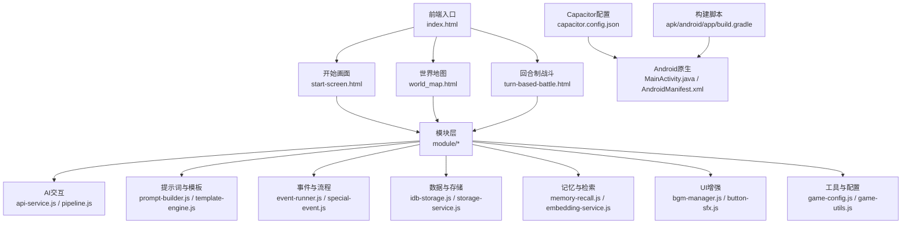

图表来源
- [index.html](file://module/index.html)
- [start-screen.html](file://module/start-screen.html)
- [world_map.html](file://module/world_map.html)
- [turn-based-battle.html](file://module/turn-based-battle.html)
- [capacitor.config.json](file://module/capacitor.config.json)
- [MainActivity.java](file://apk/android/app/src/main/java/com/jihaitang/jxz/MainActivity.java)
- [AndroidManifest.xml](file://apk/android/app/src/main/AndroidManifest.xml)
- [build.gradle](file://apk/android/app/build.gradle)

章节来源
- [ReadMe.md](file://ReadMe.md)
- [capacitor.config.json](file://module/capacitor.config.json)
- [MainActivity.java](file://apk/android/app/src/main/java/com/jihaitang/jxz/MainActivity.java)
- [AndroidManifest.xml](file://apk/android/app/src/main/AndroidManifest.xml)
- [build.gradle](file://apk/android/app/build.gradle)

## 核心组件
- AI交互管线：负责将玩家输入与上下文组装为提示词，调用API获取生成结果，并进行结构化解析与后处理
- 提示词与模板引擎：管理角色设定、世界书、动作列表、变量替换与模板渲染
- 事件与流程引擎：驱动剧情推进、特殊事件触发、回合制战斗流程与状态机
- 数据存储与快照：基于IndexedDB的持久化、快照保存与恢复、周/历史摘要服务
- 记忆与检索：向量化嵌入、召回与重排序，用于长程记忆与知识检索
- UI与媒体：背景音、音效、主题样式与弹窗配置
- 工具与配置：通用工具函数、技能表、同步与转换工具、Token统计等

章节来源
- [api-service.js](file://module/api-service.js)
- [pipeline.js](file://module/pipeline.js)
- [prompt-builder.js](file://module/prompt-builder.js)
- [response-parser.js](file://module/response-parser.js)
- [event-runner.js](file://module/event-runner.js)
- [idb-storage.js](file://module/idb-storage.js)
- [storage-service.js](file://module/storage-service.js)
- [memory-recall.js](file://module/memory-recall.js)
- [embedding-service.js](file://module/embedding-service.js)
- [reranker.js](file://module/reranker.js)
- [bgm-manager.js](file://module/bgm-manager.js)
- [button-sfx.js](file://module/button-sfx.js)
- [game-config.js](file://module/game-config.js)
- [skill-list.js](file://module/skill-list.js)
- [game-skills.js](file://module/game-skills.js)
- [game-helpers.js](file://module/game-helpers.js)
- [game-utils.js](file://module/game-utils.js)
- [token-utils.js](file://module/token-utils.js)
- [sync-utils.js](file://module/sync-utils.js)
- [st-converter.js](file://module/st-converter.js)
- [idb-snapshot.js](file://module/idb-snapshot.js)

## 架构总览
系统以“前端页面 → 模块层 → 本地存储/AI服务”为主干，辅以“记忆检索与摘要”、“事件驱动与流程控制”、“UI与媒体增强”。Capacitor将Web应用封装为Android应用，提供原生能力桥接；IndexedDB承担离线持久化；AI交互通过API服务与外部大模型通信，并在本地进行提示词构建与响应解析。

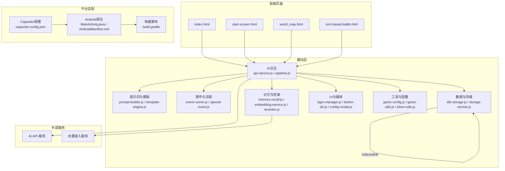

图表来源
- [index.html](file://module/index.html)
- [start-screen.html](file://module/start-screen.html)
- [world_map.html](file://module/world_map.html)
- [turn-based-battle.html](file://module/turn-based-battle.html)
- [api-service.js](file://module/api-service.js)
- [pipeline.js](file://module/pipeline.js)
- [prompt-builder.js](file://module/prompt-builder.js)
- [template-engine.js](file://module/template-engine.js)
- [event-runner.js](file://module/event-runner.js)
- [special-event.js](file://module/special-event.js)
- [idb-storage.js](file://module/idb-storage.js)
- [storage-service.js](file://module/storage-service.js)
- [memory-recall.js](file://module/memory-recall.js)
- [embedding-service.js](file://module/embedding-service.js)
- [reranker.js](file://module/reranker.js)
- [bgm-manager.js](file://module/bgm-manager.js)
- [button-sfx.js](file://module/button-sfx.js)
- [config-modal.js](file://ui/config-modal.js)
- [game-config.js](file://module/game-config.js)
- [game-utils.js](file://module/game-utils.js)
- [token-utils.js](file://module/token-utils.js)
- [capacitor.config.json](file://module/capacitor.config.json)
- [MainActivity.java](file://apk/android/app/src/main/java/com/jihaitang/jxz/MainActivity.java)
- [AndroidManifest.xml](file://apk/android/app/src/main/AndroidManifest.xml)
- [build.gradle](file://apk/android/app/build.gradle)

## 详细组件分析

### AI交互与提示词构建
- 目标：将玩家输入、角色状态、世界书与动作选项组合为高质量提示词，调用AI服务并解析结构化输出
- 关键流程：
  - 收集上下文：角色属性、变量、历史摘要、世界书片段
  - 构建提示词：模板渲染、变量替换、动作列表注入
  - 调用API：带重试与超时策略，必要时走CORS代理
  - 解析响应：提取剧情文本、行动选项、数值变化、事件标记
  - 后处理：更新状态、写入日志、触发事件

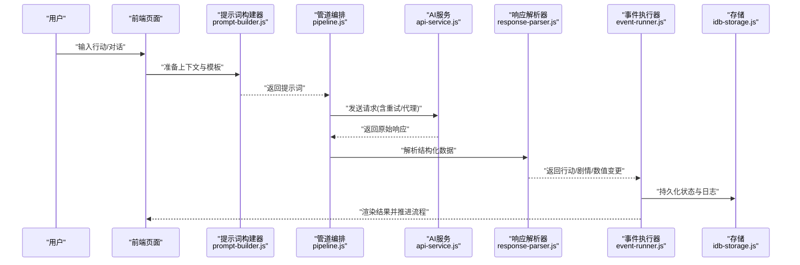

图表来源
- [prompt-builder.js](file://module/prompt-builder.js)
- [pipeline.js](file://module/pipeline.js)
- [api-service.js](file://module/api-service.js)
- [response-parser.js](file://module/response-parser.js)
- [event-runner.js](file://module/event-runner.js)
- [idb-storage.js](file://module/idb-storage.js)

章节来源
- [prompt-builder.js](file://module/prompt-builder.js)
- [pipeline.js](file://module/pipeline.js)
- [api-service.js](file://module/api-service.js)
- [response-parser.js](file://module/response-parser.js)
- [event-runner.js](file://module/event-runner.js)
- [idb-storage.js](file://module/idb-storage.js)

### 事件与流程引擎
- 目标：驱动剧情分支、回合制战斗、特殊事件与地点探索的流程控制
- 关键点：
  - 事件注册与匹配：根据条件与上下文选择分支
  - 回合制战斗：行动阶段、判定阶段、结算阶段的状态机
  - 特殊事件：触发条件、效果应用、状态回滚与快照点
  - 地点运行器：加载场景、切换昼夜、动态事件池

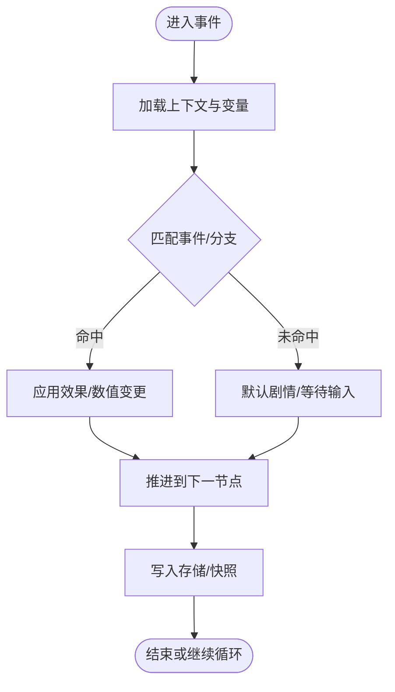

图表来源
- [event-runner.js](file://module/event-runner.js)
- [special-event.js](file://module/special-event.js)
- [location-runner.js](file://module/location-runner.js)
- [variable-system.js](file://module/variable-system.js)
- [idb-snapshot.js](file://module/idb-snapshot.js)

章节来源
- [event-runner.js](file://module/event-runner.js)
- [special-event.js](file://module/special-event.js)
- [location-runner.js](file://module/location-runner.js)
- [variable-system.js](file://module/variable-system.js)
- [idb-snapshot.js](file://module/idb-snapshot.js)

### 数据存储与快照
- 目标：基于IndexedDB实现角色状态、对话历史、世界书片段、配置与日志的持久化
- 关键点：
  - 统一存储接口：读写、批量操作、事务与错误处理
  - 快照机制：关键节点保存与恢复，支持回溯与调试
  - 摘要服务：周总结与历史摘要，降低上下文长度与成本
  - 同步工具：跨会话一致性校验与冲突解决

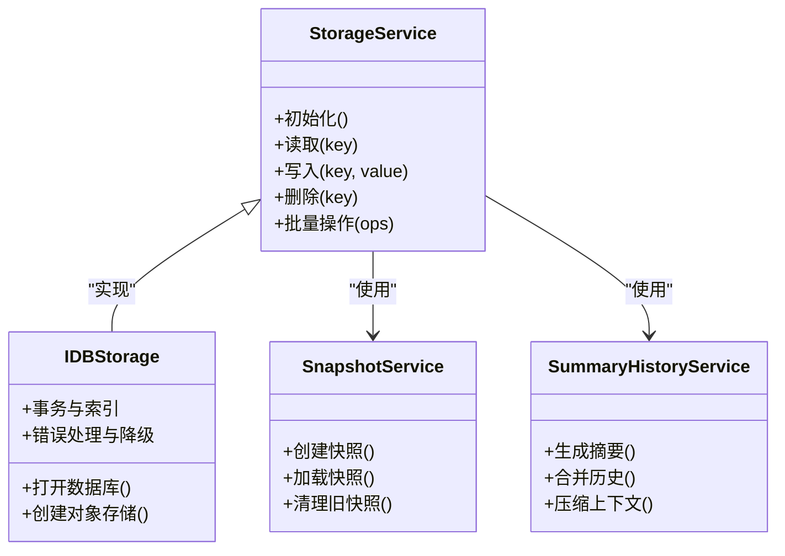

图表来源
- [storage-service.js](file://module/storage-service.js)
- [idb-storage.js](file://module/idb-storage.js)
- [idb-snapshot.js](file://module/idb-snapshot.js)
- [summary-history-service.js](file://module/summary-history-service.js)
- [week-history-service.js](file://module/week-history-service.js)
- [sync-utils.js](file://module/sync-utils.js)

章节来源
- [storage-service.js](file://module/storage-service.js)
- [idb-storage.js](file://module/idb-storage.js)
- [idb-snapshot.js](file://module/idb-snapshot.js)
- [summary-history-service.js](file://module/summary-history-service.js)
- [week-history-service.js](file://module/week-history-service.js)
- [sync-utils.js](file://module/sync-utils.js)

### 记忆与检索
- 目标：通过向量化嵌入与召回，实现长程记忆与知识检索，提升对话连贯性与世界书联动
- 关键点：
  - 嵌入服务：对文本片段进行向量化存储
  - 召回与重排：相似度检索与质量重排序
  - 记忆回放：在提示词中注入相关片段，增强上下文

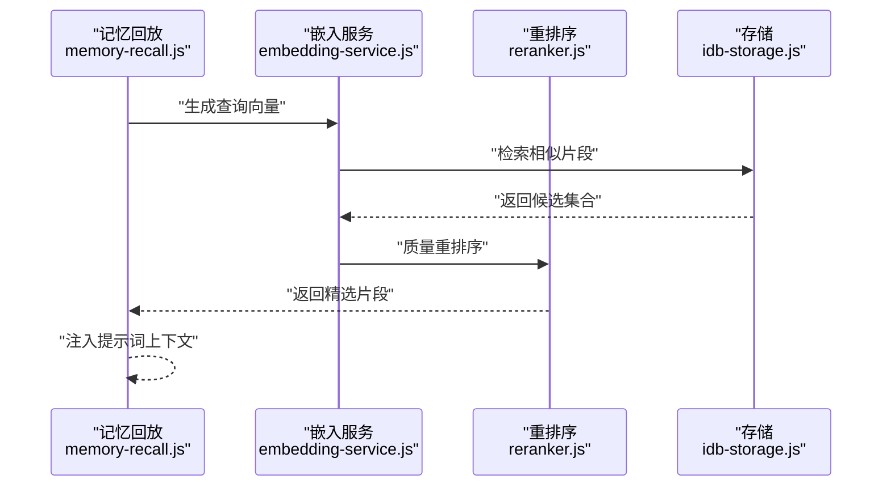

图表来源
- [memory-recall.js](file://module/memory-recall.js)
- [embedding-service.js](file://module/embedding-service.js)
- [reranker.js](file://module/reranker.js)
- [idb-storage.js](file://module/idb-storage.js)

章节来源
- [memory-recall.js](file://module/memory-recall.js)
- [embedding-service.js](file://module/embedding-service.js)
- [reranker.js](file://module/reranker.js)
- [idb-storage.js](file://module/idb-storage.js)

### 世界书与自定义内容
- 目标：维护可扩展的世界观与规则集，支持地点介绍、NPC设定、动作与技能定义
- 关键点：
  - 世界书引擎：加载与检索世界书条目
  - 自定义扩展：插件式扩展点，便于新增地点/NPC/事件
  - 模板引擎：统一渲染格式，支持变量与条件

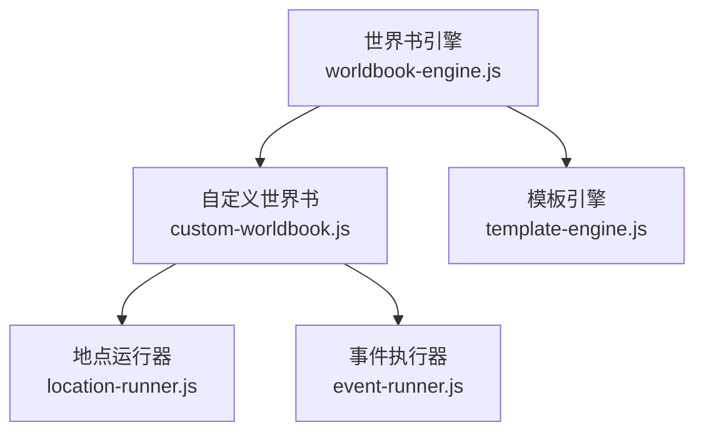

图表来源
- [worldbook-engine.js](file://module/worldbook-engine.js)
- [custom-worldbook.js](file://module/custom-worldbook.js)
- [template-engine.js](file://module/template-engine.js)
- [location-runner.js](file://module/location-runner.js)
- [event-runner.js](file://module/event-runner.js)

章节来源
- [worldbook-engine.js](file://module/worldbook-engine.js)
- [custom-worldbook.js](file://module/custom-worldbook.js)
- [template-engine.js](file://module/template-engine.js)
- [location-runner.js](file://module/location-runner.js)
- [event-runner.js](file://module/event-runner.js)

### 战斗系统与技能
- 目标：实现回合制战斗流程、技能矩阵与伤害计算、状态与增益/减益管理
- 关键点：
  - 技能表与运行时：定义技能效果、冷却、消耗与触发条件
  - 战斗辅助：行动矩阵、风格配对、场地效果与回合计数
  - 模拟与报告：用于平衡性分析与测试

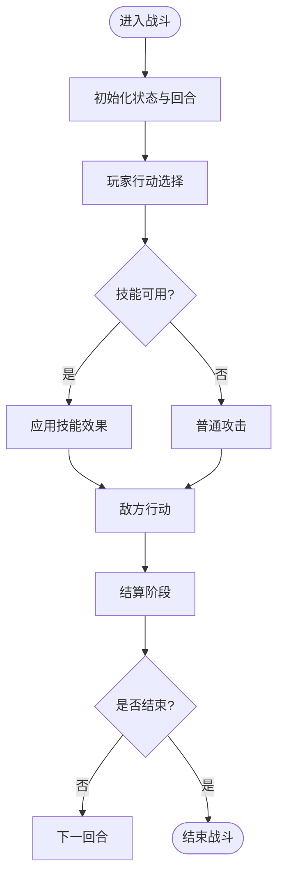

图表来源
- [turn-based-battle.html](file://module/turn-based-battle.html)
- [game-skills.js](file://module/game-skills.js)
- [skill-list.js](file://module/skill-list.js)
- [game-helpers.js](file://module/game-helpers.js)
- [game-utils.js](file://module/game-utils.js)

章节来源
- [turn-based-battle.html](file://module/turn-based-battle.html)
- [game-skills.js](file://module/game-skills.js)
- [skill-list.js](file://module/skill-list.js)
- [game-helpers.js](file://module/game-helpers.js)
- [game-utils.js](file://module/game-utils.js)

### UI与媒体增强
- 目标：提供沉浸式体验，包括背景音乐、按钮音效、主题样式与配置弹窗
- 关键点：
  - 背景音管理器：播放、切换与音量控制
  - 按钮音效：交互反馈
  - 主题样式：CSS主题与响应式布局
  - 配置弹窗：设置项管理与持久化

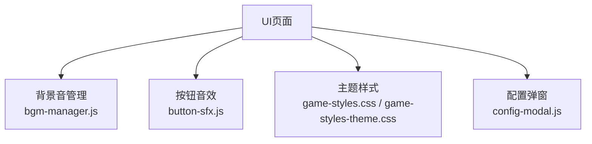

图表来源
- [bgm-manager.js](file://module/bgm-manager.js)
- [button-sfx.js](file://module/button-sfx.js)
- [game-styles.css](file://module/game-styles.css)
- [game-styles-theme.css](file://module/game-styles-theme.css)
- [config-modal.js](file://ui/config-modal.js)

章节来源
- [bgm-manager.js](file://module/bgm-manager.js)
- [button-sfx.js](file://module/button-sfx.js)
- [game-styles.css](file://module/game-styles.css)
- [game-styles-theme.css](file://module/game-styles-theme.css)
- [config-modal.js](file://ui/config-modal.js)

### 工具与配置
- 目标：提供通用工具、配置管理、Token统计、同步与转换工具
- 关键点：
  - 游戏配置：全局开关、难度、语言等
  - 工具函数：字符串处理、时间、随机数、格式化
  - Token统计：估算提示词与响应大小
  - 同步与转换：跨会话一致性与数据迁移
  - 日志捕获：调试与问题定位

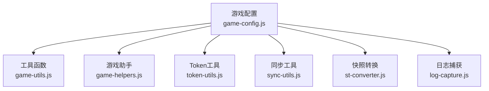

图表来源
- [game-config.js](file://module/game-config.js)
- [game-utils.js](file://module/game-utils.js)
- [game-helpers.js](file://module/game-helpers.js)
- [token-utils.js](file://module/token-utils.js)
- [sync-utils.js](file://module/sync-utils.js)
- [st-converter.js](file://module/st-converter.js)
- [log-capture.js](file://module/log-capture.js)

章节来源
- [game-config.js](file://module/game-config.js)
- [game-utils.js](file://module/game-utils.js)
- [game-helpers.js](file://module/game-helpers.js)
- [token-utils.js](file://module/token-utils.js)
- [sync-utils.js](file://module/sync-utils.js)
- [st-converter.js](file://module/st-converter.js)
- [log-capture.js](file://module/log-capture.js)

## 依赖关系分析
- 模块内聚与耦合：
  - AI交互管线强依赖提示词构建与响应解析，弱依赖事件执行与存储
  - 存储层独立于业务逻辑，提供统一接口供上层调用
  - 记忆与检索依赖存储与外部嵌入服务，对AI交互提供可选增强
- 外部依赖：
  - Capacitor：Android平台桥接与原生能力
  - IndexedDB：本地持久化
  - CORS代理：跨域请求转发
- 潜在循环依赖：
  - 事件执行与存储之间应避免直接双向引用，建议通过服务接口解耦

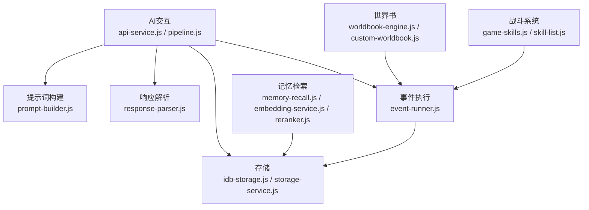

图表来源
- [api-service.js](file://module/api-service.js)
- [pipeline.js](file://module/pipeline.js)
- [prompt-builder.js](file://module/prompt-builder.js)
- [response-parser.js](file://module/response-parser.js)
- [event-runner.js](file://module/event-runner.js)
- [idb-storage.js](file://module/idb-storage.js)
- [storage-service.js](file://module/storage-service.js)
- [memory-recall.js](file://module/memory-recall.js)
- [embedding-service.js](file://module/embedding-service.js)
- [reranker.js](file://module/reranker.js)
- [worldbook-engine.js](file://module/worldbook-engine.js)
- [custom-worldbook.js](file://module/custom-worldbook.js)
- [game-skills.js](file://module/game-skills.js)
- [skill-list.js](file://module/skill-list.js)

章节来源
- [api-service.js](file://module/api-service.js)
- [pipeline.js](file://module/pipeline.js)
- [prompt-builder.js](file://module/prompt-builder.js)
- [response-parser.js](file://module/response-parser.js)
- [event-runner.js](file://module/event-runner.js)
- [idb-storage.js](file://module/idb-storage.js)
- [storage-service.js](file://module/storage-service.js)
- [memory-recall.js](file://module/memory-recall.js)
- [embedding-service.js](file://module/embedding-service.js)
- [reranker.js](file://module/reranker.js)
- [worldbook-engine.js](file://module/worldbook-engine.js)
- [custom-worldbook.js](file://module/custom-worldbook.js)
- [game-skills.js](file://module/game-skills.js)
- [skill-list.js](file://module/skill-list.js)

## 性能与体验优化
- 网络与AI交互：
  - 请求重试与超时控制，避免长时间阻塞
  - CORS代理减少跨域失败率
  - 提示词压缩与摘要，降低Token消耗与延迟
- 本地存储：
  - IndexedDB分片与索引优化，提高读写性能
  - 快照增量保存，减少全量写入
- 记忆检索：
  - 召回数量与重排序阈值调优，平衡准确性与速度
- 媒体与UI：
  - 按需加载与懒加载，减少首屏体积
  - 音频预加载与缓存，提升交互流畅度

[本节为通用指导，不直接分析具体文件]

## 故障排查指南
- 常见问题定位：
  - 日志捕获：查看关键路径的错误堆栈与上下文
  - 存储异常：检查IndexedDB对象存储是否存在、索引是否正确
  - 网络问题：确认API可达性与代理配置
  - 提示词问题：检查模板变量替换与必填字段
- 调试建议：
  - 启用详细日志与Token统计
  - 使用快照回滚到稳定状态
  - 逐步缩小范围：先验证提示词构建，再验证API响应，最后验证事件执行

章节来源
- [log-capture.js](file://module/log-capture.js)
- [idb-storage.js](file://module/idb-storage.js)
- [api-service.js](file://module/api-service.js)
- [prompt-builder.js](file://module/prompt-builder.js)
- [idb-snapshot.js](file://module/idb-snapshot.js)

## 结论
姬侠传以“前端即应用”的架构为核心，借助Capacitor与IndexedDB实现跨平台与离线体验，通过AI交互、事件驱动与记忆检索构建丰富的武侠文字冒险玩法。模块化设计与清晰的职责划分使得系统具备良好的可扩展性与可维护性。未来可在提示词工程、检索质量与性能优化方面持续迭代，进一步提升叙事深度与用户体验。

[本节为总结性内容，不直接分析具体文件]

## 附录
- 快速上手：
  - Web端：在浏览器中打开前端入口页面即可体验
  - Android端：使用Capacitor构建并安装APK
- 演示与截图：
  - 主页与开始画面：参考前端入口与开始画面页面
  - 世界地图与地点探索：参考世界地图页面
  - 回合制战斗：参考战斗页面
- 相关页面与模块路径：
  - 前端入口与页面：[index.html](file://module/index.html)、[start-screen.html](file://module/start-screen.html)、[world_map.html](file://module/world_map.html)、[turn-based-battle.html](file://module/turn-based-battle.html)
  - 平台适配：[capacitor.config.json](file://module/capacitor.config.json)、[MainActivity.java](file://apk/android/app/src/main/java/com/jihaitang/jxz/MainActivity.java)、[AndroidManifest.xml](file://apk/android/app/src/main/AndroidManifest.xml)、[build.gradle](file://apk/android/app/build.gradle)
  - 核心模块：见“核心组件”与“详细组件分析”中的文件列表

章节来源
- [index.html](file://module/index.html)
- [start-screen.html](file://module/start-screen.html)
- [world_map.html](file://module/world_map.html)
- [turn-based-battle.html](file://module/turn-based-battle.html)
- [capacitor.config.json](file://module/capacitor.config.json)
- [MainActivity.java](file://apk/android/app/src/main/java/com/jihaitang/jxz/MainActivity.java)
- [AndroidManifest.xml](file://apk/android/app/src/main/AndroidManifest.xml)
- [build.gradle](file://apk/android/app/build.gradle)