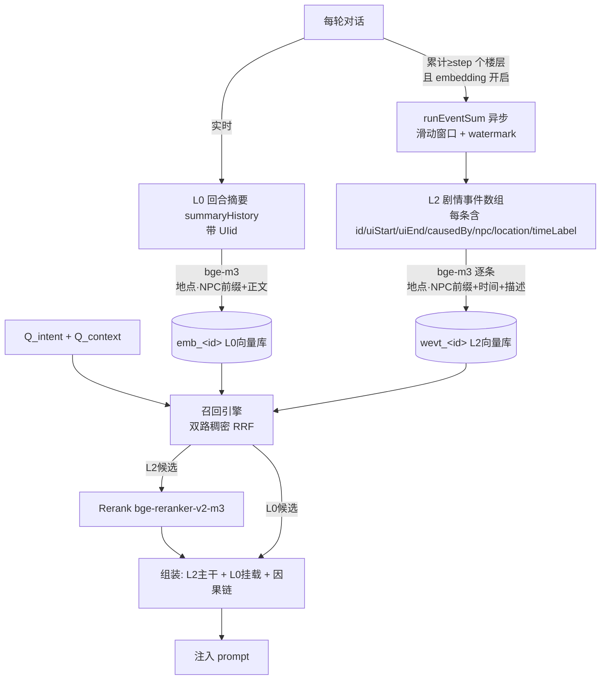
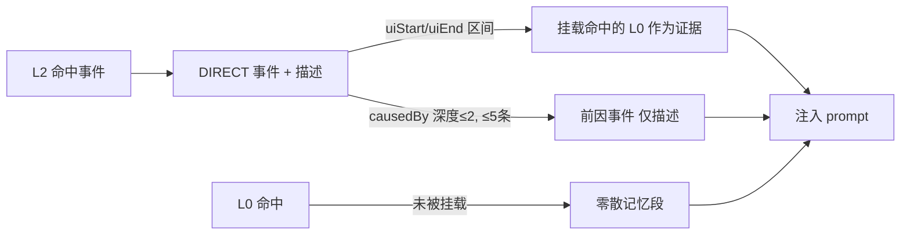
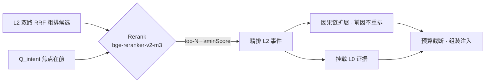
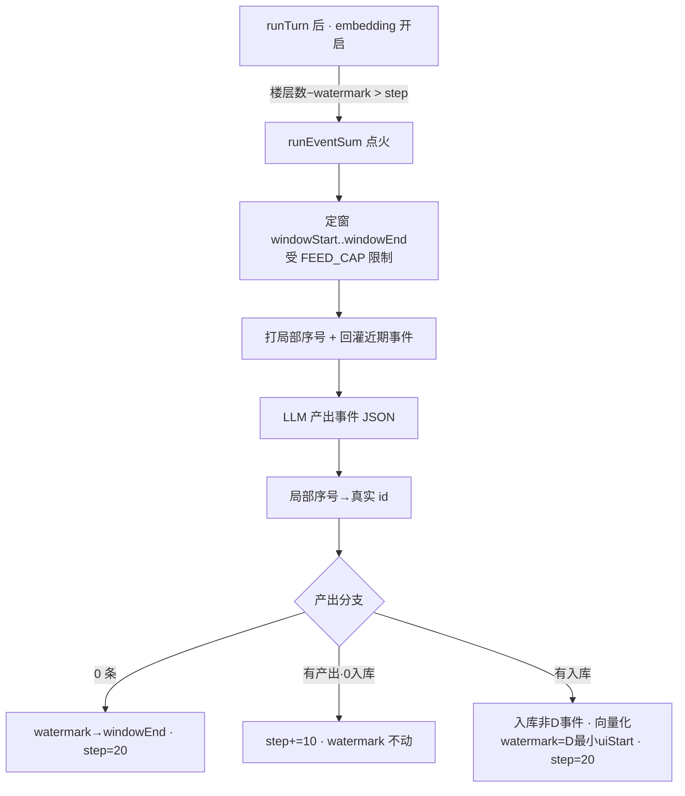

# 向量化方案优化 2 ——「回合摘要(L0) + 剧情事件(L2)」双层 + 因果链 + 挂载

> 本文承接《小白X-向量化检索召回机制详解.md》。
> 目标：在现有单层向量召回的基础上，引入「剧情事件层(L2)」，复刻小白X 的**模型 A**（L2 主干 + L0 挂载 + 因果链追溯），但用更贴合本项目数据模型的方式落地。
> **落地方式（本版定稿）**：L2 **不再绑定「周总结/runSummary」**，而是新增一条**独立的 `runEventSum` 链路**。它在 embedding 开启时，按 uiConversation 的**滑动窗口 + watermark** 异步抽取剧情事件，写入新的 `eventHistory` 并逐条向量化。`runSummary` / `weekHistory` **完全不动**，老存档零风险。
> 关键既有代码：`module/pipeline.js`、`module/memory-recall.js`、`module/embedding-service.js`、`module/summary-runner.js`、`module/week-history-service.js`、`module/summary-history-service.js`、`module/storage-service.js`、`module/prompt-builder.js`。

---

## 一、现在的方案（现状）

### 1.1 只有「单层」向量化

| 层 | 数据源 | 存储 | 是否向量化 | 是否召回 |
|----|--------|------|-----------|---------|
| 回合摘要 | `summaryHistory`（每轮 `<SUMMARY>`，逐条带 `UIid`） | `emb_<id>` | ✅ 单向量 | ✅ |
| 周总结 | `weekHistory`（`runSummary` 产出，整段文本） | `jxz_weekHistory` | ❌ | ❌（仅按 token 预算平铺进 prompt） |

也就是说：**当前真正参与向量召回的只有「回合摘要」一层**，周总结只是纯文本拼进提示词，不量化、不召回（见 `week-history-service.js` 头部注释）。

### 1.2 向量化文本（入库）

`pipeline.js / _buildEmbedText(summary, uiConversation)`：

```
[地点：xxx]
[在场NPC：xxx]
<summaryText 原文>
```

- 通过 `summary.UIid` 在 `uiConversation` 里回溯到对应 assistant 楼层，再往前找最近一条 user 消息，从中抽「地点 / NPC」前缀（`_extractLocationNpcPrefix`）。
- Embedding：`BAAI/bge-m3`（1024 维，硅基流动 OpenAI 兼容接口），指纹 `model@siliconflow` 防止换模型混用。
- 落库：`storageService.saveEmbedding(id, Float32Array, meta)`，运行期缓存在 `memoryRecall._cache`。
- 一致性对账：`_syncEmbeddingsWithSummaryHistory()` 每次请求前补齐缺失 / 删除孤立 `emb_`。

### 1.3 检索召回（现有：双路 Dense + RRF）

发生在 `pipeline.js / runTurn`，调 `memoryRecall.recallRelevantMemories(...)`：

- **Q_intent**（主路）：当前用户输入，经 `_buildQueryIntentText` 归一化（丢「时间/季节」行、地点统一为「地点：xxx」、NPC 保留 key）。
- **Q_context**（辅路）：上一轮 AI 回复原文 + 从上轮 user 消息抽出的「地点/NPC」前缀。
- 两路一次批量 embed → 各自对 `_cache` 全量算余弦 → 各自按相似度排名 → **RRF 融合**：`score = 1/(K+rank_intent) + 1/(K+rank_context)`，`K=60`。
- 过滤：`MIN_SIM=0.60`（intent 路保底）、`focusCharacters` 实体软过滤（`sim<0.72` 的候选必须含焦点 NPC 名）。
- 截断：`topK=15` + `maxTokens=3000` 双重截断。
- 排除：RecentMemories 候选池（`week >= 最后一条 weekHistory.markWeek - 1`）由 `excludeIds` 排除，避免和近期窗口重复。

> 现状小结：**单层、双路稠密 RRF**，无事件层、无因果链、无挂载、无重排序、无词法通道。

---

## 二、优化后的方案（目标：模型 A）

### 2.1 升级为「双层」记忆

| 层 | 语义角色 | 数据源 | 存储 | 向量化 | 召回中的角色 |
|----|---------|--------|------|--------|------------|
| **L0 回合摘要** | evidence（证据） | `summaryHistory`（不变） | `emb_<id>`（不变） | ✅ 单向量 | 作为**证据**挂在 L2 事件下；挂不上的成「零散记忆」 |
| **L2 剧情事件** | event（事件，**主干**） | **新增 `eventHistory`**（`runEventSum` 滑动窗口产出，逐事件结构化记录） | `wevt_<id>` 逐事件向量 | ✅ 单向量 | **召回主干**，承载因果链与挂载 |

> L3（SPO 事实约束）、PPR 图扩散、L1 原文块**本期不做**。本项目已有 `gameData` 结构化变量承担世界一致性，L3 冗余。

### 2.2 总结的层级关系



- **L0 覆盖「细节」**，**L2 覆盖「事件骨架 + 因果 + 跨回合脉络」**。
- 两层重叠由「挂载 + 去重（`usedL0Ids`）」消解：被挂到某事件下的 L0 不再单独出现。

---

## 三、向量入库 / 检索细节

### 3.1 向量化文本（L0 / L2 同构）

L2 的入库文本格式**与 L0 保持一致**：同样前置「地点 / 在场NPC」结构化前缀，再接正文。这样两层向量落在同一语义空间风格里，查询向量（Q_intent / Q_context 也带地点/NPC 前缀）对两层都对齐。

| 层 | 向量化输入文本 |
|----|---------------|
| L0 | 沿用现状：`地点：xxx\n在场NPC：xxx\n + summaryText`（`_buildEmbedText`，**不改**） |
| L2 | `地点：xxx\n在场NPC：xxx\n + 时间标签 + 事件描述`（**新增，格式对齐 L0**） |

L2 向量化文本示例（由 `location` / `npc` 字段拼出前缀，正文为 `timeLabel + description`）：

```
地点：天山派药庐
在场NPC：萧白瑚
[第一年二月第三周] 主角携鹿茸酒前往萧白瑚药庐探病，萧白瑚收下药酒但态度疏离，临走约定下周复诊。
```

> **只有「人能读、保留原词」的字段进 embedding**：地点、在场NPC、时间标签、事件描述。
> `id / causedBy / uiStart / uiEnd / week / keywords` 这类结构化字段**不进向量**——它们是检索后用于挂载、因果追溯、过滤、（未来）词法召回的元数据。

### 3.2 结构化处理（L2 入库记录）

每条事件**单独**存一条记录（逐事件结构化，不再是整段文本 blob）：

```jsonc
{
  "id": "evt-123",            // 全局递增事件号（核心）
  "week": 18,                  // 游戏周 = uiConversation[uiEnd].week（楼层自带 week 字段，代码盖章，不依赖 LLM）
  "timeLabel": "第一年二月第三周",
  "description": "主角携鹿茸酒前往萧白瑚药庐探病，萧白瑚收下药酒但态度疏离，临走约定下周复诊。",
  "uiStart": 142,             // 本事件覆盖的起始 uiConversation 总下标（含user；由局部序号映射而来，见 4.3 步骤6）
  "uiEnd":   148,             // 结尾总下标
  "causedBy": ["evt-87"],      // 0~2 个全局事件 id；不确定填 []
  "npc": ["萧白瑚"],           // 相关 NPC 正式名（用于拼向量前缀 + 实体过滤）
  "location": "天山派药庐",     // 地点（用于拼向量前缀）
  "title": "药庐探病",          // 短标题（地点·事件，注入表头/调试抓手）
  "keywords": ["鹿茸酒","探病","复诊"], // 事件级关键词 3~6 个（未来词法倒排第三路的倒排种子；不进向量）
  // 注：arcUpdates/factUpdates 是批次级全局增量，转存 eventMeta（见 5.1），**不**入逐事件记录
  "source": "runEventSum",
  "createdAt": 1781363400111
}
```

> **字段取舍（对照小白X）**：`type`（8 类）/`weight`（5 级）小白X 自己在向量召回/注入里都不消费（注入 `formatEventWithEvidence` 只读 timeLabel/title/participants/summary/causedBy，⭐ 也按检索名次而非 weight），故**不加**。`title` 与 `keywords` 是**事件级**字段，随逐事件记录存在这里：`title` 注入表头；`keywords`（3~6 个）是**未来词法倒排第三路的倒排种子**——词法索引是「词→事件 id」，关键词必须挂在每个事件上才能定位回该事件，故**按事件存、不做全局**。`arcUpdates/factUpdates` 是**批次级全局增量**，**要求 LLM 实际产出**但不入逐事件记录、转存滚动状态 `eventMeta`（详见第五节输出结构与 5.1 存储）；生成即捕获，消费（是否注入 / 与 gameData 对账）后续再定。

对应向量记录（与上面一一对应，按 `id` 关联）：`{ id:"evt-123", vector:Float32, text:<地点/NPC前缀+timeLabel+description>, week, fingerprint, createdAt, type:"event" }`。

> `week` 由代码盖章：滑动窗口可能跨周，故**每条事件**的 `week` 取其 `uiEnd` 对应 uiConversation 楼层的游戏内周——`uiConversation` 每条楼层（user / assistant 均）写入时都带 `week` 字段（见 `appendUIConversation`：盖入当时的 `currentWeek`），直接 `uiConv[uiEnd].week` 即可，不依赖 LLM、不按整窗统一。`week` 仅作元数据（L2 近期排除/排序），**不进向量**。

**挂载键说明**：`uiStart`/`uiEnd` 存 **uiConversation 总数组下标（整数）**，与 eventWatermark 同一单位。挂载时需把 L0 的 `UIid`（assistant 消息 id 字符串）转为它在 uiConversation 里的 index，在每次 recall 时预建一次 `Map<id, totalIdx>` 即可做 O(1) 查询：

```js
// recall 阶段预建一次，O(N)
const idxMap = new Map(uiConv.map((msg, i) => [msg.id, i]));

// 挂载判断，O(1)
const l0Idx = idxMap.get(l0.UIid);
const mounted = l0Idx != null && l0Idx >= event.uiStart && l0Idx <= event.uiEnd;
```

> 约束：`uiStart/uiEnd` 与 `summaryHistory.UIid` 对应的 uiConversation index 必须来自**同一份 uiConversation 数组**，否则 index 错位。原设计的 `parseInt(id.slice(1))` 时间戳比较已不再需要。

### 3.3 L0 与 L2 的双路稠密召回融合

召回分**两个独立向量库**各自召回，每库都用现有的「intent + context」双路稠密 RRF（**本期不做词法倒排**），再分别得到命中表：

```
                ┌── Q_intent  (dense) ─┐
  L0 向量库 ────┤                       ├─ RRF ─→ L0 命中表  （沿用现有 memory-recall）
                └── Q_context (dense) ─┘

                ┌── Q_intent  (dense) ─┐
  L2 向量库 ────┤                       ├─ RRF ─→ L2 命中表
                └── Q_context (dense) ─┘
```

- **稠密两路（intent + context）**：复用现有 `recallRelevantMemories` 的 RRF 逻辑（`K=60`），对两个库各跑一遍。
- **RRF 融合（基准偏置 + 两路长度因子）**：
  ```
  score(d) = w_intent · 1/(K+rank_intent) + w_context · 1/(K+rank_context)
  w_intent  = INTENT_BASE  · lengthFactor(用户输入字数)
  w_context = CONTEXT_BASE · lengthFactor(上一条 AI 回复字数)
  INTENT_BASE = 0.6 , CONTEXT_BASE = 0.4         // 基准让 intent 略高（参考小白X 焦点 0.55 : 近上下文 0.30 ≈ 1.8:1）
  lengthFactor(n): n>=50 → 1.0; n<=0 → 0.35; 否则 0.35 + 0.65·(n/50)   // 抄小白X computeLengthFactor
  ```
  > **基准偏置**：常规输入下两路 `lengthFactor` 都≈1，比值即 `INTENT_BASE:CONTEXT_BASE = 0.6:0.4`——**用户输入是主诉求，基准就让 intent 路更重**（学小白X 给焦点更高基础权重）。
  > **长度因子（两路都乘）**：RRF 纯按名次算分、无视绝对相似度，用户输入很短时（如"跳过一周"）`Q_intent` 极度泛化，排第 1 的也能拿 `1/(K+1)` 把噪声顶进来；故按字数压 intent。context（AI 回复）一般很长 → `lengthFactor≈1.0`，两路同乘只是为对称、实际只 intent 会动。短输入时 `w_intent` 被压到 `0.6·0.35≈0.21`，`w_context≈0.4`，**context 自动接管**。`lengthFactor` 自带下限 0.35，已保证用户输入不会完全失声，不再额外设地板。
  > **权重无需归一化**：排序只看相对大小，所有文档同乘一个常数名次不变；且过阈值用的是余弦相似度而非 `rrfScore`。故 `INTENT_BASE+CONTEXT_BASE` 不必=1，**只有比值有意义**。
- **过阈值改用两路取大**：原逻辑只看 intent 单路（`simIntent < MIN_SIM` 丢弃），短输入时对好记忆偏低会错杀、对泛化记忆虚高会进噪声。改为 **`max(simIntent, simContext) >= MIN_SIM`** 才入选；`focusCharacters` 实体软过滤的 `ENTITY_BYPASS_SIM=0.72` 同样改为对 `max(simIntent, simContext)` 判断。与降权互补：**降权管排序、max 管闸门**。
- **L0 / L2 同一份逻辑**：以上降权 + max 阈值由同一个 `recallRelevantMemories`（仅换向量库）承担，对两库一致生效，无需各自实现。
- **L2 独立运行期缓存**：`memoryRecall` 为 L2 单独维护 `_cacheL2`（结构同 L0 `_cache`，装 `wevt_` 向量），并提供独立 `addToCacheL2(rec)` / `removeFromCacheL2(id)` 入口；与 L0 的 `_cache` / `removeFromCache` **完全分开**——召回、对账删孤、补缺各走各的缓存，互不污染。
- **词法第三路（intent-lexical）暂不做**：留作后续（若发现生僻专名召不回再补，挂 intent 侧 + dense 门控 + 低权重）。

> 两个库的查询向量复用同一组 `Q_intent / Q_context`，一次批量 embed，分别对两库打分即可，不额外增加 embedding 调用。

### 3.4 L0 与 L2 挂载（组装为 prompt）

> **流水线顺序**：3.3 双路 RRF 粗排 → 3.5 Rerank 精排 L2 事件 → **本节 3.4 挂载/组装**。即下面的「L2 直接命中事件」指的是**已过 3.5 精排后的 top-N 事件**。

以 **L2 为主干**，组装顺序参考小白X：

1. **L2 直接命中事件**（DIRECT，已过 Rerank 精排）：注入事件描述，并把命中的 L0（按 `uiStart/uiEnd` 区间归属）作为**证据**挂在该事件下。
2. **因果链扩展**：对每条 DIRECT 事件，沿 `causedBy` **递归追溯（最大深度 2）**，最多注入 **5 条**前因事件；前因事件**只给描述、不再挂 L0**（防膨胀）。排序优先「被多个命中事件引用的因 + 浅层因」。
3. **孤儿 L0**：没挂到任何事件下的 L0 命中，单独成「零散记忆」段。
4. **去重**：维护 `usedL0Ids`，被挂载消费的 L0 不在「零散记忆」里重复。



### 3.5 重排序（Rerank，本期落地）

**先看小白X 是怎么重排的（作为参考）**：

- **位置**：重排发生在 `recall.js → locateAndPullEvidence()` 的 **Stage 6**，即**先多路召回（dense + lexical）跑完、Floor 加权 RRF 融合之后**，再对融合出的候选做一道交叉编码精排，最后才进预算组装。**重排是「粗排→精排」里的精排一步**。
- **重排的单位**：是「最终会被注入的那个粒度」——小白X 是 floor（USER+AI 拼成一段、带说话人名）。
- **查询用自然语言**：`rerankQuery` 是「焦点在前」的原始句（当前输入 + 近期上下文），**不是关键词**。
- **高置信候选跳过重排**：`mustKeep` floor（实体 bypass 的强命中）不进 rerank，直接保留；只有「普通候选」过精排。
- **模型与参数**：`BAAI/bge-reranker-v2-m3`（硅基 `/rerank`），`RERANK_TOP_N=20`、`RERANK_MIN_SCORE=0.10`，多 key 轮询、批 20、并发 5、单次最多 100 docs（见 `reranker.js`）。

**我们该在哪个阶段重排、怎么排**（照搬思路 + 适配本项目）：

1. **阶段：在 L2 双路 RRF 融合之后、因果链扩展 / L0 挂载之前**。即对 3.3 产出的 **L2 候选事件表**精排，取 top-N 精事件，再去做因果追溯和挂载。顺序：
   ```
   三路召回→RRF 粗排  →  【Rerank 精排 L2 事件】  →  因果链扩展  →  挂载 L0  →  预算截断  →  注入
   ```
2. **重排的单位 = L2 事件**（主干，也是最终注入的主单位）。候选文本用事件的可读文本：`timeLabel + description`（与入库向量文本同源，但 rerank 传原文、不传向量）。L0 是挂在事件下的证据，**随事件走，不单独精排**；孤儿 L0 可不重排、按 RRF 分截断。
3. **查询 = `Q_intent` 自然语言（焦点在前）**：当前用户输入放前、上一软 AI 回复作上下文拼后（同小白X rerankQuery 的「焦点在前」）。
4. **高置信跳过重排**：`focusCharacters` 实体强命中、以及因果链带进来的前因事件，**不参与 rerank**（它们是靠逻辑/实体进来的，不是靠相关度）。
5. **参数建议**：`RERANK_TOP_N` 游戏场景调小一点（`8~12`，因事件比 floor 信息密度高）；`RERANK_MIN_SCORE ≈ 0.10`。失败/超时时 fallback 回 RRF 分数顺序（不阻断主流程）。



---

## 四、L2 事件抽取链路（runEventSum 滑动窗口）

L2 事件**不再绑定周总结**。新增独立模块 `runEventSum`（建议放 `module/event-runner.js`），在 embedding 开启时按 uiConversation 的滑动窗口异步抽取剧情事件。其设计与 `summary-runner.js` 的「异步 + 互斥锁 + 点火」一脉相承，但**不需要 FIFO 队列**——因为它每次干的都是同一件事：「从 watermark 往后扫」，多次触发天然可合并。

### 4.1 状态字段（进快照 + 存档）

> 本表**仅列 `runEventSum` 的 runner 状态**；持久化数据 `eventHistory`（逐事件记录）与 `eventMeta`（滚动弧光/事实）见 5.1，二者同进快照/存档、随重生成回滚。

| 字段 | 含义 | 默认 | 持久化 |
|------|------|------|--------|
| `eventWatermark` | 已确认入库到此的 **uiConversation 总数组下标**（含 user+assistant，整数）；此下标以内的消息所覆盖的事件都已抽完 | 0 | ✅ 进快照/存档，随重生成回滚 |
| `eventStep` | 触发步长，单位为 **uiConversation 总条目数**（含 user，20≈10 对话回合）。动态：卡长场景 +10，成功入库归位 20 | 20 | ✅ 进快照/存档，随重生成回滚 |
| `_running` | 互斥锁，防重入 | false | 运行期 |
| `_pending` | 运行期间又攒够楼层则置位，跑完补跑一次 | false | 运行期 |

> **全链路统一用 uiConversation 总数组下标（整数）**：watermark、uiStart、uiEnd 全部存 total index，不混用消息 id 字符串。这样触发判定、定窗、backfill 对比均为纯整数运算，无需扫描查找。挂载时需把 L0 的 `UIid` 查到其 index（在 recall 阶段预建一次 `Map<id, idx>`，O(N) 建、O(1) 查）——见 3.2 挂载键说明。
>
> **`eventStep` 默认 20**（total 单位，含 user）：20 条 total ≈ 10 个 user+assistant 回合触发一次；卡长场景 +10。
>
> **事件号复用为何安全（不需要单调计数器、也不需要任何"不回滚"特殊字段）**：事件号沿用 `max(eventHistory)+1`，重生成回退后 max 变小、新批可能复用旧号段。安全性来自**删孤先于重写**：旧批 `wevt_<id>` 在重生成那一轮 runTurn 开头的 `_syncL2`（删孤）里就按 id 删除，而这发生在新批 runEventSum 写回**之前**。于是复用号段时——① `wevt_` 是同键 `put`，物理上不可能"一号两向量"；② 旧向量已被删孤，新批向量化成功就覆盖为新内容、失败则该号处于"缺失"（不是"陈旧"），下一轮 `_syncL2` 补缺自愈。最坏只是单轮"该事件暂召不回"，与 L0 向量化失败同类，可接受。另：新号只会覆盖已删的旧号、绝不与存活事件撞号（存活 id 均 ≤ max）。

派生常量：`FEED_CAP = 2 × eventStep`（单轮最多喂入的楼层数，主要用于老存档快速补建 L2；step 增大时 FEED_CAP 随之增大）。`BACKFILL_DISTANCE = 20`（可调，回灌历史事件的距离阈值，见 4.4）。

### 4.2 触发判定

触发检查挂在 `runTurn` **末尾的 fire-and-forget 块**里（与 L0 embedding 并列，在 `storageService.appendUIConversation()` 写完之后，这样本轮新楼层已计入），且仅当 `embeddingService.isEnabled()` 时执行：

```js
// 伪代码，与 summaryRunner.scheduleSummary() setTimeout 同级、不阻塞主流程
const uiConv = storageService.loadUIConversation();
const watermarkPos = storageService.loadEventWatermark() ?? 0;  // total index，默认 0
if (uiConv.length - watermarkPos > eventStep) {
    eventRunner.maybeSchedule();
}
```

> 对照：`summaryRunner.scheduleSummary()` 是由**游戏周切换**（`newWeek === 1`）驱动；`eventRunner` 改为**总条目累计差**驱动（含 user+assistant），不依赖周边界。实际喂给 LLM 的原文仍只用 assistant 楼层，user 消息在定窗后过滤掉。

成立则点火。若 `_running`，置 `_pending=true` 等本轮跑完再补跑。

**`eventRunner.resumeOnLoad()` 挂载点**（用同一条 `uiConv.length − watermark > eventStep` 判断，满足则点火补建）：① **应用初始化完成、`embeddingService` 就绪后**（首屏加载跑一次）；② **读档 / 导入存档完成后**（新存档可能积压大量未抽历史）；③ **embedding 从关切换到开时**（此前没跑过 L2，需从 watermark=0 起补建）。三处都只是"检查 + 可能点火"，靠 `_running` 互斥保持幂等，重复调用无害。

### 4.3 单轮执行（runEventSum）

1. **定窗**：`windowStart = eventWatermark`（total index）；`windowEnd = min(uiConversation.length - 1, windowStart + FEED_CAP)`（total index）。取该范围内 uiConversation 原文，**仅保留 assistant 条目**（role==='assistant'）喂给 LLM，user 消息过滤掉；打局部序号前也只对 assistant 条目编号。
2. **打局部序号**：窗口内每条 assistant 楼层标 `#1 #2 … #K`，同时在代码里维护「**局部序号 → total index**」映射表（直接记下该 assistant 楼层在 uiConversation 的下标，不经过消息 id 中转）。
3. **回灌历史事件**（见 4.4）：拼入「已记录事件」清单。
4. **算 nextEventId** = `eventHistory` 里最大事件号 + 1（见 4.6；回退后复用旧号段是安全的）。
5. **调 LLM** 产出事件 JSON（uiStart/uiEnd 用局部序号，见第五节）。
6. **映射回 total 下标**：把每条事件的局部序号 uiStart/uiEnd 经映射表换成 **total index**（即 §3.2 要存的整数下标），无需再经 id 二次换算。
7. **按产出分三支处理**（见 4.5），推进 watermark、决定 eventStep。
8. **校验 + 入库**：通过校验的事件逐条写 `eventHistory`、逐条向量化写 `wevt_<id>`。
9. `_running=false`；若 `_pending` 或仍满足触发条件，补跑一次。

### 4.4 回灌历史事件（causedBy 引用 + 重读去重，一物两用）

从 `eventHistory` 取**已入库且 `uiEnd ≥ (windowStart − BACKFILL_DISTANCE)`** 的事件（uiEnd 与 windowStart 均为 total index，直接整数比较），逐条带 `id + timeLabel + description` 喂回 LLM，并标注「已记录，勿重复输出」。

- **作用一（causedBy）**：新事件可引用这些近期旧事件作为前因，不悬空。
- **作用二（防重读重抽）**：watermark 回退时（见 4.5）下一轮会重读部分已入库事件的原文，这份清单让 LLM 知道「这段已记过」，不再重复抽取。

> 例：`eventWatermark=70`，窗口 `70~110`，`BACKFILL_DISTANCE=20` → 把 `uiEnd ≥ 50` 的已入库事件全部回灌。

### 4.5 watermark 推进规则（核心：永不产生残事件）

产出事件后，按 `uiEnd` 升序排（`uiEnd` 相同看 `uiStart` 升序），记 `lastAsstIdx` = **窗口内最后一条 assistant 楼层的 total index**，定义**待缓提集合 D**：

> **D = { uiEnd ≥ `lastAsstIdx` 的所有事件 } ∪ { uiEnd 最大的那个事件 }**
>
> 用 `lastAsstIdx` 而非 `windowEnd`：`windowEnd` 是 total index、可能落在 user 楼层上，而 `uiEnd` 只会是 assistant 楼层下标，直接比 `windowEnd` 会永远不相等；改比"窗口内最大 assistant index"才正确捕获"结尾贴着窗口末尾的事件"。

按产出情况分三支：

| 本轮产出 | 含义 | watermark | eventStep |
|---|---|---|---|
| **0 条事件** | 纯过场水（查背包/刷商店/无实质剧情） | 推进到 `windowEnd`（total index） | 保持 20 |
| **≥1 条但 0 条入库**（全在 D 里） | 卡在一个尚未结束的长场景 | **不推进** | **+10** |
| **≥1 条入库** | 正常 | = **D 里最小的 `uiStart`**（total index） | **归位 20** |

- 不在 D 里的事件 = 确定完整 → 入库。
- 「永远缓提最后一个」用结构规则，不依赖 LLM 自判是否被切断。
- 长场景下 step 不断 +10 → 窗口越拉越大，直到那个事件真正结束（`uiEnd < lastAsstIdx`，即它后面还有更新的 assistant 楼层）才被**完整**收录，全程零残段（取代旧方案里的 HARD_CAP 切半降级）。
- 被缓提的永远是「最新、刚发生」的内容，它本就在近期上下文窗口 / L0 里，晚一个周期入 L2 无感。



### 4.6 校验
- **全局事件号**：`nextEventId = eventHistory 所有 id 最大值 + 1`（跨窗连续）。重生成回退后 max 变小、新批可能复用旧号段——这是安全的：新号只会覆盖（同键 `put`）已被 `_syncL2` 删孤的旧 `wevt_`，绝不与存活事件撞号（存活 id 均 ≤ max）；详见 4.1 / 第八节工况 7。
- **causedBy**：指向不存在的 id → 丢弃该引用；写入前对本批 events 做**环检测**，成环则断开（优雅降级）。
- **uiStart/uiEnd**：映射失败/缺失 → 该事件不参与 L0 挂载但仍可召回。
- **因果递归**（召回时）：深度 2、注入上限 5、带 visited 集防环。

---

## 五、事件 JSON 输出结构（含字段定义）

`runEventSum` 的输出为**单个 JSON 对象**（不影响 `runSummary` 的 `<SUMMARY>` 文本输出）。学习小白X 的分层，但按本项目"未来词法召回"需求做了一处调整：`events[]` 为**事件级**（逐条向量化召回，其中 `keywords` 是该事件的词法倒排种子），`arcUpdates/factUpdates` 为**批次级全局增量**（每批重算/只输出变化，不入 event 对象）：

```jsonc
{
  // 思考引导段，仅供 LLM 自检，代码丢弃不入库
  "mindful_prelude": {
    "dedup_analysis": "已有 X 个事件，本批识别出 Y 个新事件，边界在 #k",
    "fact_changes": "识别到的关系/事实变化概述"
  },

  // 事件级：逐条向量化、召回、挂 L0
  "events": [
    {
      "id": "evt-{$nextEventId}",   // 必填。全局递增，从 {$nextEventId} 起依次 +1
      "title": "药庐·萧白瑚探病",    // 必填。短标题「地点·事件」，注入表头/调试抓手
      "timeLabel": "第一年二月第三周", // 必填。游戏内时间；原文未明则沿用最近时间标记
      "description": "白描叙述句（50字内）。保留正式人名/地点/物件/具体动作/约定/钩子，禁止『关系升温』式空话",
      "uiStart": 1,                  // 必填。覆盖起始楼层的「局部序号」（窗口内 #1 起），代码事后映射为真实 id
      "uiEnd":   3,                  // 必填。结尾局部序号；单事件可与 uiStart 相同
      "keywords": ["鹿茸酒","探病","复诊"], // 必填。本事件 3~6 个关键词（专名/物件/动作），未来词法倒排种子
      "npc": ["萧白瑚"],             // 选填。相关 NPC 正式名（不用代词/别名）
      "location": "天山派药庐",       // 选填。地点
      "causedBy": ["evt-87"]         // 选填。0~2 个全局事件 id；因果明确才填，不确定填 []
    }
  ],

  // 批次级增量：只输出本批有变化的角色弧光（正式人名为键）
  "arcUpdates": [
    { "name": "萧白瑚", "trajectory": "从戒备转为试探性靠近", "progress": 0.35, "newMoment": "主动来药庐送药并久留" }
  ],

  // 批次级增量：只输出本批 NEW/CHANGED 的 SPO 世界事实（s+p 为键）
  "factUpdates": [
    { "s": "主角", "p": "对萧白瑚的看法", "o": "心存好奇又愧疚", "isState": true, "trend": "投缘" }
  ]
}
```

字段定义：

**事件级（`events[]`）**

| 字段 | 必填 | 类型 | 说明 |
|------|------|------|------|
| `id` | ✅ | string | 全局递增事件号 `evt-N`，运行时以 `{$nextEventId}` 注入起始号 |
| `title` | ✅ | string | 短标题「地点·事件」（8~12 字），注入表头/调试抓手 |
| `timeLabel` | ✅ | string | 游戏内时间标签 |
| `description` | ✅ | string | 高召回白描，向量化的唯一语义文本来源 |
| `uiStart` / `uiEnd` | ✅ | number | 事件覆盖范围的 **uiConversation 总数组下标**（含 user 条目）；代码由局部序号映射得到，用于挂载 L0 |
| `keywords` | ✅ | string[] | 本事件 3~6 个关键词（专名/物件/动作）；**未来词法倒排第三路的倒排种子**（词→事件 id）；不进向量 |
| `npc` | ❌ | string[] | 相关 NPC 正式名 |
| `location` | ❌ | string | 地点 |
| `causedBy` | ❌ | string[] | 0~2 个前因事件全局 id；明确才填，留 `[]` 完全正常 |

**批次级（全局/增量，不入 event 对象）**

| 字段 | 必填 | 类型 | 说明 |
|------|------|------|------|
| `arcUpdates` | ✅ | `{name, trajectory, progress, newMoment}[]` | 仅输出本批有变化的角色弧光；`name` 用正式人名，`progress ∈ 0.0~1.0`，无变化则 `[]` |
| `factUpdates` | ✅ | `{s, p, o, isState, trend?, retracted?}[]` | 仅输出本批 NEW/CHANGED 的 SPO 事实；`s+p` 为键覆盖旧值；关系类 `p="对X的看法"` 须带 `trend`；删除用 `{s,p,retracted:true}`；无变化则 `[]` |

> **要求 LLM 实际产出这些字段**（不再是空占位）：总结是一次性、昂贵的操作，关键词/弧光/事实若不在产出当时一并抽取，事后无法廉价补建（得重跑整段总结）。因此**生成即捕获**，先把数据攒住；至于消费——`keywords` 留给后续词法倒排（按事件存便于建索引），`arcUpdates/factUpdates` 与机制层 `gameData`（好感/关系/世界标志位）职责重叠，**现阶段 gameData 仍是机制权威**，这两类字段先作为"叙事记忆层"的旁路数据存档，是否注入/如何与 gameData 对账后续再定。
>
> **不加** `type`（相遇/冲突/揭示…）、`weight`（事件级 核心/主线/点睛…）：小白X 在向量召回/注入链路里都不读这两个事件级字段（见 `generate/prompt.js` 的 `formatEventWithEvidence` 只取 timeLabel/title/participants/summary/causedBy），纯是手动总结 UI 的人工标注，对我们无价值。
>
> **与小白X 的一处分层差异**：小白X 把 `keywords` 放在**全局**（综合全剧情、用于非向量展示）。我们预期做词法第三路、且召回单位是 L2 事件，故把 `keywords` 下沉到**每个事件**——倒排索引「词→事件 id」必须以事件为文档，关键词挂事件上才能定位回该事件。`arcUpdates/factUpdates` 仍保持全局（它们本就是滚动状态）。

### 5.1 批次级字段的存储：滚动全局状态 `eventMeta`

`events[]`（含其 `keywords`）逐条追加进 `eventHistory` 数组；而 `arcUpdates/factUpdates` 是**批次级增量**，不适合逐批堆数组（会无限膨胀且重复）。采用**单一滚动状态记录 `eventMeta`**（存储键名 **`jxz_eventMeta`**，与现有 `jxz_weekHistory` 同系列命名；同批新增的还有 `jxz_eventHistory` / `jxz_eventWatermark` / `jxz_eventStep`），每批把 LLM 吐的增量**应用**进去后覆写：

```jsonc
// 单一记录，随 eventWatermark 一起进快照/存档/回滚
{
  "arcs":  { "萧白瑚": { "trajectory": "从戒备转试探", "progress": 0.35, "newMoment": "主动来药庐送药" } }, // 按 name 合并
  "facts": { "主角|对萧白瑚的看法": { "o": "心存好奇又愧疚", "isState": true, "trend": "投缘" } } // 按 s+p 合并
}
```

合并语义（代码侧执行，不劳 LLM）：
- `arcs`：按 `name` 上覆盖 `trajectory/progress/newMoment`。
- `facts`：按 `s+p` 上覆盖 `o/isState/trend`；`{retracted:true}` 则删除该键。

> `keywords` 不在这里——它是**事件级**字段，随 `eventHistory` 的逐事件记录走（便于未来按事件建词法倒排索引）。
> 该 `eventMeta` 是**叙事记忆层的旁路状态**，与机制层 `gameData`（好感/关系/世界标志位）**分开存、现阶段不反写 gameData**；生成即捕获，消费（是否注入 / 与 gameData 如何对账）后续再定。

---

## 六、runEventSum Prompt 设计

`event-runner.js` 的 system / user prompt 要点（独立于 `summary-runner.js`，不影响周总结）。**整体借鉴小白X 的"规格内化 + 正念前导 + 分字段硬规则"写法**（见 `LittleWhiteBox-main/.../data/config.js` 的 `DEFAULT_SUMMARY_ASSISTANT_DOC_PROMPT` 与 `DEFAULT_SUMMARY_USER_JSON_FORMAT_PROMPT`）：

### 6.1 system（规格内化，参考小白X 的 DOC_PROMPT）

向 LLM 一次性交代四套规范，让它把"标准"内化后再产出：

1. **事件白描风格（最重要）**：沿用现有 `SUMMARY_SYSTEM_PROMPT` 的「禁止空泛、保留原词、合格/不合格对照」，迁移到 `description`。要写清"谁·在哪·拿着什么·对谁·做了什么·结果如何"，禁止「关系升温/发生冲突/揭示秘密」式空话；优先 1 句，信息过多才 2 句。**`description` 不要内嵌楼层标注（如 `(#x-y)`）**——楼层只走结构化 `uiStart/uiEnd` 字段，正文保持纯叙述，避免污染向量文本。直接照搬小白X 的不合格/合格对照例子（具体度示范，不约束题材语气）。
2. **关系趋势量表**：`破裂←厌恶←反感←陌生→投缘→亲密→交融`，给 `factUpdates` 的关系类 `trend` 用。
3. **弧光追踪**：`arcUpdates = {name, trajectory(15字内当前阶段), progress(0~1), newMoment(本次新增关键时刻)}`，只记本批有推进的角色。
4. **SPO 世界事实**：维护一个小型 world state；`{s,p,o,isState,trend?,retracted?}`，`s+p` 为键覆盖；`isState:true`=核心约束(位置/身份/生死/归属/关系)永不自动删，`false`=软记忆可被容量裁剪；关系类 `p="对X的看法"` 必带 `trend`；删除 `{s,p,retracted:true}`；**谓词复用、不造同义词**；**只输出 NEW/CHANGED**。

末尾约束「直接输出单个合法 JSON、勿加解释、字符串内避免英文双引号」。

### 6.2 user（任务 + 物料 + 正念前导）

1. **原文带局部序号**：窗口内每条 assistant 楼层前置 `#1 #2 …`，要求 LLM 用局部序号填 `uiStart/uiEnd`（不让它碰真实 id，避免抄错/编造；代码事后映射）。
2. **回灌历史事件**（供去重 + `causedBy` 引用，勿重复输出），逐条 `id + timeLabel + description`（见 4.4 距离规则）：
   ```
   【已记录事件（勿重复输出，可作 causedBy 引用）】
   evt-85 [第一年二月第一周] 主角在教场被呼延显当众考校剑法，第四招被打落木剑……
   evt-87 [第一年二月第二周] 萧白瑚误以为主角偷看她的药方手札，当场冷脸离开……
   ```
3. **回灌全局基线**（供增量去重）：各角色当前 `arc.progress`、已建立的 SPO `facts` 摘要——让 LLM 只吐"真正新增/变化"的弧光与事实。（`keywords` 是事件级、随事件新写，无需回灌全局基线。）
4. **注入全局起始号**：`events[0].id` 从 `evt-{$nextEventId}` 起，运行时替换。
5. **正念前导**（小白X 的 `mindful_prelude`）：先让 LLM 自检"本批边界在哪、哪些是新事件、哪些事实变了"，再产出正式 JSON——压低重复与幻觉。
6. **增量纪律**：`events` 不重复已记录事件，每条事件**必带 3~6 个 `keywords`**（专名/物件/动作）；`arcUpdates/factUpdates` 只列本批有变化项，无变化给 `[]`。
7. **因果规则**：仅在因果明确（直接导致/明确动机/承接后果）时填 `causedBy`，0~2 个，指向已记录或本批新事件；不确定填 `[]`。

> 与小白X 的差异：我们**砍掉事件级 `type/weight`**（召回链路不读）、`participants` 改用我们既有的 `npc` 字段命名、`summary` 改名 `description`（语义一致）、新增 `uiStart/uiEnd` 局部序号用于挂 L0。其余分层与字段规则尽量与小白X 对齐，便于复用其调试经验。

---

## 七、改动范围

| 文件 | 改动 |
|------|------|
| **`module/event-runner.js`（新增）** | `runEventSum` 链路：状态机（watermark/step/_running/_pending）、触发判定、定窗 + 局部序号、回灌历史事件、调 LLM、产出三分支处理、校验、逐条写 eventHistory + 逐条向量化。参考 `summary-runner.js` 的异步/互斥/点火，但**无 FIFO 队列**；带 AbortController 可取消 |
| **`module/event-history-service.js`（新增）** | `eventHistory` 存储（逐事件记录数组，含事件级 `keywords`）；`appendEvents()`、`getRecentEvents(uiEnd≥X)`、`getMaxEventId()`、`replaceOrInsert`、重建入口；另管 `eventMeta` 滚动状态：`applyMetaUpdates({arcUpdates,factUpdates})`（arcs 按 name、facts 按 s+p 合并/`retracted` 删）、`getMetaBaseline()`（回灌 arc/facts 给 prompt） |
| `module/storage-service.js` | ① `eventHistory`(`jxz_eventHistory`) + `eventMeta`(`jxz_eventMeta`) 读写；② `eventWatermark`(`jxz_eventWatermark`) / `eventStep`(`jxz_eventStep`) 读写 + 进快照（saveFullSnapshot/restore）+ 进存档（createSave/import/buildSavePayload），`eventMeta` 同走快照/存档；③ L2 事件向量 `wevt_<id>` 存取；④ `loadAllEmbeddings` 区分 `emb_`(L0) / `wevt_`(L2) |
| `module/pipeline.js` | ① runTurn 后触发 `eventRunner.maybeSchedule()`，**另在应用初始化完成、读档/导入完成、embedding 开启切换三处调 `eventRunner.resumeOnLoad()`**（见 4.2）；② 新增 `_syncL2EmbeddingsWithEventHistory()`（仿 `_syncEmbeddingsWithSummaryHistory`，eventHistory↔wevt_ 补缺删孤、同步清/补 `_cacheL2`，请求前跑、排在 recall 之前）；③ 召回新增 L2 库；④ L2 候选经 `reranker.js` 精排（粗排后、挂载前）；⑤ 组装：L2 主干 + L0 挂载（uiStart/uiEnd 区间）+ 因果链（深度2/上限5）+ 孤儿 L0 + `usedL0Ids` 去重 |
| `module/memory-recall.js` | 新增 L2 库召回（或泛化 `recallRelevantMemories` 支持多库）+ **L2 独立缓存 `_cacheL2` 及 `addToCacheL2`/`removeFromCacheL2` 入口**（与 L0 `_cache` 分开）；`traceCausation`（深度2/上限5/visited 防环）；L2「近期排除」（仿 L0：事件取 `uiConv[uiEnd].week`，`week >= 最后一条 weekHistory.markWeek − 1` 的太近事件不进 L2 候选）；挂载与去重 |
| `module/prompt-builder.js` | 注入分段：`[印象深的事] L2事件(挂L0证据)` → `[零散记忆] 孤儿L0`；与 weekHistory 平铺文本的去重**本期先不处理**（见第八节） |
| **`module/reranker.js`（新增）** | 封装 `bge-reranker-v2-m3`（硅基 `/rerank`）：L2 双路 RRF 粗排后、因果/挂载前对 L2 候选事件精排 top-N；**单 key**（本项目暂无多 key 设施）+ 超时 fallback 回 RRF 顺序（见 3.5）。独立成文件，便于复用与单测 |
| `module/summary-runner.js` / `module/week-history-service.js` | **不改**。周总结与 weekHistory 维持现状 |

### 参数汇总（本期定档）

| 参数 | 值 |
|------|-----|
| 事件 id | 全局递增 `evt-N` = `max(eventHistory)+1`；重生成回退后可能复用已删批次的号段（安全，见 4.1 / 工况 7） |
| 触发步长 `eventStep` | 默认 **20**（total uiConversation 条目，≈10 对话回合）；卡长场景 **+10**，成功入库归位 **20**；进存档/快照 |
| `FEED_CAP` | `2 × eventStep`（老存档补建用） |
| `BACKFILL_DISTANCE` | **20**（可调，total index 单位，回灌历史事件距离阈值） |
| 待缓提集合 D | `{uiEnd==windowEnd}` ∪ `{uiEnd 最大者}`；watermark = D 最小 uiStart（均为 total index） |
| 挂载键 | `uiStart` / `uiEnd`（total index，整数；LLM 填局部 assistant 序号、代码映射为 total index）；挂载时预建 `Map<UIid, idx>` 做 O(1) 查 |
| 召回路数 | 双路稠密（intent + context），词法第三路暂不做 |
| RRF K | 60 |
| 双路权重 | `w = BASE · lengthFactor(字数)`；`INTENT_BASE=0.6`、`CONTEXT_BASE=0.4`（intent 基准更高）；`lengthFactor`：≥50字→1.0，下限0.35；不强制和=1（只看比值） |
| 过阈值 | `max(simIntent, simContext) ≥ MIN_SIM(0.60)`；实体软过滤同样对 max 判断（`ENTITY_BYPASS_SIM=0.72`） |
| 因果递归 / 注入上限 | 深度 **2** / **5** 条 |
| Rerank | bge-reranker-v2-m3；`RERANK_TOP_N=8~12`、`RERANK_MIN_SCORE≈0.10` |
| 词法倒排 | 后续，暂缓 |
| HARD_CAP / step 软上限 | **本期不做**（动态 step 已能完整收录长场景；极端 token 爆再议） |

---

## 八、与现状的兼容与迁移

- **L0 链路不动**：`summaryHistory`、`emb_<id>`、`_buildEmbedText`、现有双路 RRF 全部保留。
- **runSummary / weekHistory 不动**：周总结链路与 weekHistory 结构维持现状，`hasRunSummaryEntry` / `source==='runSummary'` 不受影响。
- **L2 为纯增量旁路**：`eventHistory` / `eventMeta` / `wevt_` / `eventWatermark` / `eventStep` 都是新增字段。老存档没有这些 → 召回自动退化为「仅 L0」，等价现状，零破坏。embedding 关闭时 `runEventSum` 完全不跑，零成本。
- **老存档补建**：开启 embedding 后，`eventWatermark` 从头开始，靠 `FEED_CAP` 分块（每轮最多 `2×step` 楼层）逐段把历史 uiConversation 抽成 L2 事件，`_pending` 驱动连续补跑直到追平当前进度。
- **L2 向量对账**：`_syncL2EmbeddingsWithEventHistory` 在每次请求前补缺删孤，兜住「写了 eventHistory 但向量化中途失败」「重生成回滚」等不一致。
- **重生成回滚**：`eventWatermark` + `eventStep` + `eventHistory` + `eventMeta` 随快照一起回滚（`eventMeta` 是滚动覆盖状态，必须随快照整体还原，不能逆向“减去增量”）。事件号沿用 `max(eventHistory)+1`、回退后可能复用旧号段，但安全（见 4.1 / 工况 7：`wevt_` 同键覆盖 + 删孤先于重写，无需任何"不回滚"特殊字段）。飞行中的 `runEventSum` 用 AbortController 取消（仿 `summary-runner.cancel()`），避免旧结果写回已还原状态。

- **重生成健壮性约束（实现 checklist，三条必须钉死）**：
  1. **`_syncL2EmbeddingsWithEventHistory()` 必须排在每轮 recall 之前**（与 L0 的 `_syncEmbeddings` 同位置，runTurn 开头）：重生成回退后，旧批 `wevt_<id>` 成孤儿，靠这一步在召回前按 id「删孤 + 补缺」清理；否则回退窗口内会召回到已撤销的事件。删孤同时清 IDB 与 **L2 运行期缓存 `_cacheL2`**（走 `removeFromCacheL2`，与 L0 的 `_cache`/`removeFromCache` 分开）。
  2. **`eventRunner.cancel()` 必须加进 `_confirmRegenerate`**（紧挨现有 `summaryRunner.cancel()`，见 `index.html` 重生成处）：AbortController 中止飞行中 LLM；且 `runEventSum` 回调返回前要**再次确认未被取消**（仿 `summary-runner.js` 的「LLM 返回后再确认未被取消」），防被取消的旧响应在 restore 之后才写回、污染已还原状态。
  3. **cancel 时一并清 `_running=false; _pending=false`**：否则 restore 后残留的 `_pending` 会基于**旧窗口**触发一次错误补跑。

- **逐工况结论**（用户列举的 0~3 + 衍生）：
  - **工况 0/2**（未触发 / runTurn 未跑完未点火）：`runEventSum` 未启动，重生成等价于纯 L0 路径，安全。
  - **工况 1**（已入库、watermark 已推进后重生成）：靠"快照回滚 L2 状态 + 重生成那一轮 `_syncL2` 在新批写回前删孤 wevt_"保证一致，安全。
  - **工况 3**（总结跑一半未返回时重生成）：靠约束 2/3（cancel + 防写回 + 清 `_pending`）保证不写回，安全。
  - **工况 4（老存档补建期间重生成）**：补建靠 `_pending` 连续补跑，cancel 必须能打断**整条补跑链**（清 `_pending`），不只当前这次。
  - **工况 5（飞行中不重生成、直接发下一条新消息）**：非重生成，新 runTurn 的 `_syncL2` 与新点火靠 `_running` 互斥挡重入；飞行中那批"晚一拍入库"可接受。
  - **工况 6（连续多次重生成）**：每次重生成无条件调用 `eventRunner.cancel()`（幂等），第 k 次能取消第 k−1 次重生成触发的 `runEventSum`。
  - **工况 7（重生成后事件数/号段不同）**：新批复用旧号段是安全的——`wevt_` 同键覆盖（物理上不会"一号两向量"），且旧批 wevt_ 已在新批写回前被 `_syncL2` 删孤；新批向量化成功则覆盖为新内容、失败则该号暂"缺失"由下一轮补缺自愈，绝无"陈旧错配"（详见 4.1）。无需单调计数器或不回滚特殊字段。
  - **工况 8（中途关闭 embedding 后重生成）**：`runEventSum` 与 `_syncL2` 均早退，孤儿 `wevt_` 暂不清理（与 L0「关了就不动」一致），重新开启后由 `_syncL2` 补齐清理，可接受。
- **prompt 去重（暂缓）**：L2 召回与 weekHistory 平铺文本可能覆盖同段剧情，本期不处理。每回合 prompt 暂按：**weekHistory 平铺文本 → L2/L0 召回（L2 仿 L0：事件取 `uiConv[uiEnd].week`，`week >= 最后一条 weekHistory.markWeek − 1` 的太近事件不参与召回）→ summaryHistory 最近几周** 组织；冗余问题后续再优化。
- **后续可选**：step 软上限 / HARD_CAP（防极端长场景 token 爆）、词法倒排第三路、L3 SPO。
- **向量存储清理（可选，非必须）**：当前 `emb_<id>` / `wevt_<id>` 每条一个 keyval 记录，IDB 面板里条目多但**功能无碍**。小白X 也是每条一行（Dexie `bulkPut`，`[chatId, chunkId]` 键），并非"单一大数组"。**不建议**合并成一个大数组（每存一条要整组 read-modify-write、O(N) 写放大、增量对账退化为整体重写、单记录过大）。真要清爽，优先做：① `vector` 由 JSON number[] 改 **Float32→ArrayBuffer 二进制**（体积/速度更优，小白X 的真做法）；② 把 `emb_`/`wevt_` 挪到**独立 IDB store/命名空间**与存档分离。
